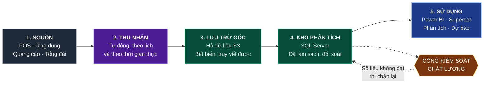

# BẢN THIẾT KẾ CƠ SỞ DỮ LIỆU
## Hệ thống Phân tích Dữ liệu Chuỗi Facial Bar

**Tài liệu trình phê duyệt**

| | |
|---|---|
| **Mã tài liệu** | FB-DWH-DESIGN-v1.0 |
| **Ngày trình** | 14/08/2026 |
| **Phạm vi** | Thiết kế cơ sở dữ liệu và nền tảng phân tích dữ liệu toàn chuỗi |
| **Người soạn** | Bộ phận Dữ liệu |
| **Đơn vị thẩm định** | Công nghệ Thông tin · Tài chính Kế toán · Vận hành |
| **Cấp phê duyệt** | Ban Tổng Giám đốc |
| **Tài liệu kỹ thuật đính kèm** | [Flow.md](Flow.md) — luồng dữ liệu tổng thể · [docs/](docs/) — đặc tả chi tiết: cấu trúc bảng, quy trình nạp, quy tắc kiểm soát chất lượng |

---

## 1. TÓM TẮT ĐIỀU HÀNH

### 1.1. Đề xuất

Xây dựng một cơ sở dữ liệu phân tích tập trung cho toàn chuỗi Facial Bar, hợp nhất dữ liệu từ POS tại cửa hàng, ứng dụng khách hàng, hệ thống quảng cáo và tổng đài về **một nguồn số liệu duy nhất**, phục vụ báo cáo điều hành, phân tích khách hàng và dự báo kinh doanh.

### 1.2. Vấn đề đang giải quyết

| Vấn đề | Hệ quả kinh doanh |
|---|---|
| Số liệu nằm rải rác ở nhiều hệ thống, không hệ thống nào là nguồn chân lý | Mỗi bộ phận báo một con số khác nhau; họp giao ban mất thời gian tranh luận số thay vì bàn hành động |
| Không lưu lịch sử thay đổi | Không trả lời được "khách này lúc phát sinh giao dịch đang ở hạng thẻ nào"; báo cáo quá khứ tự thay đổi khi dữ liệu hiện tại bị sửa |
| Một khách hàng tồn tại dưới nhiều mã ở các hệ thống khác nhau | Tỷ lệ khách quay lại, giá trị vòng đời khách hàng đều bị tính sai lệch |
| Đối soát doanh thu POS ↔ cổng thanh toán làm thủ công | Tốn công, phát hiện sai lệch chậm, rủi ro thất thoát không được cảnh báo sớm |
| Không đo được các chỉ số vận hành cốt lõi | Không biết tỷ lệ khách đặt lịch rồi không đến, tỷ lệ lấp buồng, năng suất kỹ thuật viên |

### 1.3. Giá trị mang lại

| Nhóm | Kết quả cụ thể |
|---|---|
| **Ban điều hành** | Báo cáo doanh thu thuần, tiền thực thu, xếp hạng chi nhánh cập nhật trước 08:00 mỗi ngày, đã đối soát với POS. *Lợi nhuận gộp sẵn sàng sau khi Kế toán cung cấp cách tính giá vốn dịch vụ ([mục 11](#11-rủi-ro-và-biện-pháp-kiểm-soát))* |
| **Vận hành** | Đo được tỷ lệ khách không đến, tỷ lệ huỷ lịch, thời gian phục vụ theo từng chi nhánh. *Tỷ lệ lấp buồng và năng suất kỹ thuật viên sẵn sàng sau khi Vận hành cung cấp lịch phân ca và giờ mở cửa ([mục 11](#11-rủi-ro-và-biện-pháp-kiểm-soát))* |
| **Marketing** | Đo được chi phí thu hút một khách mới và doanh thu trên mỗi đồng quảng cáo theo từng kênh |
| **Tài chính** | Đối soát tự động hằng ngày giữa hệ thống và POS/cổng thanh toán, cảnh báo ngay khi lệch |
| **Chăm sóc khách hàng** | Nhận diện sớm nhóm khách có nguy cơ không quay lại để chăm sóc kịp thời |

### 1.4. Quy mô đầu tư

| Hạng mục | Ước tính |
|---|---|
| **Thời gian triển khai** | 18 tuần — 9 giai đoạn (GĐ 0 đến GĐ 8), mỗi giai đoạn 2 tuần |
| **Nhân lực** | 16,95 người-tháng (chi tiết [mục 5.3](#53-nhân-lực)) |
| **Hạ tầng** | Bản quyền phát sinh bằng 0 (dùng SQL Server và Power BI hiện có). Dung lượng ở quy mô 20 chi nhánh khoảng 150 MB trong kho và 3 GB ở hồ dữ liệu. Dự toán chi tiết kèm các ô cần đơn giá nội bộ: [mục 9.5](#95-dự-toán-chi-phí) |
| **Phần mềm** | Tận dụng SQL Server và Power BI đã có; các thành phần còn lại là mã nguồn mở |

**Kết luận về chi phí: phần lớn chi phí nằm ở nhân lực, không nằm ở hạ tầng hay bản quyền.**

### 1.5. Đề nghị Ban Tổng Giám đốc

1. **Phê duyệt** phương án thiết kế và kế hoạch triển khai 18 tuần với nguồn lực 16,95 người-tháng.
2. **Quyết định** 8 nội dung nghiệp vụ tại [mục 6](#6-các-quyết-định-cần-ban-lãnh-đạo-phê-duyệt) — đây là các định nghĩa mang tính chính sách công ty, bộ phận kỹ thuật không tự quyết được.
3. **Chỉ định** người chịu trách nhiệm dữ liệu cho từng lĩnh vực nghiệp vụ theo [mục 7.3](#73-phân-công-trách-nhiệm-dữ-liệu).

---

## 2. MỤC TIÊU VÀ PHẠM VI

### 2.1. Mục tiêu

| # | Mục tiêu | Cách đo lường nghiệm thu |
|---|---|---|
| 1 | Một nguồn số liệu duy nhất cho toàn chuỗi | Doanh thu trên hệ thống khớp POS trong sai số ≤ 0,1%, duy trì 30 ngày liên tiếp |
| 2 | Số liệu sẵn sàng đúng giờ | Dữ liệu ngày N có trước 08:00 ngày N+1, đạt ≥ 99% số ngày trong quý |
| 3 | Lưu trữ đầy đủ lịch sử | Truy vấn được trạng thái khách hàng, chi nhánh, dịch vụ tại bất kỳ thời điểm nào trong quá khứ |
| 4 | Phát hiện sai lệch tự động | 100% sai lệch doanh thu vượt ngưỡng được cảnh báo trong ngày, không cần rà thủ công |
| 5 | Nền tảng cho phân tích nâng cao | Mô hình dự báo khách rời bỏ đạt AUC ≥ 0,75 trên tập kiểm định 3 tháng gần nhất, không dùng dữ liệu phát sinh sau mốc dự đoán |

### 2.2. Phạm vi thực hiện

**Trong phạm vi:**
- Thiết kế và xây dựng cơ sở dữ liệu phân tích (kho dữ liệu) trên SQL Server.
- Xây dựng hồ dữ liệu trên Amazon S3 để lưu trữ dữ liệu gốc.
- Đường ống nạp dữ liệu tự động từ POS, ứng dụng, hệ thống quảng cáo, cổng thanh toán.
- Hệ thống kiểm soát chất lượng dữ liệu và đối soát tự động.
- Bộ báo cáo điều hành và vận hành trên Power BI / Superset.

**Ngoài phạm vi (giai đoạn sau):**
- Thay thế hoặc chỉnh sửa hệ thống POS hiện tại.
- Xây dựng ứng dụng khách hàng mới.
- Triển khai mô hình học máy vào vận hành thực tế (giai đoạn này chỉ dựng nền tảng dữ liệu và một mô hình thử nghiệm).

### 2.3. Ranh giới trách nhiệm với hệ thống hiện có

| Hệ thống | Vai trò | Bên chịu trách nhiệm |
|---|---|---|
| POS tại cửa hàng | Nguồn dữ liệu — **chỉ đọc**, không can thiệp | Nhà cung cấp POS |
| Cơ sở dữ liệu ứng dụng đặt lịch | Nguồn dữ liệu — **chỉ đọc** | Đội phát triển ứng dụng |
| Facebook / Google Ads, GA4 | Nguồn dữ liệu qua giao diện lập trình | Marketing |
| **Kho dữ liệu phân tích** | **Thiết kế và vận hành mới** | **Bộ phận Dữ liệu** |

> **Rủi ro R1 (mục 11):** hệ thống được thiết kế ở vị thế chỉ đọc từ POS. Nếu nhà cung cấp POS thay đổi cấu trúc dữ liệu mà không thông báo, đường ống có thể gián đoạn. Biện pháp kiểm soát tại [mục 11](#11-rủi-ro-và-biện-pháp-kiểm-soát).

---

## 3. KIẾN TRÚC TỔNG THỂ

### 3.1. Năm chặng và ý nghĩa quản trị

| Chặng | Làm gì | Rủi ro nếu không có |
|---|---|---|
| **1. Nguồn** | Xác định rõ hệ thống nào là nguồn chân lý cho từng loại dữ liệu | Khi hai hệ thống lệch nhau, không có căn cứ để phân xử |
| **2. Thu nhận** | Lấy dữ liệu tự động theo lịch, không thao tác tay | Phụ thuộc cá nhân: khi người phụ trách nghỉ, báo cáo không được cập nhật |
| **3. Lưu trữ gốc** | Giữ bản gốc bất biến, không sửa đè | Không chứng minh được nguồn đã gửi gì; không dựng lại được khi phát hiện lỗi |
| **4. Kho phân tích** | Làm sạch, đối soát, chốt định nghĩa chỉ tiêu | Mỗi bộ phận tự tính theo cách riêng, ra số khác nhau |
| **5. Sử dụng** | Báo cáo và phân tích | Đầu tư không tạo ra giá trị |

### 3.2. Nguyên tắc kiến trúc

| Nguyên tắc | Ý nghĩa với lãnh đạo |
|---|---|
| **Dữ liệu gốc bất biến** | Mọi con số đều truy ngược được về file gốc mà hệ thống nguồn đã gửi — phục vụ kiểm toán |
| **Chạy lại không sai số** | Sự cố xảy ra thì chạy lại, số liệu không bị cộng dồn hai lần |
| **Cổng kiểm soát chất lượng có quyền chặn** | Dữ liệu không đạt chuẩn không được đưa vào báo cáo, thay vì đưa vào rồi phát hiện sau |
| **Chỉ dừng nhánh bị lỗi** | Một loại dữ liệu lỗi chỉ dừng nhánh nạp tương ứng; các báo cáo còn lại vẫn cập nhật bình thường |
| **Báo cáo chỉ đọc từ lớp đã kiểm định** | Không ai vô tình lấy dữ liệu chưa qua kiểm soát để làm báo cáo trình lãnh đạo |

---

## 4. THIẾT KẾ CƠ SỞ DỮ LIỆU

### 4.1. Tổng quan mô hình

Cơ sở dữ liệu được tổ chức thành **4 lớp**, mỗi lớp có vai trò kiểm soát riêng:

| Lớp | Tên | Vai trò | Ai được truy cập |
|---|---|---|---|
| 1 | Vùng đệm | Tiếp nhận dữ liệu thô từ hồ dữ liệu | Chỉ hệ thống |
| 2 | Vùng làm sạch | **Đối soát với nguồn** — nơi điều tra khi số liệu lệch | Bộ phận Dữ liệu, Kiểm toán |
| 3 | Kho phân tích | Mô hình phân tích, **chốt định nghĩa chỉ tiêu** | Bộ phận Dữ liệu, Phân tích |
| 4 | Lớp phục vụ báo cáo | Bảng tổng hợp sẵn cho báo cáo | Toàn bộ người dùng qua công cụ báo cáo |

**Quy mô:** 94 bảng và 2 view, phân bố như sau.

| Lớp | Số bảng | Đặc tả chi tiết |
|---|---|---|
| Vùng đệm | 29 | [docs/03-ddl/01-lnd.md](docs/03-ddl/01-lnd.md) |
| Vùng làm sạch | 26 bảng + 1 truy vấn dựng sẵn | [docs/03-ddl/02-crt.md](docs/03-ddl/02-crt.md) |
| Kho phân tích | 13 bảng danh mục + 8 bảng giao dịch + 1 bảng chốt tháng + 1 bảng chốt tiến trình + 1 bảng phân bổ khuyến mãi | [dimension](docs/03-ddl/03-dm-dimension.md) · [fact](docs/03-ddl/04-dm-fact.md) |
| Lớp phục vụ báo cáo | 6 | [docs/03-ddl/05-svg-bi.md](docs/03-ddl/05-svg-bi.md) |
| Điều khiển và cách ly | 9 bảng + 1 truy vấn dựng sẵn | [docs/03-ddl/06-ctl-qtn.md](docs/03-ddl/06-ctl-qtn.md) |

### 4.2. Các bảng giao dịch chính và câu hỏi kinh doanh chúng trả lời

| Bảng | Một dòng đại diện cho | Trả lời câu hỏi |
|---|---|---|
| Bảng doanh thu chi tiết | 1 dòng trên hoá đơn | Doanh thu, giảm giá, lợi nhuận gộp theo chi nhánh / dịch vụ / khách hàng |
| Bảng thanh toán | 1 lần chuyển tiền | Tiền thực thu, cơ cấu hình thức thanh toán, đối soát với cổng thanh toán |
| Bảng dịch vụ đã thực hiện | 1 dịch vụ đã làm cho khách | Năng suất kỹ thuật viên, tỷ lệ lấp buồng, tỷ lệ bán thêm tại chỗ |
| Bảng lịch hẹn | 1 lịch hẹn | Tỷ lệ khách không đến, thời gian khách phải chờ |
| Bảng đặt lịch | 1 dịch vụ được đặt | Tỷ lệ huỷ, thời gian đặt trước, hiệu quả từng kênh đặt lịch |
| Bảng vòng đời đặt lịch | 1 lần đặt lịch, cập nhật dần qua các mốc | **Phễu chuyển đổi** đặt lịch → xác nhận → đến → làm → thanh toán, kèm thời gian mỗi chặng |
| Bảng điểm thưởng | 1 lần điểm biến động | Hiệu quả chương trình khách hàng thân thiết |
| Bảng đánh giá | 1 phiếu đánh giá | Mức độ hài lòng theo chi nhánh, kỹ thuật viên, dịch vụ |
| Bảng chi phí quảng cáo | 1 ngày × 1 chiến dịch | Chi phí thu hút khách mới, doanh thu trên mỗi đồng quảng cáo |
| Bảng chốt tháng khách hàng | 1 khách × 1 tháng | Số dư điểm, hạng thẻ, trạng thái hoạt động cuối mỗi tháng |

### 4.3. Hai nguyên tắc thiết kế có ảnh hưởng trực tiếp đến độ tin cậy số liệu

**Nguyên tắc 1 — Mỗi bảng phải khai báo rõ "một dòng đại diện cho cái gì".**

Đây là nguyên nhân phổ biến nhất khiến báo cáo sai mà không ai phát hiện. Ví dụ thực tế: một khách đặt cùng lúc 2 dịch vụ sẽ tạo ra 2 dòng dữ liệu. Nếu đếm số dòng thì ra **2 lượt đặt lịch**, trong khi thực tế chỉ có **1**. Doanh thu vẫn đúng, nhưng số lượt đặt lịch sai gấp đôi.

→ Thiết kế bắt buộc khai báo và **ràng buộc kỹ thuật** điều này ngay trong cấu trúc bảng, không chỉ ghi trong tài liệu.

**Nguyên tắc 2 — Lưu lịch sử thay đổi của khách hàng, chi nhánh, nhân viên, dịch vụ.**

Ví dụ thực tế: khách hàng ở hạng Bạc tháng 1, lên hạng Vàng tháng 6. Nếu hệ thống chỉ lưu trạng thái hiện tại, thì báo cáo "doanh thu tháng 1 từ khách hạng Bạc" sẽ tính nhầm sang hạng Vàng — và **báo cáo tháng 1 in ra hôm nay sẽ khác báo cáo tháng 1 đã in hồi tháng 2**.

→ Thiết kế lưu đầy đủ các phiên bản theo thời gian, đảm bảo báo cáo quá khứ không bao giờ tự thay đổi.

### 4.4. Bộ chỉ tiêu được chốt định nghĩa

Toàn bộ **24 chỉ tiêu** được định nghĩa **một lần duy nhất** trong kho dữ liệu, không để mỗi báo cáo tự tính lại.

**5 trong 24 chỉ tiêu chưa tính được ngay** vì phụ thuộc dữ liệu chưa có nguồn ([mục 11](#11-rủi-ro-và-biện-pháp-kiểm-soát)). Cột cuối ghi rõ từng trường hợp — đây là phần Ban Tổng Giám đốc cần biết trước khi phê duyệt danh mục.

| Nhóm | Chỉ tiêu | Điều kiện tính được |
|---|---|---|
| **Tài chính** (6) | Doanh thu thuần, Tiền thực thu, Giá trị hoá đơn bình quân, Doanh thu bình quân trên khách, Tỷ lệ giảm giá | Đủ dữ liệu |
| | Lợi nhuận gộp | **Chờ cách tính giá vốn dịch vụ — Kế toán** |
| **Vận hành** (7) | Tỷ lệ khách không đến, Tỷ lệ huỷ lịch, Tỷ lệ bán thêm, Thời gian chờ bình quân, Thời gian phục vụ bình quân | Đủ dữ liệu |
| | Năng suất kỹ thuật viên | **Chờ lịch phân ca kỹ thuật viên — Vận hành** |
| | Tỷ lệ lấp buồng | **Chờ lịch phân ca và giờ mở cửa từng chi nhánh — Vận hành** |
| **Khách hàng** (7) | Tỷ lệ khách quay lại, Tỷ lệ khách rời bỏ, Mức độ hài lòng (CSAT, thang 1–5), Chỉ số khuyến nghị (NPS, thang 0–10), Tỷ lệ nâng hạng thẻ, Số khách hoạt động | Đủ dữ liệu |
| | Giá trị vòng đời khách hàng | **Chờ cách tính giá vốn dịch vụ — Kế toán** |
| **Marketing** (4) | Chi phí thu hút khách mới, Doanh thu trên mỗi đồng quảng cáo, Tỷ lệ nhấp quảng cáo | Đủ dữ liệu |
| | Tỷ lệ chuyển đổi theo chiến dịch | **Chờ chốt độ hạt dữ liệu gửi chiến dịch — GĐ 7** |

---

## 5. LỘ TRÌNH TRIỂN KHAI

### 5.1. Kế hoạch 9 giai đoạn — 18 tuần

| GĐ | Tuần | Nội dung | Kết quả bàn giao | Điều kiện nghiệm thu |
|---|---|---|---|---|
| 0 | 1–2 | Khảo sát hiện trạng, kiểm kê nguồn dữ liệu | Danh mục nguồn dữ liệu | Xác định đủ nguồn và người phụ trách |
| 1 | 3–4 | Chốt mô hình nghiệp vụ và định nghĩa chỉ tiêu | Từ điển chỉ tiêu | **Các bộ phận ký xác nhận định nghĩa** |
| 2 | 5–6 | Dựng nền tảng lưu trữ và điều phối | Hồ dữ liệu, khung vận hành | Nạp thử một nguồn, chạy lại không sai số |
| 3 | 7–8 | **Luồng doanh thu hoàn chỉnh đầu tiên** | Báo cáo doanh thu chạy được | **Số khớp POS 7 ngày liên tiếp** |
| 4 | 9–10 | Kết nối dữ liệu thời gian thực | Luồng sự kiện từ ứng dụng | Sự kiện về hệ thống dưới 5 phút |
| 5 | 11–12 | Hoàn thiện mô hình phân tích | 4 báo cáo vận hành | Phễu chuyển đổi khớp số vận hành ghi tay |
| 6 | 13–14 | Kiểm soát chất lượng và đối soát tự động | Hệ thống cảnh báo | Chặn được lỗi trong kiểm thử có chủ đích |
| 7 | 15–16 | Phân tích khách hàng và marketing | Báo cáo khách hàng, hiệu quả quảng cáo | Các chỉ số được nghiệp vụ chấp nhận |
| 8 | 17–18 | Vận hành và phân tích nâng cao | Quy trình vận hành, mô hình thử nghiệm | Có quy trình xử lý sự cố, phân ca trực |

> **Nguyên tắc triển khai:** làm trọn vẹn **một luồng nghiệp vụ** từ nguồn đến báo cáo trước, thay vì làm dàn trải mọi nguồn cùng lúc. Cách này cho ra kết quả sử dụng được ngay ở tuần thứ 8, đồng thời phát hiện sớm sai sót thiết kế khi chi phí sửa còn thấp.

### 5.2. Mốc kiểm soát của lãnh đạo

| Mốc | Thời điểm | Nội dung báo cáo |
|---|---|---|
| **M1** | Cuối tuần 4 | Trình duyệt định nghĩa chỉ tiêu — **cần chữ ký các bộ phận** |
| **M2** | Cuối tuần 8 | Trình diễn báo cáo doanh thu và kết quả đối soát với POS |
| **M3** | Cuối tuần 14 | Trình diễn hệ thống kiểm soát chất lượng và cảnh báo |
| **M4** | Cuối tuần 18 | Nghiệm thu tổng thể, bàn giao vận hành |

> **M2 là mốc quyết định.** Nếu đến tuần 8 số liệu chưa khớp POS, cần dừng lại rà soát chất lượng dữ liệu nguồn trước khi đầu tư tiếp cho các giai đoạn sau.

### 5.3. Nhân lực

| Vai trò | Mức tham gia | Người-tháng | Nhiệm vụ chính |
|---|---|---|---|
| Kiến trúc sư dữ liệu | 50% | 2,25 | Thiết kế, thẩm định, hướng dẫn kỹ thuật |
| Kỹ sư dữ liệu | 2 người, toàn thời gian | 9,0 | Xây dựng đường ống, cơ sở dữ liệu |
| Chuyên viên phân tích | Toàn thời gian từ GĐ 3 (tuần 7–18) | 3,0 | Định nghĩa chỉ tiêu, báo cáo, đối soát |
| Chuyên viên nghiệp vụ | 30% | 1,35 | Cung cấp và xác nhận quy tắc nghiệp vụ |
| Quản trị hạ tầng | 30% | 1,35 | Hạ tầng, phân quyền, bảo mật |
| | **Tổng** | **16,95** | |

Cơ sở tính: 18 tuần = 4,5 tháng. Riêng Chuyên viên phân tích tham gia từ tuần 7 đến tuần 18, tức 3 tháng.

**Phụ thuộc từ các bộ phận khác** — nếu không được bố trí sẽ làm chậm tiến độ:

| Bộ phận | Yêu cầu |
|---|---|
| Tài chính Kế toán | Xác nhận định nghĩa doanh thu và nguyên tắc ghi nhận (GĐ 1) |
| Vận hành | Cung cấp quy tắc nghiệp vụ, **lịch làm việc kỹ thuật viên**, xác nhận báo cáo vận hành (GĐ 1, 5) |
| Marketing | Cung cấp quyền truy cập hệ thống quảng cáo, chốt mô hình quy gán (GĐ 1, 7) |
| Công nghệ Thông tin | Cấp hạ tầng, mở kết nối tới POS và cơ sở dữ liệu ứng dụng (GĐ 2) |
| Nhà cung cấp POS | Cấp quyền truy cập dữ liệu, **cung cấp bảng số liệu đối chiếu doanh thu**, cam kết thông báo khi thay đổi cấu trúc |

---

## 6. CÁC QUYẾT ĐỊNH CẦN BAN LÃNH ĐẠO PHÊ DUYỆT

Đây là các nội dung mang tính **chính sách công ty**, không phải lựa chọn kỹ thuật. Bộ phận kỹ thuật nêu phương án và khuyến nghị, nhưng không tự quyết được. **Chưa chốt các nội dung này thì không thể bắt đầu Giai đoạn 2.**

### QĐ-01. Định nghĩa "Doanh thu" của công ty

Hiện có bốn cách hiểu đang cùng tồn tại giữa các bộ phận:

| Cách hiểu | Công thức | Bộ phận đang dùng |
|---|---|---|
| Doanh thu gộp | Tổng giá niêm yết | Marketing |
| **Doanh thu thuần** | Giá niêm yết trừ giảm giá | **Khuyến nghị làm chuẩn công ty** |
| Doanh thu chưa thuế | Doanh thu thuần trừ thuế | Kế toán |
| Tiền thực thu | Tổng tiền đã nhận | Tài chính |

**Khuyến nghị:** lấy **Doanh thu thuần** làm chỉ tiêu chuẩn khi nói "doanh thu" mà không nói rõ thêm. Ba chỉ tiêu còn lại vẫn được tính và lưu song song với tên gọi riêng, không bỏ.

**Cần phê duyệt:** Ban Tổng Giám đốc và Giám đốc Tài chính.

### QĐ-02. Nguyên tắc ghi nhận doanh thu theo thời gian

| Phương án | Nội dung | Ảnh hưởng |
|---|---|---|
| **A. Theo ngày thực hiện dịch vụ** | Ghi nhận khi dịch vụ được làm | **Khuyến nghị** — phản ánh đúng hoạt động kinh doanh của chi nhánh |
| B. Theo ngày thu tiền | Ghi nhận khi khách trả tiền | Sai lệch khi khách mua gói trả trước rồi dùng dần |

**Vấn đề thực tế:** khách mua gói 10 buổi trả trước một lần. Theo phương án B, toàn bộ doanh thu rơi vào tháng bán gói; các tháng sau chi nhánh phục vụ mà không ghi nhận doanh thu nào.

**Khuyến nghị:** phương án A. **Cần Kế toán xác nhận** tính tương thích với nguyên tắc ghi nhận doanh thu trên sổ sách.

### QĐ-03. Quy gán doanh thu cho kênh marketing

Khách xem quảng cáo Facebook ngày 1, tìm Google ngày 3, đặt lịch ngày 7. Doanh thu tính cho kênh nào?

| Phương án | Cách quy gán | Hệ quả cho phân bổ ngân sách marketing | Khuyến nghị |
|---|---|---|---|
| **A. Kênh có trả phí gần nhất trước khi đặt lịch** | Toàn bộ doanh thu về kênh tiếp xúc cuối | Ngân sách dồn về kênh chốt đơn (tìm kiếm Google). Rủi ro: cắt ngân sách kênh nhận diện thương hiệu ở đầu phễu vì nó không bao giờ được ghi công | ✔ |
| B. Kênh tiếp xúc đầu tiên | Toàn bộ doanh thu về kênh khách gặp đầu tiên | Ngân sách dồn về kênh nhận diện. Rủi ro: đánh giá thấp kênh chốt đơn, giảm chi đúng chỗ đang tạo đơn | |
| C. Chia đều cho mọi kênh có trả phí trong hành trình | Chia đều theo số điểm tiếp xúc | Phản ánh cân bằng hơn, nhưng không kênh nào có tín hiệu đủ rõ để quyết định tăng hay giảm chi | |

**Khuyến nghị:** phương án A — chuẩn phổ biến trong bán lẻ dịch vụ, và là phương án duy nhất tính được từ dữ liệu tiếp xúc hiện thu được. Chênh lệch chi phí thu hút khách mới giữa phương án A và B sẽ được đo trên dữ liệu 3 tháng đầu và trình lại tại mốc M1; nếu chênh lệch vượt 20% thì cần xem lại lựa chọn.

**Lý do phải chốt:** không có quy tắc thống nhất thì chi phí thu hút khách mới và hiệu quả quảng cáo sẽ được mỗi bên tính một kiểu, dẫn tới tranh luận kéo dài giữa Marketing và Tài chính.

**Cần phê duyệt:** Giám đốc Marketing và Giám đốc Tài chính.

### QĐ-04. Nguồn chân lý cho từng loại dữ liệu

Khi hai hệ thống báo số khác nhau, hệ thống nào được coi là đúng?

| Loại dữ liệu | Nguồn chân lý đề xuất | Ghi chú |
|---|---|---|
| Thông tin khách hàng | Cơ sở dữ liệu ứng dụng | POS bổ sung khách vãng lai |
| Lịch hẹn, dịch vụ đã thực hiện | POS tại cửa hàng | Nơi ghi nhận thực tế |
| Thanh toán | POS | **Bắt buộc đối soát với cổng thanh toán hằng ngày** |
| Chi phí quảng cáo | Nền tảng quảng cáo | Số liệu có thể được nền tảng điều chỉnh lại trong 7 ngày |

**Cần phê duyệt:** Ban Tổng Giám đốc — đây là căn cứ phân xử khi có tranh chấp số liệu.

### QĐ-05. Chính sách lưu trữ dữ liệu

| Loại dữ liệu | Thời gian lưu đề xuất | Căn cứ |
|---|---|---|
| Dữ liệu gốc từ nguồn | 3 năm trực tuyến, sau đó chuyển lưu trữ lạnh | Phục vụ kiểm toán và dựng lại khi cần |
| Dữ liệu đã chuẩn hoá | 5 năm | Phân tích xu hướng dài hạn |
| Kho phân tích (đầy đủ chi tiết) | 7 năm | **Cần Kế toán xác nhận** theo quy định lưu trữ chứng từ |

**Cần phê duyệt:** Giám đốc Tài chính và Pháp chế.

### QĐ-06. Xử lý dữ liệu nhạy cảm của khách hàng

Facial Bar lưu **dữ liệu liên quan đến sức khoẻ và thẩm mỹ**: tình trạng da, loại da, ảnh trước và sau điều trị. Đây là nhóm dữ liệu cần mức bảo vệ cao hơn dữ liệu thông thường.

**Khuyến nghị:**

| Loại | Xử lý |
|---|---|
| Họ tên, điện thoại, email | Mã hoá; người phân tích chỉ thấy bản che một phần |
| Ngày sinh | Chỉ hiển thị nhóm tuổi, không hiển thị ngày sinh |
| Tình trạng da, ảnh trước/sau | **Không đưa vào kho phân tích**; lưu khu vực riêng, phân quyền riêng |
| Thông tin thẻ thanh toán | **Không lưu**. Chỉ lưu mã tham chiếu và 4 số cuối |

**Cần phê duyệt:** Ban Tổng Giám đốc và Pháp chế.

### QĐ-07. Cam kết mức độ sẵn sàng của số liệu

**Đề xuất:** dữ liệu ngày N sẵn sàng trước **08:00 ngày N+1**, đạt tối thiểu **99% số ngày trong quý**.

Kèm theo là cơ chế cảnh báo phân cấp và bố trí người trực xử lý sự cố ngoài giờ. **Nếu yêu cầu mức cao hơn** (ví dụ sẵn sàng trước 06:00 hoặc đạt 99,9%), cần bổ sung nhân sự trực và tăng đầu tư hạ tầng dự phòng.

**Cần phê duyệt:** Ban Tổng Giám đốc.

### QĐ-08. Nền tảng công nghệ cho kho dữ liệu

| Phương án | Ưu điểm | Nhược điểm | Chi phí |
|---|---|---|---|
| **A. SQL Server (đang có)** | Tận dụng bản quyền và kỹ năng sẵn có; Power BI kết nối tự nhiên | Phải tự quản trị hạ tầng | **Khuyến nghị** — gần như không phát sinh chi phí bản quyền |
| B. Kho dữ liệu trên nền điện toán đám mây | Tự động mở rộng, ít việc quản trị | Chi phí theo mức sử dụng; đội ngũ cần thời gian làm quen | Phát sinh chi phí thường xuyên |

**Khuyến nghị:** phương án A. Phân tích quy mô tại [mục 9](#9-quy-mô-hiệu-năng-và-chi-phí-hạ-tầng) cho thấy SQL Server đáp ứng được **ngay cả ở quy mô 2.000 chi nhánh**. Thiết kế vẫn giữ khả năng chuyển đổi sang phương án B trong tương lai mà không phải viết lại toàn bộ.

---

## 7. BẢO MẬT VÀ QUẢN TRỊ DỮ LIỆU

### 7.1. Bảo mật

Bảo mật được thiết kế xuyên suốt, không chỉ ở khâu đặt mật khẩu cơ sở dữ liệu.

| Lớp | Biện pháp |
|---|---|
| Đường truyền | Mã hoá toàn bộ kết nối giữa các thành phần |
| Lưu trữ | Mã hoá dữ liệu khi lưu trên đĩa và trên hồ dữ liệu |
| Xác thực | Mỗi hệ thống một tài khoản riêng; không dùng tài khoản dùng chung; không lưu mật khẩu trong mã nguồn |
| Phân quyền | Cấp quyền tối thiểu cần thiết; xem [mục 7.2](#72-ma-trận-phân-quyền) |
| Nhật ký | Ghi lại toàn bộ truy cập, lưu tối thiểu 1 năm |
| Bí mật hệ thống | Quản lý tập trung, tự động thay đổi định kỳ 90 ngày |

### 7.2. Ma trận phân quyền

| Vai trò | Dữ liệu gốc | Vùng làm sạch | Kho phân tích | Báo cáo |
|---|---|---|---|---|
| Kỹ sư dữ liệu | Toàn quyền | Toàn quyền | Toàn quyền | Toàn quyền |
| Chuyên viên phân tích | Không | Đọc | Đọc | Đọc |
| Người dùng nghiệp vụ | Không | Không | Không | Đọc qua công cụ báo cáo |
| Kiểm toán | Đọc | Đọc | Đọc | Đọc |

> **Quy tắc bắt buộc:** công cụ báo cáo **chỉ được đọc lớp đã qua kiểm soát chất lượng**. Điều này ngăn tình huống một báo cáo trình lãnh đạo được lập từ dữ liệu chưa kiểm định.

### 7.3. Phân công trách nhiệm dữ liệu

Mỗi lĩnh vực nghiệp vụ cần **hai người phụ trách**: một bên nghiệp vụ (chịu trách nhiệm về tính đúng đắn của định nghĩa) và một bên kỹ thuật (chịu trách nhiệm hệ thống chạy đúng).

| Lĩnh vực | Phụ trách nghiệp vụ | Phụ trách kỹ thuật |
|---|---|---|
| Khách hàng, Thành viên, Điểm thưởng | *Cần chỉ định* | Bộ phận Dữ liệu |
| Đặt lịch, Lịch hẹn, Dịch vụ | *Cần chỉ định* | Bộ phận Dữ liệu |
| Thanh toán, Hoá đơn | *Cần chỉ định* | Bộ phận Dữ liệu |
| Marketing, Chiến dịch | *Cần chỉ định* | Bộ phận Dữ liệu |
| Nhân sự, Chi nhánh | *Cần chỉ định* | Bộ phận Dữ liệu |

**Đề nghị Ban Tổng Giám đốc chỉ định người phụ trách nghiệp vụ cho từng lĩnh vực.** Không có phân công này thì khi số liệu sai sẽ không xác định được ai có thẩm quyền quyết định cách xử lý.

---

## 8. CHẤT LƯỢNG VÀ ĐỘ TIN CẬY SỐ LIỆU

### 8.1. Bảy nhóm kiểm tra tự động

Hệ thống có **58 quy tắc kiểm tra** được chạy tự động mỗi ngày, phân theo bảy nhóm. Danh mục đầy đủ: [docs/05-quality/dq-rules.md](docs/05-quality/dq-rules.md).

| Nhóm | Số quy tắc | Nội dung kiểm tra | Ví dụ |
|---|---|---|---|
| Đầy đủ | 6 | Có thiếu dữ liệu không | Mọi chi nhánh đang mở phải có ≥ 1 hoá đơn/ngày |
| Chính xác | 13 | Giá trị có nằm trong miền cho phép | Doanh thu thuần = doanh thu gộp trừ giảm giá; thời lượng dịch vụ 5–480 phút |
| Nhất quán | 6 | Các hệ thống có khớp nhau | Doanh thu hệ thống khớp POS trong sai số 0,1% |
| Duy nhất | 9 | Có trùng lặp không | Một hoá đơn không xuất hiện hai lần |
| Hợp lệ | 9 | Đúng định dạng và danh mục không | Số điện thoại đúng định dạng; mã dịch vụ tồn tại |
| Kịp thời | 6 | Có đúng hạn không | Dữ liệu thô về hệ thống trước 06:00; báo cáo sẵn sàng trước 08:00 ngày N+1 |
| Mô hình chiều | 7 | Lịch sử thay đổi có liền mạch, đúng một phiên bản hiện hành | Mỗi khách chỉ có một bản ghi đang hiệu lực; không hở, không chồng khoảng thời gian |

### 8.2. Cơ chế xử lý khi phát hiện lỗi

| Mức độ | Số quy tắc | Xử lý | Thông báo |
|---|---|---|---|
| **Nghiêm trọng** | 44 | **Chặn**, không đưa dữ liệu vào báo cáo. Dòng lỗi chuyển sang vùng cách ly | Gọi điện và tin nhắn ngay cho người trực |
| Cảnh báo | 11 | Vẫn đưa vào nhưng gắn dấu hiệu trên báo cáo | Tin nhắn cho người phụ trách lĩnh vực |
| Ghi nhận | 1 | Ghi vào nhật ký | Báo cáo tổng hợp hằng ngày |

**Cam kết xử lý:** dữ liệu trong vùng cách ly phải được xử lý trong **3 ngày làm việc**. Có báo cáo tình trạng vùng cách ly gửi người phụ trách hằng ngày.

### 8.3. Đối soát tự động hằng ngày

Hệ thống tự động so sánh doanh thu theo từng chi nhánh, từng ngày giữa kho dữ liệu và POS, cũng như giữa POS và cổng thanh toán. Sai lệch vượt 0,1% doanh thu ngày × chi nhánh được cảnh báo ngay trong ngày.

**Đây là điểm thay đổi lớn nhất so với hiện trạng:** phát hiện sai lệch chuyển từ **rà thủ công định kỳ** sang **cảnh báo tự động hằng ngày**.

> **Điều kiện tiên quyết:** cần nhà cung cấp POS cung cấp **bảng số liệu đối chiếu** (tổng doanh thu theo ngày × chi nhánh do chính POS tính). Không có bảng này thì việc đối soát chỉ là so dữ liệu với chính nó, không có giá trị kiểm soát. Đây là yêu cầu cần đưa vào hợp đồng với nhà cung cấp.

---

## 9. QUY MÔ, HIỆU NĂNG VÀ CHI PHÍ HẠ TẦNG

### 9.1. Dự toán khối lượng dữ liệu

Giả định: 20 chi nhánh, 45 lượt dịch vụ mỗi chi nhánh mỗi ngày, 350 ngày hoạt động mỗi năm.

| Loại dữ liệu | Số dòng mỗi năm — 20 chi nhánh | Số dòng mỗi năm — 2.000 chi nhánh |
|---|---|---|
| Dòng hoá đơn | 421.000 | 42,1 triệu |
| Dịch vụ đã thực hiện | 315.000 | 31,5 triệu |
| Đặt lịch | 372.000 | 37,2 triệu |
| Thanh toán | 290.000 | 29,0 triệu |
| Điểm thưởng | 504.000 | 50,4 triệu |
| *Sự kiện trên ứng dụng (lưu ở hồ dữ liệu)* | *2,5 triệu* | *250 triệu* |

### 9.2. Dự toán dung lượng

| | 20 chi nhánh | 2.000 chi nhánh |
|---|---|---|
| Kho phân tích sau 5 năm | **~150 MB** | **~15 GB** |

### 9.3. Ba kết luận về đầu tư hạ tầng

**1. Ở quy mô hiện tại, dung lượng dữ liệu hoàn toàn không phải vấn đề.** Toàn bộ kho phân tích khoảng 150 MB — nhỏ hơn nhiều so với năng lực của một máy chủ thông thường. Không cần đầu tư phần cứng chuyên dụng.

**2. Ngay ở quy mô gấp 100 lần, SQL Server vẫn đáp ứng được.** Điều này xác nhận khuyến nghị tại QĐ-08 và cho thấy **chưa cần đầu tư vào kho dữ liệu đám mây** ở giai đoạn này.

**3. Khối dữ liệu lớn nhất là sự kiện trên ứng dụng, và nó không nằm trong kho phân tích** mà nằm ở hồ dữ liệu — nơi chi phí lưu trữ rất thấp. Đây chính là lý do kiến trúc tách làm hai tầng lưu trữ.

> **Chi phí thực sự nằm ở nhân lực, không nằm ở hạ tầng.** Đây là thông tin quan trọng khi cân nhắc phương án: tiết kiệm nhân sự để mua công nghệ đắt tiền hơn sẽ không mang lại hiệu quả trong trường hợp này.

### 9.4. Điểm nghẽn thực tế

Điểm nghẽn không phải dung lượng mà là **thời gian xử lý hằng đêm**. Ở quy mô 2.000 chi nhánh, hệ thống phải xử lý khoảng 860.000 dòng mỗi đêm trong cửa sổ 05:00–06:40. Thiết kế chia bảng giao dịch theo tháng, nên khi cần nạp lại một ngày chỉ phải ghi lại phân vùng của tháng đó thay vì toàn bảng — rút thời gian nạp bù từ hàng giờ xuống dưới 10 phút.

### 9.5. Dự toán chi phí

Bảng dưới đây tách rõ phần đã xác định được từ thiết kế và phần cần đơn giá nội bộ để ra số tiền. **Bộ phận kỹ thuật không tự điền đơn giá nhân sự và đơn giá hạ tầng** — hai ô đó cần Tài chính và Nhân sự cung cấp trước khi trình ký.

| Hạng mục | Khối lượng đã xác định | Đơn giá | Thành tiền |
|---|---|---|---|
| Nhân lực triển khai, 18 tuần | 16,95 người-tháng (chi tiết mục 5.3) | *Cần Nhân sự cung cấp đơn giá theo từng vai trò* | *Chờ đơn giá* |
| Bản quyền SQL Server, Power BI | 0 — dùng hạ tầng và giấy phép hiện có | 0 | **0** |
| Thành phần mã nguồn mở (Airflow, Kafka, Iceberg, Spark) | 0 phí bản quyền | 0 | **0** |
| Lưu trữ hồ dữ liệu S3 | 20 chi nhánh: ~3 GB sau 5 năm. 2.000 chi nhánh: ~300 GB | *Cần đơn giá S3 theo hợp đồng đám mây hiện tại* | *Chờ đơn giá* |
| Máy chủ chạy Airflow và Kafka | 1 máy 4 vCPU / 16 GB cho quy mô 20 chi nhánh | *Cần đơn giá hạ tầng nội bộ* | *Chờ đơn giá* |
| Vận hành thường xuyên sau bàn giao | 0,5 người-tháng/tháng (1 người trực 50%) | *Cần Nhân sự cung cấp* | *Chờ đơn giá* |

**Ba kết luận không phụ thuộc đơn giá:**

1. **Phần lớn chi phí là nhân lực.** Bản quyền bằng 0 và dung lượng ở quy mô 20 chi nhánh chỉ khoảng 150 MB trong kho, 3 GB ở hồ dữ liệu.
2. **Chi phí hạ tầng tăng theo khối lượng, không theo số chi nhánh.** Gấp 100 lần số chi nhánh chỉ làm dung lượng kho lên ~15 GB — vẫn nằm trong khả năng của một máy chủ SQL Server đơn.
3. **Chi phí vận hành sau bàn giao thấp hơn chi phí triển khai khoảng 30 lần mỗi tháng** (0,5 so với 16,95 người-tháng chia cho 4,5 tháng).

---

## 10. TIÊU CHÍ NGHIỆM THU

Dự án chỉ được coi là hoàn thành khi đạt **toàn bộ** các tiêu chí sau:

| # | Tiêu chí | Ngưỡng | Cách kiểm chứng |
|---|---|---|---|
| 1 | Doanh thu khớp POS | Sai lệch ≤ 0,1%, liên tiếp 30 ngày | Báo cáo đối soát tự động |
| 2 | Số liệu đúng hạn | Sẵn sàng trước 08:00, đạt ≥ 99% số ngày trong quý | Nhật ký vận hành |
| 3 | Chất lượng dữ liệu | 100% quy tắc mức Chặn đạt trong 30 ngày liên tiếp; từ 95% quy tắc mức Cảnh báo đạt, tính bình quân 30 ngày | Báo cáo chất lượng hằng ngày |
| 4 | Kiểm soát chặn được lỗi | 100% lỗi gieo trong kiểm thử bị chặn | Biên bản kiểm thử |
| 5 | Chạy lại không sai số | Chạy lại 3 lần cho kết quả giống nhau | Biên bản kiểm thử |
| 6 | Báo cáo được sử dụng thực tế | ≥ 80% quản lý chi nhánh mở báo cáo ít nhất 1 lần mỗi tuần | Nhật ký truy cập |
| 7 | Tài liệu và bàn giao | Có quy trình xử lý sự cố, danh mục dữ liệu, phân ca trực | Biên bản bàn giao |

> **Tiêu chí 6 là quan trọng nhất về mặt hiệu quả đầu tư.** Một hệ thống chạy đúng kỹ thuật nhưng không ai dùng thì không tạo ra giá trị. Đề nghị đưa tiêu chí này vào đánh giá kết quả công việc của cả bộ phận Dữ liệu và các quản lý chi nhánh.

---

## 11. RỦI RO VÀ BIỆN PHÁP KIỂM SOÁT

| # | Rủi ro | Khả năng | Mức ảnh hưởng | Biện pháp kiểm soát |
|---|---|---|---|---|
| R1 | Nhà cung cấp POS thay đổi cấu trúc dữ liệu không báo trước | Trung bình | **Cao** | Kiểm tra tự động phát hiện thay đổi cấu trúc; **đưa điều khoản thông báo trước vào hợp đồng dịch vụ** |
| R2 | Chất lượng dữ liệu nguồn kém, không gộp được định danh khách hàng | **Cao** | **Cao** | Khảo sát chất lượng ngay Giai đoạn 0; trường hợp không chắc chắn thì đưa danh sách cho người rà soát, **không tự động gộp** |
| R3 | Các bộ phận không thống nhất được định nghĩa chỉ tiêu | Trung bình | **Cao** | Đưa vào mốc M1 có chữ ký; **trường hợp không thống nhất thì trình Ban Tổng Giám đốc quyết** |
| R4 | Phụ thuộc vào một vài cá nhân | **Cao** | Trung bình | Tài liệu hoá bắt buộc; bố trí trực luân phiên; không để một người nắm độc quyền một mảng |
| R5 | Nghiệp vụ không sử dụng báo cáo | Trung bình | **Cao** | Đưa người dùng vào từ Giai đoạn 1; nghiệm thu theo mức độ sử dụng thực tế (tiêu chí 6) |
| R6 | Nguồn dữ liệu bên ngoài thay đổi hoặc bị giới hạn truy cập | Trung bình | Thấp | Lưu bản gốc bất biến, có thể dựng lại; theo dõi thay đổi từ nhà cung cấp |
| R7 | Rò rỉ dữ liệu khách hàng | Thấp | **Rất cao** | Mã hoá, phân quyền tối thiểu, che dữ liệu nhạy cảm, nhật ký truy cập, **không đưa dữ liệu sức khoẻ vào kho phân tích** |
| R8 | Tiến độ chậm do phụ thuộc bộ phận khác | **Cao** | Trung bình | Chốt cam kết nguồn lực từ các bộ phận **trước khi khởi động** (mục 5.3) |

**Ba rủi ro cần lãnh đạo can thiệp trực tiếp:** R1 (điều khoản hợp đồng với nhà cung cấp POS), R3 (thẩm quyền quyết định khi các bộ phận bất đồng), R8 (cam kết bố trí nguồn lực).

### Năm dữ liệu chưa có nguồn

Các chỉ số tương ứng sẽ **không tính được** nếu không được cung cấp:

| Dữ liệu cần | Chặn chỉ số nào | Bên cung cấp |
|---|---|---|
| Lịch làm việc / phân ca kỹ thuật viên | Năng suất kỹ thuật viên, Tỷ lệ lấp buồng | Vận hành |
| Giờ mở cửa từng chi nhánh theo ngày | Tỷ lệ lấp buồng | Vận hành |
| Cách tính giá vốn dịch vụ | Lợi nhuận gộp, Giá trị vòng đời khách hàng | Kế toán |
| Bảng số liệu đối chiếu doanh thu từ POS | **Tiêu chí nghiệm thu số 1** | Nhà cung cấp POS |
| Tỷ giá quy đổi điểm thưởng sang tiền | Giá trị điểm thưởng | CRM |

---

## 12. KHẢ NĂNG MỞ RỘNG TRONG TƯƠNG LAI

Thiết kế đã tính đến các bước phát triển tiếp theo mà không phải làm lại từ đầu:

| Nhu cầu tương lai | Đã chuẩn bị sẵn |
|---|---|
| Mở rộng số lượng chi nhánh | Dự toán khối lượng cho thấy đáp ứng ở quy mô gấp 100 lần (mục 9.1–9.2); kiểm thử hiệu năng thực tế nằm trong GĐ 6 |
| Báo cáo thời gian thực cho vận hành tại cửa hàng | Đã có luồng riêng đọc trực tiếp từ hệ thống sự kiện |
| Dự báo nhu cầu, dự báo khách rời bỏ | Bảng chân dung khách hàng đã tính sẵn các biến đầu vào cho mô hình, kèm mốc thời gian bảo đảm không dùng dữ liệu phát sinh sau thời điểm dự đoán |
| Cá nhân hoá gợi ý dịch vụ cho khách | Dữ liệu hành vi đã được lưu đầy đủ |
| Chuyển sang nền tảng đám mây nếu cần | Logic xử lý viết theo chuẩn phổ thông, hạn chế phụ thuộc riêng |

---

## 13. ĐỀ NGHỊ PHÊ DUYỆT

Kính đề nghị Ban Tổng Giám đốc xem xét và cho ý kiến về ba nội dung sau:

**Một — Phê duyệt phương án và lộ trình.** Thông qua thiết kế trình bày tại tài liệu này và kế hoạch triển khai 18 tuần với nguồn lực 16,95 người-tháng.

**Hai — Quyết định 8 nội dung chính sách tại mục 6.** Đây là các định nghĩa mang tính chuẩn công ty, ảnh hưởng trực tiếp đến mọi báo cáo về sau. Bộ phận kỹ thuật đã nêu phương án và khuyến nghị cho từng nội dung.

**Ba — Chỉ định người phụ trách dữ liệu cho từng lĩnh vực nghiệp vụ** theo mục 7.3, và **cam kết bố trí nguồn lực** từ các bộ phận Tài chính, Vận hành, Marketing, Công nghệ Thông tin theo mục 5.3.

---

### Bảng ký duyệt

| Vai trò | Họ tên | Ý kiến | Chữ ký | Ngày |
|---|---|---|---|---|
| Người soạn thảo | | | | |
| Trưởng bộ phận Dữ liệu | | | | |
| Giám đốc Công nghệ Thông tin | | | | |
| Giám đốc Tài chính | | | | |
| Giám đốc Vận hành | | | | |
| Giám đốc Marketing | | | | |
| **Tổng Giám đốc** | | | | |

---

### Phụ lục — Tài liệu liên quan

| Tài liệu | Nội dung | Đối tượng đọc |
|---|---|---|
| [Flow.md](Flow.md) | Luồng dữ liệu tổng thể: kiến trúc, nghiệp vụ, nguồn dữ liệu, các tầng nền tảng, chỉ tiêu, lộ trình | Bộ phận Dữ liệu, Công nghệ Thông tin |
| [docs/01-erd/](docs/01-erd/) | Mô hình dữ liệu logic: thực thể, quan hệ, độ hạt, mô hình chiều | Chuyên viên phân tích |
| [docs/02-mapping/](docs/02-mapping/) | Ánh xạ từng cột từ hệ thống nguồn sang kho dữ liệu | Kỹ sư dữ liệu |
| [docs/03-ddl/](docs/03-ddl/) | Cấu trúc 94 bảng, khoá, ràng buộc, index, phân vùng | Quản trị cơ sở dữ liệu |
| [docs/04-etl/](docs/04-etl/) | Quy trình nạp dữ liệu, dữ liệu khởi tạo | Kỹ sư dữ liệu |
| [docs/05-quality/](docs/05-quality/) | 58 quy tắc kiểm soát chất lượng dữ liệu | Chuyên viên phân tích, Kỹ sư dữ liệu |
| [Flow.jpg](Flow.jpg) | Sơ đồ kiến trúc kỹ thuật | Bộ phận Dữ liệu |
| Từ điển chỉ tiêu | Định nghĩa chính thức từng chỉ tiêu — **sẽ ban hành sau khi các nội dung tại mục 6 được phê duyệt** | Toàn công ty |

---

*Tài liệu này chứa thông tin nội bộ. Không phổ biến ra ngoài công ty khi chưa được phép.*
