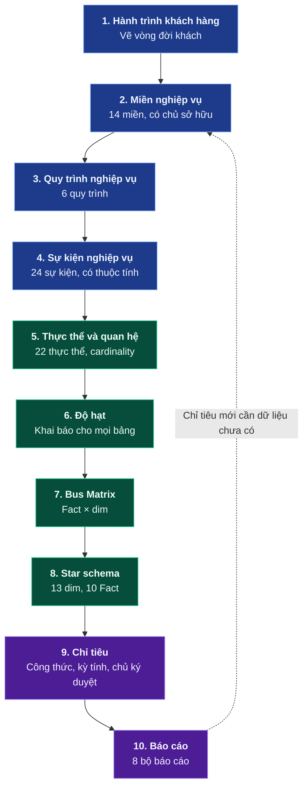

# LUỒNG THIẾT KẾ — GÓC NHÌN PHÂN TÍCH DỮ LIỆU

**Phiên bản 1.0 · 14/08/2026**

Trình tự công việc của người phân tích dữ liệu khi thiết kế cơ sở dữ liệu: đi từ nghiệp vụ đến báo cáo, qua 10 bước, mỗi bước có sản phẩm đầu ra cụ thể và điều kiện hoàn thành.

Luồng hệ thống (nguồn → báo cáo): [Flow.md](Flow.md) · Tổng thiết kế: [README.md](README.md)

**Nguyên tắc:** không bước nào được bỏ, và không đảo thứ tự. Đảo thứ tự — dựng bảng trước khi chốt độ hạt — dẫn tới viết lại toàn bộ Fact và mọi báo cáo phụ thuộc.


> **Quy ước thuật ngữ.** Thuật ngữ nghiệp vụ dùng trong toàn bộ văn bản là **chi nhánh**; tên bảng và tên cột giữ nguyên `salon` (`dim_salon`, `salon_sk`) theo quy ước đặt tên đối tượng bằng tiếng Anh. Tương tự: **hồ dữ liệu** trong văn bản, `raw`/`cleansed`/`archive` khi chỉ phân vùng; **kho phân tích** trong văn bản, `dm` khi chỉ schema.

---

## TRÌNH TỰ



Mũi tên nét đứt là vòng lặp thật: chỉ tiêu mới có thể đòi dữ liệu chưa thu — lúc đó phải quay lại bước 2 bổ sung nguồn, không thêm cột không có nguồn dữ liệu tương ứng.

| Bước | Sản phẩm đầu ra | Xong khi |
|---|---|---|
| 1 | Sơ đồ hành trình khách hàng | Vận hành xác nhận đúng thực tế tại chi nhánh |
| 2 | Danh mục 14 miền, mỗi miền có chủ sở hữu nghiệp vụ | Ban lãnh đạo chỉ định đủ người phụ trách |
| 3 | 6 quy trình, mỗi quy trình có mục tiêu và chỉ tiêu chính | Nghiệp vụ xác nhận |
| 4 | Danh mục 24 sự kiện, mỗi sự kiện có thuộc tính then chốt | Đội ứng dụng và POS xác nhận có thu được |
| 5 | ERD 22 thực thể, đủ cardinality | Không còn quan hệ nhiều-nhiều chưa phá |
| 6 | Bảng khai báo độ hạt cho mọi bảng | Mỗi bảng viết được độ hạt bằng một câu, không có chữ "và" |
| 7 | Bus Matrix | Xác định xong conformed dimension |
| 8 | Star schema 13 dim + 10 Fact | Trả lời được [10 câu hỏi nghiệp vụ ưu tiên](docs/00-business/nghiep-vu.md#3b-mười-câu-hỏi-nghiệp-vụ-ưu-tiên) |
| 9 | Từ điển chỉ tiêu | **Có chữ ký nghiệp vụ** cho từng chỉ tiêu |
| 10 | Đặc tả 8 bộ báo cáo | Người dùng xác nhận trên bản mô phỏng |

---

## 1. HÀNH TRÌNH KHÁCH HÀNG

Điểm khởi đầu duy nhất. Mọi bảng dữ liệu về sau phải trả lời được một chặng trên hành trình này; bảng không thuộc chặng nào thì phải giải trình vì sao cần.

```
Marketing → Khách thấy quảng cáo → Đăng ký → Xem dịch vụ → Đặt lịch
→ Lịch hẹn → Đến salon → Kỹ thuật viên thực hiện → Thanh toán
→ Tích điểm → Đánh giá → Nâng hạng thẻ → Marketing (vòng tiếp)
```

Vòng lặp cuối là lý do hệ thống phải lưu lịch sử: hạng thẻ và điểm đánh giá của chặng này là đầu vào cho chiến dịch chặng sau.

→ [docs/00-business/nghiep-vu.md](docs/00-business/nghiep-vu.md#1-hành-trình-khách-hàng)

---

## 2. MIỀN NGHIỆP VỤ

14 miền, chia theo bản chất dữ liệu. Cách chia này quyết định phân chia schema, phân quyền truy cập và người chịu trách nhiệm.

| Bản chất | Miền | Về sau thành |
|---|---|---|
| Danh mục (6) | Khách hàng, Chi nhánh, Nhân viên, Dịch vụ, Sản phẩm, Khuyến mãi | dim |
| Giao dịch (8) | Đặt lịch, Lịch hẹn, Điều trị, Thanh toán, Thành viên, Điểm thưởng, Marketing, Đánh giá | Fact |

Phân biệt danh mục và giao dịch bằng một tiêu chí: mô tả có động từ thể hoàn thành ("đã đặt", "đã trả") thì là giao dịch; là trạng thái tĩnh ("khách VIP", "chi nhánh Q1") thì là danh mục.

**Ba miền phải giữ tách rời:** Đặt lịch, Lịch hẹn, Điều trị là ba thực thể khác nhau. Gộp lại thì không tính được tỷ lệ khách không đến và tỷ lệ bán thêm tại chỗ — hai chỉ số vận hành quan trọng nhất của chuỗi.

→ [docs/00-business/nghiep-vu.md](docs/00-business/nghiep-vu.md#2-miền-nghiệp-vụ)

---

## 3. QUY TRÌNH NGHIỆP VỤ

Sáu quy trình. Quy trình cho biết **thứ tự phụ thuộc** giữa các bảng, từ đó ra thứ tự nạp dữ liệu.

| # | Quy trình | Miền tham gia | Chỉ tiêu chính |
|---|---|---|---|
| 1 | Thu hút khách mới | Marketing, Khách hàng, Khuyến mãi | Chi phí thu hút khách mới, doanh thu trên đồng quảng cáo |
| 2 | Đặt lịch và lịch hẹn | Khách hàng, Dịch vụ, Chi nhánh, Nhân viên, Đặt lịch, Lịch hẹn | Tỷ lệ chốt lịch, tỷ lệ không đến |
| 3 | Thực hiện dịch vụ | Lịch hẹn, Nhân viên, Điều trị, Dịch vụ, Sản phẩm | Năng suất kỹ thuật viên, tỷ lệ bán thêm |
| 4 | Thu tiền | Điều trị, Sản phẩm, Khuyến mãi, Thanh toán, Thành viên | Doanh thu, giá trị hoá đơn bình quân, tỷ lệ giảm giá |
| 5 | Giữ chân khách | Khách hàng, Thanh toán, Điểm thưởng, Thành viên | Tỷ lệ nâng hạng, điểm tích trên tiêu |
| 6 | Khiến khách quay lại | Toàn bộ | Tỷ lệ quay lại, giá trị vòng đời khách, tỷ lệ rời bỏ |

Quy trình 6 không sinh bảng nguồn mới — nó là kết quả của 5 quy trình trước, và sinh **bảng tổng hợp** ở tầng phục vụ báo cáo.

→ [docs/00-business/nghiep-vu.md](docs/00-business/nghiep-vu.md#3-quy-trình-nghiệp-vụ)

---

## 4. SỰ KIỆN NGHIỆP VỤ

24 sự kiện, đặt tên theo `<đối tượng>_<động từ thể hoàn thành>`.

Sự kiện là hạt dữ liệu nhỏ nhất. Có sự kiện thì tái dựng được lịch sử; chỉ có bảng trạng thái hiện tại thì mất vĩnh viễn thông tin *"khách này đã huỷ 3 lần trước khi đến"*.

**Hai điều thường bị bỏ sót ở bước này:**

**Sự kiện thất bại.** Phải thu cả `booking_cancelled`, `customer_no_show`, `payment_failed`. Nếu POS chỉ ghi giao dịch thành công thì mất vĩnh viễn khả năng phân tích huỷ lịch và thất bại thanh toán.

**Phân biệt hai mốc thời gian.** Mọi sự kiện cần cả `occurred_at` (lúc việc xảy ra) và `received_at` (lúc hệ thống nhận). Khách check-in 23:50 ngày 13/08 nhưng mạng lỗi, sự kiện về 00:10 ngày 14/08 — dùng sai mốc thì doanh thu ngày 13 bị hụt, ngày 14 bị dôi. Quy tắc: **lưu trữ phân vùng theo `received_at`, tính toán nghiệp vụ theo `occurred_at`**.

→ [docs/00-business/nghiep-vu.md](docs/00-business/nghiep-vu.md#4-sự-kiện-nghiệp-vụ)

---

## 5. THỰC THỂ VÀ QUAN HỆ

22 thực thể. Ba loại khoá phải phân biệt rõ vì mỗi loại dùng ở một chỗ khác nhau.

| Loại khoá | Ví dụ | Dùng ở |
|---|---|---|
| Khoá tự nhiên | Số điện thoại `+84901234567` | Gộp định danh khách ở tầng nguồn |
| Khoá nghiệp vụ | `POS-CUS-00123` | Đối chiếu ngược về hệ thống nguồn |
| Khoá đại diện | `customer_sk = 8471` | Join trong star schema |

Khách đổi số điện thoại thì khoá tự nhiên đổi và mọi giao dịch cũ mất liên kết. Khoá đại diện không bao giờ đổi, nên lịch sử được bảo toàn.

**Quan hệ nhiều-nhiều không hiện thực hoá trực tiếp được trong một bảng quan hệ** — phải phá thành hai quan hệ một-nhiều qua bảng trung gian. Trong thiết kế này có 3 chỗ: khuyến mãi × dịch vụ, thanh toán × hoá đơn, dòng hoá đơn × khuyến mãi.

→ [docs/01-erd/erd-logic.md](docs/01-erd/erd-logic.md)

---

## 6. ĐỘ HẠT

Khai báo cho **mọi** bảng: một dòng đại diện cho cái gì, viết bằng đúng một câu, không có chữ "và".

Đây là bước quyết định độ tin cậy của mọi con số về sau. Sai độ hạt làm mọi phép đếm và tổng sai **mà không sinh thông báo lỗi nào**.

**Ví dụ có số:** khách đặt 1 lần gồm 2 dịch vụ (Hydrafacial 1.200.000đ, Massage 300.000đ) → bảng độ hạt "1 dòng = 1 dịch vụ được đặt" có 2 dòng.

| Câu hỏi | Cách viết sai | Ra | Cách viết đúng | Ra |
|---|---|---|---|---|
| Có bao nhiêu lần đặt lịch? | `COUNT(*)` | **2** | `COUNT(DISTINCT booking_id)` | **1** |
| Bao nhiêu khách đã đặt? | `COUNT(customer_sk)` | **2** | `COUNT(DISTINCT d.customer_id)` qua `JOIN dim_customer d` | **1** |
| Tổng giá trị đặt? | `SUM(line_amount)` | 1.500.000 | `SUM(line_amount)` | 1.500.000 |

Cùng một bảng: `SUM` đúng, `COUNT` sai. Đó chính là hệ quả của độ hạt.

**Đếm khách phải đi qua `dim_customer.customer_id`, không dùng `COUNT(DISTINCT customer_sk)`.** Bảng Fact chỉ có khoá đại diện `customer_sk`, mà SCD Type 2 sinh một `sk` mới mỗi lần khách đổi hạng thẻ hoặc thành phố (bước 8). Một khách lên hạng giữa kỳ sẽ được đếm thành hai người, làm mẫu số của ARPU và Tỷ lệ quay lại phồng lên. Đây là chỗ bài học độ hạt ở bước này và bài học SCD2 ở bước 8 giao nhau.

**Khai báo độ hạt phải được thực thi bằng `UNIQUE` constraint trong DDL**, không chỉ ghi trong tài liệu.

→ [docs/01-erd/grain.md](docs/01-erd/grain.md)

---

## 7. BUS MATRIX

Bảng có hàng là Fact, cột là dim, ô đánh dấu nghĩa là Fact đó dùng dim đó.

Ba kết luận đọc trực tiếp từ matrix của thiết kế này:

**`dim_date` có mặt ở 10/10 Fact, `dim_customer` và `dim_salon` ở 9/10** (đều thiếu ở `fact_ad_spend`) → ba dim này dựng đầu tiên, và tuyệt đối không được tồn tại hai bản. Mỗi mart tự dựng một `dim_customer` riêng dẫn tới nhiều định nghĩa khách hàng song song và số liệu lệch nhau giữa các bộ phận.

**`fact_ad_spend` có độ hạt thô hơn hẳn** (ngày × chiến dịch × nền tảng, không có khách hàng) → cấm join trực tiếp với `fact_sales_line`. Muốn tính doanh thu trên đồng quảng cáo phải tổng hợp `fact_sales_line` lên mức ngày × chiến dịch trước.

**`fact_payment` không có `dim_service`** → bảng này không trả lời được "dịch vụ nào thu được nhiều tiền nhất". Đây không phải thiếu sót mà là hệ quả tất yếu của độ hạt: hình thức thanh toán gắn với lần chuyển tiền, không gắn với dòng hoá đơn.

→ [docs/01-erd/bus-matrix.md](docs/01-erd/bus-matrix.md)

---

## 8. STAR SCHEMA

13 dim, 10 Fact, 1 bảng cầu nối.

### Ba loại Fact — chọn theo câu hỏi nghiệp vụ

| Loại | Số bảng | Trả lời | Ví dụ |
|---|---|---|---|
| Giao dịch | 8 | Đo lượng và tiền theo thời gian | `fact_sales_line`, `fact_payment` |
| Chốt kỳ | 1 | Trạng thái tích luỹ cuối mỗi kỳ | `fact_customer_monthly_snapshot` — số dư điểm, hạng thẻ cuối tháng |
| Chốt tiến trình | 1 | Thời gian giữa các bước và tỷ lệ rơi từng bước | `fact_booking_lifecycle` — phễu đặt lịch → thanh toán |

`fact_booking_lifecycle` là bảng có giá trị vận hành cao nhất: một câu truy vấn ra ngay phễu 5 bậc kèm số giờ mỗi chặng. Đây là bảng **Fact** duy nhất được `UPDATE`. Các dim SCD2 cũng bị `UPDATE` khi đóng phiên bản cũ và khi ghi đè thuộc tính Type 1.

### Lưu lịch sử bằng SCD Type 2

Bốn dim theo dõi lịch sử: `dim_customer`, `dim_salon`, `dim_employee`, `dim_service`.

Khách ở hạng Bạc tháng 1, lên Vàng tháng 6. Câu hỏi *"doanh thu tháng 1 từ khách hạng Bạc"*:

| Cách | Kết quả |
|---|---|
| Ghi đè (Type 1) | **Sai** — doanh thu tháng 1 bị tính vào hạng Vàng, và báo cáo tháng 1 in hôm nay khác báo cáo đã in hồi tháng 2 |
| Thêm phiên bản (Type 2) | **Đúng** — tháng 1 vĩnh viễn là Bạc |

### Ba quy tắc thiết kế measure

| # | Quy tắc | Vi phạm thì |
|---|---|---|
| 1 | Không lưu tỷ lệ trong Fact, chỉ lưu tử số và mẫu số | Chi nhánh A 90/100 = 90%, Chi nhánh B 10/900 = 1,1%. `AVG` ra **45,6%**; đúng là `(90+10)/(100+900)` = **10%**. Lệch 4,6 lần |
| 2 | Số dư là measure **semi-additive**: cộng được theo mọi chiều **trừ thời gian**. Fact giao dịch lưu biến động (`point_delta`); periodic snapshot được phép lưu số dư cuối kỳ nhưng phải lọc đúng một kỳ trước khi tổng hợp | Khách có 500 điểm cuối tháng 1, 700 tháng 2, 900 tháng 3. `SUM` qua 3 tháng ra 2.100 — vô nghĩa; số dư cuối kỳ là 900, số dư bình quân kỳ là 700 |
| 3 | Mọi dim có dòng `-1` cho trường hợp không xác định | Fact thiếu khoá bị `INNER JOIN` xoá mất, doanh thu hụt không dấu vết |

→ [docs/01-erd/star-schema.md](docs/01-erd/star-schema.md) · DDL: [dim](docs/03-ddl/03-dm-dimension.md) · [Fact](docs/03-ddl/04-dm-fact.md)

---

## 9. CHỈ TIÊU

Bắt đầu từ câu hỏi của nghiệp vụ, không bắt đầu từ cột có trong database. Làm ngược lại tạo ra báo cáo không gắn với câu hỏi nghiệp vụ nào, và không đạt tiêu chí nghiệm thu số 6 (từ 80% quản lý chi nhánh mở báo cáo mỗi tuần).

| Nhóm | Số chỉ tiêu | Nguồn chính |
|---|---|---|
| Tài chính | 6 | `fact_sales_line`, `fact_payment` |
| Vận hành | 7 | `fact_appointment`, `fact_treatment`, `fact_booking_lifecycle` |
| Khách hàng | 7 | `agg_customer_360`, `fact_feedback` |
| Marketing | 4 | `fact_ad_spend`; `fact_campaign_send` — **chưa chốt độ hạt, GĐ 7** ([căn cứ](README.md#hai-bảng-chưa-thiết-kế-chi-tiết)) |

Mỗi chỉ tiêu phải khai báo đủ: công thức, bảng nguồn, kỳ tính, cảnh báo về độ hạt, và **người nghiệp vụ ký duyệt**. Chỉ tiêu chưa có chữ ký không được đưa lên báo cáo trình lãnh đạo — ràng buộc này thực thi bằng cột `approved_by` trong `ctl.metric_definition`.

### Bốn chỉ tiêu cần chốt chính sách trước khi tính

| Chỉ tiêu | Vấn đề | Ai quyết |
|---|---|---|
| Doanh thu | 4 cách hiểu đang cùng tồn tại: gộp, thuần, chưa thuế, tiền thực thu | Tổng Giám đốc + Tài chính |
| Kỳ ghi nhận doanh thu | Theo ngày làm dịch vụ hay ngày thu tiền — khác nhau khi khách mua gói trả trước | Kế toán |
| Quy gán kênh marketing | Khách xem Facebook ngày 1, Google ngày 3, đặt ngày 7 — tính cho kênh nào | Marketing + Tài chính |
| Giá vốn dịch vụ | Chỉ vật tư, hay vật tư cộng phân bổ công kỹ thuật viên | Kế toán |

### Ba chỉ tiêu có ràng buộc tính toán riêng

| Chỉ tiêu | Sai ở đâu | Cách đúng |
|---|---|---|
| Tỷ lệ khách quay lại | Không nêu kỳ tính → hiểu là toàn thời gian thì chỉ tăng mãi | Bắt buộc nêu kỳ, đề xuất 12 tháng gần nhất |
| Tỷ lệ khách rời bỏ | Đặt ngưỡng vắng theo cảm tính | Suy từ phân vị 80–90% khoảng cách giữa hai lượt đến, rà lại mỗi 6 tháng |
| Giá trị vòng đời khách | Tính trên doanh thu → ngân sách marketing dồn về nhóm khách có doanh thu cao nhưng tỷ suất lãi gộp thấp | Tính trên lãi gộp; số năm dự kiến suy từ `1 / tỷ lệ rời bỏ năm` |

**Lưu ý về thang đo hài lòng:** thang 1–5 sao dùng để tính CSAT. NPS được định nghĩa trên thang 0–10 (promoter 9–10, detractor 0–6) và là **câu hỏi khác**, phải thu riêng. Gọi thang 1–5 là NPS là sai định nghĩa và không so được với số liệu ngành.

→ [docs/07-analytics/chi-tieu-va-bao-cao.md](docs/07-analytics/chi-tieu-va-bao-cao.md#1-từ-điển-chỉ-tiêu)

---

## 10. BÁO CÁO

Tám bộ báo cáo, mỗi bộ có người dùng và tần suất xác định.

| Báo cáo | Người dùng | Tần suất |
|---|---|---|
| Tổng quan điều hành | Tổng Giám đốc, Giám đốc Vận hành | Ngày |
| Hiệu quả chi nhánh | Quản lý chi nhánh | Ngày |
| Cơ cấu dịch vụ và sản phẩm | Sản phẩm | Tuần |
| Năng suất kỹ thuật viên | Vận hành, Nhân sự | Tuần |
| Khách hàng và giữ chân | CRM, Marketing | Tuần |
| Hiệu quả marketing | Marketing | Ngày |
| Chất lượng dữ liệu | Bộ phận Dữ liệu | Ngày |
| Theo dõi chi nhánh tức thời | Lễ tân, Quản lý | Thời gian thực |

**Chuẩn tối thiểu cho mọi báo cáo:** ghi rõ thời điểm cập nhật cuối · ghi rõ định nghĩa chỉ tiêu khớp từ điển · cho phép xuất dữ liệu để người dùng tự kiểm · không quá 7 biểu đồ một trang · luôn có mốc so sánh (cùng kỳ, kỳ trước, hoặc mục tiêu).

Báo cáo thời gian thực phải ghi rõ **"số liệu tạm tính"** — nhánh này chưa khử trùng lặp, chưa đối soát POS, chưa qua 58 quy tắc chất lượng. Số chính thức luôn lấy từ kho phân tích.

→ [docs/07-analytics/chi-tieu-va-bao-cao.md](docs/07-analytics/chi-tieu-va-bao-cao.md#2-báo-cáo-và-phân-tích)

---

## CHECKLIST TRƯỚC KHI CHUYỂN BƯỚC

**Trước khi rời bước 6 (độ hạt) sang bước 7:**
- Mọi bảng viết được độ hạt bằng một câu, không có chữ "và"?
- Xác định được khoá duy nhất của độ hạt đó?
- Đã phân loại từng measure là cộng được / cộng được trừ thời gian / không cộng được?
- Không còn cột nào lưu tỷ lệ?

**Trước khi phát hành một chỉ tiêu:**
- Công thức đã có chữ ký nghiệp vụ?
- Không join trực tiếp hai Fact; nếu chỉ tiêu cần cả hai thì tổng hợp từng Fact về cùng độ hạt trước rồi mới chia (drilling across)?
- Có cần `DISTINCT` không?
- Đã nêu kỳ tính, múi giờ, mốc chốt ngày?
- Xử lý NULL và chia cho 0 thế nào?
- Đã đối soát thủ công với nguồn ít nhất một lần?

→ Checklist đầy đủ: [docs/99-reference/tra-cuu.md](docs/99-reference/tra-cuu.md#3-checklist)

---

## TÀI LIỆU LIÊN QUAN

| Bước | Đặc tả chi tiết |
|---|---|
| 1–4 | [docs/00-business/nghiep-vu.md](docs/00-business/nghiep-vu.md) |
| 5 | [docs/01-erd/erd-logic.md](docs/01-erd/erd-logic.md) |
| 6 | [docs/01-erd/grain.md](docs/01-erd/grain.md) |
| 7 | [docs/01-erd/bus-matrix.md](docs/01-erd/bus-matrix.md) |
| 8 | [docs/01-erd/star-schema.md](docs/01-erd/star-schema.md) · [docs/03-ddl/](docs/03-ddl/) |
| 9–10 | [docs/07-analytics/chi-tieu-va-bao-cao.md](docs/07-analytics/chi-tieu-va-bao-cao.md) |
| Kiểm soát chất lượng số liệu | [docs/05-quality/dq-rules.md](docs/05-quality/dq-rules.md) |
