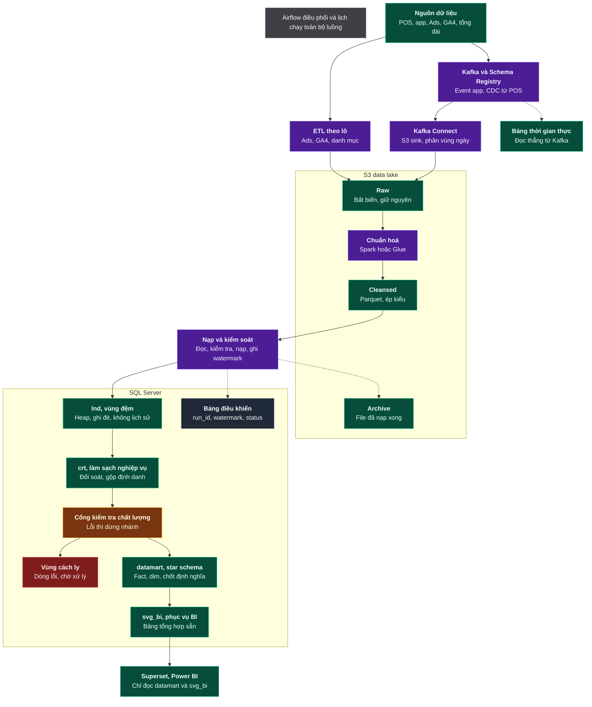

# FACIAL BAR — LUỒNG DỮ LIỆU

**Phiên bản 1.0 · 14/08/2026**

Tài liệu luồng: dữ liệu đi từ đâu, qua những bước nào, đến đâu. Mỗi bước trỏ tới tài liệu đặc tả chi tiết tương ứng.

Sơ đồ gốc: [Flow.jpg](Flow.jpg) · Bản trình phê duyệt: [Ban-Thiet-Ke-CSDL.md](Ban-Thiet-Ke-CSDL.md) · Toàn bộ đặc tả: [docs/](docs/)

**Quy ước thuật ngữ:** tiếng Việt cho khái niệm; giữ tiếng Anh cho tên sản phẩm (Airflow, Kafka, Spark, SQL Server), tên schema (`lnd`, `crt`, `dm`, `svg_bi`, `ctl`, `qtn`) và thuật ngữ đã thành chuẩn ngành (CDC, watermark, Heap, Parquet, star schema, Fact, dim). Đúng quy ước dùng trong sơ đồ gốc.

---

## SƠ ĐỒ

Số hoá nguyên trạng [Flow.jpg](Flow.jpg): 20 hộp, 18 mũi tên, không thêm không bớt.

Chú thích màu, nguyên văn trong ảnh: *Tím là bước xử lý, xanh lá là nơi lưu dữ liệu. Nét đứt là nhánh phụ và luồng quay lại.*
Ảnh dùng thêm vàng cho cổng kiểm soát, đỏ cho vùng lỗi, xám cho thành phần không lưu dữ liệu nghiệp vụ.

---

## 1. NGUỒN DỮ LIỆU

*POS, app, Ads, GA4, tổng đài*

| Nhóm | Hệ thống | Dữ liệu phát sinh |
|---|---|---|
| Tại cửa hàng | POS | Lịch hẹn, dịch vụ đã làm, hoá đơn, thanh toán, vật tư tiêu hao |
| Ứng dụng | App iOS/Android, web | Hành vi khách: xem dịch vụ, đặt lịch, đánh giá |
| Nghiệp vụ | Cơ sở dữ liệu đặt lịch | Khách hàng, booking, điểm thưởng, thành viên |
| Bên ngoài | Facebook/Google Ads, GA4, cổng thanh toán, tổng đài, nền tảng marketing | Chi phí quảng cáo, lưu lượng web, đối soát thanh toán |

Với mỗi loại dữ liệu phải chỉ định **đúng một** hệ thống là nguồn chân lý. Thiếu quy định này thì khi hai hệ thống lệch số sẽ không có căn cứ phân xử.

→ [Nguồn và thu nạp](docs/06-platform/nguon-va-thu-nap.md) · [Nghiệp vụ sinh ra dữ liệu](docs/00-business/nghiep-vu.md)

---

## 2. THU NẠP

Hai nhánh song song, chọn theo yêu cầu độ trễ.

### 2.1. ETL theo lô — *Ads, GA4, danh mục*

Dữ liệu không cần tức thời: chi phí quảng cáo, lưu lượng web, danh mục dịch vụ và sản phẩm. Gọi API theo lịch, ghi thẳng vào `raw`.

Chi phí quảng cáo phải **nạp lại 7 ngày gần nhất** mỗi lần chạy, vì nền tảng quảng cáo còn điều chỉnh số liệu trong 7 ngày.

### 2.2. Kafka và Schema Registry — *Event app, CDC từ POS*

| Loại | Nguồn | Cơ chế |
|---|---|---|
| Sự kiện ứng dụng | App, web | Ứng dụng chủ động đẩy ngay khi sự kiện xảy ra |
| CDC | Cơ sở dữ liệu nghiệp vụ, POS | Debezium đọc log thay đổi, bắt được cả DELETE |

Schema Registry chặn ngay tại nơi gửi khi cấu trúc sự kiện sai, thay vì để pipeline hạ nguồn vỡ lúc 3 giờ sáng.

### 2.3. Kafka Connect — *S3 sink, phân vùng ngày*

Đưa sự kiện từ Kafka xuống `raw`, phân vùng theo ngày. Ghi file khi đạt một trong ba ngưỡng: 128 MB, 100.000 dòng, 15 phút — để tránh sinh hàng triệu file nhỏ làm Spark chậm.

> Không phải dữ liệu nào cũng đi Kafka. Chi phí vận hành Kafka là thật; dữ liệu cập nhật một lần mỗi ngày mà đẩy qua Kafka là thừa và tăng số điểm có thể hỏng.

→ [Ba cơ chế thu nạp](docs/06-platform/nguon-va-thu-nap.md#2-ba-cơ-chế-thu-nạp)

---

## 3. S3 DATA LAKE

| Phân vùng | Nội dung | Nguyên tắc |
|---|---|---|
| **Raw** | Giữ nguyên bản gốc từ nguồn | **Bất biến** — file đã ghi không sửa; muốn bản mới thì ghi file mới |
| **Chuẩn hoá** | Spark hoặc Glue biến đổi | Sáu bước: kiểm tra cấu trúc → ép kiểu → chuẩn tên cột → khử trùng lặp CDC → kiểm tra chất lượng → ghi Parquet |
| **Cleansed** | Bản chuẩn hoá dùng được cho hạ nguồn | Parquet + Snappy, quản lý bằng Apache Iceberg |
| **Archive** | File đã nạp xong vào SQL Server | Phục vụ dựng lại pipeline. **Không phải backup database** |

Nguyên tắc bất biến ở `raw` là điều kiện để: chứng minh nguồn đã gửi gì (kiểm toán), chạy lại pipeline tháng trước ra đúng kết quả tháng trước, và sửa lỗi code rồi nạp lại từ đầu.

→ [Hồ dữ liệu S3](docs/06-platform/ho-du-lieu-va-kho.md#1-hồ-dữ-liệu-s3)

---

## 4. NẠP VÀ KIỂM SOÁT

*Đọc, kiểm tra, nạp, ghi watermark*

Bốn việc theo đúng thứ tự đó. Hai yêu cầu bắt buộc:

**Watermark** — ghi lại đã xử lý đến đâu để lần sau chỉ lấy phần mới. Thiếu watermark thì mỗi lần chạy phải quét lại toàn bộ, hoặc phải ghi cứng ngày trong code và mất khả năng nạp bù lịch sử.

**Chạy lại không sai số** — chạy một lần hay năm lần với cùng dữ liệu vào đều ra cùng kết quả. Pipeline sẽ hỏng và sẽ có người bấm retry; không đảm bảo điều này thì doanh thu tự cộng dồn theo số lần retry.

Kết thúc bước này: file đã nạp xong chuyển sang `Archive`, trạng thái lần chạy ghi vào `Bảng điều khiển`.

→ [Nạp và kiểm soát](docs/06-platform/ho-du-lieu-va-kho.md#2-nạp-và-kiểm-soát) · [Quy trình nạp](docs/04-etl/)

---

## 5. SQL SERVER

### 5.1. `lnd`, vùng đệm — *Heap, ghi đè, không lịch sử*

Tiếp nhận dữ liệu từ `cleansed`. Không index, ghi đè mỗi lần chạy, mọi cột kiểu `NVARCHAR`.

Mục đích thiết kế: **tách lỗi vận chuyển khỏi lỗi dữ liệu**. Nạp `lnd` thất bại là lỗi hạ tầng; nạp `crt` thất bại là lỗi dữ liệu. Không giữ lịch sử ở đây vì lịch sử đã nằm trên S3.

→ 28 bảng: [docs/03-ddl/01-lnd.md](docs/03-ddl/01-lnd.md)

### 5.2. `crt`, làm sạch nghiệp vụ — *Đối soát, gộp định danh*

Mô hình 3NF, giữ đúng độ hạt của nguồn, chưa áp quy tắc nghiệp vụ.

Đây là **tầng phân xử**: `crt` khớp POS thì lỗi ở `dm`; `crt` lệch POS thì lỗi ở thu nạp. Không có tầng này thì không khoanh được vùng lỗi.

Việc khó nhất là **gộp định danh** — cùng một khách xuất hiện với ba mã khác nhau ở app, POS và GA4. Không gộp thì một khách bị đếm thành ba, làm sai toàn bộ chỉ số quay lại và giá trị vòng đời khách hàng.

→ 25 bảng + 1 view: [docs/03-ddl/02-crt.md](docs/03-ddl/02-crt.md)

### 5.3. Cổng kiểm tra chất lượng — *Lỗi thì dừng nhánh*

56 quy tắc trên sáu tiêu chí: đầy đủ, chính xác, nhất quán, duy nhất, hợp lệ, kịp thời.

| Mức | Số quy tắc | Hành vi |
|---|---|---|
| Chặn | 44 | Dừng nhánh, dòng lỗi sang vùng cách ly, không nạp vào `dm` |
| Cảnh báo | 11 | Vẫn nạp, gắn dấu hiệu trên báo cáo |
| Ghi nhận | 1 | Chỉ ghi nhật ký |

Cổng **chỉ dừng nhánh bị lỗi**, không dừng toàn hệ thống. Dừng cả hệ thống vì một bảng lỗi là thiết kế kém: nó khiến người vận hành dần tắt luôn cổng cho mọi thứ chạy được.

→ 56 quy tắc: [docs/05-quality/dq-rules.md](docs/05-quality/dq-rules.md)

### 5.4. Vùng cách ly — *Dòng lỗi, chờ xử lý*

Giữ **những dòng lỗi**, không phải cả bảng, kèm lý do và bản gốc dạng JSON để sửa rồi nạp lại. Có người phụ trách và cam kết xử lý trong 3 ngày làm việc; không có người rà thì vùng này tích luỹ lỗi mà không ai định lượng được phần doanh thu bị bỏ sót.

→ [docs/03-ddl/06-ctl-qtn.md](docs/03-ddl/06-ctl-qtn.md#2-qtn--vùng-cách-ly)

### 5.5. `datamart`, star schema — *Fact, dim, chốt định nghĩa*

13 dim, 10 Fact, 1 bảng cầu nối. Đây là nơi thay đổi độ hạt từ nguồn sang độ hạt phân tích, sinh khoá đại diện, và áp cơ chế lưu lịch sử SCD.

"Chốt định nghĩa" nghĩa là mỗi chỉ tiêu được định nghĩa **một lần duy nhất** tại tầng này. Ví dụ "doanh thu" đang có bốn cách hiểu giữa các bộ phận — cả bốn đều được tính và lưu với tên riêng, không để tên chung chung.

→ [Mô hình logic](docs/01-erd/) · DDL: [dim](docs/03-ddl/03-dm-dimension.md) · [Fact](docs/03-ddl/04-dm-fact.md)

### 5.6. `svg_bi`, phục vụ BI — *Bảng tổng hợp sẵn*

Sáu bảng tổng hợp để báo cáo mở dưới 2 giây. Tính một lần lúc 06:40, đọc 500 lần trong ngày.

Nguyên tắc: **không lưu tỷ lệ**, chỉ lưu tử số và mẫu số. Tỷ lệ không cộng được, nên lưu sẵn tỷ lệ sẽ khiến mọi phép tổng hợp lên mức cao hơn cho ra số sai.

→ 6 bảng: [docs/03-ddl/05-svg-bi.md](docs/03-ddl/05-svg-bi.md)

### 5.7. Bảng điều khiển — *run_id, watermark, status*

Không chứa dữ liệu nghiệp vụ, chỉ chứa thông tin về chính pipeline: lần chạy nào, đã xử lý đến đâu, kết quả ra sao, quy tắc nào không đạt.

Thiếu nhóm bảng này thì câu hỏi *"số liệu hôm nay đã đủ chưa"* không có câu trả lời nào ngoài phỏng đoán.

→ 9 bảng + 1 view: [docs/03-ddl/06-ctl-qtn.md](docs/03-ddl/06-ctl-qtn.md)

---

## 6. TIÊU THỤ

### 6.1. Superset, Power BI — *Chỉ đọc datamart và svg_bi*

Ranh giới bắt buộc: công cụ báo cáo **cấm** truy cập `lnd`, `crt`, `ctl`. Hai tầng đầu chưa qua cổng kiểm tra chất lượng; để báo cáo đọc trực tiếp thì sẽ có ngày một báo cáo trình lãnh đạo được lập từ dữ liệu chưa kiểm định.

→ [Chỉ tiêu và báo cáo](docs/07-analytics/chi-tieu-va-bao-cao.md)

### 6.2. Bảng thời gian thực — *Đọc thẳng từ Kafka*

Nhánh riêng, không qua hồ dữ liệu và không qua kho. Phục vụ vài chỉ số vận hành cần ngay: số khách đang trong salon, doanh thu tạm tính hôm nay, số booking mới trong một giờ.

Đánh đổi: **nhanh nhưng gần đúng** — chưa đối soát, chưa qua cổng chất lượng. Báo cáo thời gian thực phải ghi rõ "số liệu tạm tính"; số chính thức luôn lấy từ `datamart`.

---

## 7. AIRFLOW

*Điều phối và lịch chạy toàn bộ luồng*

Trong sơ đồ gốc, Airflow là khung chú thích bao trên toàn bộ, không nối vào hộp nào — nghĩa là nó điều phối tất cả.

| Lịch | Việc |
|---|---|
| 03:00–04:00 | Thu nạp theo lô: Ads, GA4, danh mục |
| 04:30 | Chuẩn hoá `raw` → `cleansed` |
| 05:00 | Nạp `cleansed` → `lnd` → `crt`, ghi watermark |
| 05:40 | Cổng kiểm tra chất lượng |
| 06:00 | Dựng dim rồi Fact vào `datamart` |
| 06:40 | Làm mới `svg_bi` |
| 07:00 | Đối soát với POS và cổng thanh toán |
| Chủ nhật 02:00 | Bảo trì Iceberg: gộp file nhỏ, xoá snapshot cũ |

Thứ tự bất biến: **dim trước, Fact sau** — Fact cần khoá đại diện do dim sinh ra.

→ [Điều phối bằng Airflow](docs/06-platform/ho-du-lieu-va-kho.md#4-điều-phối-bằng-airflow)

---

## 8. LUỒNG QUAY LẠI

Ba nhánh nét đứt trong sơ đồ, và một luồng cần thiết mà sơ đồ gốc chưa vẽ.

| Luồng | Trong ảnh | Mục đích |
|---|---|---|
| Nạp và kiểm soát → Archive | Có | Lưu file đã nạp xong để dựng lại pipeline khi cần |
| Nạp và kiểm soát → Bảng điều khiển | Có | Ghi `run_id`, watermark, trạng thái |
| Kafka → Bảng thời gian thực | Có | Nhánh riêng cho chỉ số vận hành tức thời |
| Vùng cách ly → nạp lại | **Không** | Dòng lỗi sau khi sửa phải quay lại đường nạp, nếu không sẽ nằm đó vĩnh viễn |

Luồng thứ tư không có trong sơ đồ gốc nhưng bắt buộc phải có khi triển khai.

→ [Cổng kiểm tra chất lượng và vùng cách ly](docs/06-platform/ho-du-lieu-va-kho.md#cổng-kiểm-tra-chất-lượng-và-vùng-cách-ly)

---

## 9. QUY MÔ

| | 20 salon | 2.000 salon |
|---|---|---|
| Bảng lớn nhất trong kho (`fact_sales_line`) | 421.000 dòng/năm | 42,1 triệu dòng/năm |
| Toàn bộ `datamart` sau 5 năm | ~150 MB | ~15 GB |
| Sự kiện ứng dụng — ở hồ dữ liệu, không vào kho | 2,5 triệu/năm | 250 triệu/năm |

Dung lượng không phải điểm nghẽn ở cả hai quy mô. Điểm nghẽn là **thời gian nạp** trong cửa sổ 05:00–06:40. Khối dữ liệu lớn nhất là sự kiện ứng dụng và nó nằm ở hồ dữ liệu — đây chính là lý do kiến trúc tách hai tầng lưu trữ thay vì chỉ dùng một.

→ [Dự toán số dòng và dung lượng](docs/03-ddl/00-init.md#6-volumetrics--dự-toán-số-dòng-và-dung-lượng)

---

## 10. BỐN RÀNG BUỘC KHÔNG ĐƯỢC VI PHẠM

Vi phạm bất kỳ ràng buộc nào đều tạo ra sai số **không sinh thông báo lỗi**, nên không phát hiện được bằng kiểm thử thông thường.

| # | Ràng buộc | Thực thi bằng | Kiểm chứng |
|---|---|---|---|
| 1 | Mỗi bảng khai báo độ hạt bằng một câu, không có chữ "và" | `UNIQUE` trên cột định nghĩa độ hạt | `DQ-UNIQ-001` |
| 2 | Quy trình nạp chạy lại ra cùng kết quả | Xoá-nạp theo phân vùng hoặc `MERGE` theo khoá nghiệp vụ | Chạy 3 lần, đối chiếu |
| 3 | Không lưu tỷ lệ trong Fact, chỉ lưu tử số và mẫu số | Rà cột khi duyệt DDL | Không có cột `*_pct` trong `dm.fact_*` |
| 4 | Mọi dim có dòng `-1`; khoá ngoại trong Fact `NOT NULL` | Nạp dòng `-1` trước Fact đầu tiên | `DQ-SCD-003` |

Ba lỗi sai âm thầm hay gặp: `COUNT(*)` sai độ hạt · `AVG` của một tỷ lệ · `INNER JOIN` với dim thiếu khoá. Cả ba đều được chặn bằng chính bốn ràng buộc trên.

---

## TÀI LIỆU ĐẶC TẢ

| Chủ đề | Tài liệu |
|---|---|
| Nghiệp vụ: miền, quy trình, sự kiện | [docs/00-business/nghiep-vu.md](docs/00-business/nghiep-vu.md) |
| Mô hình logic: thực thể, độ hạt, star schema, bus matrix | [docs/01-erd/](docs/01-erd/) |
| Ánh xạ nguồn sang đích ở mức cột | [docs/02-mapping/source-to-target.md](docs/02-mapping/source-to-target.md) |
| DDL: 79 bảng, khoá, ràng buộc, index, phân vùng | [docs/03-ddl/](docs/03-ddl/) |
| Quy trình nạp và dữ liệu khởi tạo | [docs/04-etl/](docs/04-etl/) |
| 56 quy tắc kiểm soát chất lượng | [docs/05-quality/dq-rules.md](docs/05-quality/dq-rules.md) |
| Nguồn, thu nạp, hồ dữ liệu, kho, điều phối | [docs/06-platform/](docs/06-platform/) |
| Chỉ tiêu, báo cáo, mô hình dự báo | [docs/07-analytics/chi-tieu-va-bao-cao.md](docs/07-analytics/chi-tieu-va-bao-cao.md) |
| Công nghệ, bảo mật, quản trị, giám sát, mở rộng | [docs/08-operations/van-hanh.md](docs/08-operations/van-hanh.md) |
| Lộ trình 8 giai đoạn | [docs/09-roadmap/lo-trinh.md](docs/09-roadmap/lo-trinh.md) |
| Quy ước đặt tên, thuật ngữ, checklist | [docs/99-reference/tra-cuu.md](docs/99-reference/tra-cuu.md) |
