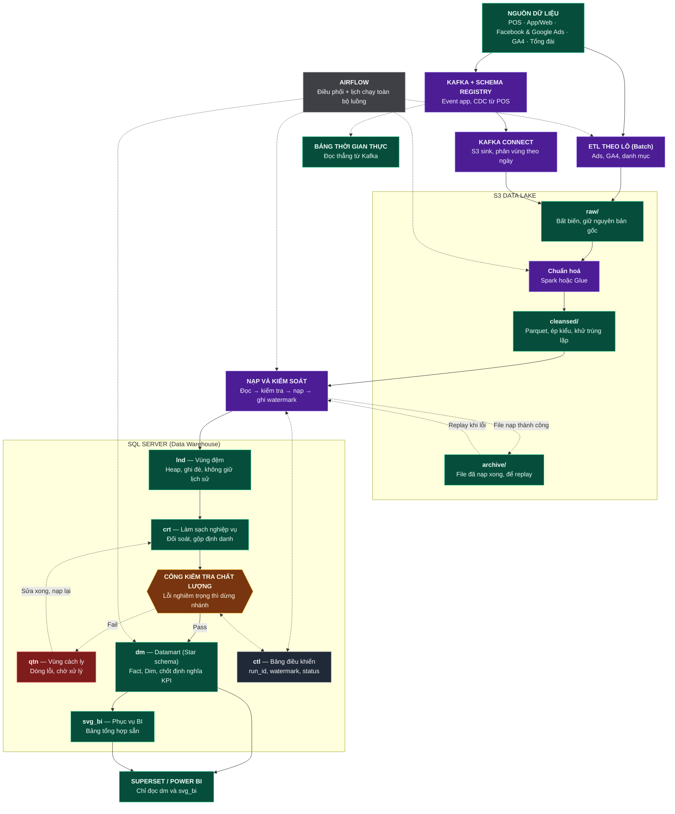
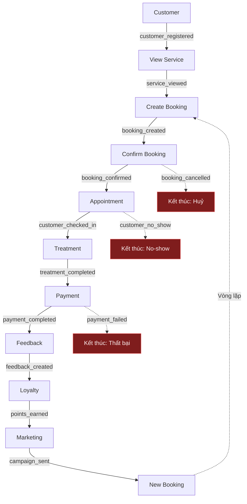
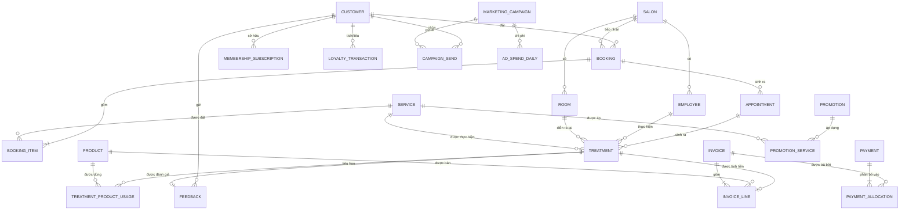
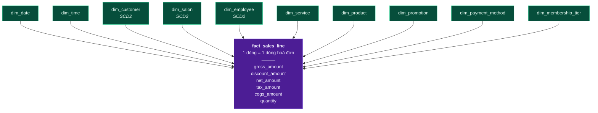
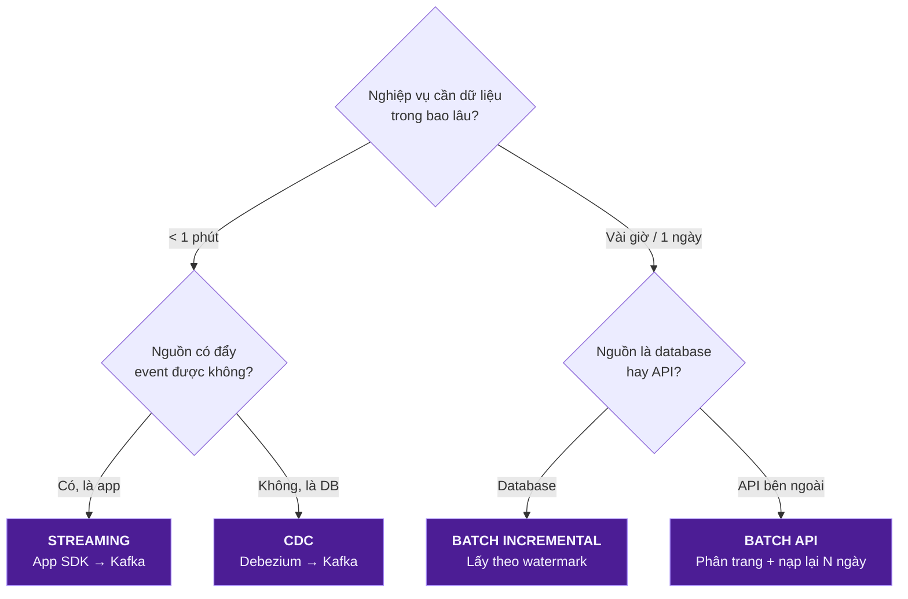
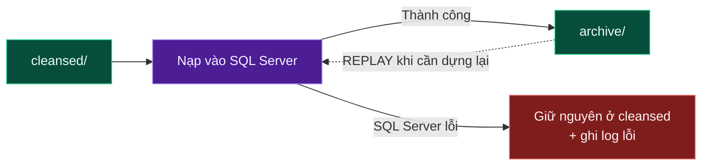
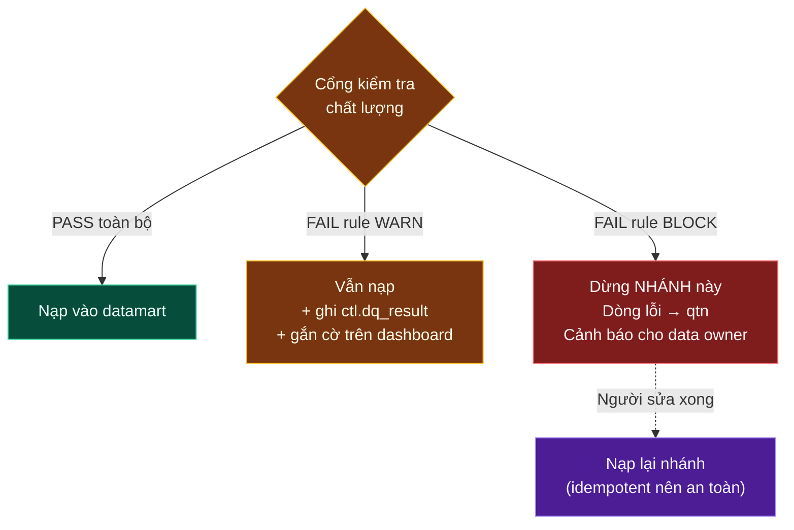
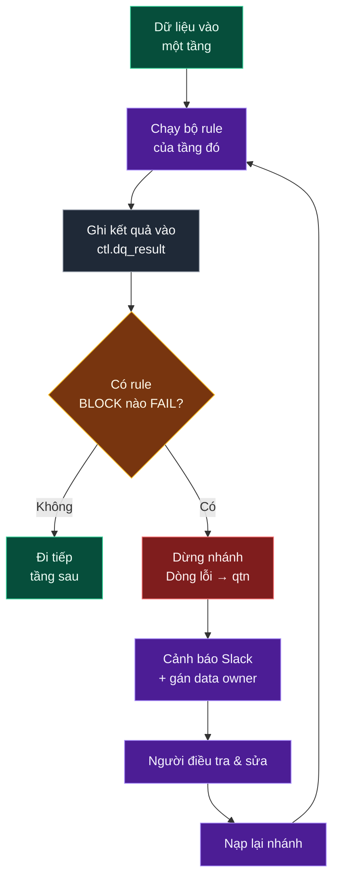

# FACIAL BAR — KẾ HOẠCH THIẾT KẾ DATA PLATFORM
### Tài liệu thiết kế theo góc nhìn Data Analyst / Data Architect

> **Cách đọc tài liệu này**
>
> Mỗi khái niệm được trình bày theo đúng 4 câu hỏi, để đọc đến đâu hiểu đến đó:
>
> | Ký hiệu | Ý nghĩa |
> |---|---|
> | **Là gì** | Định nghĩa bằng 1 câu, không dùng thuật ngữ để giải thích thuật ngữ |
> | **Ví dụ Facial Bar** | Ví dụ cụ thể trong nghiệp vụ spa/facial |
> | **Vì sao cần** | Không có nó thì hệ thống sai/hỏng ở đâu |
> | **Cách làm** | Việc phải làm, tên bảng, tên cột, câu lệnh |
>
> **Nguyên tắc xuyên suốt:** đi từ **Business → Data → Technology**.
> Không bao giờ chọn công nghệ trước rồi mới đi tìm lý do dùng nó.

---

## MỤC LỤC

| # | Lớp | Trả lời câu hỏi | Sản phẩm đầu ra (deliverable) |
|---|---|---|---|
| [0](#phần-0--bức-tranh-tổng-thể) | Tổng thể | Toàn bộ hệ thống trông như thế nào? | Sơ đồ kiến trúc |
| [1](#phần-1--business-layer) | Business | Nghiệp vụ là gì? Chuyện gì xảy ra? | Domain list, Process map, Event catalog |
| [2](#phần-2--data-modeling-layer) | Data Modeling (Logic) | Dữ liệu có hình dạng gì? | ERD, Grain table, Bus Matrix, Star schema |
| [3](#phần-3--data-source--flow) | Source & Flow | Dữ liệu từ đâu, vào bằng cách nào? | Source mapping, Ingestion matrix |
| [4](#phần-4--data-platform) | Platform | Lưu ở đâu, xử lý ra sao? | Lake zoning, DWH layering |
| **[5](#phần-5--thiết-kế-database-vật-lý)** | **Physical DB Design** | **Bảng, cột, khoá, index cụ thể ra sao?** | **DDL đầy đủ, index & partition, volumetrics** |
| [6](#phần-6--analytics-layer) | Analytics | Dùng để làm gì? | KPI dictionary, Dashboard spec, ML use case |
| [7](#phần-7--architecture--non-functional) | Architecture | An toàn / tin cậy / scale được không? | Tech stack, DQ framework, Governance |
| [8](#phần-8--roadmap-thực-thi) | Roadmap | Làm theo thứ tự nào? | Kế hoạch 8 sprint |
| [9](#phần-9--phụ-lục) | Phụ lục | Tra cứu nhanh | Naming convention, Glossary, Checklist |

> **Ba lớp thiết kế database** — tài liệu này đi qua đủ cả ba, đừng nhảy bước:
>
> | Lớp | Tên | Sản phẩm | Ở phần nào |
> |---|---|---|---|
> | **Conceptual** (Khái niệm) | Có những thực thể nào, quan hệ ra sao | Domain list, ERD nghiệp vụ | Phần 1–2.2 |
> | **Logical** (Logic) | Bảng nào, cột nào, khoá nào, grain nào — chưa gắn với DBMS cụ thể | Grain table, Bus Matrix, Star schema | Phần 2.3–2.7 |
> | **Physical** (Vật lý) | Kiểu dữ liệu, index, partition, dung lượng — gắn chặt với SQL Server | **DDL chạy được** | **Phần 5** |

---
---

# PHẦN 0 — BỨC TRANH TỔNG THỂ

Đây là bản số hoá của sơ đồ trong [Flow.jpg](Flow.jpg). Toàn bộ tài liệu bên dưới chỉ là phần giải thích chi tiết cho sơ đồ này.



**Quy ước màu (giống chú thích trong ảnh):**

| Màu | Ý nghĩa |
|---|---|
| 🟣 Tím | **Bước xử lý** — dữ liệu bị biến đổi tại đây (ETL, Kafka, Spark, Load) |
| 🟢 Xanh lá | **Nơi lưu dữ liệu** — dữ liệu nằm yên tại đây (S3 zone, schema SQL) |
| 🟡 Vàng | **Cổng kiểm soát** — có quyền dừng luồng |
| 🔴 Đỏ | **Vùng lỗi** — dữ liệu bị chặn lại, chờ người xử lý |
| ⚪ Xám | **Điều phối / metadata** — không chứa dữ liệu nghiệp vụ |
| ┄┄ Nét đứt | **Nhánh phụ / luồng quay lại** (replay, quarantine, orchestration) |

### Đọc sơ đồ theo 5 chặng

| Chặng | Tên gọi chuẩn | Việc xảy ra | Nếu hỏng thì sao |
|---|---|---|---|
| 1 | **Ingestion** (thu nạp) | Lấy dữ liệu ra khỏi hệ thống nguồn | Không có dữ liệu mới → báo cáo bị "đóng băng" ở ngày cũ |
| 2 | **Storage / Lake** | Lưu bản gốc bất biến + bản chuẩn hoá | Mất bản gốc → không thể dựng lại lịch sử, không thể audit |
| 3 | **Processing / Load** | Chuẩn hoá, khử trùng lặp, nạp vào DWH | Nạp trùng → doanh thu bị đếm 2 lần |
| 4 | **Modeling / Serving** | Dựng Fact–Dim, chốt định nghĩa KPI | Mỗi phòng ban ra một số khác nhau |
| 5 | **Consumption** | Dashboard, ad-hoc SQL, ML | Business không dùng được → cả platform vô nghĩa |

---
---

# PHẦN 1 — BUSINESS LAYER

> **Mục tiêu lớp này:** Hiểu nghiệp vụ **trước khi** vẽ bất kỳ cái bảng nào.
> Đây là lớp mà 80% lỗi thiết kế database thực sự bắt nguồn — không phải lỗi kỹ thuật.

## 1.1. Xuất phát điểm: Hành trình khách hàng

Slogan của Facial Bar là **"Hành trình khách hàng"** → dùng chính nó làm xương sống thiết kế.


**Vì sao bắt đầu từ đây:** hành trình khách hàng là thứ **duy nhất** mà cả CEO, marketing, lễ tân và data team đều hiểu giống nhau. Mọi bảng dữ liệu sau này phải trả lời được một chặng nào đó trên hành trình này. Bảng nào không thuộc chặng nào → nghi vấn: có thực sự cần không?

Chú ý mũi tên nét đứt cuối cùng: đây là **closed-loop** — dữ liệu đầu ra (feedback, hạng thành viên) trở thành đầu vào cho marketing chặng sau. Đây là lý do platform cần dữ liệu lịch sử, không chỉ dữ liệu hiện tại.

---

## 1.2. Business Domain — Xác định các "vùng nghiệp vụ"

**Là gì:** Domain là một nhóm khái niệm nghiệp vụ có cùng chủ đề, do cùng một nhóm người chịu trách nhiệm.
**Vì sao cần:** Domain là cơ sở để chia schema, chia quyền truy cập, chia người sở hữu dữ liệu (data owner). Không chia domain → sau này 200 bảng nằm lẫn lộn trong 1 schema, không ai biết bảng nào của ai.

| # | Domain | Câu hỏi nghiệp vụ nó trả lời | Bản chất | Chủ sở hữu (Owner) |
|---|---|---|---|---|
| 1 | **Customer** | Ai là khách? Mới hay cũ? Đã quay lại mấy lần? | Master | CRM / Marketing |
| 2 | **Salon / Store** | Có bao nhiêu chi nhánh? Ở đâu? Quy mô nào? | Master | Vận hành |
| 3 | **Employee / Therapist** | Ai trực tiếp phục vụ khách? Tay nghề bậc mấy? | Master | HR / Vận hành |
| 4 | **Service** | Facial Bar bán những dịch vụ gì? Giá bao nhiêu? | Master | Sản phẩm |
| 5 | **Product** | Sản phẩm nào bán lẻ, sản phẩm nào dùng trong buồng? | Master | Kho / Sản phẩm |
| 6 | **Booking** | Khách đặt gì, khi nào, qua kênh nào? | Transaction | Vận hành |
| 7 | **Appointment** | Lịch hẹn cụ thể: ngày, giờ, buồng, KTV nào? | Transaction | Vận hành |
| 8 | **Treatment** | Dịch vụ **thực tế** đã được làm ra sao? | Transaction | Vận hành |
| 9 | **Payment** | Khách trả bao nhiêu, bằng hình thức gì? | Transaction | Tài chính |
| 10 | **Promotion** | Khuyến mãi nào đang chạy? Giảm bao nhiêu? | Master | Marketing |
| 11 | **Membership** | Khách ở hạng nào? Hết hạn khi nào? | Transaction (có kỳ hạn) | CRM |
| 12 | **Loyalty** | Khách tích/tiêu bao nhiêu điểm? | Transaction | CRM |
| 13 | **Marketing** | Chiến dịch nào? Chi bao nhiêu? Ra bao nhiêu khách? | Transaction | Marketing |
| 14 | **Feedback** | Khách hài lòng không? Vì sao? | Transaction | CX |

### Khái niệm cần phân biệt ngay: Master vs Transaction

| | **Master Data** (Dữ liệu chủ) | **Transaction Data** (Dữ liệu giao dịch) |
|---|---|---|
| **Là gì** | Mô tả **một thứ tồn tại** | Ghi lại **một việc đã xảy ra** |
| Ví dụ | Khách hàng Lan, Salon Q1, dịch vụ Hydrafacial | Lan đặt lịch lúc 14:00 ngày 12/08 |
| Số lượng | Ít (nghìn dòng) | Rất nhiều (triệu dòng, tăng mỗi ngày) |
| Thay đổi | Chậm, sửa tại chỗ | Chỉ thêm mới (append) |
| Có mốc thời gian? | Không bắt buộc | **Luôn có** |
| Sau này thành | **Dimension** | **Fact** |

> 💡 **Quy tắc nhận biết nhanh:** nếu câu mô tả có động từ ở thể quá khứ ("đã đặt", "đã trả", "đã đánh giá") → Transaction. Nếu là danh từ tĩnh ("là khách VIP", "là chi nhánh Q1") → Master.

### Bẫy nghiệp vụ #1 — Booking ≠ Appointment ≠ Treatment

Đây là chỗ dễ gộp bảng nhất, và cũng là chỗ gây sai số liệu nhiều nhất.

| | Booking | Appointment | Treatment |
|---|---|---|---|
| Là gì | **Ý định** của khách | **Lịch hẹn** đã xếp | **Việc đã làm** thật |
| Thời điểm | Khi khách bấm "Đặt lịch" | Khi hệ thống xếp KTV + buồng + giờ | Khi KTV thực hiện xong |
| Có thể huỷ? | Có | Có (kèm no-show) | Không (đã làm rồi) |
| Sinh doanh thu? | **Không** | **Không** | **Có** (qua Payment) |

**Vì sao phải tách 3 bảng:**
- 1 booking có thể tách thành **nhiều** appointment (khách đặt combo 3 buổi).
- 1 appointment có thể sinh **nhiều** treatment (đến làm facial, lễ tân up-sell thêm massage cổ vai gáy).
- 1 appointment có thể sinh **0** treatment (khách no-show).

Nếu gộp làm một bảng → không thể tính được **tỷ lệ no-show** và **tỷ lệ up-sell**, là 2 KPI vận hành quan trọng nhất của chuỗi spa.

---

## 1.3. Business Process — Các domain phối hợp với nhau ra sao

**Là gì:** Process là một chuỗi bước nghiệp vụ có điểm bắt đầu, điểm kết thúc và một mục tiêu kinh doanh rõ ràng.
**Vì sao cần:** Process cho biết **thứ tự phụ thuộc** giữa các bảng → quyết định thứ tự nạp dữ liệu trong pipeline (không thể nạp `payment` trước khi có `treatment`).

| # | Process | Mục tiêu | Domain tham gia | KPI chính |
|---|---|---|---|---|
| 1 | **Customer Acquisition** | Thu hút khách mới | Marketing, Customer, Promotion | CAC, ROAS, số khách mới |
| 2 | **Booking & Appointment** | Khách đặt được lịch | Customer, Service, Salon, Employee, Booking, Appointment | Tỷ lệ chốt lịch, no-show |
| 3 | **Treatment** | Thực hiện dịch vụ | Appointment, Employee, Treatment, Service, Product | Utilization KTV, thời gian phục vụ |
| 4 | **Payment & Sales** | Thu tiền | Treatment, Product, Promotion, Payment, Membership | Revenue, ATV, tỷ lệ giảm giá |
| 5 | **Loyalty & Membership** | Giữ chân khách | Customer, Payment, Loyalty, Membership | Tỷ lệ nâng hạng, điểm tiêu/tích |
| 6 | **Customer Retention** | Khiến khách quay lại | Toàn bộ (closed-loop) | Repeat rate, CLV, churn |

> 💡 Process 6 không có bảng riêng — nó là **kết quả** của 5 process trước. Đây là dấu hiệu tốt: process phân tích thường không sinh bảng nguồn mới, mà sinh **bảng tổng hợp** ở tầng datamart.

---

## 1.4. Business Event — Chuyện gì thực sự xảy ra

**Là gì:** Event là một việc đã xảy ra tại một thời điểm xác định, không thể thay đổi được nữa.
**Vì sao cần:** Event chính là **hạt dữ liệu nhỏ nhất** của hệ thống. Có event → tái dựng được toàn bộ lịch sử. Chỉ có bảng trạng thái hiện tại → mất vĩnh viễn thông tin "khách đã từng huỷ 3 lần trước khi đến".

### Quy ước đặt tên event
`<domain>_<động từ quá khứ>` — luôn dùng thể **đã hoàn thành**, chữ thường, gạch dưới.

✅ `booking_created`, `payment_completed`
❌ `create_booking` (đang làm), ❌ `BookingCreate` (không nhất quán), ❌ `booking` (không biết chuyện gì xảy ra)

### Event Catalog

| Domain | Event | Ý nghĩa nghiệp vụ | Thuộc tính then chốt |
|---|---|---|---|
| Customer | `customer_registered` | Khách tạo tài khoản | customer_id, channel, referral_code |
| | `customer_updated` | Sửa thông tin | customer_id, field_changed |
| | `customer_login` | Đăng nhập app | customer_id, device, session_id |
| Service | `service_viewed` | Xem trang dịch vụ | customer_id, service_id, duration_sec |
| Booking | `booking_created` | Đặt lịch | booking_id, service_ids[], slot_at |
| | `booking_confirmed` | Salon xác nhận | booking_id, confirmed_by |
| | `booking_cancelled` | Huỷ | booking_id, reason, cancelled_by |
| | `booking_rescheduled` | Đổi giờ | booking_id, old_slot, new_slot |
| Appointment | `customer_checked_in` | Khách đến quầy | appointment_id, checkin_at |
| | `customer_no_show` | Khách không đến | appointment_id |
| Treatment | `treatment_started` | Bắt đầu làm | treatment_id, employee_id, room_id |
| | `treatment_completed` | Làm xong | treatment_id, actual_duration_min |
| Payment | `payment_initiated` | Bấm thanh toán | payment_id, amount, method |
| | `payment_completed` | Trả tiền xong | payment_id, gateway_txn_id |
| | `payment_failed` | Thất bại | payment_id, error_code |
| | `refund_issued` | Hoàn tiền | payment_id, refund_amount |
| Loyalty | `points_earned` | Tích điểm | customer_id, points, source_payment_id |
| | `points_redeemed` | Tiêu điểm | customer_id, points, target |
| Membership | `membership_purchased` | Mua thẻ | customer_id, tier, valid_from/to |
| | `membership_upgraded` | Nâng hạng | customer_id, from_tier, to_tier |
| | `membership_expired` | Hết hạn | customer_id, tier |
| Feedback | `feedback_created` | Gửi đánh giá | feedback_id, rating, comment |
| Marketing | `campaign_sent` | Gửi chiến dịch | campaign_id, customer_id, channel |
| | `campaign_clicked` | Khách bấm vào | campaign_id, customer_id |

### Thuộc tính bắt buộc của MỌI event (Event Envelope)

Đây là "bao thư" chung, tách biệt với nội dung nghiệp vụ. Bắt buộc chuẩn hoá từ ngày đầu.

| Trường | Kiểu | Vai trò | Vì sao bắt buộc |
|---|---|---|---|
| `event_id` | UUID | Khoá duy nhất của event | Để **khử trùng lặp** — Kafka có thể gửi 1 event 2 lần |
| `event_name` | string | Tên event | Định tuyến xử lý |
| `event_version` | int | Phiên bản schema | Để đổi schema không làm vỡ downstream |
| `occurred_at` | timestamp (UTC) | **Lúc việc xảy ra thật** | Dùng để tính toán nghiệp vụ |
| `received_at` | timestamp (UTC) | Lúc hệ thống nhận được | Dùng để đo độ trễ, phát hiện late data |
| `source_system` | string | `pos` / `app` / `web` / `ga4` | Truy vết nguồn gốc |
| `entity_id` | string | ID đối tượng chính | Dùng làm Kafka partition key |

> ⚠️ **Bẫy `occurred_at` vs `received_at`:** khách check-in ở salon lúc 23:50 ngày 13/08 nhưng mạng lỗi, event về server 00:10 ngày 14/08. Nếu báo cáo dùng `received_at` → doanh thu ngày 13 bị hụt, ngày 14 bị dôi. **Luôn phân vùng lưu trữ theo `received_at`, nhưng tính toán nghiệp vụ theo `occurred_at`.**

---

## 1.5. Business Event Flow — Ghép Process + Event



> 💡 **Điểm quan trọng mà bản phác thảo ban đầu chưa có: các nhánh THẤT BẠI.**
> Luồng "happy path" chỉ là 1 trong nhiều kết cục. Phân tích kinh doanh giá trị nhất nằm ở nhánh thất bại: *tại sao 30% booking bị huỷ?*
> Vì vậy mô hình dữ liệu **phải lưu cả event thất bại**, không chỉ event thành công. Nếu POS chỉ ghi booking thành công → mất vĩnh viễn khả năng phân tích huỷ lịch.

### Tóm tắt 3 khái niệm cốt lõi của Business Layer

| Khái niệm | Câu hỏi | Ví dụ Facial Bar |
|---|---|---|
| **Domain** | Có những đối tượng nghiệp vụ nào? | Customer, Salon, Booking, Payment |
| **Process** | Chúng vận hành với nhau thế nào? | Customer → Booking → Treatment → Payment |
| **Event** | Trong quá trình đó chuyện gì xảy ra? | `booking_created` → `treatment_completed` → `payment_completed` |

---
---

# PHẦN 2 — DATA MODELING LAYER

> **Mục tiêu:** Biến Process/Event thành các đối tượng dữ liệu có cấu trúc, xác định quan hệ và xác định **mỗi dòng đại diện cho cái gì**.

## 2.1. Data Entity — Từ Domain thành bảng

**Là gì:** Entity là một đối tượng nghiệp vụ được biểu diễn thành bảng, có khoá xác định duy nhất.

### Khái niệm khoá — phân biệt 3 loại

| Loại khoá | Là gì | Ví dụ | Dùng ở đâu |
|---|---|---|---|
| **Natural Key** (khoá tự nhiên) | Giá trị nghiệp vụ tự nhận diện | Số điện thoại `0901234567` | Nhận diện khách ở tầng nguồn |
| **Business Key** (khoá nghiệp vụ) | ID do hệ thống nguồn sinh ra | `POS-CUS-00123` | Đối chiếu ngược về nguồn |
| **Surrogate Key** (khoá đại diện) | Số nguyên vô nghĩa do DWH tự sinh | `customer_sk = 8471` | Join trong Star schema |

**Vì sao cần Surrogate Key:** khách đổi số điện thoại → natural key đổi → mọi giao dịch cũ bị mất liên kết. Surrogate key không bao giờ đổi, nên lịch sử được bảo toàn. Ngoài ra join số nguyên nhanh hơn join chuỗi rất nhiều.

### Master Entity

```sql
-- crt.customer : bản sạch, 1 dòng = 1 khách hàng duy nhất
customer_id        BIGINT       PK   -- business key thống nhất sau khi gộp định danh
phone              VARCHAR(20)       -- đã chuẩn hoá E.164: +84901234567
email              VARCHAR(255)
full_name          NVARCHAR(200)
date_of_birth      DATE
gender             VARCHAR(10)       -- F / M / OTHER / UNKNOWN
registration_date  DATE         NOT NULL
acquisition_channel VARCHAR(50)      -- fb_ads / google_ads / walk_in / referral
first_salon_id     BIGINT       FK -> salon
status             VARCHAR(20)  NOT NULL  -- active / inactive / blacklisted
created_at         DATETIME2    NOT NULL
updated_at         DATETIME2    NOT NULL
```

| Entity | Khoá chính | Các thuộc tính then chốt |
|---|---|---|
| `salon` | salon_id | name, city, district, address, open_date, close_date, capacity_beds, manager_id |
| `employee` | employee_id | full_name, role (therapist/receptionist/manager), skill_level, hire_date, terminate_date, salon_id |
| `service` | service_id | name, category, standard_duration_min, list_price, is_active, valid_from, valid_to |
| `product` | product_id | name, category, unit, retail_price, cost_price, is_retail, is_consumable |
| `promotion` | promotion_id | name, type (percent/amount/gift), value, valid_from, valid_to, applicable_scope |
| `membership_tier` | tier_id | tier_name (Silver/Gold/Platinum), min_spend, discount_pct, point_multiplier |
| `room` | room_id | salon_id, room_name, room_type |
| `marketing_campaign` | campaign_id | name, platform, objective, start_date, end_date, budget |

### Transaction Entity — nhóm quan trọng nhất

Đây là nhóm thể hiện **business activity**, và cũng là nhóm sinh ra toàn bộ giá trị phân tích.

```sql
-- crt.booking : 1 dòng = 1 lần khách đặt lịch (phần HEADER)
booking_id       BIGINT      PK
customer_id      BIGINT      FK -> customer
salon_id         BIGINT      FK -> salon
booking_channel  VARCHAR(30)      -- app / web / hotline / walk_in
booking_status   VARCHAR(20)      -- created / confirmed / cancelled / completed
booked_at        DATETIME2   NOT NULL   -- lúc khách bấm đặt
requested_slot_at DATETIME2  NOT NULL   -- giờ khách muốn đến
cancel_reason    NVARCHAR(200) NULL
promotion_id     BIGINT      NULL FK -> promotion
source_event_id  UUID             -- truy vết về event gốc

-- crt.booking_item : 1 dòng = 1 DỊCH VỤ trong 1 booking (phần LINE)
booking_item_id  BIGINT      PK
booking_id       BIGINT      FK -> booking
service_id       BIGINT      FK -> service
quantity         INT
unit_price       DECIMAL(18,2)
discount_amount  DECIMAL(18,2)
line_amount      DECIMAL(18,2)    -- = quantity * unit_price - discount_amount
```

> 💡 **Khái niệm Header–Line (Đầu–Dòng):** một giao dịch gần như luôn có 2 mức: mức tổng (ai, khi nào, ở đâu) và mức chi tiết (mua cái gì, mấy cái). Tách 2 bảng là chuẩn mực. Gộp lại sẽ khiến dữ liệu khách hàng bị lặp lại theo số dòng dịch vụ → nguồn gốc của double counting.

| Entity | Khoá chính | Grain (1 dòng = ?) | Ghi chú |
|---|---|---|---|
| `booking` | booking_id | 1 lần đặt lịch | Header |
| `booking_item` | booking_item_id | 1 dịch vụ trong 1 booking | Line |
| `appointment` | appointment_id | 1 lịch hẹn cụ thể | Có KTV, buồng, giờ |
| `treatment` | treatment_id | 1 dịch vụ **đã thực hiện** bởi 1 KTV | Nơi sinh doanh thu dịch vụ |
| `treatment_product_usage` | usage_id | 1 sản phẩm dùng trong 1 treatment | Tính COGS |
| `invoice` | invoice_id | 1 hoá đơn | Header |
| `invoice_line` | invoice_line_id | 1 dòng hoá đơn (dịch vụ hoặc sản phẩm) | **Grain doanh thu chuẩn** |
| `payment` | payment_id | 1 lần chuyển tiền | 1 hoá đơn có thể trả nhiều lần |
| `payment_allocation` | alloc_id | 1 phần tiền phân bổ cho 1 hoá đơn | Giải bài toán trả góp / trả nhiều thẻ |
| `loyalty_transaction` | loyalty_txn_id | 1 lần điểm biến động (+/−) | Sổ kế toán điểm |
| `membership_subscription` | subscription_id | 1 kỳ thành viên của 1 khách | Có valid_from/valid_to |
| `feedback` | feedback_id | 1 phiếu đánh giá | Gắn với treatment hoặc appointment |
| `campaign_send` | send_id | 1 lần gửi tới 1 khách | Grain: campaign × customer × lần gửi |
| `ad_spend_daily` | (date, campaign_id, platform) | 1 ngày × 1 chiến dịch × 1 nền tảng | Từ Ads API |

---

## 2.2. Relationship & Cardinality

**Là gì:** Cardinality là số lượng dòng ở bảng A ứng với một dòng ở bảng B.

| Ký hiệu | Đọc là | Ví dụ Facial Bar |
|---|---|---|
| **1:1** | Một–một | 1 appointment ↔ 1 phiếu check-in |
| **1:N** | Một–nhiều | 1 customer có **nhiều** booking |
| **N:1** | Nhiều–một | Nhiều treatment thuộc **một** appointment |
| **N:N** | Nhiều–nhiều | 1 promotion áp cho nhiều service, 1 service nhận nhiều promotion |

> ⚠️ **Quan hệ N:N không tồn tại được trong database.** Phải luôn phá thành 2 quan hệ 1:N qua một **bảng trung gian** (bridge / junction table).
> `promotion` 1—N `promotion_service` N—1 `service`
>
> **Vì sao:** nếu không có bảng trung gian, phải nhồi danh sách service vào 1 cột dạng `"1,5,9"` → không join được, không index được, không kiểm tra toàn vẹn được.

### ERD nghiệp vụ



---

## 2.3. GRAIN — Khái niệm quan trọng nhất của toàn bộ tài liệu

**Là gì:** Grain (độ hạt) là câu trả lời cho câu hỏi **"MỘT DÒNG trong bảng này đại diện cho điều gì?"** — trả lời bằng đúng một câu, không có chữ "và".

**Vì sao đây là khái niệm quan trọng nhất:** grain quyết định mọi phép đếm và mọi phép tổng. Sai grain → `COUNT(*)` và `SUM()` sai → toàn bộ báo cáo sai, nhưng **không có lỗi nào báo ra**. Đây là loại lỗi tệ nhất: sai âm thầm.

### Bảng khai báo Grain (bắt buộc có cho mọi bảng)

| Bảng | 1 dòng = | Khoá duy nhất | Đo được gì |
|---|---|---|---|
| `dim_customer` | 1 **phiên bản** của 1 khách hàng | customer_id + valid_from | — (dimension) |
| `dim_salon` | 1 phiên bản của 1 salon | salon_id + valid_from | — |
| `dim_service` | 1 dịch vụ | service_id | — |
| `fact_booking_line` | 1 **dịch vụ được đặt** trong 1 booking | booking_item_id | số dịch vụ đặt, giá trị đặt |
| `fact_appointment` | 1 **lịch hẹn** | appointment_id | số lịch hẹn, no-show, thời gian chờ |
| `fact_treatment` | 1 **dịch vụ đã thực hiện** | treatment_id | số lượt làm, phút phục vụ |
| `fact_sales_line` | 1 **dòng hoá đơn** | invoice_line_id | **doanh thu**, giảm giá, COGS |
| `fact_payment` | 1 **lần chuyển tiền** | payment_id | tiền thực thu |
| `fact_loyalty_txn` | 1 lần điểm biến động | loyalty_txn_id | điểm tích, điểm tiêu |
| `fact_feedback` | 1 phiếu đánh giá | feedback_id | rating, NPS |
| `fact_ad_spend` | 1 ngày × chiến dịch × nền tảng | (date_key, campaign_sk, platform) | chi phí, impression, click |

### Bẫy Double Counting — ví dụ có số cụ thể

Khách **Lan** đặt 1 booking gồm 2 dịch vụ: *Hydrafacial 1.200.000đ* và *Massage vai gáy 300.000đ*.

Bảng `fact_booking_line` (grain = 1 dịch vụ đặt) sẽ có **2 dòng**:

| booking_id | booking_item_id | customer | service | line_amount |
|---|---|---|---|---|
| B-001 | BI-001 | Lan | Hydrafacial | 1.200.000 |
| B-001 | BI-002 | Lan | Massage vai gáy | 300.000 |

| Câu hỏi nghiệp vụ | Câu SQL **SAI** | Kết quả sai | Câu SQL **ĐÚNG** | Kết quả đúng |
|---|---|---|---|---|
| Có bao nhiêu booking? | `COUNT(*)` | **2** ❌ | `COUNT(DISTINCT booking_id)` | **1** ✅ |
| Bao nhiêu khách đã đặt? | `COUNT(customer_id)` | **2** ❌ | `COUNT(DISTINCT customer_id)` | **1** ✅ |
| Tổng giá trị đặt? | `SUM(line_amount)` | **1.500.000** ✅ | `SUM(line_amount)` | 1.500.000 ✅ |

→ Cùng một bảng: `SUM` thì đúng, `COUNT` thì sai. **Đó chính là hệ quả của grain.**

**Bẫy nặng hơn — join làm nhân dòng (fan-out):**

Nếu join `fact_sales_line` (3 dòng hoá đơn) với `fact_payment` (khách trả 2 lần: 1 lần thẻ, 1 lần tiền mặt) mà không qua bảng phân bổ:

```
3 dòng × 2 lần trả = 6 dòng  →  SUM(revenue) bị nhân lên 2 lần
```

**Cách phòng 3 lớp:**
1. **Không bao giờ join 2 fact trực tiếp với nhau.** Muốn so sánh thì tổng hợp từng fact về cùng grain trước, rồi mới join (kỹ thuật *drilling across*).
2. Luôn đi qua bảng phân bổ (`payment_allocation`) khi quan hệ là N:N.
3. Ghi rõ grain vào comment của bảng và vào data catalog.

### Ba loại Fact — chọn đúng loại theo câu hỏi nghiệp vụ

| Loại Fact | Là gì | Ví dụ Facial Bar | Khi nào dùng |
|---|---|---|---|
| **Transaction Fact** | 1 dòng = 1 sự kiện xảy ra | `fact_sales_line`, `fact_payment` | Đo lượng, đo tiền theo thời gian |
| **Periodic Snapshot** | 1 dòng = trạng thái của 1 đối tượng vào cuối mỗi kỳ | `fact_customer_monthly_snapshot` (số dư điểm, hạng thẻ cuối tháng) | Đo trạng thái tích luỹ, đo "bao nhiêu khách đang active" |
| **Accumulating Snapshot** | 1 dòng = 1 quy trình, **cập nhật dần** qua các mốc | `fact_booking_lifecycle` (booked_at → confirmed_at → checkin_at → treatment_at → paid_at) | Đo **thời gian giữa các bước** và tỷ lệ rơi ở từng bước |

> 💡 `fact_booking_lifecycle` là bảng đắt giá nhất cho vận hành: nó cho ra ngay funnel *đặt lịch → xác nhận → đến → làm → trả tiền*, kèm số ngày/giờ ở mỗi chặng. Đây là bảng duy nhất được phép **UPDATE** trong datamart.

---

## 2.4. Star Schema — Mô hình chiều

**Là gì:** Star schema là cách tổ chức dữ liệu thành các bảng **Fact** (số đo, ở giữa) vây quanh bởi các bảng **Dimension** (ngữ cảnh, ở ngoài) — trông như hình ngôi sao.

**Vì sao dùng Star schema thay vì mô hình chuẩn hoá 3NF của OLTP:**

| | OLTP (3NF) | Star Schema |
|---|---|---|
| Tối ưu cho | Ghi nhanh, không trùng lặp | **Đọc nhanh, dễ hiểu** |
| Số bảng phải join để ra 1 báo cáo | 8–15 | **2–4** |
| Người dùng cuối tự viết SQL được? | Rất khó | Được |
| Giữ lịch sử thay đổi? | Thường không | **Có (SCD)** |



### SCD — Slowly Changing Dimension (Chiều thay đổi chậm)

**Là gì:** Cơ chế xử lý việc thuộc tính của một dimension bị thay đổi theo thời gian.

**Vấn đề cụ thể:** Tháng 1 khách Lan ở hạng **Silver**, tháng 6 lên **Gold**. Câu hỏi: *"Doanh thu tháng 1 từ khách Silver là bao nhiêu?"*

| Loại | Cách xử lý | Kết quả với câu hỏi trên | Dùng khi |
|---|---|---|---|
| **SCD Type 1** | Ghi đè giá trị cũ | **SAI** — doanh thu tháng 1 bị tính vào Gold | Sửa lỗi chính tả tên khách |
| **SCD Type 2** | Thêm dòng mới, đóng dòng cũ | **ĐÚNG** — tháng 1 vẫn là Silver | Thuộc tính cần phân tích theo lịch sử |
| **SCD Type 3** | Thêm cột `previous_tier` | Chỉ nhớ được 1 bước lùi | Ít dùng |

```sql
-- dm.dim_customer : SCD Type 2
customer_sk      BIGINT      PK        -- surrogate key, tăng tự động
customer_id      BIGINT      NOT NULL  -- business key, LẶP LẠI qua các phiên bản
full_name        NVARCHAR(200)
phone            VARCHAR(20)
gender           VARCHAR(10)
age_group        VARCHAR(20)           -- <25 / 25-34 / 35-44 / 45+
city             VARCHAR(50)
membership_tier  VARCHAR(20)           -- thuộc tính THEO DÕI LỊCH SỬ
acquisition_channel VARCHAR(50)
-- Bộ cột điều khiển SCD2:
valid_from       DATETIME2   NOT NULL
valid_to         DATETIME2   NOT NULL  -- '9999-12-31' nếu đang hiệu lực
is_current       BIT         NOT NULL
row_hash         VARBINARY(32)         -- hash các cột theo dõi, để phát hiện thay đổi
```

Dữ liệu thực tế:

| customer_sk | customer_id | tier | valid_from | valid_to | is_current |
|---|---|---|---|---|---|
| 8471 | 1001 | Silver | 2026-01-05 | 2026-06-14 | 0 |
| 9022 | 1001 | Gold | 2026-06-15 | 9999-12-31 | **1** |

Fact tháng 1 trỏ vào `customer_sk = 8471` → mãi mãi là Silver. Fact tháng 7 trỏ vào `9022` → Gold. Lịch sử được bảo toàn tuyệt đối.

> 💡 **Vai trò của `row_hash`:** mỗi lần nạp, băm các cột cần theo dõi rồi so với hash cũ. Khác nhau → tạo phiên bản mới. Giống nhau → bỏ qua. Nếu không có hash, phải so từng cột bằng tay — dài dòng và dễ sót.

### Dimension đặc biệt

| Loại | Là gì | Ví dụ Facial Bar |
|---|---|---|
| **Role-playing dimension** | Một dim dùng nhiều vai | `dim_date` đóng vai `booked_date`, `appointment_date`, `paid_date` — tạo view riêng cho từng vai |
| **Degenerate dimension** | Mã giao dịch nằm ngay trong fact, không có dim riêng | `invoice_no`, `booking_id` |
| **Junk dimension** | Gom nhiều cờ nhị phân rời rạc vào 1 dim | `is_first_visit`, `is_promotion_applied`, `is_walk_in` |
| **Conformed dimension** | Một dim dùng chung cho nhiều fact | `dim_customer` dùng cho cả `fact_sales_line` và `fact_feedback` → cho phép so sánh chéo |
| **Unknown member** | Dòng `sk = -1` cho trường hợp thiếu dữ liệu | Khách walk-in chưa có hồ sơ |

> ⚠️ **Luôn tạo dòng `sk = -1` ("Unknown") trong mọi dimension.** Nếu không, fact thiếu khoá sẽ bị mất khi INNER JOIN → doanh thu bốc hơi mà không ai biết. Đây là lỗi kinh điển.

### Chốt định nghĩa KPI ngay tại Datamart

Sơ đồ ghi *"datamart star schema — Fact, dim, **chốt định nghĩa**"*. Nghĩa là: mỗi số đo chỉ được định nghĩa **một lần duy nhất** tại tầng này, không để mỗi dashboard tự tính lại.

Ví dụ tranh chấp kinh điển: **"Doanh thu" là gì?**

| Cách hiểu | Công thức | Ai dùng |
|---|---|---|
| Gross revenue | `SUM(gross_amount)` | Marketing (đo quy mô) |
| Net revenue | `SUM(gross_amount − discount_amount)` | **Chuẩn công ty** |
| Net excl. VAT | `SUM(net_amount − tax_amount)` | Kế toán |
| Cash collected | `SUM(payment.amount)` | Tài chính (dòng tiền) |

→ Datamart phải có sẵn cả 4 cột với tên khác nhau rõ ràng, kèm định nghĩa trong data catalog. **Không** để tên chung chung là `revenue`.

---

## 2.5. Chuẩn hoá (Normalization) — và vì sao Datamart cố ý phá chuẩn

**Là gì:** Chuẩn hoá là việc sắp xếp cột vào bảng sao cho **mỗi dữ kiện chỉ được lưu ở đúng một chỗ**.

**Vì sao phải hiểu:** hai tầng `crt` và `dm` trong sơ đồ được thiết kế theo **hai triết lý ngược nhau**. Không hiểu chuẩn hoá thì sẽ vô tình làm `crt` giống `dm` (mất khả năng đối soát) hoặc làm `dm` giống `crt` (dashboard phải join 12 bảng, mở 30 giây).

| Dạng chuẩn | Yêu cầu | Vi phạm thật ở Facial Bar | Hậu quả cụ thể |
|---|---|---|---|
| **1NF** | Mỗi ô chứa **một** giá trị nguyên tử, không có nhóm lặp | `booking.service_ids = '1,5,9'` | Không join, không index, không đếm được số dịch vụ |
| **2NF** | Mọi cột non-key phụ thuộc **toàn bộ** khoá chính | Bảng `booking_item(booking_id, service_id)` lại lưu `customer_name` — tên khách chỉ phụ thuộc `booking_id` | Sửa tên khách phải sửa N dòng; sót 1 dòng là dữ liệu tự mâu thuẫn |
| **3NF** | Không có phụ thuộc **bắc cầu** (non-key → non-key) | `booking` lưu `salon_city`, mà city phụ thuộc `salon_id` chứ không phụ thuộc `booking_id` | Salon chuyển địa chỉ → toàn bộ booking cũ mang thành phố sai |

*(BCNF và các dạng cao hơn hiếm khi phát sinh trong nghiệp vụ bán lẻ dịch vụ; nếu gặp thì thường là dấu hiệu khoá chính đang bị chọn sai.)*

### Hai tầng, hai triết lý — đây là quyết định thiết kế, không phải sự bất nhất

| | `crt` (Curated) | `dm` (Datamart) |
|---|---|---|
| Mục tiêu | **Đúng**, đối soát được với nguồn | **Đọc nhanh**, người dùng tự hiểu |
| Dạng chuẩn | **3NF** | **Cố ý phá 3NF** (denormalized) |
| Số bảng phải join cho 1 báo cáo | 8–15 | 2–4 |
| `city` được lưu ở đâu | Chỉ ở `crt.salon` | Nhân bản vào `dim_salon` **và** `dim_customer` |
| Vì sao chấp nhận trùng lặp | — | Dimension chỉ vài nghìn dòng; đổi vài MB trùng lặp để bỏ hàng chục phép join |
| Ai đảm bảo nhất quán | **Ràng buộc FK** của database | **Pipeline + DQ rule** (database không tự lo được) |

> ⚠️ **Câu "denormalize cho nhanh" chỉ đúng với DIMENSION, không đúng với FACT.**
> Denormalize fact (nhồi `customer_name`, `salon_city` vào từng dòng hoá đơn) là sai vì: (1) fact có hàng trăm triệu dòng, nhân bản chuỗi ở đó làm bảng phình gấp nhiều lần; (2) **mất luôn khả năng áp SCD2** — thuộc tính đã bị đóng băng cứng trong fact, không còn phiên bản nào để chọn.

### Một chỗ được phép "phá 1NF" có kiểm soát: quan hệ nhiều-nhiều trong fact

Vấn đề thật: một hoá đơn có thể áp **đồng thời 2 khuyến mãi** (giảm 20% sinh nhật + tặng kèm mask). Fact có grain 1 dòng = 1 dòng hoá đơn, nhưng lại cần trỏ tới **nhiều** promotion.

Ba cách xử lý, và lý do chọn:

| Cách | Làm gì | Vấn đề |
|---|---|---|
| Nhân dòng fact | 1 dòng hoá đơn × 2 promotion = 2 dòng | ❌ **Phá grain** → `SUM(net_amount)` bị nhân đôi |
| Nhồi vào 1 cột | `promotion_ids = '3,7'` | ❌ Phá 1NF, không lọc/join được |
| **Bridge table + hệ số phân bổ** | Bảng cầu nối riêng, có `allocation_factor` cộng lại bằng 1 | ✅ Giữ nguyên grain fact, phân tích được theo promotion |

→ Chọn cách 3. DDL của `bridge_sales_promotion` nằm ở [mục 5.7](#57-ddl--bridge-table-và-aggregate-table).

---

## 2.6. Additivity — Measure nào được phép SUM theo chiều nào

**Là gì:** Additivity cho biết một số đo có được phép `SUM` theo từng chiều hay không.

**Vì sao là khái niệm thiết kế, không phải khái niệm dùng báo cáo:** nó quyết định **cột nào được lưu trong fact**. Chọn sai kiểu measure thì mọi báo cáo tổng hợp về sau đều sai, mà lại là sai âm thầm.

| Loại | Cộng được theo | Ví dụ Facial Bar | Cách tổng hợp đúng |
|---|---|---|---|
| **Additive** | **Mọi** chiều | `net_amount`, `discount_amount`, `quantity`, `cogs_amount`, `busy_minutes` | `SUM()` bình thường |
| **Semi-additive** | Mọi chiều **trừ thời gian** | `point_balance` (số dư điểm), `active_member_count`, `inventory_qty` | Lấy **giá trị cuối kỳ**, không `SUM` qua các tháng |
| **Non-additive** | **Không** chiều nào | `rating`, `discount_pct`, `utilization_pct`, `nps` | Lưu **tử số + mẫu số**, tính lại tỷ lệ khi tổng hợp |

### Quy tắc thiết kế #1: KHÔNG lưu tỷ lệ trong fact

```sql
-- ❌ SAI: lưu sẵn tỷ lệ
CREATE TABLE dm.fact_treatment (treatment_id BIGINT, utilization_pct DECIMAL(5,2), ...);

-- ✅ ĐÚNG: lưu tử số và mẫu số, để tỷ lệ được tính lại ở mọi mức tổng hợp
CREATE TABLE dm.fact_treatment (treatment_id BIGINT, busy_minutes INT, available_minutes INT, ...);
-- Tổng hợp:  SUM(busy_minutes) * 1.0 / NULLIF(SUM(available_minutes), 0)
```

**Con số chứng minh** — hai salon có quy mô rất khác nhau:

| Salon | busy_minutes | available_minutes | utilization |
|---|---|---|---|
| Q1 (mới mở, 1 buồng) | 90 | 100 | 90,0% |
| Q7 (10 buồng) | 10 | 900 | 1,1% |

- Cách sai: `AVG(90,0% ; 1,1%)` = **45,6%**
- Cách đúng: `(90+10) / (100+900)` = **10,0%**

Lệch **4,5 lần**. Và không có thông báo lỗi nào.

### Quy tắc thiết kế #2: lưu BIẾN ĐỘNG, không lưu SỐ DƯ

Số dư điểm là semi-additive nên rất dễ dùng sai. Khách có 500 điểm cuối tháng 1, 700 cuối tháng 2, 900 cuối tháng 3 → `SUM = 2.100 điểm` là con số vô nghĩa; đáp án đúng là **900**.

→ Vì vậy `fact_loyalty_txn` lưu `point_delta` (`+150`, `−500`) là **additive**, và số dư được tính bằng tổng luỹ tiến:

```sql
SELECT customer_sk, date_key,
       SUM(point_delta) OVER (PARTITION BY customer_sk ORDER BY date_key
                              ROWS BETWEEN UNBOUNDED PRECEDING AND CURRENT ROW) AS point_balance
FROM   dm.fact_loyalty_txn;
```

Số dư cuối tháng vẫn được chốt sẵn vào `fact_customer_monthly_snapshot` để báo cáo khỏi phải tính luỹ tiến trên toàn bộ lịch sử — đây chính là lý do tồn tại của **periodic snapshot fact**.

---

## 2.7. Bus Matrix — bản đồ trung tâm của thiết kế chiều

**Là gì:** Bảng có **hàng là các fact table** (business process) và **cột là các dimension**; ô được đánh dấu nghĩa là fact đó dùng dim đó.

**Vì sao đây là artifact quan trọng nhất của lớp thiết kế logic:**
1. Cột xuất hiện ở nhiều hàng → đó là **conformed dimension**, phải dựng **một bản dùng chung**. Mỗi mart tự dựng một `dim_customer` riêng là con đường chắc chắn dẫn tới "mỗi phòng ban một con số".
2. Nó cho **thứ tự triển khai**: dim nào được dùng nhiều nhất thì làm trước.
3. Nó cho biết **so sánh chéo nào là hợp lệ** — hai fact chỉ so được với nhau qua những dim mà **cả hai** đều có.

| Fact / Business Process | Grain | date | time | customer | salon | employee | room | service | product | promotion | payment_method | campaign | junk |
|---|---|:-:|:-:|:-:|:-:|:-:|:-:|:-:|:-:|:-:|:-:|:-:|:-:|
| `fact_booking_line` | 1 dịch vụ được đặt | ✓ | ✓ | ✓ | ✓ | | | ✓ | | ✓ | | ✓ | ✓ |
| `fact_appointment` | 1 lịch hẹn | ✓ | ✓ | ✓ | ✓ | ✓ | ✓ | | | | | | ✓ |
| `fact_treatment` | 1 dịch vụ đã làm | ✓ | ✓ | ✓ | ✓ | ✓ | ✓ | ✓ | | ✓ | | | ✓ |
| `fact_sales_line` | 1 dòng hoá đơn | ✓ | ✓ | ✓ | ✓ | ✓ | | ✓ | ✓ | ✓ | | ✓ | ✓ |
| `fact_payment` | 1 lần chuyển tiền | ✓ | ✓ | ✓ | ✓ | | | | | | ✓ | | |
| `fact_loyalty_txn` | 1 lần điểm biến động | ✓ | | ✓ | ✓ | | | | | | | | |
| `fact_feedback` | 1 phiếu đánh giá | ✓ | | ✓ | ✓ | ✓ | | ✓ | | | | | |
| `fact_ad_spend` | 1 ngày × chiến dịch × nền tảng | ✓ | | | | | | | | ✓ | | ✓ | |
| `fact_booking_lifecycle` | 1 booking (cập nhật dần) | ✓ | | ✓ | ✓ | ✓ | | ✓ | | ✓ | | ✓ | ✓ |
| `fact_customer_monthly_snapshot` | 1 khách × 1 tháng | ✓ | | ✓ | ✓ | | | | | | | | |

> **Ghi chú thiết kế — không có cột `membership_tier` trong matrix là có chủ đích.**
> Hạng thành viên được lưu **làm thuộc tính bên trong `dim_customer` và được SCD2 theo dõi**, không đặt FK riêng trên fact. Nhờ vậy, join fact với `dim_customer` theo thời điểm giao dịch là **tự động** ra đúng hạng thẻ tại thời điểm đó. Bảng `dim_membership_tier` vẫn tồn tại nhưng chỉ là **bảng tham chiếu quy tắc** (`discount_pct`, `point_multiplier`) cho ETL dùng, không phải chiều phân tích.

### Ba kết luận thiết kế đọc trực tiếp từ Bus Matrix

**1. `dim_date`, `dim_customer`, `dim_salon` có mặt ở gần như mọi fact** → ba dim này phải dựng đầu tiên (Sprint 1) và tuyệt đối không được tồn tại hai bản.

**2. `fact_ad_spend` có grain thô hơn hẳn** (ngày × chiến dịch, không có customer) → **cấm join trực tiếp** với `fact_sales_line`. Muốn tính ROAS phải tổng hợp `fact_sales_line` lên mức ngày × campaign **trước**, rồi mới join hai bảng cùng grain — đây chính là kỹ thuật *drilling across*:

```sql
WITH rev AS (   -- đưa fact chi tiết LÊN đúng grain của fact kia
    SELECT date_key, campaign_sk, SUM(net_amount) AS net_revenue
    FROM   dm.fact_sales_line
    WHERE  campaign_sk <> -1
    GROUP  BY date_key, campaign_sk
),
spd AS (
    SELECT date_key, campaign_sk, SUM(spend_amount) AS spend
    FROM   dm.fact_ad_spend
    GROUP  BY date_key, campaign_sk
)
SELECT COALESCE(r.date_key, s.date_key)       AS date_key,
       COALESCE(r.campaign_sk, s.campaign_sk) AS campaign_sk,
       ISNULL(r.net_revenue, 0)               AS net_revenue,
       ISNULL(s.spend, 0)                     AS spend,
       ISNULL(r.net_revenue,0) / NULLIF(s.spend, 0) AS roas
FROM   rev r
FULL OUTER JOIN spd s ON r.date_key = s.date_key AND r.campaign_sk = s.campaign_sk;
```
`FULL OUTER JOIN` là cố ý: giữ được cả chiến dịch tốn tiền mà không ra doanh thu (ROAS = 0) và doanh thu không gắn chiến dịch nào.

**3. `fact_payment` không có `dim_service`** → bảng này **không trả lời được** câu "dịch vụ nào thu được nhiều tiền nhất". Câu đó phải hỏi `fact_sales_line`. Ngược lại `fact_sales_line` không có `dim_payment_method` → câu "khách trả bằng gì nhiều nhất" phải hỏi `fact_payment`.
Đây không phải thiếu sót mà là **hệ quả tất yếu của grain**: hình thức thanh toán gắn với **lần chuyển tiền**, không gắn với **dòng hoá đơn** — một hoá đơn trả bằng 2 thẻ thì không có cách nào gán "hình thức thanh toán" cho từng dòng hoá đơn mà không bịa dữ liệu.

---
---

# PHẦN 3 — DATA SOURCE & FLOW

> **Mục tiêu:** Trả lời 3 câu hỏi — Dữ liệu phát sinh ở đâu? Đưa vào platform bằng cách nào? Đi qua những hệ thống nào?

## 3.1. Data Source — 4 nhóm nguồn của Facial Bar

| Nhóm | Là gì | Hệ thống cụ thể | Loại dữ liệu | Đặc tính |
|---|---|---|---|---|
| **A. Web / Mobile App** | Nơi phát sinh **hành vi** khách hàng | App iOS/Android, Website | Clickstream event (JSON) | Lượng lớn, bán cấu trúc, **chỉ thêm mới** |
| **B. OLTP Database** | Nơi lưu **giao dịch nghiệp vụ** chính | PostgreSQL/MySQL của hệ thống booking | Bảng quan hệ | Có cấu trúc, **bị UPDATE/DELETE** |
| **C. POS / Salon System** | Dữ liệu phát sinh **tại cửa hàng** | POS ở quầy, phần mềm quản lý buồng | Hoá đơn, check-in, tiêu hao vật tư | Có cấu trúc, **mạng có thể mất → dữ liệu về muộn** |
| **D. External Systems** | Hệ thống **bên ngoài** | Facebook Ads, Google Ads, GA4, Payment Gateway, CRM, Email/SMS, Tổng đài | API / file export | **Không kiểm soát được schema**, có rate limit, có độ trễ |

### Source Mapping — một Entity có thể có nhiều Source

Đây là bảng quan trọng: nó cho biết chỗ nào cần **gộp định danh** và chỗ nào cần **đối soát**.

| Entity | Nguồn chính (System of Record) | Nguồn bổ trợ | Xử lý xung đột |
|---|---|---|---|
| `customer` | OLTP | App (device, hành vi), POS (khách walk-in), CRM | Gộp theo phone → email → device_id |
| `booking` | OLTP | App event (`booking_created`), Hotline | OLTP thắng; event dùng để đo độ trễ |
| `appointment` | POS | OLTP | POS thắng (là nơi thực tế xếp lịch) |
| `treatment` | POS | — | POS là nguồn duy nhất |
| `payment` | POS | Payment Gateway | **Bắt buộc đối soát** POS ↔ Gateway hằng ngày |
| `product_usage` | POS | Hệ thống kho | Đối soát tồn kho cuối kỳ |
| `feedback` | App | SMS survey, Tổng đài | Khử trùng lặp theo (customer, treatment) |
| `ad_spend` | Facebook/Google Ads API | — | Chú ý API **cập nhật lại số liệu 7 ngày** |
| `web_traffic` | GA4 | — | Chỉ dùng ở mức tổng hợp, GA4 có lấy mẫu |

> 💡 **Khái niệm System of Record (SoR):** với mỗi trường dữ liệu, phải chỉ định **đúng một** hệ thống là nguồn chân lý. Không có SoR → khi 2 nguồn lệch nhau, không ai biết tin cái nào, và cuộc họp sẽ biến thành tranh luận vô tận.

---

## 3.2. Ingestion — 3 cơ chế thu nạp

**Là gì:** Ingestion là việc đưa dữ liệu từ hệ thống nguồn vào data platform.

| Cơ chế | Là gì | Dùng khi | Nguồn ở Facial Bar | Công cụ | Độ trễ |
|---|---|---|---|---|---|
| **Batch** (theo lô) | Định kỳ lấy trọn một khối dữ liệu | Không cần real-time, nguồn là API/file | Facebook Ads, Google Ads, GA4, danh mục dịch vụ | Airflow + Python/Spark | Giờ → Ngày |
| **CDC** (Change Data Capture) | Đọc **log thay đổi** của database để bắt từng INSERT/UPDATE/DELETE | Cần biết dữ liệu OLTP thay đổi gì, không muốn quét lại cả bảng | OLTP: customer, booking, payment | Debezium → Kafka | Giây |
| **Streaming** | Ứng dụng **chủ động đẩy** event ngay khi xảy ra | Event hành vi, cần gần real-time | App event: `service_viewed`, `booking_created`, `feedback_created` | SDK → Kafka | Mili giây → Giây |

### CDC — giải thích kỹ vì đây là khái niệm khó nhất

**Vấn đề:** bảng `booking` trong OLTP có 5 triệu dòng. Mỗi đêm quét lại toàn bộ thì rất nặng và vẫn **không biết** dòng nào vừa bị sửa, dòng nào vừa bị xoá.

**Cách CDC giải quyết:** mọi database quan hệ đều ghi lại mọi thay đổi vào một file log nội bộ (WAL ở PostgreSQL, binlog ở MySQL). Debezium đọc chính file log đó và biến từng thay đổi thành một message Kafka:

```json
{
  "op": "u",                                  // c=create, u=update, d=delete, r=snapshot
  "before": { "booking_id": 1001, "booking_status": "created" },
  "after":  { "booking_id": 1001, "booking_status": "confirmed" },
  "source": { "table": "booking", "lsn": 84021, "ts_ms": 1755149400000 }
}
```

**Cái CDC cho ta mà batch không bao giờ có:** bắt được **DELETE** (batch chỉ thấy dòng biến mất một cách bí ẩn), và bắt được **mọi trạng thái trung gian** (batch chỉ thấy trạng thái lúc quét).

**Cái CDC đòi hỏi phải xử lý thêm:**
1. **Khử trùng lặp:** CDC đảm bảo *at-least-once* — một thay đổi có thể về 2 lần. Phải dùng `(business_key, lsn)` để loại trùng.
2. **Chọn dòng mới nhất:** trong 1 batch có thể có 5 phiên bản của cùng 1 booking. Phải lấy phiên bản có `lsn` lớn nhất.
3. **Xử lý xoá mềm:** không xoá thật ở DWH, mà set `is_deleted = 1` để giữ lịch sử.

```sql
-- Mẫu chuẩn: chọn phiên bản cuối cùng của mỗi bản ghi trong 1 lô CDC
WITH ranked AS (
  SELECT *,
         ROW_NUMBER() OVER (PARTITION BY booking_id ORDER BY _lsn DESC) AS rn
  FROM lnd.cdc_booking
)
SELECT * FROM ranked WHERE rn = 1 AND _op <> 'd';
```

### Ma trận quyết định — chọn cơ chế nào?



> ⚠️ **Không phải data nào cũng phải đi Kafka.** Chi phí vận hành Kafka rất thật (cluster, monitoring, schema registry, người biết vận hành). Dữ liệu chi phí quảng cáo chỉ cập nhật 1 lần/ngày mà đẩy qua Kafka là **over-engineering** — vừa tốn tiền vừa tăng số điểm có thể hỏng.
>
> **Chọn cơ chế dựa trên yêu cầu độ trễ (latency requirement) và đặc tính của nguồn.**

---

## 3.3. Kafka & Schema Registry

| Khái niệm | Là gì | Cấu hình cho Facial Bar |
|---|---|---|
| **Topic** | Kênh chứa các event cùng loại | `facialbar.booking.v1`, `facialbar.payment.v1`, `facialbar.customer.v1`, `facialbar.feedback.v1`, `facialbar.cdc.booking` |
| **Partition** | Topic được chia nhỏ để xử lý song song | 6 partition/topic, key = `customer_id` |
| **Partition Key** | Trường quyết định event vào partition nào | Cùng `customer_id` → cùng partition → **đảm bảo đúng thứ tự** cho từng khách |
| **Consumer Group** | Nhóm tiến trình cùng đọc 1 topic | `cg-s3-sink`, `cg-realtime-dashboard` |
| **Retention** | Giữ event bao lâu | 7 ngày (đủ để replay khi pipeline lỗi cuối tuần) |
| **Schema Registry** | Nơi lưu và kiểm tra schema của event | Avro, chế độ `BACKWARD` |

**Vì sao cần Schema Registry:** hôm nay dev app đổi `rating` từ số nguyên sang chuỗi. Không có registry → event vẫn được gửi, pipeline xuống hạ nguồn mới vỡ lúc 3 giờ sáng. Có registry → producer bị **chặn ngay tại chỗ** với lỗi rõ ràng.

**Chế độ tương thích `BACKWARD`:** consumer code mới đọc được dữ liệu cũ. Nghĩa là: **được phép thêm** field có giá trị mặc định, **được phép xoá** field không bắt buộc; **không được** đổi kiểu dữ liệu hay đổi tên field.

**Kafka Connect (S3 Sink):** đây là thành phần đưa event từ Kafka xuống S3, phân vùng theo ngày:
```
s3://facialbar-lake/raw/kafka/booking/v1/dt=2026-08-14/hour=09/part-00001.json.gz
```
Kích hoạt ghi file khi đạt 1 trong 3 ngưỡng: 128 MB, 100.000 dòng, hoặc 15 phút — chọn cái nào đến trước. Mục đích là tránh **bài toán file nhỏ** (hàng triệu file 2 KB làm Spark chậm gấp chục lần).

---

## 3.4. Kết quả của Phần 3

| Câu hỏi | Trả lời |
|---|---|
| Data từ đâu? | Web/App, OLTP, POS, External Systems |
| Data vào bằng cách nào? | Streaming, CDC, Batch, API |
| Dùng công nghệ gì? | Kafka + Schema Registry, Debezium, Kafka Connect, Airflow, Spark/Glue |
| Data đi đâu? | S3 Data Lake (zone `raw`) |

---
---

# PHẦN 4 — DATA PLATFORM

## 4.1. Data Lake

**Là gì:** Data Lake là nơi lưu trữ tập trung dữ liệu ở quy mô lớn, chứa được nhiều định dạng và **giữ dữ liệu gần với dạng gốc của nguồn**.
**Chọn công nghệ:** Amazon S3.

**Lake lưu những gì:** dữ liệu có cấu trúc (customer, booking, payment, treatment, product, salon, employee, marketing, feedback), bán cấu trúc (JSON event, CSV export, log), và có thể cả phi cấu trúc (ảnh trước/sau điều trị, tài liệu đồng ý điều trị).

### Ba zone chính

| Zone | Mục đích | Định dạng | Nguyên tắc |
|---|---|---|---|
| **raw/** | Giữ **nguyên** dữ liệu từ nguồn, **không** transformation | Đúng như nguồn (JSON/CSV/Avro), gzip | **Immutable** |
| **cleansed/** | Bản đã chuẩn hoá, dùng được cho hạ nguồn | Parquet + Snappy | Có schema rõ ràng, đã ép kiểu |
| **archive/** | Giữ file **đã nạp thành công**, phục vụ replay/recovery | Như raw | Chỉ chuyển vào sau khi nạp xong |

### Nguyên tắc Immutable (Bất biến) — Write Once

**Là gì:** File đã ghi vào Lake thì **không sửa trực tiếp**. Muốn có bản mới → ghi file mới.

```
raw/pos/booking/dt=2026-08-14/booking_20260814_v1.parquet   ← lô đầu
raw/pos/booking/dt=2026-08-14/booking_20260814_v2.parquet   ← nguồn gửi lại, KHÔNG ghi đè v1
```

**Vì sao bắt buộc:**
1. **Audit** — khi số liệu lệch, phải chứng minh được nguồn đã gửi cái gì. Ghi đè là mất chứng cứ.
2. **Reproducibility** — chạy lại pipeline của tháng trước phải ra đúng kết quả tháng trước.
3. **An toàn trước lỗi code** — pipeline có bug thì chỉ cần sửa code rồi chạy lại từ raw. Nếu raw đã bị ghi đè bằng dữ liệu lỗi → mất vĩnh viễn.

### Cấu trúc thư mục chuẩn

```
s3://facialbar-lake/
├── raw/
│   ├── pos/booking/dt=2026-08-14/...
│   ├── pos/invoice/dt=2026-08-14/...
│   ├── kafka/booking/v1/dt=2026-08-14/hour=09/...
│   ├── cdc/oltp/customer/dt=2026-08-14/...
│   ├── ads/facebook/dt=2026-08-14/...
│   └── ga4/events/dt=2026-08-14/...
├── cleansed/
│   ├── customer/    (Iceberg table)
│   ├── booking/
│   ├── invoice_line/
│   └── payment/
└── archive/
    └── pos/booking/loaded_dt=2026-08-14/...
```

> 💡 **Vì sao thư mục có dạng `dt=2026-08-14` (kiểu Hive):** query engine đọc được ngay cột phân vùng từ tên thư mục. Câu `WHERE dt = '2026-08-14'` sẽ **chỉ đọc 1 thư mục** thay vì quét toàn bộ bucket. Đây gọi là **partition pruning** — chênh lệch chi phí có thể lên tới hàng trăm lần.

### Bước Chuẩn hoá (raw → cleansed) — Spark hoặc Glue

Đây chính là hộp tím "Chuẩn hoá" trong sơ đồ. Gồm 6 việc, theo đúng thứ tự:

| # | Việc | Chi tiết | Ví dụ |
|---|---|---|---|
| 1 | **Validation** | Kiểm tra schema, cột bắt buộc, dòng hỏng | Thiếu `booking_id` → đẩy sang reject |
| 2 | **Type Casting** | Ép kiểu về đúng chuẩn | `"1200000.00"` → `DECIMAL(18,2)`; `"14/08/2026"` → `DATE` |
| 3 | **Column Standardization** | Chuẩn tên cột, chuẩn giá trị | `CustomerID`/`cust_id` → `customer_id`; `"Nam"`/`"M"`/`"male"` → `M` |
| 4 | **CDC Deduplication** | Loại bản ghi trùng, lấy phiên bản cuối | `ROW_NUMBER() ... ORDER BY _lsn DESC` |
| 5 | **Data Quality** | Chạy rule kiểm tra chất lượng | `amount >= 0`, `occurred_at <= now()` |
| 6 | **Ghi Parquet + Snappy** | Định dạng cột, nén | Nhỏ hơn JSON ~5–10 lần, đọc nhanh hơn nhiều |

**Vì sao chọn Parquet:** Parquet lưu theo **cột**, nên câu `SELECT SUM(net_amount)` chỉ đọc đúng 1 cột thay vì cả dòng. Nén tốt hơn vì dữ liệu cùng cột có cùng kiểu. Snappy nén nhẹ hơn gzip nhưng **giải nén nhanh hơn nhiều** và cho phép chia file để xử lý song song — đánh đổi đúng cho phân tích.

### Archive Zone — cơ chế phục hồi



> ⚠️ **Archive KHÔNG phải Database Backup.** Đây là hai thứ khác nhau hoàn toàn:
>
> | | Database Backup | Archive Zone |
> |---|---|---|
> | Là gì | Bản sao **trạng thái** của DB | Bản sao **dữ liệu đầu vào** của pipeline |
> | Phục hồi được gì | Đưa DB về thời điểm T | **Chạy lại** pipeline từ đầu |
> | Ai dùng | DBA | Data Engineer |
> | Khi nào dùng | Server chết, xoá bảng nhầm | Logic transform sai, cần nạp lại 3 tháng |

### Apache Iceberg — Open Table Format

**Là gì:** Iceberg là một lớp **metadata** đặt lên trên các file Parquet trên S3, biến một đống file rời rạc thành một **bảng** thực sự có schema, có phiên bản, có transaction.

**Vấn đề Iceberg giải quyết:** S3 chỉ là kho file. Không có Iceberg thì:
- Muốn tìm dữ liệu → phải `LIST` toàn bộ prefix (rất chậm, tốn tiền theo request).
- Muốn `UPDATE` 1 dòng → phải đọc file, sửa, ghi lại cả file.
- Đang đọc mà job khác đang ghi → đọc được dữ liệu nửa vời.
- Đổi schema → mọi consumer vỡ.

**Iceberg quản lý 4 thứ:**

| Thành phần | Là gì | Lợi ích cụ thể |
|---|---|---|
| **Schema** | Lưu định nghĩa cột trong metadata | Biết chính xác bảng có cột gì, kiểu gì |
| **Metadata / Manifest** | Danh sách file thuộc bảng + thống kê min/max mỗi cột | Query → đọc metadata → **xác định đúng file cần đọc** → không phải quét S3 |
| **Snapshot** | Mỗi lần ghi tạo một snapshot mô tả trạng thái mới của bảng | Mỗi snapshot là **một trạng thái nhất quán tại một thời điểm** |
| **Partition** | Thông tin phân vùng nằm trong metadata (không phụ thuộc đường dẫn) | Giảm lượng dữ liệu phải đọc; **đổi được cách phân vùng** mà không ghi lại dữ liệu |

**Bốn năng lực có được từ đó:**

| Năng lực | Là gì | Ví dụ Facial Bar |
|---|---|---|
| **Schema Evolution** | Thêm/xoá/đổi tên cột an toàn | Thêm cột `skin_type` vào `treatment` — job cũ vẫn chạy bình thường |
| **ACID Transaction** | Ghi thì hoặc xong hẳn, hoặc như chưa từng xảy ra | Spark job chết giữa đường → không để lại dữ liệu nửa vời |
| **Time Travel** | Đọc bảng ở trạng thái quá khứ (nhờ snapshot) | `SELECT * FROM cleansed.booking FOR TIMESTAMP AS OF '2026-08-01'` để xem báo cáo hôm đó dựa trên dữ liệu nào |
| **Hidden Partitioning** | Người viết SQL không cần biết cột phân vùng | `WHERE occurred_at > ...` tự động được tối ưu |

> 💡 **Iceberg không "ôm" dữ liệu.** Dữ liệu thực tế vẫn là các file Parquet trên S3. Iceberg chỉ quản lý **metadata + trạng thái** của bảng. Xoá metadata thì file vẫn còn, nhưng không còn là "bảng" nữa.

**Dùng Iceberg ở đâu:** tầng **cleansed** trở đi (nơi cần schema ổn định, cần UPDATE/DELETE cho CDC, cần time travel). Tầng **raw** giữ nguyên file thô để bảo toàn nguyên tắc immutable.

**Việc bảo trì bắt buộc (nhiều nơi quên, dẫn tới chậm dần theo tháng):**
- `rewrite_data_files` — gộp file nhỏ (chạy hằng tuần).
- `expire_snapshots` — xoá snapshot cũ hơn 30 ngày (để metadata không phình).
- `remove_orphan_files` — dọn file không còn thuộc snapshot nào.

---

## 4.2. Ingestion / Loading Layer — "Nạp và kiểm soát"

Đây là hộp tím ở giữa sơ đồ, làm 4 việc theo thứ tự: **Đọc → Kiểm tra → Nạp → Ghi watermark**.

### Khái niệm Watermark

**Là gì:** Watermark là một dấu mốc được lưu lại, ghi nhớ "đã xử lý đến đâu rồi", để lần chạy sau chỉ lấy phần mới.

**Vì sao cần:** không có watermark thì mỗi lần chạy phải quét lại toàn bộ dữ liệu (rất chậm và tốn tiền), hoặc phải hard-code ngày trong code (chạy lại lịch sử là không thể).

| Loại watermark | Giá trị lưu | Dùng cho |
|---|---|---|
| Theo thời gian | `2026-08-14 09:00:00` | Nguồn có cột `updated_at` đáng tin |
| Theo LSN/offset | `84021` | CDC (chính xác tuyệt đối) |
| Theo phân vùng ngày | `dt=2026-08-14` | File trên S3 |
| Theo danh sách file | Tên các file đã nạp | Nguồn gửi file không theo lịch |

### Tính Idempotent (chạy lại không sai)

**Là gì:** Chạy pipeline 1 lần hay 5 lần với cùng dữ liệu đầu vào đều cho **cùng một kết quả**.

**Vì sao là yêu cầu tối quan trọng:** pipeline sẽ hỏng, và người ta sẽ bấm retry. Nếu không idempotent, mỗi lần retry cộng thêm một bản dữ liệu → doanh thu tăng vọt không rõ lý do.

| Cách làm | Kỹ thuật | Áp dụng cho |
|---|---|---|
| **Delete-Insert theo phân vùng** | `DELETE WHERE dt = @dt;` rồi `INSERT` | Fact theo ngày — đơn giản và an toàn nhất |
| **MERGE theo khoá nghiệp vụ** | `MERGE ... ON target.bk = source.bk` | Dimension SCD, bảng có UPDATE |
| **INSERT có kiểm tra tồn tại** | `WHERE NOT EXISTS (...)` | Bảng append-only, khối lượng nhỏ |

```sql
-- Mẫu nạp fact idempotent theo ngày (DDL đầy đủ của bảng ở mục 5.6.1)
BEGIN TRAN;
    DELETE FROM dm.fact_sales_line WHERE service_date_key = @date_key;

    INSERT INTO dm.fact_sales_line
        (service_date_key, invoice_date_key, customer_sk, salon_sk, /* ... */,
         invoice_line_id, invoice_no, net_amount, _run_id)
    SELECT @date_key,
           YEAR(i.invoiced_at)*10000 + MONTH(i.invoiced_at)*100 + DAY(i.invoiced_at),
           ISNULL(c.customer_sk, -1),      -- -1 = Unknown member, KHÔNG để NULL
           ISNULL(s.salon_sk, -1),
           /* ... */
           il.invoice_line_id,             -- cột định nghĩa GRAIN
           i.invoice_no,
           il.net_amount,
           @run_id
    FROM   crt.invoice_line il
    JOIN   crt.invoice i        ON i.invoice_id = il.invoice_id
    -- LEFT JOIN + ISNULL để KHÔNG BAO GIỜ mất dòng fact vì thiếu dimension
    LEFT JOIN dm.dim_customer c ON c.customer_id = i.customer_id
                               AND i.service_at >= c.valid_from
                               AND i.service_at <  c.valid_to      -- temporal join, xem cảnh báo dưới
    LEFT JOIN dm.dim_salon s    ON s.salon_id = i.salon_id
                               AND i.service_at >= s.valid_from
                               AND i.service_at <  s.valid_to
    WHERE  CAST(i.service_at AS DATE) = @business_date;

    UPDATE ctl.watermark
       SET last_value = @business_date, last_run_id = @run_id, updated_at = SYSUTCDATETIME()
     WHERE source_name = 'pos' AND entity_name = 'invoice_line';
COMMIT;
```

> ⚠️ **Ba cái bẫy trong đúng một câu INSERT này:**
>
> **1. `LEFT JOIN` theo khoảng `valid_from`/`valid_to` là temporal join** — chọn đúng phiên bản SCD2 **có hiệu lực tại thời điểm giao dịch**. Dùng `is_current = 1` cho fact lịch sử sẽ gán hạng thành viên hiện tại vào giao dịch quá khứ.
>
> **2. `INNER JOIN` thay vì `LEFT JOIN`** sẽ khiến khách chưa có trong dim làm **mất luôn dòng doanh thu** — không lỗi, không cảnh báo.
>
> **3. `ISNULL(..., -1)` là bắt buộc**, không phải phòng xa. Cột FK trong fact được khai báo `NOT NULL` (mục 5.3), nên thiếu `ISNULL` thì câu INSERT sẽ fail — và đó là kết quả **tốt hơn** so với việc âm thầm ghi NULL rồi bị `INNER JOIN` của người dùng cuối xoá mất về sau.
>
> **4. Lọc theo `service_at` chứ không phải `invoiced_at`** — doanh thu ghi nhận theo ngày dịch vụ được thực hiện (mục 4.3), và `service_date_key` cũng là khoá phân vùng (mục 5.6.1). Lọc sai cột thì partition pruning vô hiệu và số liệu lệch ngày.

### Control / Metadata Tables — "Bảng điều khiển"

**Là gì:** Nhóm bảng không chứa dữ liệu nghiệp vụ, chỉ chứa thông tin về **chính pipeline**: đã chạy chưa, chạy đến đâu, kết quả thế nào.

**Vì sao cần:** không có nhóm bảng này thì khi giám đốc hỏi *"số liệu hôm nay đã đủ chưa?"* — không ai trả lời được, chỉ có thể đoán.

```sql
-- ctl.pipeline_run : 1 dòng = 1 lần chạy 1 task
run_id          UNIQUEIDENTIFIER PK
dag_id          VARCHAR(100)
task_id         VARCHAR(100)
business_date   DATE
started_at      DATETIME2
ended_at        DATETIME2      NULL
status          VARCHAR(20)     -- RUNNING / SUCCESS / FAILED / SKIPPED
rows_read       BIGINT
rows_written    BIGINT
rows_rejected   BIGINT
error_message   NVARCHAR(MAX)   NULL

-- ctl.watermark : 1 dòng = 1 (nguồn, entity)
source_name     VARCHAR(50)     PK
entity_name     VARCHAR(100)    PK
watermark_type  VARCHAR(20)     -- TIMESTAMP / LSN / PARTITION
last_value      VARCHAR(100)
last_run_id     UNIQUEIDENTIFIER
updated_at      DATETIME2

-- ctl.load_audit : 1 dòng = 1 file đã nạp  → dùng để chống nạp trùng file
audit_id        BIGINT          PK
run_id          UNIQUEIDENTIFIER
file_path       VARCHAR(1000)
file_hash       VARCHAR(64)     -- phát hiện cùng nội dung gửi lại
rows_in_file    BIGINT
loaded_at       DATETIME2
status          VARCHAR(20)

-- ctl.dq_result : 1 dòng = 1 lần chạy 1 rule
dq_result_id    BIGINT          PK
run_id          UNIQUEIDENTIFIER
rule_id         VARCHAR(50)
entity_name     VARCHAR(100)
dimension       VARCHAR(30)     -- Completeness / Accuracy / ...
severity        VARCHAR(10)     -- BLOCK / WARN
metric_value    DECIMAL(18,4)
threshold_value DECIMAL(18,4)
status          VARCHAR(10)     -- PASS / FAIL
checked_at      DATETIME2
```

---

## 4.3. Data Warehouse (SQL Server) — 4 tầng

**Là gì:** Sau Data Lake, cần một nơi tối ưu cho SQL Analytics + BI + Reporting.

**Vì sao cần cả Lake và Warehouse:** Lake giỏi lưu trữ rẻ, linh hoạt, quy mô lớn. Warehouse giỏi query nhanh có index, có transaction, kết nối tốt với BI tool và người dùng SQL. Đây là hai vai trò khác nhau, không thay thế nhau.

### Tầng 1 — `lnd` (Landing / Vùng đệm)

| | |
|---|---|
| **Mục đích** | Nơi hạ cánh dữ liệu từ Lake vào SQL Server |
| **Đặc điểm** | **Heap** (không index), **Overwrite** (ghi đè), **No history** (không giữ lịch sử) |
| **Vì sao Heap** | Chỉ ghi rồi đọc một lần → index chỉ làm chậm việc ghi, không có lợi ích |
| **Vì sao không giữ lịch sử** | **Lịch sử đã nằm ở S3** — giữ lại ở đây là trùng lặp vô ích và tốn tiền |
| **Kiểu dữ liệu** | Để rộng (`NVARCHAR`) để **không bao giờ fail lúc nạp** — sai kiểu sẽ được bắt ở tầng sau với thông báo rõ ràng |

```sql
CREATE TABLE lnd.pos_invoice_line (
    invoice_id      NVARCHAR(50),
    invoice_line_id NVARCHAR(50),
    service_id      NVARCHAR(50),
    quantity        NVARCHAR(20),      -- chưa ép kiểu ở đây
    unit_price      NVARCHAR(50),
    _src_file       VARCHAR(1000),     -- cột kỹ thuật: truy vết file gốc
    _run_id         UNIQUEIDENTIFIER,  -- cột kỹ thuật: lần chạy nào nạp
    _loaded_at      DATETIME2
);
```

### Tầng 2 — `crt` (Curated / Làm sạch nghiệp vụ)

| | |
|---|---|
| **Mục đích** | **Reconciliation / Đối soát với nguồn** + làm sạch nghiệp vụ. Nếu số lệch → điều tra tại đây |
| **Việc làm** | Cleaning → Deduplication → Type casting đúng → **Gộp định danh** → Đối soát |
| **Đặc điểm** | Đã có khoá, có index, có ràng buộc, kiểu dữ liệu chuẩn |
| **Grain** | Vẫn giữ **đúng grain của nguồn** — chưa biến đổi theo logic nghiệp vụ |

> 💡 **Vai trò thực sự của `crt`:** đây là **tầng trọng tài**. Khi kế toán nói *"doanh thu POS là 1,25 tỷ mà dashboard hiện 1,21 tỷ"*, ta so `crt` với POS: nếu `crt` khớp POS → lỗi ở logic datamart; nếu `crt` lệch POS → lỗi ở ingestion. Không có tầng này, việc tìm lỗi giống như mò kim trong đống cỏ.

**Gộp định danh (Identity Resolution)** — việc khó nhất ở tầng `crt`:

Cùng một người là khách hàng nhưng xuất hiện ở 3 nơi với 3 mã khác nhau:

| Nguồn | Mã | Thông tin có |
|---|---|---|
| App | `app_user_88213` | email `lan@gmail.com`, phone `0901234567` |
| POS | `POS-CUS-00123` | phone `0901234567`, tên "Nguyễn Thị Lan" |
| GA4 | `client_id.9982371` | không có thông tin cá nhân |

Nếu không gộp → 1 khách bị đếm thành 3 → **repeat rate, CLV, retention đều sai**.

```sql
-- crt.customer_identity_map : bảng cầu nối định danh
identity_id     BIGINT       PK      -- ID nội bộ của một danh tính nguồn
source_system   VARCHAR(30)          -- app / pos / ga4 / crm
source_id       VARCHAR(100)
match_key       VARCHAR(100)         -- phone đã chuẩn E.164, hoặc email lowercase
customer_id     BIGINT               -- ID KHÁCH HÀNG THỐNG NHẤT (golden record)
match_method    VARCHAR(30)          -- exact_phone / exact_email / device_link / manual
match_confidence DECIMAL(3,2)        -- 0.00 – 1.00
matched_at      DATETIME2
```

Thứ tự ưu tiên gộp: `phone chuẩn hoá` → `email lowercase` → `(tên + ngày sinh + salon)` → thủ công. Trường hợp `match_confidence < 0.8` phải đưa vào danh sách cho người review, **không tự động gộp** — gộp sai 2 khách thành 1 là lỗi rất khó phát hiện và khó sửa.

### Tầng 3 — `dm` (Datamart / Star Schema)

| | |
|---|---|
| **Mục đích** | Mô hình chiều để phân tích: Fact, Dimension, **chốt định nghĩa KPI** |
| **Việc làm** | Từ `crt` → áp **Business Logic** → sinh Fact / Dimension |
| **Đặc điểm** | Đây là nơi **thay đổi grain** (từ grain nguồn sang grain phân tích), sinh surrogate key, áp SCD |

**Business Logic là gì (những quy tắc chỉ tồn tại ở tầng này):**
- "Khách mới" = không có hoá đơn nào trước ngày này.
- "No-show" = có appointment, `checkin_at IS NULL`, và đã qua giờ hẹn 30 phút.
- Doanh thu ghi nhận **theo ngày dịch vụ được thực hiện**, không theo ngày thu tiền.
- Membership hết hạn ngày cuối tháng thì tháng đó vẫn tính là active.

### Tầng 4 — `svg_bi` (Serving / Consumption Layer)

| | |
|---|---|
| **Mục đích** | Bảng **tổng hợp sẵn** (pre-aggregated) để dashboard mở trong dưới 2 giây |
| **Vì sao cần** | Dashboard mở 500 lượt/ngày, mỗi lượt quét 50 triệu dòng fact là lãng phí. Tính 1 lần lúc 5h sáng, đọc 500 lần |
| **Đặc điểm** | Đã denormalize, ít dòng, nhiều cột, có index phù hợp báo cáo |

| Bảng | Grain | Dùng cho dashboard |
|---|---|---|
| `svg_bi.agg_revenue_daily_salon` | ngày × salon | Tổng quan doanh thu |
| `svg_bi.agg_service_perf_monthly` | tháng × salon × dịch vụ | Hiệu quả dịch vụ |
| `svg_bi.agg_therapist_utilization_daily` | ngày × KTV | Năng suất KTV |
| `svg_bi.agg_customer_360` | 1 dòng = 1 khách | Chân dung khách hàng, đầu vào ML |
| `svg_bi.agg_cohort_retention` | cohort tháng × tháng thứ N | Phân tích giữ chân khách |
| `svg_bi.agg_funnel_daily` | ngày | Phễu booking → treatment → payment |

> ⚠️ **Ranh giới cần giữ nghiêm:** BI tool (Superset, Power BI) **chỉ được đọc** `dm` và `svg_bi`. Cấm truy cập `lnd`, `crt`, `ctl`.
> **Vì sao:** dữ liệu ở `lnd`/`crt` **chưa qua cổng kiểm tra chất lượng**. Nếu để BI đọc trực tiếp, một ngày nào đó sẽ có báo cáo dùng dữ liệu chưa được kiểm định — và đó sẽ là báo cáo gửi cho ban giám đốc.

### Cổng kiểm tra chất lượng (Quality Gate) & Vùng cách ly (Quarantine)

Đây là hộp vàng và hộp đỏ trong sơ đồ — nằm giữa `crt` và `dm`.

**Cổng kiểm tra chất lượng là gì:** một bước có **quyền dừng luồng**. Rule nghiêm trọng thất bại → **dừng nhánh đó**, không đẩy dữ liệu bẩn vào datamart.

**Nguyên tắc thiết kế cổng — "dừng nhánh", không "dừng cả hệ thống":**



Nếu `fact_payment` bị chặn, `fact_feedback` vẫn phải được nạp bình thường. Dừng cả hệ thống vì một bảng lỗi là thiết kế kém — nó khiến team dần dần **tắt luôn cổng kiểm tra** để mọi thứ chạy được, và thế là mất tác dụng.

**Vùng cách ly (Quarantine) là gì:** nơi giữ **những dòng lỗi** (không phải cả bảng), kèm lý do lỗi, chờ người xử lý.

```sql
CREATE TABLE qtn.reject_row (
    reject_id     BIGINT IDENTITY PK,
    run_id        UNIQUEIDENTIFIER,
    entity_name   VARCHAR(100),
    business_key  VARCHAR(200),
    rule_id       VARCHAR(50),
    reject_reason NVARCHAR(500),
    payload       NVARCHAR(MAX),      -- JSON của cả dòng gốc, để sửa và nạp lại
    status        VARCHAR(20),        -- NEW / INVESTIGATING / FIXED / IGNORED
    assigned_to   VARCHAR(100),
    created_at    DATETIME2,
    resolved_at   DATETIME2 NULL
);
```

> 💡 **Quarantine phải có người sở hữu và SLA xử lý.** Vùng cách ly không ai xem sẽ nhanh chóng biến thành nghĩa địa dữ liệu — có 400.000 dòng lỗi mà không ai biết mất bao nhiêu doanh thu. Đề xuất: báo cáo quarantine hằng ngày cho data owner, SLA xử lý 3 ngày làm việc.

### Bảng thời gian thực (Real-time table)

Trong sơ đồ, đây là nhánh nét đứt đi **thẳng từ Kafka** sang, **không** qua Lake và **không** qua DWH.

| | |
|---|---|
| **Mục đích** | Vài số liệu cần xem ngay: số khách đang trong salon, doanh thu hôm nay tính đến giờ này, số booking mới trong 1 giờ |
| **Vì sao đi đường riêng** | Đi qua Lake + DWH mất 15–60 phút. Vận hành cần con số của **5 phút trước** |
| **Đặc tính đánh đổi** | **Nhanh nhưng gần đúng** — chưa đối soát, chưa qua cổng chất lượng |
| **Nguyên tắc bắt buộc** | Dashboard real-time phải ghi rõ *"số liệu tạm tính, chưa đối soát"*. **Số chính thức luôn lấy từ datamart** |

---

## 4.4. Airflow — Điều phối

**Là gì:** Airflow chịu trách nhiệm quyết định **cái gì chạy, khi nào chạy, chạy sau cái gì**, và xử lý khi có lỗi.

**Vì sao cần thay vì dùng cron:** cron chỉ biết "5h sáng chạy script A". Nó không biết A đã xong chưa mới chạy B, không tự retry, không backfill được 60 ngày lịch sử, không cho biết vì sao hôm qua thất bại.

### Thiết kế DAG

| DAG | Lịch chạy | Nhiệm vụ | Phụ thuộc |
|---|---|---|---|
| `dag_ingest_ads_daily` | 03:00 | Gọi Facebook/Google Ads API → `raw/ads/` | — |
| `dag_ingest_ga4_daily` | 03:30 | GA4 export → `raw/ga4/` | — |
| `dag_ingest_master_daily` | 04:00 | Danh mục service/product/salon/employee | — |
| `dag_lake_standardize` | 04:30 | Spark: raw → cleansed (6 bước chuẩn hoá) | 3 DAG trên |
| `dag_load_dwh` | 05:00 | cleansed → `lnd` → `crt`, ghi watermark | `dag_lake_standardize` |
| `dag_dq_gate` | 05:40 | Chạy toàn bộ DQ rule, quyết định pass/block | `dag_load_dwh` |
| `dag_build_datamart` | 06:00 | `crt` → `dim` (SCD2) → `fact` | `dag_dq_gate` |
| `dag_refresh_svg_bi` | 06:40 | Dựng lại các bảng tổng hợp | `dag_build_datamart` |
| `dag_iceberg_maintenance` | Chủ nhật 02:00 | Compact file, expire snapshot | — |
| `dag_reconciliation` | 07:00 | Đối soát `crt` ↔ POS/Gateway, gửi báo cáo | `dag_dq_gate` |

**Nguyên tắc thiết kế DAG:**
1. **Thứ tự luôn là: Dimension trước, Fact sau.** Fact cần surrogate key từ dimension.
2. **Task nhỏ, một việc.** Task 500 dòng code hỏng ở giữa thì phải chạy lại từ đầu.
3. **Mọi task nhận `business_date` làm tham số** — điều kiện tiên quyết để backfill được.
4. **Retry: 3 lần, giãn cách luỹ tiến** (2 phút → 4 phút → 8 phút) cho lỗi hạ tầng tạm thời.
5. **Đặt SLA** — `dag_refresh_svg_bi` phải xong trước 08:00 (giờ business mở dashboard); trễ thì cảnh báo.
6. **Chỉ dùng `LatestOnlyOperator`** cho việc gửi thông báo, để backfill không spam 60 email.

---
---

# PHẦN 5 — THIẾT KẾ DATABASE VẬT LÝ

> **Mục tiêu:** Chuyển mô hình logic ở Phần 2 thành **DDL chạy được trên SQL Server** — đủ kiểu dữ liệu, khoá, ràng buộc, index, phân vùng và dự toán dung lượng.
>
> Đây là phần duy nhất trong tài liệu **gắn chặt với một DBMS cụ thể**. Nếu sau này đổi sang Synapse/Snowflake, chỉ phần này phải viết lại — các phần khác giữ nguyên. Đó là lý do nó được tách riêng.

## 5.1. Phạm vi thiết kế — cái gì ta thiết kế, cái gì là cho sẵn

Điều đầu tiên phải chốt trong mọi tài liệu thiết kế DB: **ranh giới trách nhiệm**.

| Đối tượng database | Ai thiết kế | Ta được làm gì |
|---|---|---|
| OLTP booking DB (PostgreSQL) | Team ứng dụng | **Chỉ đọc** qua CDC. Không đổi được schema → phải chịu đựng mọi thứ nguồn gửi sang |
| POS DB | Nhà cung cấp POS | Chỉ đọc qua export/CDC. **Rủi ro:** nhà cung cấp đổi schema không báo trước → cần DQ rule schema-drift |
| Kafka topic + Avro schema | **Ta thiết kế**, thống nhất với team app | Phần 3.3 |
| Iceberg table ở `cleansed` | **Ta thiết kế toàn bộ** | Phần 4.1 |
| `lnd`, `crt`, `dm`, `svg_bi`, `ctl`, `qtn` | **Ta thiết kế toàn bộ** | **Phần 5 này** |

> 💡 **`crt` chính là mô hình quan hệ chuẩn hoá 3NF của Facial Bar.** Nếu sau này công ty tự viết lại hệ thống booking thay cho POS mua ngoài, schema `crt` là điểm khởi đầu tốt nhất cho OLTP mới — nó đã được đối soát với thực tế nghiệp vụ trong nhiều tháng.

### Khởi tạo database và schema

```sql
CREATE DATABASE FacialBarDW
    COLLATE Vietnamese_CI_AI;          -- xem lý do ở mục 5.2
ALTER DATABASE FacialBarDW SET RECOVERY SIMPLE;   -- DWH dựng lại được từ Lake, không cần log chain đầy đủ
ALTER DATABASE FacialBarDW SET READ_COMMITTED_SNAPSHOT ON;  -- báo cáo không bị chặn bởi job nạp
GO

CREATE SCHEMA lnd;      -- Landing: vùng đệm, heap, ghi đè
CREATE SCHEMA crt;      -- Curated: 3NF, đã làm sạch, dùng để đối soát
CREATE SCHEMA dm;       -- Datamart: star schema
CREATE SCHEMA svg_bi;   -- Serving: bảng tổng hợp sẵn cho BI
CREATE SCHEMA ctl;      -- Control: run_id, watermark, DQ result
CREATE SCHEMA qtn;      -- Quarantine: dòng lỗi chờ xử lý
GO
```

`READ_COMMITTED_SNAPSHOT ON` là quyết định nhỏ nhưng quan trọng: không có nó, job nạp lúc 06:00 sẽ **chặn** dashboard của người mở lúc 06:05, và người dùng sẽ báo "hệ thống treo".

---

## 5.2. Chuẩn kiểu dữ liệu và collation

**Nguyên tắc:** mỗi loại dữ liệu có **đúng một** kiểu chuẩn cho toàn bộ database. Không để cột `phone` chỗ thì `VARCHAR(15)`, chỗ thì `NVARCHAR(50)` — join giữa chúng sẽ sinh implicit conversion và mất index.

| Loại dữ liệu | Kiểu chuẩn | Vì sao chọn / vì sao không chọn cái khác |
|---|---|---|
| Surrogate key | `BIGINT IDENTITY(1,1)` (dim nhỏ dùng `INT`) | Join số nguyên nhanh nhất; `INT` đủ cho dim < 2,1 tỷ dòng |
| Business key (số) | `BIGINT` | — |
| Business key (chuỗi từ nguồn) | `VARCHAR(50)` | Mã POS/gateway đều ASCII, không cần Unicode |
| Khoá ngày | `INT` dạng `20260814` | Đọc được bằng mắt, dùng trực tiếp làm partition function. **Đánh đổi:** tốn 4 byte so với `DATE` 3 byte — chấp nhận |
| Khoá giờ | `SMALLINT` (0–1439 = phút trong ngày) | 2 byte, đủ biểu diễn từng phút |
| Ngày | `DATE` | 3 byte |
| Thời điểm | `DATETIME2(3)`, **luôn UTC** | 7 byte, chính xác tới ms. **Không dùng `DATETIME`**: 8 byte, độ chính xác 3,33 ms và làm tròn kỳ dị (`.997`/`.000`) — vừa to hơn vừa kém hơn |
| Múi giờ | Không dùng `DATETIMEOFFSET` trong DWH | Đã chuẩn hoá UTC ở tầng cleansed; lưu offset lần nữa là mời gọi dữ liệu lệch múi giờ |
| Tiền | `DECIMAL(18,2)` | **Không dùng `MONEY`** (phép chia gây sai số làm tròn tích luỹ). **Không dùng `FLOAT`** (kế toán sẽ tìm ra chỗ lệch) |
| Tỷ lệ / hệ số | `DECIMAL(9,4)` hoặc `DECIMAL(9,6)` | Đủ chính xác cho hệ số phân bổ |
| Số lượng | `DECIMAL(9,2)` | Dịch vụ có thể bán nửa buổi; `INT` sẽ chặn nghiệp vụ này |
| Text tiếng Việt (tên, địa chỉ, ghi chú) | `NVARCHAR(n)` | Bắt buộc. `VARCHAR` không lưu được dấu tiếng Việt trên collation không phải UTF-8 |
| Mã kỹ thuật, status, email | `VARCHAR(n)` | ASCII thuần, tiết kiệm nửa dung lượng |
| Boolean | `BIT` | SQL Server đóng gói 8 cột `BIT` liền nhau vào 1 byte → nhóm chúng cạnh nhau khi khai báo |
| Danh mục / enum | `VARCHAR(20)` + `CHECK` + bảng tham chiếu | **Không** mã hoá thành `TINYINT`: đọc dữ liệu thô mà thấy `status = 3` thì không ai hiểu, và mọi câu SQL đều phải join thêm |
| UUID | `UNIQUEIDENTIFIER` | **Không dùng làm clustered key** — giá trị ngẫu nhiên gây phân mảnh trang nghiêm trọng |
| JSON | `NVARCHAR(MAX)` + `CHECK (ISJSON(col) = 1)` | Chỉ dùng ở `lnd` và `qtn`, không dùng ở `dm` |

### Collation — chi tiết đặc thù tiếng Việt, dễ bị bỏ sót

Chọn `Vietnamese_CI_AI` ở cấp database:
- **CI** (Case-Insensitive) — không phân biệt hoa/thường.
- **AI** (Accent-Insensitive) — không phân biệt dấu. Lễ tân gõ `nguyen thi lan` phải tìm ra `Nguyễn Thị Lan`. Đây là yêu cầu nghiệp vụ thật, không phải tuỳ chọn kỹ thuật.

**Nhưng AI tạo ra một cái bẫy:** collation không phân biệt dấu coi `"Lan"` và `"Làn"` là **bằng nhau**. Nếu cột đó nằm trong `UNIQUE` hoặc dùng làm khoá join, hai giá trị khác nhau sẽ bị coi là trùng.

→ **Quy tắc:** mọi cột dùng làm **khoá hoặc mã** phải ghi đè collation nhị phân:

```sql
CREATE TABLE crt.customer (
    customer_id BIGINT        NOT NULL,
    phone       VARCHAR(20)   COLLATE Latin1_General_100_BIN2 NULL,  -- khoá gộp định danh: so sánh chính xác
    email       VARCHAR(255)  COLLATE Latin1_General_100_BIN2 NULL,  -- nt
    full_name   NVARCHAR(200) NULL,                                  -- theo collation DB: tìm kiếm không dấu
    ...
);
```

---

## 5.3. Cột kỹ thuật chuẩn và chính sách NULL

### Cột kỹ thuật bắt buộc theo từng tầng

Tiền tố `_` để phân biệt rõ với cột nghiệp vụ.

| Tầng | Cột kỹ thuật bắt buộc | Dùng để làm gì |
|---|---|---|
| `lnd` | `_src_file`, `_src_line_no`, `_run_id`, `_loaded_at` | Truy vết một dòng sai về đúng **file và dòng** trong file gốc |
| `crt` | `_src_system`, `_run_id`, `_loaded_at`, `_updated_at`, `_is_deleted` | `_is_deleted` = xoá mềm, giữ lịch sử khi CDC báo DELETE |
| `dm.dim_*` | `valid_from`, `valid_to`, `is_current`, `row_hash`, `_run_id`, `_updated_at` | Bộ điều khiển SCD2 |
| `dm.fact_*` | `_run_id`, `_loaded_at` | Biết dòng này do lần chạy nào nạp → xoá đúng khi nạp lại |
| `svg_bi.agg_*` | `_run_id`, `_refreshed_at` | Dashboard hiển thị "dữ liệu cập nhật lúc..." |

### Chính sách NULL — quyết định, không phải mặc định

| Vị trí | Chính sách | Vì sao |
|---|---|---|
| **Measure trong fact** | `NOT NULL DEFAULT 0` | `SUM(NULL)` trả NULL, và `NULL + 5 = NULL` → một dòng NULL làm cả tổng thành NULL |
| **FK trong fact** | `NOT NULL`, thiếu thì dùng `-1` (Unknown member) | NULL trong FK làm `INNER JOIN` **âm thầm xoá mất dòng doanh thu** |
| **Thuộc tính dim dùng để lọc** | `NOT NULL`, thiếu thì `N'(Không xác định)'` | NULL hiển thị thành ô trống trên BI, người dùng tưởng hệ thống lỗi |
| **Thuộc tính dim chỉ để xem** | Cho phép NULL | Ví dụ `holiday_name_vi` |
| **Ngày mốc chưa xảy ra** (accumulating snapshot) | `NULL` là **đúng** | `paid_date_key = NULL` nghĩa là "chưa trả tiền" — khác hoàn toàn với `-1` nghĩa là "không xác định" |

> ⚠️ Phân biệt ba trạng thái khác nhau, không được trộn: `NULL` = **chưa xảy ra**; `-1` = **đã xảy ra nhưng không biết là gì**; `0` = **giá trị bằng không**. Trộn ba cái này lại là nguồn của những báo cáo sai mà không ai giải thích được.

---

## 5.4. Chiến lược khoá và ràng buộc

### Ma trận ràng buộc theo tầng

| Ràng buộc | `lnd` | `crt` | `dm` | Quyết định & lý do |
|---|---|---|---|---|
| **PRIMARY KEY** | ❌ Không | ✅ Có | ✅ Có (trên SK) | `lnd` là heap ghi-đè, PK chỉ làm chậm việc nạp |
| **UNIQUE trên grain** | ❌ | ✅ | ✅ **Bắt buộc** | Đây là **hàng rào cứng duy nhất** chống double counting do nạp trùng |
| **FOREIGN KEY** | ❌ | ✅ Enforced | ⚠️ Có điều kiện — xem dưới | |
| **CHECK** | ❌ | ✅ | ✅ | Chặn dữ liệu vô lý ngay tại database |
| **DEFAULT** | ❌ | ✅ | ✅ | |
| **NOT NULL** | ❌ (để rộng) | ✅ | ✅ | `lnd` phải **không bao giờ fail lúc nạp**; sai kiểu để tầng sau bắt với thông báo rõ ràng |

### Quyết định về FOREIGN KEY ở tầng `dm` — có đánh đổi thật

Đây là điểm nhiều tài liệu thiết kế nói lấp lửng. Ba phương án:

| Phương án | Ưu | Nhược |
|---|---|---|
| **A. FK enforced đầy đủ** | Database tự đảm bảo không có fact mồ côi; Power BI tự nhận diện quan hệ khi import | Mỗi `INSERT` phải kiểm tra → nạp lô lớn chậm hơn rõ rệt |
| **B. Không tạo FK, dùng DQ rule** | Nạp nhanh nhất | Mất tài liệu hoá quan hệ trong chính database; phát hiện lỗi **sau khi** đã nạp |
| **C. FK có tạo nhưng `NOCHECK` trong lúc nạp** | Nhanh khi nạp, vẫn có tài liệu hoá | Bật lại `WITH CHECK` phải quét toàn bảng — với 200 triệu dòng là rất lâu |

**Quyết định cho Facial Bar: chọn A ở quy mô hiện tại (20 salon).** Volumetrics ở [mục 5.10](#510-volumetrics--dự-toán-số-dòng-và-dung-lượng) cho thấy fact lớn nhất chỉ ~421.000 dòng/năm — chi phí kiểm tra FK là không đáng kể so với lợi ích. **Chuyển sang B khi một fact vượt 100 triệu dòng**, và khi đó DQ rule "orphan check" phải được viết trước khi bỏ FK, không phải sau.

### Bẫy SQL Server: UNIQUE index trên bảng đã phân vùng

Đây là chi tiết kỹ thuật rất dễ vướng khi triển khai thật.

SQL Server yêu cầu: **index unique trên bảng phân vùng phải chứa cột phân vùng** để được coi là *aligned*. Index không aligned thì **không thể `SWITCH` phân vùng** — mất luôn cơ chế xoá/lưu trữ dữ liệu cũ trong vài giây.

| Cách | Kết quả |
|---|---|
| `UNIQUE (invoice_line_id)` | ✅ Duy nhất toàn bảng — ❌ non-aligned, **chặn `SWITCH`** |
| `UNIQUE (service_date_key, invoice_line_id)` | ✅ Aligned, `SWITCH` được — ⚠️ chỉ đảm bảo duy nhất **trong cùng một ngày** |
| Không có unique index | ✅ Nạp nhanh nhất — ❌ mất hàng rào chống nạp trùng |

**Quyết định: chọn cách 2, bù bằng DQ rule kiểm tra duy nhất toàn cục.**
Lý do: một `invoice_line_id` về bản chất chỉ thuộc **một** `service_date_key`, nên trong thực tế cách 2 chặn được đúng tình huống hay gặp (nạp lại cùng một phân vùng hai lần). Trường hợp còn lại — cùng `invoice_line_id` xuất hiện dưới hai ngày khác nhau — là dấu hiệu **lỗi ở hệ nguồn**, và DQ rule sau đây sẽ bắt được:

```sql
-- DQ rule DQ-UNIQ-001 : duy nhất toàn cục của grain fact_sales_line
SELECT invoice_line_id, COUNT(*) AS dup_cnt
FROM   dm.fact_sales_line
GROUP  BY invoice_line_id
HAVING COUNT(*) > 1;
```

### Quy ước đặt tên ràng buộc và index

Bắt buộc đặt tên tường minh. Để SQL Server tự sinh tên (`PK__fact_sal__3213E83F8A4B...`) là làm cho thông báo lỗi trở nên vô nghĩa và làm script deploy không lặp lại được.

| Loại | Mẫu tên | Ví dụ |
|---|---|---|
| Primary key | `PK_<bảng>` | `PK_dim_customer` |
| Unique | `UQ_<bảng>_<cột>` | `UQ_dim_customer_bk_validfrom` |
| Unique index | `UX_<bảng>_<cột>` | `UX_dim_customer_current` |
| Foreign key | `FK_<bảng con>_<bảng cha>` | `FK_fact_sales_line_dim_customer` |
| Check | `CK_<bảng>_<quy tắc>` | `CK_fact_sales_line_amount_nonneg` |
| Default | `DF_<bảng>_<cột>` | `DF_fact_sales_line_quantity` |
| Index thường | `IX_<bảng>_<cột>` | `IX_crt_invoice_line_invoice_id` |
| Columnstore | `CCI_<bảng>` | `CCI_fact_sales_line` |

---

## 5.5. DDL — Dimension

### 5.5.1. `dim_date` — dimension nền tảng, phải làm đầu tiên

```sql
CREATE TABLE dm.dim_date (
    date_key          INT           NOT NULL,   -- 20260814
    full_date         DATE          NOT NULL,
    day_of_month      TINYINT       NOT NULL,
    day_of_week_iso   TINYINT       NOT NULL,   -- 1 = Thứ Hai ... 7 = Chủ Nhật
    day_name_vi       NVARCHAR(12)  NOT NULL,
    week_of_year_iso  TINYINT       NOT NULL,
    month_number      TINYINT       NOT NULL,
    month_name_vi     NVARCHAR(12)  NOT NULL,
    quarter_number    TINYINT       NOT NULL,
    year_number       SMALLINT      NOT NULL,
    year_month        INT           NOT NULL,   -- 202608 — khoá tổng hợp theo tháng
    year_quarter      INT           NOT NULL,   -- 20263
    -- Cờ nghiệp vụ: nhóm BIT liền nhau để SQL Server đóng gói vào cùng byte
    is_weekend        BIT           NOT NULL,
    is_month_end      BIT           NOT NULL,
    is_vn_holiday     BIT           NOT NULL,
    is_tet_season     BIT           NOT NULL,   -- 21 ngày trước Tết: cao điểm của ngành spa
    holiday_name_vi   NVARCHAR(50)  NULL,
    CONSTRAINT PK_dim_date PRIMARY KEY CLUSTERED (date_key),
    CONSTRAINT UQ_dim_date_full_date UNIQUE (full_date),
    CONSTRAINT CK_dim_date_dow CHECK (day_of_week_iso BETWEEN 1 AND 7)
);

CREATE INDEX IX_dim_date_year_month ON dm.dim_date (year_month) INCLUDE (full_date);
```

Nạp dữ liệu (10 năm = 4.018 dòng — nạp một lần, không bao giờ nạp lại):

```sql
WITH d AS (
    SELECT CAST('2022-01-01' AS DATE) AS dt
    UNION ALL
    SELECT DATEADD(DAY, 1, dt) FROM d WHERE dt < '2032-12-31'
)
INSERT INTO dm.dim_date
    (date_key, full_date, day_of_month, day_of_week_iso, day_name_vi, week_of_year_iso,
     month_number, month_name_vi, quarter_number, year_number, year_month, year_quarter,
     is_weekend, is_month_end, is_vn_holiday, is_tet_season, holiday_name_vi)
SELECT
    YEAR(dt)*10000 + MONTH(dt)*100 + DAY(dt),
    dt,
    DAY(dt),
    dow.iso,
    CHOOSE(dow.iso, N'Thứ Hai', N'Thứ Ba', N'Thứ Tư', N'Thứ Năm', N'Thứ Sáu', N'Thứ Bảy', N'Chủ Nhật'),
    DATEPART(ISO_WEEK, dt),
    MONTH(dt),
    CONCAT(N'Tháng ', MONTH(dt)),
    DATEPART(QUARTER, dt),
    YEAR(dt),
    YEAR(dt)*100 + MONTH(dt),
    YEAR(dt)*10  + DATEPART(QUARTER, dt),
    CASE WHEN dow.iso >= 6 THEN 1 ELSE 0 END,
    CASE WHEN dt = EOMONTH(dt) THEN 1 ELSE 0 END,
    0, 0, NULL                              -- ngày lễ được UPDATE riêng, xem ghi chú
FROM d
CROSS APPLY (SELECT ((DATEPART(WEEKDAY, dt) + @@DATEFIRST - 2) % 7) + 1 AS iso) AS dow
OPTION (MAXRECURSION 0);
```

> 💡 **Hai chi tiết không hiển nhiên trong đoạn trên:**
>
> **1. Công thức `((DATEPART(WEEKDAY, dt) + @@DATEFIRST - 2) % 7) + 1`.** `DATEPART(WEEKDAY)` phụ thuộc thiết lập `@@DATEFIRST` của session — cùng một câu SQL chạy ở hai server có thể ra thứ khác nhau. Công thức này triệt tiêu ảnh hưởng đó, luôn cho Thứ Hai = 1.
>
> **2. `is_vn_holiday` và `is_tet_season` để 0 rồi UPDATE sau, không tính bằng công thức.** Tết theo âm lịch nên **không có công thức**; ngày nghỉ bù cũng do Chính phủ công bố từng năm. Vì vậy cần bảng `ctl.vn_holiday` nạp thủ công mỗi năm một lần:
> ```sql
> CREATE TABLE ctl.vn_holiday (
>     holiday_date  DATE          NOT NULL CONSTRAINT PK_vn_holiday PRIMARY KEY,
>     holiday_name  NVARCHAR(50)  NOT NULL,
>     is_tet        BIT           NOT NULL
> );
>
> UPDATE d
>    SET d.is_vn_holiday   = 1,
>        d.holiday_name_vi = h.holiday_name
> FROM dm.dim_date d JOIN ctl.vn_holiday h ON h.holiday_date = d.full_date;
>
> -- Cao điểm spa: 21 ngày trước ngày đầu Tết
> UPDATE d SET d.is_tet_season = 1
> FROM dm.dim_date d
> WHERE EXISTS (SELECT 1 FROM ctl.vn_holiday h
>               WHERE h.is_tet = 1 AND d.full_date BETWEEN DATEADD(DAY,-21,h.holiday_date) AND h.holiday_date);
> ```
> Thiếu cờ này thì mọi phân tích so sánh cùng kỳ sẽ sai lệch nặng vào tháng 1–2, và model dự báo nhu cầu sẽ không giải thích được cú tăng vọt trước Tết.

### 5.5.2. `dim_time` — tách riêng khỏi `dim_date`

```sql
CREATE TABLE dm.dim_time (
    time_key        SMALLINT     NOT NULL,   -- 0..1439 = số phút kể từ 00:00
    time_value      TIME(0)      NOT NULL,
    hour_24         TINYINT      NOT NULL,
    minute_of_hour  TINYINT      NOT NULL,
    slot_15min      VARCHAR(11)  NOT NULL,   -- '14:00-14:15' — khớp slot đặt lịch của salon
    time_band_vi    NVARCHAR(10) NOT NULL,   -- Sáng / Trưa / Chiều / Tối
    is_peak_hour    BIT          NOT NULL,   -- 17:00–20:00
    CONSTRAINT PK_dim_time PRIMARY KEY CLUSTERED (time_key)
);
```

> 💡 **Vì sao tách `dim_date` và `dim_time` thành hai bảng thay vì một `dim_datetime`:**
> Một dimension datetime ở mức phút cho 10 năm sẽ có `4.018 × 1.440 = 5,79 triệu` dòng — mất hết ưu điểm "dimension nhỏ, join nhanh". Tách ra thì tổng chỉ còn `4.018 + 1.440 = 5.458` dòng. Đây là mẫu thiết kế chuẩn, không phải tối ưu hoá non.

### 5.5.3. `dim_customer` — SCD Type 2 kết hợp Type 1

```sql
CREATE TABLE dm.dim_customer (
    customer_sk         BIGINT        IDENTITY(1,1) NOT NULL,
    customer_id         BIGINT        NOT NULL,          -- business key, LẶP qua các phiên bản
    -- Thuộc tính Type 1 (ghi đè, không giữ lịch sử)
    full_name           NVARCHAR(200) NOT NULL,
    phone_masked        VARCHAR(20)   NOT NULL,          -- '090****567' — bản đầy đủ chỉ ở crt
    gender              VARCHAR(10)   NOT NULL,
    -- Thuộc tính Type 2 (thay đổi thì tạo phiên bản mới)
    age_group           VARCHAR(20)   NOT NULL,          -- <25 / 25-34 / 35-44 / 45+
    city                NVARCHAR(50)  NOT NULL,
    membership_tier     VARCHAR(20)   NOT NULL,          -- None/Silver/Gold/Platinum
    acquisition_channel VARCHAR(50)   NOT NULL,
    rfm_segment         VARCHAR(30)   NOT NULL,          -- Champion / Loyal / At-Risk / Lost
    first_salon_sk      INT           NOT NULL,
    -- Bộ điều khiển SCD2
    valid_from          DATETIME2(3)  NOT NULL,
    valid_to            DATETIME2(3)  NOT NULL,          -- '9999-12-31' nếu đang hiệu lực
    is_current          BIT           NOT NULL,
    row_hash            VARBINARY(32) NOT NULL,
    _run_id             UNIQUEIDENTIFIER NOT NULL,
    _updated_at         DATETIME2(3)  NOT NULL CONSTRAINT DF_dim_customer_upd DEFAULT (SYSUTCDATETIME()),

    CONSTRAINT PK_dim_customer PRIMARY KEY CLUSTERED (customer_sk),
    CONSTRAINT UQ_dim_customer_bk_validfrom UNIQUE (customer_id, valid_from),
    CONSTRAINT CK_dim_customer_validity CHECK (valid_to > valid_from),
    CONSTRAINT CK_dim_customer_gender CHECK (gender IN ('F','M','OTHER','UNKNOWN'))
);

-- Chỉ MỘT phiên bản được là hiện hành cho mỗi khách. Filtered index vừa ràng buộc vừa tăng tốc.
CREATE UNIQUE INDEX UX_dim_customer_current
    ON dm.dim_customer (customer_id)
    WHERE is_current = 1;

-- Phục vụ temporal join khi nạp fact lịch sử
CREATE INDEX IX_dim_customer_bk_range
    ON dm.dim_customer (customer_id, valid_from, valid_to)
    INCLUDE (customer_sk, membership_tier);
```

**Dòng Unknown member** — phải seed ngay sau khi tạo bảng, trước khi nạp fact đầu tiên:

```sql
SET IDENTITY_INSERT dm.dim_customer ON;
INSERT INTO dm.dim_customer
    (customer_sk, customer_id, full_name, phone_masked, gender, age_group, city,
     membership_tier, acquisition_channel, rfm_segment, first_salon_sk,
     valid_from, valid_to, is_current, row_hash, _run_id)
VALUES
    (-1, -1, N'(Không xác định)', 'N/A', 'UNKNOWN', 'UNKNOWN', N'(Không xác định)',
     'None', 'UNKNOWN', 'UNKNOWN', -1,
     '1900-01-01', '9999-12-31', 1, 0x00, '00000000-0000-0000-0000-000000000000');
SET IDENTITY_INSERT dm.dim_customer OFF;
```

Cần `SET IDENTITY_INSERT` vì `IDENTITY(1,1)` không tự sinh được giá trị âm. **Mọi dimension đều phải có dòng `-1` này** — thiếu nó thì fact có khoá lỗi sẽ bị `INNER JOIN` xoá mất, và doanh thu bốc hơi không dấu vết.

### 5.5.4. Các dimension SCD2 còn lại

```sql
CREATE TABLE dm.dim_salon (
    salon_sk        INT           IDENTITY(1,1) NOT NULL,
    salon_id        BIGINT        NOT NULL,
    salon_name      NVARCHAR(100) NOT NULL,
    salon_code      VARCHAR(20)   COLLATE Latin1_General_100_BIN2 NOT NULL,
    city            NVARCHAR(50)  NOT NULL,
    district        NVARCHAR(50)  NOT NULL,
    address         NVARCHAR(255) NOT NULL,
    region          VARCHAR(20)   NOT NULL,          -- Bắc / Trung / Nam
    capacity_beds   TINYINT       NOT NULL,
    salon_size_band VARCHAR(20)   NOT NULL,          -- Small / Medium / Large
    open_date       DATE          NOT NULL,
    close_date      DATE          NULL,
    is_active       BIT           NOT NULL,
    valid_from      DATETIME2(3)  NOT NULL,
    valid_to        DATETIME2(3)  NOT NULL,
    is_current      BIT           NOT NULL,
    row_hash        VARBINARY(32) NOT NULL,
    _run_id         UNIQUEIDENTIFIER NOT NULL,
    _updated_at     DATETIME2(3)  NOT NULL CONSTRAINT DF_dim_salon_upd DEFAULT (SYSUTCDATETIME()),
    CONSTRAINT PK_dim_salon PRIMARY KEY CLUSTERED (salon_sk),
    CONSTRAINT UQ_dim_salon_bk_validfrom UNIQUE (salon_id, valid_from),
    CONSTRAINT CK_dim_salon_beds CHECK (capacity_beds > 0)
);
CREATE UNIQUE INDEX UX_dim_salon_current ON dm.dim_salon (salon_id) WHERE is_current = 1;

CREATE TABLE dm.dim_employee (
    employee_sk     INT           IDENTITY(1,1) NOT NULL,
    employee_id     BIGINT        NOT NULL,
    employee_name   NVARCHAR(200) NOT NULL,
    employee_code   VARCHAR(20)   COLLATE Latin1_General_100_BIN2 NOT NULL,
    role_name       VARCHAR(30)   NOT NULL,          -- therapist / receptionist / manager
    skill_level     VARCHAR(20)   NOT NULL,          -- Junior / Senior / Expert
    current_salon_sk INT          NOT NULL,
    hire_date       DATE          NOT NULL,
    terminate_date  DATE          NULL,
    tenure_band     VARCHAR(20)   NOT NULL,          -- <6m / 6-12m / 1-3y / 3y+
    is_active       BIT           NOT NULL,
    valid_from      DATETIME2(3)  NOT NULL,
    valid_to        DATETIME2(3)  NOT NULL,
    is_current      BIT           NOT NULL,
    row_hash        VARBINARY(32) NOT NULL,
    _run_id         UNIQUEIDENTIFIER NOT NULL,
    _updated_at     DATETIME2(3)  NOT NULL CONSTRAINT DF_dim_employee_upd DEFAULT (SYSUTCDATETIME()),
    CONSTRAINT PK_dim_employee PRIMARY KEY CLUSTERED (employee_sk),
    CONSTRAINT UQ_dim_employee_bk_validfrom UNIQUE (employee_id, valid_from),
    CONSTRAINT CK_dim_employee_role CHECK (role_name IN ('therapist','receptionist','manager','other'))
);
CREATE UNIQUE INDEX UX_dim_employee_current ON dm.dim_employee (employee_id) WHERE is_current = 1;

CREATE TABLE dm.dim_service (
    service_sk       INT           IDENTITY(1,1) NOT NULL,
    service_id       BIGINT        NOT NULL,
    service_name     NVARCHAR(150) NOT NULL,
    service_code     VARCHAR(30)   COLLATE Latin1_General_100_BIN2 NOT NULL,
    category_l1      NVARCHAR(50)  NOT NULL,        -- Facial / Body / Nail / Combo
    category_l2      NVARCHAR(50)  NOT NULL,        -- Hydrafacial / Peeling / ...
    standard_duration_min SMALLINT NOT NULL,
    list_price_amount DECIMAL(18,2) NOT NULL,
    price_band       VARCHAR(20)   NOT NULL,        -- Economy / Standard / Premium
    is_signature     BIT           NOT NULL,
    is_active        BIT           NOT NULL,
    valid_from       DATETIME2(3)  NOT NULL,
    valid_to         DATETIME2(3)  NOT NULL,
    is_current       BIT           NOT NULL,
    row_hash         VARBINARY(32) NOT NULL,
    _run_id          UNIQUEIDENTIFIER NOT NULL,
    _updated_at      DATETIME2(3)  NOT NULL CONSTRAINT DF_dim_service_upd DEFAULT (SYSUTCDATETIME()),
    CONSTRAINT PK_dim_service PRIMARY KEY CLUSTERED (service_sk),
    CONSTRAINT UQ_dim_service_bk_validfrom UNIQUE (service_id, valid_from),
    CONSTRAINT CK_dim_service_duration CHECK (standard_duration_min BETWEEN 5 AND 480),
    CONSTRAINT CK_dim_service_price CHECK (list_price_amount >= 0)
);
CREATE UNIQUE INDEX UX_dim_service_current ON dm.dim_service (service_id) WHERE is_current = 1;
```

> 💡 **Vì sao `dim_service` cần SCD2 dù giá đã có trong fact:** công ty tái cấu trúc danh mục, chuyển *Hydrafacial* từ nhóm `Standard` sang `Premium`. Nếu ghi đè (Type 1), toàn bộ doanh thu quá khứ của dịch vụ đó bị dồn sang `Premium` → báo cáo "cơ cấu doanh thu theo phân khúc giá" của các năm trước **tự thay đổi**, và không ai hiểu vì sao con số tháng trước khác con số đã in ra.

### 5.5.5. Các dimension SCD Type 1 (nhỏ, không cần lịch sử)

Tất cả cùng một khuôn: SK + business key + thuộc tính + `_updated_at`, không có bộ SCD2.

```sql
CREATE TABLE dm.dim_product (
    product_sk     INT IDENTITY(1,1) NOT NULL CONSTRAINT PK_dim_product PRIMARY KEY CLUSTERED,
    product_id     BIGINT       NOT NULL CONSTRAINT UQ_dim_product_bk UNIQUE,
    product_name   NVARCHAR(150) NOT NULL,
    category       NVARCHAR(50)  NOT NULL,
    brand          NVARCHAR(50)  NOT NULL,
    unit           VARCHAR(20)   NOT NULL,
    is_retail      BIT           NOT NULL,     -- bán lẻ cho khách
    is_consumable  BIT           NOT NULL,     -- vật tư tiêu hao trong buồng
    _updated_at    DATETIME2(3)  NOT NULL CONSTRAINT DF_dim_product_upd DEFAULT (SYSUTCDATETIME())
);

CREATE TABLE dm.dim_promotion (
    promotion_sk   INT IDENTITY(1,1) NOT NULL CONSTRAINT PK_dim_promotion PRIMARY KEY CLUSTERED,
    promotion_id   BIGINT       NOT NULL CONSTRAINT UQ_dim_promotion_bk UNIQUE,
    promotion_name NVARCHAR(150) NOT NULL,
    promotion_type VARCHAR(20)   NOT NULL,     -- percent / amount / gift / bundle
    discount_value DECIMAL(18,2) NOT NULL,
    valid_from_date DATE         NOT NULL,
    valid_to_date   DATE         NOT NULL,
    _updated_at    DATETIME2(3)  NOT NULL CONSTRAINT DF_dim_promotion_upd DEFAULT (SYSUTCDATETIME()),
    CONSTRAINT CK_dim_promotion_type CHECK (promotion_type IN ('percent','amount','gift','bundle','none'))
);

CREATE TABLE dm.dim_payment_method (
    payment_method_sk INT IDENTITY(1,1) NOT NULL CONSTRAINT PK_dim_payment_method PRIMARY KEY CLUSTERED,
    payment_method_code VARCHAR(30) COLLATE Latin1_General_100_BIN2 NOT NULL
        CONSTRAINT UQ_dim_payment_method_bk UNIQUE,
    payment_method_name NVARCHAR(50) NOT NULL,   -- Tiền mặt / Thẻ / QR / Ví điện tử / Voucher
    method_group      VARCHAR(20)  NOT NULL,     -- cash / card / digital / voucher
    is_cash           BIT          NOT NULL,     -- phân biệt tiền mặt để đối soát quỹ
    _updated_at       DATETIME2(3) NOT NULL CONSTRAINT DF_dim_pm_upd DEFAULT (SYSUTCDATETIME())
);

CREATE TABLE dm.dim_room (
    room_sk     INT IDENTITY(1,1) NOT NULL CONSTRAINT PK_dim_room PRIMARY KEY CLUSTERED,
    room_id     BIGINT       NOT NULL CONSTRAINT UQ_dim_room_bk UNIQUE,
    salon_sk    INT          NOT NULL,
    room_name   NVARCHAR(50) NOT NULL,
    room_type   VARCHAR(30)  NOT NULL,           -- single / double / vip
    _updated_at DATETIME2(3) NOT NULL CONSTRAINT DF_dim_room_upd DEFAULT (SYSUTCDATETIME()),
    CONSTRAINT FK_dim_room_dim_salon FOREIGN KEY (salon_sk) REFERENCES dm.dim_salon(salon_sk)
);

CREATE TABLE dm.dim_campaign (
    campaign_sk    INT IDENTITY(1,1) NOT NULL CONSTRAINT PK_dim_campaign PRIMARY KEY CLUSTERED,
    campaign_id    VARCHAR(100) COLLATE Latin1_General_100_BIN2 NOT NULL
        CONSTRAINT UQ_dim_campaign_bk UNIQUE,
    campaign_name  NVARCHAR(200) NOT NULL,
    platform       VARCHAR(30)   NOT NULL,       -- facebook / google / zalo / sms / email
    objective      VARCHAR(30)   NOT NULL,       -- awareness / conversion / retention
    start_date     DATE          NOT NULL,
    end_date       DATE          NULL,
    _updated_at    DATETIME2(3)  NOT NULL CONSTRAINT DF_dim_campaign_upd DEFAULT (SYSUTCDATETIME())
);

-- Bảng THAM CHIẾU quy tắc hạng thành viên (ETL dùng), KHÔNG phải chiều phân tích.
-- Hạng thẻ để phân tích nằm trong dim_customer và được SCD2 theo dõi — xem ghi chú ở mục 2.7.
CREATE TABLE dm.dim_membership_tier (
    tier_code        VARCHAR(20) NOT NULL CONSTRAINT PK_dim_membership_tier PRIMARY KEY CLUSTERED,
    tier_name        NVARCHAR(50) NOT NULL,
    tier_rank        TINYINT      NOT NULL,      -- 0=None, 1=Silver, 2=Gold, 3=Platinum
    min_spend_amount DECIMAL(18,2) NOT NULL,
    discount_pct     DECIMAL(9,4) NOT NULL,
    point_multiplier DECIMAL(9,4) NOT NULL,
    _updated_at      DATETIME2(3) NOT NULL CONSTRAINT DF_dim_tier_upd DEFAULT (SYSUTCDATETIME())
);
```

Mỗi bảng trên cũng cần seed dòng `-1` / `'UNKNOWN'` tương ứng.

### 5.5.6. `dim_booking_junk` — Junk dimension

```sql
CREATE TABLE dm.dim_booking_junk (
    booking_junk_sk      INT IDENTITY(1,1) NOT NULL
        CONSTRAINT PK_dim_booking_junk PRIMARY KEY CLUSTERED,
    booking_channel      VARCHAR(20) NOT NULL,   -- app / web / hotline / walk_in
    is_first_visit       BIT NOT NULL,
    is_promotion_applied BIT NOT NULL,
    is_member            BIT NOT NULL,
    is_rescheduled       BIT NOT NULL,
    CONSTRAINT UQ_dim_booking_junk_combo
        UNIQUE (booking_channel, is_first_visit, is_promotion_applied, is_member, is_rescheduled),
    CONSTRAINT CK_dim_booking_junk_channel
        CHECK (booking_channel IN ('app','web','hotline','walk_in','unknown'))
);
```

**Vì sao tồn tại bảng này:** 5 cột cờ nhỏ nếu để trực tiếp trong fact sẽ bị **nhân bản trên từng dòng fact**. Gom lại thành một `INT` duy nhất:

| Cách | Cột trong fact | Byte/dòng | Với 42 triệu dòng |
|---|---|---|---|
| Để cờ trong fact | `VARCHAR(20)` + 4 × `BIT` | ~13 byte | ~546 MB |
| **Junk dimension** | 1 × `INT` | 4 byte | **~168 MB** |

Bảng junk chỉ có tối đa `5 × 2 × 2 × 2 × 2 = 80` dòng — sinh sẵn toàn bộ tổ hợp một lần bằng `CROSS JOIN`, ETL chỉ việc tra khoá.

---

## 5.6. DDL — Fact

### 5.6.1. `fact_sales_line` — Transaction fact, bảng trung tâm

```sql
CREATE TABLE dm.fact_sales_line (
    -- ===== Khoá chiều =====
    service_date_key       INT           NOT NULL,   -- ngày DỊCH VỤ được thực hiện → khoá phân vùng
    invoice_date_key       INT           NOT NULL,   -- ngày lập hoá đơn (role-playing dimension)
    service_time_key       SMALLINT      NOT NULL,
    customer_sk            BIGINT        NOT NULL,
    salon_sk               INT           NOT NULL,
    employee_sk            INT           NOT NULL,   -- KTV thực hiện; -1 với dòng bán sản phẩm
    service_sk             INT           NOT NULL,   -- -1 với dòng sản phẩm
    product_sk             INT           NOT NULL,   -- -1 với dòng dịch vụ
    promotion_sk           INT           NOT NULL,
    campaign_sk            INT           NOT NULL,
    booking_junk_sk        INT           NOT NULL,
    -- ===== Degenerate dimension (mã nghiệp vụ, không có dim riêng) =====
    invoice_line_id        BIGINT        NOT NULL,   -- ĐÂY LÀ GRAIN của bảng
    invoice_no             VARCHAR(30)   NOT NULL,
    invoice_line_no        SMALLINT      NOT NULL,
    treatment_id           BIGINT        NULL,       -- NULL nếu là dòng bán sản phẩm thuần
    booking_id             BIGINT        NULL,       -- NULL nếu khách walk-in
    -- ===== Measure — TẤT CẢ đều additive =====
    quantity               DECIMAL(9,2)  NOT NULL CONSTRAINT DF_fsl_qty     DEFAULT (0),
    unit_price_amount      DECIMAL(18,2) NOT NULL CONSTRAINT DF_fsl_unit    DEFAULT (0),
    gross_amount           DECIMAL(18,2) NOT NULL CONSTRAINT DF_fsl_gross   DEFAULT (0),
    promo_discount_amount  DECIMAL(18,2) NOT NULL CONSTRAINT DF_fsl_pdisc   DEFAULT (0),
    member_discount_amount DECIMAL(18,2) NOT NULL CONSTRAINT DF_fsl_mdisc   DEFAULT (0),
    discount_amount        DECIMAL(18,2) NOT NULL CONSTRAINT DF_fsl_disc    DEFAULT (0),
    net_amount             DECIMAL(18,2) NOT NULL CONSTRAINT DF_fsl_net     DEFAULT (0),
    tax_amount             DECIMAL(18,2) NOT NULL CONSTRAINT DF_fsl_tax     DEFAULT (0),
    net_excl_tax_amount    DECIMAL(18,2) NOT NULL CONSTRAINT DF_fsl_netex   DEFAULT (0),
    cogs_amount            DECIMAL(18,2) NOT NULL CONSTRAINT DF_fsl_cogs    DEFAULT (0),
    gross_margin_amount    DECIMAL(18,2) NOT NULL CONSTRAINT DF_fsl_margin  DEFAULT (0),
    line_count             TINYINT       NOT NULL CONSTRAINT DF_fsl_cnt     DEFAULT (1),
    -- ===== Cột kỹ thuật =====
    _run_id                UNIQUEIDENTIFIER NOT NULL,
    _loaded_at             DATETIME2(3)  NOT NULL CONSTRAINT DF_fsl_loaded DEFAULT (SYSUTCDATETIME()),

    CONSTRAINT CK_fact_sales_line_amount_nonneg
        CHECK (gross_amount >= 0 AND discount_amount >= 0 AND quantity >= 0),
    CONSTRAINT CK_fact_sales_line_net_consistent
        CHECK (ABS(net_amount - (gross_amount - discount_amount)) < 0.01),
    CONSTRAINT CK_fact_sales_line_one_of
        CHECK (service_sk <> -1 OR product_sk <> -1),   -- một dòng phải là dịch vụ HOẶC sản phẩm
    CONSTRAINT FK_fact_sales_line_dim_date
        FOREIGN KEY (service_date_key) REFERENCES dm.dim_date(date_key),
    CONSTRAINT FK_fact_sales_line_dim_date_inv
        FOREIGN KEY (invoice_date_key) REFERENCES dm.dim_date(date_key),
    CONSTRAINT FK_fact_sales_line_dim_time
        FOREIGN KEY (service_time_key) REFERENCES dm.dim_time(time_key),
    CONSTRAINT FK_fact_sales_line_dim_customer
        FOREIGN KEY (customer_sk) REFERENCES dm.dim_customer(customer_sk),
    CONSTRAINT FK_fact_sales_line_dim_salon
        FOREIGN KEY (salon_sk) REFERENCES dm.dim_salon(salon_sk),
    CONSTRAINT FK_fact_sales_line_dim_employee
        FOREIGN KEY (employee_sk) REFERENCES dm.dim_employee(employee_sk),
    CONSTRAINT FK_fact_sales_line_dim_service
        FOREIGN KEY (service_sk) REFERENCES dm.dim_service(service_sk),
    CONSTRAINT FK_fact_sales_line_dim_product
        FOREIGN KEY (product_sk) REFERENCES dm.dim_product(product_sk),
    CONSTRAINT FK_fact_sales_line_dim_promotion
        FOREIGN KEY (promotion_sk) REFERENCES dm.dim_promotion(promotion_sk),
    CONSTRAINT FK_fact_sales_line_dim_campaign
        FOREIGN KEY (campaign_sk) REFERENCES dm.dim_campaign(campaign_sk),
    CONSTRAINT FK_fact_sales_line_dim_junk
        FOREIGN KEY (booking_junk_sk) REFERENCES dm.dim_booking_junk(booking_junk_sk)
) ON ps_date_key_month (service_date_key);

-- Index chính: columnstore, aligned theo phân vùng
CREATE CLUSTERED COLUMNSTORE INDEX CCI_fact_sales_line
    ON dm.fact_sales_line
    ON ps_date_key_month (service_date_key);

-- Hàng rào chống nạp trùng — aligned (chứa cột phân vùng), xem mục 5.4
CREATE UNIQUE INDEX UX_fact_sales_line_grain
    ON dm.fact_sales_line (service_date_key, invoice_line_id);
```

**Bốn quyết định thiết kế trong bảng này, kèm lý do:**

**1. `service_date_key` làm khoá phân vùng, không phải `invoice_date_key`.** Nghiệp vụ ghi nhận doanh thu **theo ngày dịch vụ được thực hiện** (mục 4.3), nên hầu hết truy vấn lọc theo cột này. Phân vùng phải theo cột được lọc nhiều nhất, nếu không thì partition pruning vô dụng.

**2. `net_amount` được lưu vật lý, không dùng computed column.** Có thể khai báo `AS (gross_amount - discount_amount) PERSISTED`, nhưng chọn cách lưu vật lý + `CHECK` + DQ rule vì: (a) khi debug thấy ngay giá trị ETL đã tính; (b) không lệ thuộc cú pháp riêng của SQL Server — nhất quán với đường thoát di trú ở [mục 7.6](#76-scalability--reliability).

**3. Cột `line_count` luôn bằng 1.** Đây là *counting fact* — nó khiến người dùng gõ `SUM(line_count)` thay vì `COUNT(*)`. Nghe như thừa, nhưng nó biến mọi phép đếm thành cộng, và cộng thì **luôn đúng bất kể grain**, còn `COUNT(*)` thì không (xem lại mục 2.3).

**4. `CK_fact_sales_line_one_of`** chặn dòng vừa không phải dịch vụ vừa không phải sản phẩm — một dòng hoá đơn "rỗng" thường là dấu hiệu lỗi mapping ở ETL.

### 5.6.2. `fact_payment` — tiền thực thu

```sql
CREATE TABLE dm.fact_payment (
    payment_date_key   INT           NOT NULL,
    payment_time_key   SMALLINT      NOT NULL,
    customer_sk        BIGINT        NOT NULL,
    salon_sk           INT           NOT NULL,
    payment_method_sk  INT           NOT NULL,
    -- Degenerate
    payment_id         BIGINT        NOT NULL,       -- GRAIN
    invoice_no         VARCHAR(30)   NOT NULL,
    gateway_txn_id     VARCHAR(100)  NULL,           -- để đối soát với payment gateway
    payment_status     VARCHAR(20)   NOT NULL,       -- completed / failed / refunded
    -- Measure
    payment_amount     DECIMAL(18,2) NOT NULL CONSTRAINT DF_fp_amount DEFAULT (0),
    refund_amount      DECIMAL(18,2) NOT NULL CONSTRAINT DF_fp_refund DEFAULT (0),
    fee_amount         DECIMAL(18,2) NOT NULL CONSTRAINT DF_fp_fee    DEFAULT (0),
    net_cash_amount    DECIMAL(18,2) NOT NULL CONSTRAINT DF_fp_net    DEFAULT (0),
    payment_count      TINYINT       NOT NULL CONSTRAINT DF_fp_cnt    DEFAULT (1),
    _run_id            UNIQUEIDENTIFIER NOT NULL,
    _loaded_at         DATETIME2(3)  NOT NULL CONSTRAINT DF_fp_loaded DEFAULT (SYSUTCDATETIME()),
    CONSTRAINT CK_fact_payment_status
        CHECK (payment_status IN ('completed','failed','refunded','pending')),
    CONSTRAINT FK_fact_payment_dim_date
        FOREIGN KEY (payment_date_key) REFERENCES dm.dim_date(date_key),
    CONSTRAINT FK_fact_payment_dim_customer
        FOREIGN KEY (customer_sk) REFERENCES dm.dim_customer(customer_sk),
    CONSTRAINT FK_fact_payment_dim_salon
        FOREIGN KEY (salon_sk) REFERENCES dm.dim_salon(salon_sk),
    CONSTRAINT FK_fact_payment_dim_pm
        FOREIGN KEY (payment_method_sk) REFERENCES dm.dim_payment_method(payment_method_sk)
) ON ps_date_key_month (payment_date_key);

CREATE CLUSTERED COLUMNSTORE INDEX CCI_fact_payment
    ON dm.fact_payment ON ps_date_key_month (payment_date_key);
CREATE UNIQUE INDEX UX_fact_payment_grain
    ON dm.fact_payment (payment_date_key, payment_id);
```

> 💡 **Lưu `payment_status = 'failed'` trong fact là có chủ đích.** Nhiều thiết kế chỉ nạp giao dịch thành công, và thế là mất vĩnh viễn khả năng trả lời "tỷ lệ thanh toán thất bại theo cổng thanh toán là bao nhiêu" — một chỉ số vận hành quan trọng. Đổi lại, **mọi truy vấn doanh thu bắt buộc phải có `WHERE payment_status = 'completed'`**, nên phải tạo view chuẩn để người dùng không quên:
> ```sql
> CREATE VIEW dm.v_fact_payment_completed AS
> SELECT * FROM dm.fact_payment WHERE payment_status = 'completed';
> ```

### 5.6.3. Các transaction fact còn lại

```sql
CREATE TABLE dm.fact_booking_line (
    booked_date_key     INT      NOT NULL,          -- ngày khách BẤM đặt
    requested_date_key  INT      NOT NULL,          -- ngày khách MUỐN đến (role-playing)
    booked_time_key     SMALLINT NOT NULL,
    customer_sk         BIGINT   NOT NULL,
    salon_sk            INT      NOT NULL,
    service_sk          INT      NOT NULL,
    promotion_sk        INT      NOT NULL,
    campaign_sk         INT      NOT NULL,
    booking_junk_sk     INT      NOT NULL,
    booking_item_id     BIGINT   NOT NULL,          -- GRAIN
    booking_id          BIGINT   NOT NULL,
    booking_status      VARCHAR(20) NOT NULL,       -- created/confirmed/cancelled/completed
    cancel_reason_code  VARCHAR(30) NULL,
    quantity            DECIMAL(9,2)  NOT NULL CONSTRAINT DF_fbl_qty  DEFAULT (0),
    booked_amount       DECIMAL(18,2) NOT NULL CONSTRAINT DF_fbl_amt  DEFAULT (0),
    lead_time_hours     DECIMAL(9,2)  NOT NULL CONSTRAINT DF_fbl_lead DEFAULT (0),  -- đặt trước bao lâu
    booking_line_count  TINYINT  NOT NULL CONSTRAINT DF_fbl_cnt DEFAULT (1),
    is_cancelled        BIT      NOT NULL CONSTRAINT DF_fbl_canc DEFAULT (0),
    _run_id             UNIQUEIDENTIFIER NOT NULL,
    _loaded_at          DATETIME2(3) NOT NULL CONSTRAINT DF_fbl_loaded DEFAULT (SYSUTCDATETIME()),
    CONSTRAINT CK_fact_booking_line_status
        CHECK (booking_status IN ('created','confirmed','cancelled','completed','rescheduled'))
) ON ps_date_key_month (booked_date_key);
CREATE CLUSTERED COLUMNSTORE INDEX CCI_fact_booking_line
    ON dm.fact_booking_line ON ps_date_key_month (booked_date_key);
CREATE UNIQUE INDEX UX_fact_booking_line_grain
    ON dm.fact_booking_line (booked_date_key, booking_item_id);

CREATE TABLE dm.fact_appointment (
    appointment_date_key INT      NOT NULL,
    slot_time_key        SMALLINT NOT NULL,
    customer_sk          BIGINT   NOT NULL,
    salon_sk             INT      NOT NULL,
    employee_sk          INT      NOT NULL,
    room_sk              INT      NOT NULL,
    booking_junk_sk      INT      NOT NULL,
    appointment_id       BIGINT   NOT NULL,          -- GRAIN
    booking_id           BIGINT   NULL,
    appointment_status   VARCHAR(20) NOT NULL,       -- scheduled/checked_in/no_show/cancelled
    scheduled_duration_min SMALLINT NOT NULL CONSTRAINT DF_fa_sdur DEFAULT (0),
    wait_time_min        SMALLINT NOT NULL CONSTRAINT DF_fa_wait  DEFAULT (0),
    appointment_count    TINYINT  NOT NULL CONSTRAINT DF_fa_cnt   DEFAULT (1),
    is_no_show           BIT      NOT NULL CONSTRAINT DF_fa_ns    DEFAULT (0),
    is_checked_in        BIT      NOT NULL CONSTRAINT DF_fa_ci    DEFAULT (0),
    _run_id              UNIQUEIDENTIFIER NOT NULL,
    _loaded_at           DATETIME2(3) NOT NULL CONSTRAINT DF_fa_loaded DEFAULT (SYSUTCDATETIME())
) ON ps_date_key_month (appointment_date_key);
CREATE CLUSTERED COLUMNSTORE INDEX CCI_fact_appointment
    ON dm.fact_appointment ON ps_date_key_month (appointment_date_key);
CREATE UNIQUE INDEX UX_fact_appointment_grain
    ON dm.fact_appointment (appointment_date_key, appointment_id);

CREATE TABLE dm.fact_treatment (
    treatment_date_key INT      NOT NULL,
    start_time_key     SMALLINT NOT NULL,
    customer_sk        BIGINT   NOT NULL,
    salon_sk           INT      NOT NULL,
    employee_sk        INT      NOT NULL,
    room_sk            INT      NOT NULL,
    service_sk         INT      NOT NULL,
    promotion_sk       INT      NOT NULL,
    booking_junk_sk    INT      NOT NULL,
    treatment_id       BIGINT   NOT NULL,            -- GRAIN
    appointment_id     BIGINT   NULL,
    -- Measure: lưu TỬ SỐ và MẪU SỐ, không lưu tỷ lệ (mục 2.6)
    busy_minutes       SMALLINT NOT NULL CONSTRAINT DF_ft_busy  DEFAULT (0),
    available_minutes  SMALLINT NOT NULL CONSTRAINT DF_ft_avail DEFAULT (0),
    standard_minutes   SMALLINT NOT NULL CONSTRAINT DF_ft_std   DEFAULT (0),
    overrun_minutes    SMALLINT NOT NULL CONSTRAINT DF_ft_over  DEFAULT (0),
    product_cogs_amount DECIMAL(18,2) NOT NULL CONSTRAINT DF_ft_cogs DEFAULT (0),
    treatment_count    TINYINT  NOT NULL CONSTRAINT DF_ft_cnt   DEFAULT (1),
    is_upsell          BIT      NOT NULL CONSTRAINT DF_ft_ups   DEFAULT (0),  -- không có trong booking gốc
    _run_id            UNIQUEIDENTIFIER NOT NULL,
    _loaded_at         DATETIME2(3) NOT NULL CONSTRAINT DF_ft_loaded DEFAULT (SYSUTCDATETIME()),
    CONSTRAINT CK_fact_treatment_duration CHECK (busy_minutes BETWEEN 0 AND 480)
) ON ps_date_key_month (treatment_date_key);
CREATE CLUSTERED COLUMNSTORE INDEX CCI_fact_treatment
    ON dm.fact_treatment ON ps_date_key_month (treatment_date_key);
CREATE UNIQUE INDEX UX_fact_treatment_grain
    ON dm.fact_treatment (treatment_date_key, treatment_id);

CREATE TABLE dm.fact_loyalty_txn (
    txn_date_key    INT      NOT NULL,
    customer_sk     BIGINT   NOT NULL,
    salon_sk        INT      NOT NULL,
    loyalty_txn_id  BIGINT   NOT NULL,               -- GRAIN
    txn_type        VARCHAR(20) NOT NULL,            -- earn / redeem / expire / adjust
    source_payment_id BIGINT NULL,
    -- Lưu BIẾN ĐỘNG (additive), không lưu SỐ DƯ (semi-additive) — mục 2.6
    point_delta     INT      NOT NULL CONSTRAINT DF_fl_delta DEFAULT (0),
    point_value_amount DECIMAL(18,2) NOT NULL CONSTRAINT DF_fl_val DEFAULT (0),
    _run_id         UNIQUEIDENTIFIER NOT NULL,
    _loaded_at      DATETIME2(3) NOT NULL CONSTRAINT DF_fl_loaded DEFAULT (SYSUTCDATETIME()),
    CONSTRAINT CK_fact_loyalty_type CHECK (txn_type IN ('earn','redeem','expire','adjust'))
) ON ps_date_key_month (txn_date_key);
CREATE CLUSTERED COLUMNSTORE INDEX CCI_fact_loyalty_txn
    ON dm.fact_loyalty_txn ON ps_date_key_month (txn_date_key);
CREATE UNIQUE INDEX UX_fact_loyalty_txn_grain
    ON dm.fact_loyalty_txn (txn_date_key, loyalty_txn_id);

CREATE TABLE dm.fact_feedback (
    feedback_date_key INT      NOT NULL,
    customer_sk       BIGINT   NOT NULL,
    salon_sk          INT      NOT NULL,
    employee_sk       INT      NOT NULL,
    service_sk        INT      NOT NULL,
    feedback_id       BIGINT   NOT NULL,             -- GRAIN
    treatment_id      BIGINT   NULL,
    feedback_channel  VARCHAR(20) NOT NULL,          -- app / sms / hotline
    -- rating là NON-ADDITIVE: lưu kèm mẫu số để tính lại trung bình có trọng số
    rating            TINYINT  NOT NULL,
    rating_sum        SMALLINT NOT NULL CONSTRAINT DF_ff_rsum DEFAULT (0),  -- = rating
    response_count    TINYINT  NOT NULL CONSTRAINT DF_ff_rcnt DEFAULT (1),  -- mẫu số
    is_promoter       BIT      NOT NULL CONSTRAINT DF_ff_prom DEFAULT (0),  -- rating >= 5
    is_detractor      BIT      NOT NULL CONSTRAINT DF_ff_detr DEFAULT (0),  -- rating <= 3
    has_comment       BIT      NOT NULL CONSTRAINT DF_ff_cmt  DEFAULT (0),
    _run_id           UNIQUEIDENTIFIER NOT NULL,
    _loaded_at        DATETIME2(3) NOT NULL CONSTRAINT DF_ff_loaded DEFAULT (SYSUTCDATETIME()),
    CONSTRAINT CK_fact_feedback_rating CHECK (rating BETWEEN 1 AND 5)
) ON ps_date_key_month (feedback_date_key);
CREATE CLUSTERED COLUMNSTORE INDEX CCI_fact_feedback
    ON dm.fact_feedback ON ps_date_key_month (feedback_date_key);
CREATE UNIQUE INDEX UX_fact_feedback_grain
    ON dm.fact_feedback (feedback_date_key, feedback_id);

-- Fact có grain THÔ HƠN hẳn: không có customer. Xem cảnh báo drilling across ở mục 2.7.
CREATE TABLE dm.fact_ad_spend (
    spend_date_key   INT      NOT NULL,
    campaign_sk      INT      NOT NULL,
    promotion_sk     INT      NOT NULL,
    platform         VARCHAR(30) NOT NULL,
    spend_amount     DECIMAL(18,2) NOT NULL CONSTRAINT DF_fas_spend DEFAULT (0),
    impression_count BIGINT   NOT NULL CONSTRAINT DF_fas_imp   DEFAULT (0),
    click_count      BIGINT   NOT NULL CONSTRAINT DF_fas_click DEFAULT (0),
    lead_count       INT      NOT NULL CONSTRAINT DF_fas_lead  DEFAULT (0),
    _run_id          UNIQUEIDENTIFIER NOT NULL,
    _loaded_at       DATETIME2(3) NOT NULL CONSTRAINT DF_fas_loaded DEFAULT (SYSUTCDATETIME()),
    -- Grain khai báo tường minh bằng chính PK: 1 ngày × 1 chiến dịch × 1 nền tảng
    CONSTRAINT PK_fact_ad_spend PRIMARY KEY CLUSTERED (spend_date_key, campaign_sk, platform),
    CONSTRAINT FK_fact_ad_spend_dim_date
        FOREIGN KEY (spend_date_key) REFERENCES dm.dim_date(date_key),
    CONSTRAINT FK_fact_ad_spend_dim_campaign
        FOREIGN KEY (campaign_sk) REFERENCES dm.dim_campaign(campaign_sk)
);
```

`fact_ad_spend` **không dùng columnstore và không phân vùng** — chỉ ~21.000 dòng/năm, rowstore clustered là lựa chọn đúng. Đừng áp columnstore cho bảng nhỏ: mỗi rowgroup cần tối thiểu 102.400 dòng để nén hiệu quả, dưới ngưỡng đó columnstore **chậm hơn** rowstore.

### 5.6.4. `fact_booking_lifecycle` — Accumulating Snapshot

Bảng **duy nhất** trong `dm` được phép `UPDATE`.

```sql
CREATE TABLE dm.fact_booking_lifecycle (
    booking_id          BIGINT   NOT NULL,           -- GRAIN: 1 dòng = 1 booking, cập nhật dần
    customer_sk         BIGINT   NOT NULL,
    salon_sk            INT      NOT NULL,
    employee_sk         INT      NOT NULL,
    service_sk          INT      NOT NULL,
    promotion_sk        INT      NOT NULL,
    campaign_sk         INT      NOT NULL,
    booking_junk_sk     INT      NOT NULL,
    -- ===== Các MỐC thời gian: NULL = CHƯA xảy ra (khác hẳn -1 = không xác định) =====
    booked_date_key     INT      NOT NULL,
    confirmed_date_key  INT      NULL,
    checkin_date_key    INT      NULL,
    treatment_date_key  INT      NULL,
    paid_date_key       INT      NULL,
    feedback_date_key   INT      NULL,
    cancelled_date_key  INT      NULL,
    -- ===== Khoảng cách giữa các mốc (giờ) — đây là giá trị thật của bảng này =====
    hours_book_to_confirm  DECIMAL(9,2) NULL,
    hours_confirm_to_visit DECIMAL(9,2) NULL,
    hours_checkin_to_start DECIMAL(9,2) NULL,
    hours_treat_to_pay     DECIMAL(9,2) NULL,
    hours_book_to_pay      DECIMAL(9,2) NULL,        -- tổng thời gian toàn chu trình
    -- ===== Cờ trạng thái phễu: cho phép tính funnel bằng SUM =====
    reached_confirmed   BIT NOT NULL CONSTRAINT DF_fbc_c  DEFAULT (0),
    reached_checkin     BIT NOT NULL CONSTRAINT DF_fbc_ci DEFAULT (0),
    reached_treatment   BIT NOT NULL CONSTRAINT DF_fbc_t  DEFAULT (0),
    reached_payment     BIT NOT NULL CONSTRAINT DF_fbc_p  DEFAULT (0),
    reached_feedback    BIT NOT NULL CONSTRAINT DF_fbc_f  DEFAULT (0),
    is_cancelled        BIT NOT NULL CONSTRAINT DF_fbc_x  DEFAULT (0),
    is_no_show          BIT NOT NULL CONSTRAINT DF_fbc_ns DEFAULT (0),
    net_amount          DECIMAL(18,2) NOT NULL CONSTRAINT DF_fbc_net DEFAULT (0),
    _run_id             UNIQUEIDENTIFIER NOT NULL,
    _updated_at         DATETIME2(3) NOT NULL CONSTRAINT DF_fbc_upd DEFAULT (SYSUTCDATETIME()),
    CONSTRAINT PK_fact_booking_lifecycle PRIMARY KEY CLUSTERED (booking_id)
);

CREATE INDEX IX_fact_booking_lifecycle_booked
    ON dm.fact_booking_lifecycle (booked_date_key)
    INCLUDE (reached_confirmed, reached_checkin, reached_treatment, reached_payment, is_cancelled, is_no_show);
```

Toàn bộ phễu chuyển đổi chỉ bằng một câu, không cần join:

```sql
SELECT booked_date_key,
       COUNT(*)                    AS booking_cnt,
       SUM(CAST(reached_confirmed AS INT)) AS confirmed_cnt,
       SUM(CAST(reached_checkin   AS INT)) AS checkin_cnt,
       SUM(CAST(reached_treatment AS INT)) AS treatment_cnt,
       SUM(CAST(reached_payment   AS INT)) AS paid_cnt,
       AVG(hours_book_to_pay)      AS avg_cycle_hours
FROM   dm.fact_booking_lifecycle
GROUP  BY booked_date_key;
```

> ⚠️ **Bảng này dùng rowstore clustered, KHÔNG dùng columnstore.** Columnstore rất kém với khối lượng `UPDATE` lớn — mỗi lần sửa là đánh dấu xoá dòng cũ rồi ghi dòng mới vào delta store, làm bảng phình và chậm dần. Accumulating snapshot bản chất là bảng bị UPDATE liên tục → rowstore là đúng.

### 5.6.5. `fact_customer_monthly_snapshot` — Periodic Snapshot

Giải bài toán semi-additive: chốt sẵn số dư điểm và trạng thái cuối mỗi tháng.

```sql
CREATE TABLE dm.fact_customer_monthly_snapshot (
    year_month          INT      NOT NULL,           -- 202608
    month_end_date_key  INT      NOT NULL,
    customer_sk         BIGINT   NOT NULL,
    salon_sk            INT      NOT NULL,           -- salon gần nhất khách đến
    -- Semi-additive: là giá trị CUỐI KỲ, không được SUM qua các tháng
    point_balance       INT      NOT NULL CONSTRAINT DF_fcms_pb   DEFAULT (0),
    membership_tier     VARCHAR(20) NOT NULL,
    days_since_last_visit SMALLINT NOT NULL CONSTRAINT DF_fcms_dslv DEFAULT (0),
    -- Additive trong phạm vi tháng
    visit_count_mtd     SMALLINT NOT NULL CONSTRAINT DF_fcms_vc DEFAULT (0),
    net_amount_mtd      DECIMAL(18,2) NOT NULL CONSTRAINT DF_fcms_amt DEFAULT (0),
    -- Additive: đếm đầu người, cộng được theo mọi chiều TRỪ thời gian
    is_active_customer  BIT      NOT NULL CONSTRAINT DF_fcms_act DEFAULT (0),  -- có đến trong 90 ngày
    is_churned          BIT      NOT NULL CONSTRAINT DF_fcms_ch  DEFAULT (0),
    _run_id             UNIQUEIDENTIFIER NOT NULL,
    _loaded_at          DATETIME2(3) NOT NULL CONSTRAINT DF_fcms_loaded DEFAULT (SYSUTCDATETIME()),
    CONSTRAINT PK_fact_customer_monthly_snapshot
        PRIMARY KEY CLUSTERED (year_month, customer_sk)
);
```

> ⚠️ **Cảnh báo dùng sai đã được đưa vào chính tên cột:** `point_balance` là semi-additive. `SUM(point_balance)` qua nhiều tháng cho ra số vô nghĩa; phải lọc `WHERE year_month = 202608`. Ghi rõ điều này vào Data Catalog cho bảng này là **bắt buộc**, không phải khuyến nghị.

---

## 5.7. DDL — Bridge table và Aggregate table

### Bridge table cho quan hệ nhiều-nhiều (giải bài toán ở mục 2.5)

```sql
CREATE TABLE dm.bridge_sales_promotion (
    invoice_line_id           BIGINT       NOT NULL,
    promotion_sk              INT          NOT NULL,
    allocation_factor         DECIMAL(9,6) NOT NULL,   -- tổng theo invoice_line_id = 1.000000
    allocated_discount_amount DECIMAL(18,2) NOT NULL,
    _run_id                   UNIQUEIDENTIFIER NOT NULL,
    CONSTRAINT PK_bridge_sales_promotion PRIMARY KEY CLUSTERED (invoice_line_id, promotion_sk),
    CONSTRAINT CK_bridge_sales_promotion_factor
        CHECK (allocation_factor > 0 AND allocation_factor <= 1),
    CONSTRAINT FK_bridge_sales_promotion_dim_promotion
        FOREIGN KEY (promotion_sk) REFERENCES dm.dim_promotion(promotion_sk)
);
```

DQ rule đi kèm — không có nó thì bridge table vô dụng:

```sql
-- DQ-ALLOC-001: hệ số phân bổ của mỗi dòng hoá đơn phải cộng lại đúng 1
SELECT invoice_line_id, SUM(allocation_factor) AS total_factor
FROM   dm.bridge_sales_promotion
GROUP  BY invoice_line_id
HAVING ABS(SUM(allocation_factor) - 1.0) > 0.000001;
```

> ⚠️ **Quy tắc dùng bridge — bắt buộc phải viết vào Data Catalog:**
> Join `fact_sales_line` với `bridge_sales_promotion` **sẽ nhân số dòng fact lên** theo số promotion. Sau khi join, **chỉ được** dùng `allocated_discount_amount`; **cấm** dùng `net_amount` (sẽ bị nhân đôi). Đây chính là cái giá phải trả để phân tích được quan hệ nhiều-nhiều, và nó phải được ghi ra thành văn — nếu không, sẽ có người viết `SUM(net_amount)` sau khi join bridge.

### Aggregate table

```sql
CREATE TABLE svg_bi.agg_revenue_daily_salon (
    date_key            INT      NOT NULL,
    salon_sk            INT      NOT NULL,
    -- Doanh thu: chốt sẵn cả 4 định nghĩa để không ai phải tự tính (mục 2.4)
    gross_amount        DECIMAL(18,2) NOT NULL,
    discount_amount     DECIMAL(18,2) NOT NULL,
    net_amount          DECIMAL(18,2) NOT NULL,
    net_excl_tax_amount DECIMAL(18,2) NOT NULL,
    cash_collected_amount DECIMAL(18,2) NOT NULL,
    cogs_amount         DECIMAL(18,2) NOT NULL,
    gross_margin_amount DECIMAL(18,2) NOT NULL,
    -- Tử số / mẫu số để BI tính lại tỷ lệ ở mọi mức tổng hợp
    invoice_count       INT NOT NULL,
    line_count          INT NOT NULL,
    treatment_count     INT NOT NULL,
    unique_customer_count INT NOT NULL,          -- ĐÃ tính DISTINCT ở mức ngày × salon
    new_customer_count  INT NOT NULL,
    appointment_count   INT NOT NULL,
    no_show_count       INT NOT NULL,
    busy_minutes        INT NOT NULL,
    available_minutes   INT NOT NULL,
    rating_sum          INT NOT NULL,
    response_count      INT NOT NULL,
    _run_id             UNIQUEIDENTIFIER NOT NULL,
    _refreshed_at       DATETIME2(3) NOT NULL,
    CONSTRAINT PK_agg_revenue_daily_salon PRIMARY KEY CLUSTERED (date_key, salon_sk)
);
```

> ⚠️ **`unique_customer_count` là cột KHÔNG cộng được** — nó đã bị `DISTINCT` ở mức ngày × salon. Khách đến cả 3 ngày sẽ được đếm 3 lần nếu cộng qua tháng. Đếm số khách duy nhất trong tháng **buộc phải** quay lại `fact_sales_line`.
> Đây là hạn chế cố hữu của mọi bảng tổng hợp: **`COUNT(DISTINCT ...)` không tổng hợp trước được.** Cách xử lý đúng: đặt tên cột tường minh (`..._count` ở mức grain của bảng), ghi rõ vào catalog, và tạo thêm bảng `agg_revenue_monthly_salon` có cột `unique_customer_count` tính riêng ở mức tháng.

```sql
-- Bảng chân dung khách hàng: 1 dòng = 1 khách. Dùng cho CRM và làm feature store cho ML.
CREATE TABLE svg_bi.agg_customer_360 (
    customer_sk           BIGINT NOT NULL CONSTRAINT PK_agg_customer_360 PRIMARY KEY CLUSTERED,
    customer_id           BIGINT NOT NULL,
    -- RFM
    last_visit_date       DATE   NULL,
    days_since_last_visit SMALLINT NULL,
    visit_count_lifetime  INT    NOT NULL,
    visit_count_l90d      SMALLINT NOT NULL,
    net_amount_lifetime   DECIMAL(18,2) NOT NULL,
    net_amount_l365d      DECIMAL(18,2) NOT NULL,
    avg_ticket_amount     DECIMAL(18,2) NOT NULL,
    rfm_segment           VARCHAR(30) NOT NULL,
    -- Hành vi
    favourite_service_sk  INT    NOT NULL,
    favourite_salon_sk    INT    NOT NULL,
    favourite_employee_sk INT    NOT NULL,
    avg_rating            DECIMAL(3,2) NULL,
    cancel_count_lifetime SMALLINT NOT NULL,
    no_show_count_lifetime SMALLINT NOT NULL,
    -- Thành viên & điểm
    membership_tier       VARCHAR(20) NOT NULL,
    point_balance         INT    NOT NULL,
    -- Nhãn / dự đoán của ML
    is_churned            BIT    NOT NULL,
    churn_probability     DECIMAL(5,4) NULL,
    predicted_clv_amount  DECIMAL(18,2) NULL,
    -- MỐC CHỐT FEATURE: bắt buộc, để chống data leakage (mục 6.3)
    feature_cutoff_date   DATE   NOT NULL,
    _run_id               UNIQUEIDENTIFIER NOT NULL,
    _refreshed_at         DATETIME2(3) NOT NULL
);
```

Cột `feature_cutoff_date` là điểm nối trực tiếp với nguyên tắc chống **data leakage** ở mục 6.3: mọi feature trong dòng này chỉ được tính từ dữ liệu có `occurred_at <= feature_cutoff_date`. Không có cột này thì không thể chứng minh model được huấn luyện sạch.

---

## 5.8. Index và Partition

### Partition function và scheme

```sql
-- Sinh danh sách biên phân vùng theo tháng cho 2024–2032
DECLARE @vals NVARCHAR(MAX) = N'', @d DATE = '2024-01-01';
WHILE @d <= '2032-12-01'
BEGIN
    SET @vals += CONVERT(VARCHAR(8), @d, 112) + N',';
    SET @d = DATEADD(MONTH, 1, @d);
END

DECLARE @sql NVARCHAR(MAX) =
    N'CREATE PARTITION FUNCTION pf_date_key_month (INT) AS RANGE RIGHT FOR VALUES ('
    + LEFT(@vals, LEN(@vals) - 1) + N');';
EXEC sys.sp_executesql @sql;

CREATE PARTITION SCHEME ps_date_key_month
    AS PARTITION pf_date_key_month ALL TO ([PRIMARY]);
```

Dùng `RANGE RIGHT` để biên `20260801` thuộc **phân vùng tháng 8**, đúng trực giác. `RANGE LEFT` sẽ đẩy ngày mùng 1 về phân vùng tháng trước — nguồn của những sai lệch 1 ngày rất khó tìm.

### Ma trận index theo loại bảng

| Loại bảng | Index chính | Index phụ | Lý do |
|---|---|---|---|
| `lnd.*` | **Không có** (heap) | — | Chỉ ghi một lần rồi đọc một lần; index chỉ làm chậm nạp |
| `crt.*` | CLUSTERED trên business key | NC trên FK + cột hay lọc; NC trên `(_run_id)` | Phục vụ đối soát và join khi build `dm` |
| `dm.dim_*` nhỏ (<100k) | CLUSTERED PK trên SK (rowstore) | UNIQUE `(bk, valid_from)`; filtered UNIQUE `WHERE is_current=1`; NC `(bk, valid_from, valid_to)` | Join theo SK; temporal join khi nạp fact |
| `dm.fact_*` lớn | **CLUSTERED COLUMNSTORE**, aligned theo phân vùng | UNIQUE NC trên `(date_key, grain_id)` | Nén 5–10×, quét nhanh; NC chặn nạp trùng |
| `dm.fact_*` nhỏ (<100k) | CLUSTERED rowstore trên PK | — | Dưới 102.400 dòng/rowgroup, columnstore **chậm hơn** rowstore |
| `dm.fact_booking_lifecycle` | CLUSTERED rowstore trên `booking_id` | NC trên `booked_date_key` INCLUDE cờ phễu | Bị UPDATE liên tục → columnstore không phù hợp |
| `svg_bi.agg_*` | CLUSTERED rowstore trên `(date_key, dim_sk)` | — | Bảng nhỏ, truy vấn theo khoảng ngày |

**Nguyên tắc: fact chỉ có tối đa 1–2 index phụ.** Mỗi index phụ trên fact làm chậm việc nạp và tăng dung lượng. Nếu dashboard chậm, giải pháp đúng là **thêm bảng tổng hợp ở `svg_bi`**, không phải thêm index vào fact.

### Sliding window — lưu trữ dữ liệu cũ trong vài giây

Khi cần đưa dữ liệu quá 25 tháng ra khỏi DWH (bước 3 ở mục 7.6):

```sql
-- 1. Bảng staging phải cùng cấu trúc, cùng filegroup, cùng loại index
CREATE TABLE dm.fact_sales_line_switchout (/* ...cấu trúc y hệt... */)
    ON ps_date_key_month (service_date_key);

-- 2. Chuyển cả phân vùng ra ngoài: chỉ là đổi metadata, KHÔNG di chuyển dữ liệu
ALTER TABLE dm.fact_sales_line
    SWITCH PARTITION 14 TO dm.fact_sales_line_switchout PARTITION 14;

-- 3. Dữ liệu đã có bản gốc bất biến ở S3 → xoá bảng staging là an toàn
DROP TABLE dm.fact_sales_line_switchout;
```

`SWITCH` chạy trong vài giây bất kể phân vùng có bao nhiêu dòng, vì nó chỉ đổi con trỏ metadata. So sánh: `DELETE FROM ... WHERE service_date_key < 20240101` trên 40 triệu dòng sẽ chạy hàng chục phút, phình transaction log và chặn mọi truy vấn khác.

> 💡 Đây là ví dụ rõ nhất cho thấy **`raw` zone bất biến trên S3 là điều kiện tiên quyết** để `SWITCH` rồi `DROP` mà không lo mất dữ liệu. Hai quyết định thiết kế ở hai tầng khác nhau nhưng phụ thuộc lẫn nhau.

---

## 5.9. Thủ tục nạp — SCD2 và Fact

### Nạp dimension SCD Type 2 (kết hợp Type 1)

```sql
CREATE OR ALTER PROCEDURE dm.usp_load_dim_customer
    @run_id UNIQUEIDENTIFIER
AS
BEGIN
    SET NOCOUNT, XACT_ABORT ON;

    -- Bước 0: dựng bản nguồn, băm CHỈ những cột cần theo dõi lịch sử
    SELECT c.customer_id, c.full_name, c.phone_masked, c.gender,
           c.age_group, c.city, c.membership_tier, c.acquisition_channel,
           c.rfm_segment, c.first_salon_sk,
           HASHBYTES('SHA2_256',
               CONCAT_WS('|', c.age_group, c.city, c.membership_tier,
                              c.acquisition_channel, c.rfm_segment)
           ) AS row_hash
    INTO   #src
    FROM   crt.v_customer_for_dim c      -- view đã gộp định danh và ép kiểu
    WHERE  c._is_deleted = 0;

    CREATE UNIQUE CLUSTERED INDEX IX_src ON #src (customer_id);

    DECLARE @changed TABLE (customer_id BIGINT PRIMARY KEY);
    DECLARE @now DATETIME2(3) = SYSUTCDATETIME();

    BEGIN TRAN;

    -- Bước 1: ĐÓNG phiên bản hiện hành của những khách có thay đổi ở cột Type-2
    UPDATE d
       SET d.valid_to    = @now,
           d.is_current  = 0,
           d._updated_at = @now
    OUTPUT deleted.customer_id INTO @changed
    FROM   dm.dim_customer d
    JOIN   #src s ON s.customer_id = d.customer_id
    WHERE  d.is_current = 1
      AND  d.row_hash  <> s.row_hash;

    -- Bước 2: MỞ phiên bản mới cho đúng những khách vừa bị đóng
    INSERT INTO dm.dim_customer
        (customer_id, full_name, phone_masked, gender, age_group, city,
         membership_tier, acquisition_channel, rfm_segment, first_salon_sk,
         valid_from, valid_to, is_current, row_hash, _run_id)
    SELECT s.customer_id, s.full_name, s.phone_masked, s.gender, s.age_group, s.city,
           s.membership_tier, s.acquisition_channel, s.rfm_segment, s.first_salon_sk,
           @now, '9999-12-31', 1, s.row_hash, @run_id
    FROM   #src s
    JOIN   @changed ch ON ch.customer_id = s.customer_id;

    -- Bước 3: THÊM khách hoàn toàn mới (chưa từng có dòng nào trong dim)
    INSERT INTO dm.dim_customer
        (customer_id, full_name, phone_masked, gender, age_group, city,
         membership_tier, acquisition_channel, rfm_segment, first_salon_sk,
         valid_from, valid_to, is_current, row_hash, _run_id)
    SELECT s.customer_id, s.full_name, s.phone_masked, s.gender, s.age_group, s.city,
           s.membership_tier, s.acquisition_channel, s.rfm_segment, s.first_salon_sk,
           @now, '9999-12-31', 1, s.row_hash, @run_id
    FROM   #src s
    WHERE  NOT EXISTS (SELECT 1 FROM dm.dim_customer d WHERE d.customer_id = s.customer_id);

    -- Bước 4: GHI ĐÈ thuộc tính Type-1 trên phiên bản hiện hành (sửa chính tả, đổi số ĐT)
    UPDATE d
       SET d.full_name    = s.full_name,
           d.phone_masked = s.phone_masked,
           d.gender       = s.gender,
           d._updated_at  = @now
    FROM   dm.dim_customer d
    JOIN   #src s ON s.customer_id = d.customer_id
    WHERE  d.is_current = 1
      AND (d.full_name <> s.full_name OR d.phone_masked <> s.phone_masked OR d.gender <> s.gender);

    COMMIT;
END
```

**Bốn bước, đúng thứ tự này, không đổi được:**

| Bước | Việc | Nếu làm sai thứ tự |
|---|---|---|
| 1 | Đóng phiên bản cũ, **ghi lại danh sách bị đóng** qua `OUTPUT` | Không có `OUTPUT` thì bước 2 phải suy đoán "khách nào vừa đổi" — cách phổ biến là so `valid_to` với thời gian, rất dễ sai khi job chạy lại |
| 2 | Mở phiên bản mới cho **đúng** danh sách đó | Nếu mở cho mọi khách → sinh phiên bản trùng vô ích, làm phình dim |
| 3 | Thêm khách mới | Phải chạy **sau** bước 2, nếu không khách vừa đổi sẽ bị coi là mới và bị thêm lần hai |
| 4 | Ghi đè Type-1 | Phải chạy **sau cùng**, để phiên bản mới ở bước 2 cũng được cập nhật |

Thủ tục này **idempotent**: chạy lại với cùng dữ liệu nguồn thì bước 1 không tìm thấy chênh lệch hash → không làm gì cả.

### Kiểm tra tính đúng đắn của SCD2 — DQ rule bắt buộc

```sql
-- DQ-SCD-001: không được có KHOẢNG HỞ hoặc KHOẢNG CHỒNG trong lịch sử một khách
WITH v AS (
    SELECT customer_id, valid_from, valid_to,
           LEAD(valid_from) OVER (PARTITION BY customer_id ORDER BY valid_from) AS next_from
    FROM   dm.dim_customer
    WHERE  customer_sk <> -1
)
SELECT * FROM v
WHERE  next_from IS NOT NULL AND next_from <> valid_to;   -- phải liền mạch tuyệt đối

-- DQ-SCD-002: mỗi khách có đúng MỘT phiên bản hiện hành
SELECT customer_id, COUNT(*) AS current_cnt
FROM   dm.dim_customer
WHERE  is_current = 1
GROUP  BY customer_id
HAVING COUNT(*) <> 1;
```

Không có hai rule này thì lỗi SCD2 sẽ âm thầm làm **nhân đôi dòng fact** khi temporal join, và biểu hiện ra ngoài là "doanh thu tự nhiên tăng gấp đôi ở vài khách hàng".

### Nạp fact

Mẫu delete-insert theo phân vùng, kèm temporal join — xem [mục 4.2](#42-ingestion--loading-layer--nạp-và-kiểm-soát). Bổ sung một chi tiết vật lý ở đây:

```sql
-- Với bảng đã phân vùng, xoá bằng TRUNCATE PARTITION nhanh hơn DELETE rất nhiều
-- (SQL Server 2016+), và không phình transaction log
TRUNCATE TABLE dm.fact_sales_line
    WITH (PARTITIONS (@partition_number));
```

---

## 5.10. Volumetrics — dự toán số dòng và dung lượng

**Vì sao phải làm bước này:** không có volumetrics thì mọi quyết định về index, partition và chọn DBMS đều là phỏng đoán. Đây cũng là bước kiểm chứng lại lựa chọn công nghệ ở [mục 7.1](#71-chọn-technology).

### Giả định nghiệp vụ

| Tham số | Giá trị | Nguồn giả định |
|---|---|---|
| Số salon (hiện tại) | 20 | Thực tế |
| Lượt treatment / salon / ngày | 45 | 10 buồng × 6 slot × ~75% lấp buồng |
| Ngày hoạt động / năm | 350 | Nghỉ Tết |
| Dịch vụ / lần đến | 1,25 | Tỷ lệ up-sell hiện tại |
| Tỷ lệ no-show | 12% | Thực tế ngành |
| Tỷ lệ hoá đơn có bán lẻ sản phẩm | 30%, 1,4 dòng | Thực tế ngành |
| Tỷ lệ gửi feedback | 35% | Thực tế ngành |

### Dự toán số dòng mỗi năm

| Bảng | Công thức | 20 salon | 2.000 salon (×100) |
|---|---|---|---|
| `fact_treatment` | 20 × 45 × 350 | **315.000** | 31,5 tr |
| `fact_appointment` | treatment ÷ 1,25 ÷ 0,88 | **286.000** | 28,6 tr |
| `fact_booking_line` | appointment × 1,3 | **372.000** | 37,2 tr |
| `fact_sales_line` | 315.000 + (0,30 × 252.000 × 1,4) | **421.000** | 42,1 tr |
| `fact_payment` | 252.000 × 1,15 | **290.000** | 29,0 tr |
| `fact_loyalty_txn` | 252.000 × 2 | **504.000** | 50,4 tr |
| `fact_feedback` | 315.000 × 0,35 | **110.000** | 11,0 tr |
| `fact_booking_lifecycle` | = số booking | **286.000** | 28,6 tr |
| `fact_customer_monthly_snapshot` | khách active × 12 | **~420.000** | 42,0 tr |
| `fact_ad_spend` | 350 × 30 campaign × 2 platform | **21.000** | 21.000 |
| *App event (chỉ ở Lake, không vào DWH)* | — | *~2,5 tr* | *250 tr* |

### Dự toán dung lượng `dm` (fact lớn nhất)

| | 20 salon | 2.000 salon |
|---|---|---|
| `fact_sales_line` — dòng/năm | 421.000 | 42,1 triệu |
| Byte/dòng (rowstore, ~140 B) | 59 MB/năm | 5,9 GB/năm |
| Byte/dòng (**columnstore**, nén ~8×) | **~7 MB/năm** | **~740 MB/năm** |
| Sau 5 năm | ~35 MB | ~3,7 GB |
| **Toàn bộ schema `dm` sau 5 năm** (mọi fact + dim) | **~150 MB** | **~15 GB** |

### Ba kết luận thiết kế từ volumetrics

**1. Ở quy mô 20 salon, dung lượng không phải vấn đề gì cả.** Toàn bộ datamart nằm gọn trong RAM của một server tầm trung. Điều này **xác nhận** quyết định giữ FK enforced ở mục 5.4 và quyết định chọn SQL Server ở mục 7.1.

**2. Ngay ở quy mô 2.000 salon, `dm` cũng chỉ ~15 GB.** Fact lớn nhất đạt ~210 triệu dòng sau 5 năm — vẫn dưới ngưỡng 1 tỷ dòng ở bước 3 của mục 7.6. Nghĩa là **bước 4 (di trú sang MPP) rất có thể không bao giờ cần đến**. Đường thoát vẫn phải giữ, nhưng không nên đầu tư trước cho nó.

**3. Bảng lớn nhất của toàn hệ thống là app event (250 triệu dòng/năm ở quy mô 2.000 salon) — và nó không nằm trong DWH.** Nó nằm ở S3/Iceberg, nơi lưu trữ rẻ và tính toán tách rời. Đây chính là lý do kiến trúc **Lake + Warehouse** thay vì chỉ một trong hai: dữ liệu hành vi khối lượng lớn ở Lake, dữ liệu giao dịch cần join nhanh ở Warehouse.

> 💡 **Điểm nghẽn thật sự không phải dung lượng mà là THỜI GIAN NẠP.** Ở quy mô 2.000 salon, mỗi đêm phải nạp ~1,2 triệu dòng fact trong cửa sổ 05:00–06:40. Đó là lý do các quyết định về idempotent, phân vùng và `TRUNCATE PARTITION` quan trọng hơn nhiều so với việc tiết kiệm vài GB.

---

## 5.11. Danh mục đối tượng database

Bảng tra cứu tổng hợp — đây là trang được mở nhiều nhất trong mọi tài liệu thiết kế DB.

| Schema | Bảng | Loại | Grain (1 dòng = ?) | Khoá | Index chính | Phân vùng | Dòng/năm (20 salon) |
|---|---|---|---|---|---|---|---|
| `dm` | `dim_date` | Dimension | 1 ngày | `date_key` | Clustered PK | — | 365 (nạp 1 lần) |
| `dm` | `dim_time` | Dimension | 1 phút trong ngày | `time_key` | Clustered PK | — | 1.440 (nạp 1 lần) |
| `dm` | `dim_customer` | Dim SCD2 | 1 phiên bản của 1 khách | `customer_sk` | Clustered PK + filtered UX | — | ~35.000 |
| `dm` | `dim_salon` | Dim SCD2 | 1 phiên bản của 1 salon | `salon_sk` | Clustered PK + filtered UX | — | ~30 |
| `dm` | `dim_employee` | Dim SCD2 | 1 phiên bản của 1 NV | `employee_sk` | Clustered PK + filtered UX | — | ~400 |
| `dm` | `dim_service` | Dim SCD2 | 1 phiên bản của 1 dịch vụ | `service_sk` | Clustered PK + filtered UX | — | ~150 |
| `dm` | `dim_product` | Dim SCD1 | 1 sản phẩm | `product_sk` | Clustered PK | — | ~500 |
| `dm` | `dim_promotion` | Dim SCD1 | 1 khuyến mãi | `promotion_sk` | Clustered PK | — | ~120 |
| `dm` | `dim_payment_method` | Dim SCD1 | 1 hình thức TT | `payment_method_sk` | Clustered PK | — | ~10 |
| `dm` | `dim_room` | Dim SCD1 | 1 buồng | `room_sk` | Clustered PK | — | ~200 |
| `dm` | `dim_campaign` | Dim SCD1 | 1 chiến dịch | `campaign_sk` | Clustered PK | — | ~200 |
| `dm` | `dim_membership_tier` | Reference | 1 hạng thẻ | `tier_code` | Clustered PK | — | 4 |
| `dm` | `dim_booking_junk` | Junk dim | 1 tổ hợp cờ | `booking_junk_sk` | Clustered PK | — | ≤ 80 |
| `dm` | `fact_sales_line` | Transaction | 1 dòng hoá đơn | `invoice_line_id` | **CCI** + UX aligned | Tháng | **421.000** |
| `dm` | `fact_payment` | Transaction | 1 lần chuyển tiền | `payment_id` | **CCI** + UX aligned | Tháng | 290.000 |
| `dm` | `fact_booking_line` | Transaction | 1 dịch vụ được đặt | `booking_item_id` | **CCI** + UX aligned | Tháng | 372.000 |
| `dm` | `fact_appointment` | Transaction | 1 lịch hẹn | `appointment_id` | **CCI** + UX aligned | Tháng | 286.000 |
| `dm` | `fact_treatment` | Transaction | 1 dịch vụ đã làm | `treatment_id` | **CCI** + UX aligned | Tháng | 315.000 |
| `dm` | `fact_loyalty_txn` | Transaction | 1 lần điểm biến động | `loyalty_txn_id` | **CCI** + UX aligned | Tháng | 504.000 |
| `dm` | `fact_feedback` | Transaction | 1 phiếu đánh giá | `feedback_id` | **CCI** + UX aligned | Tháng | 110.000 |
| `dm` | `fact_ad_spend` | Transaction | ngày × campaign × platform | PK 3 cột | Clustered rowstore | — | 21.000 |
| `dm` | `fact_booking_lifecycle` | **Accumulating** | 1 booking (cập nhật dần) | `booking_id` | Clustered rowstore | — | 286.000 |
| `dm` | `fact_customer_monthly_snapshot` | **Periodic** | 1 khách × 1 tháng | PK 2 cột | Clustered rowstore | — | ~420.000 |
| `dm` | `bridge_sales_promotion` | Bridge | 1 dòng HĐ × 1 KM | PK 2 cột | Clustered rowstore | — | ~150.000 |
| `svg_bi` | `agg_revenue_daily_salon` | Aggregate | ngày × salon | PK 2 cột | Clustered rowstore | — | 7.000 |
| `svg_bi` | `agg_customer_360` | Aggregate | 1 khách | `customer_sk` | Clustered PK | — | ~35.000 |
| `ctl` | `pipeline_run` | Control | 1 lần chạy 1 task | `run_id` | Clustered PK | — | ~15.000 |
| `ctl` | `watermark` | Control | 1 (nguồn, entity) | PK 2 cột | Clustered PK | — | ~30 |
| `ctl` | `load_audit` | Control | 1 file đã nạp | `audit_id` | Clustered PK | — | ~40.000 |
| `ctl` | `dq_result` | Control | 1 lần chạy 1 rule | `dq_result_id` | Clustered PK | — | ~50.000 |
| `ctl` | `vn_holiday` | Reference | 1 ngày lễ | `holiday_date` | Clustered PK | — | ~15 |
| `qtn` | `reject_row` | Quarantine | 1 dòng bị từ chối | `reject_id` | Clustered PK | — | biến động |

**Tổng: 13 dimension + 10 fact + 1 bridge + 2 aggregate + 5 control/reference = 31 bảng ở `dm`/`svg_bi`/`ctl`/`qtn`**, cộng các bảng `lnd`/`crt` tương ứng theo từng nguồn.

### Ranh giới phạm vi — những bảng CHƯA thiết kế chi tiết trong tài liệu này

Nêu rõ chỗ chưa làm là một phần của tài liệu thiết kế. Chỗ nào chưa có thì phải nói ra, không để người đọc tự phát hiện.

| Bảng | Được nhắc ở | Vì sao chưa thiết kế chi tiết | Thuộc sprint |
|---|---|---|---|
| `fact_campaign_send` | KPI Campaign Conversion (6.1), Bản đồ (9.4) | Grain phụ thuộc cách Marketing Platform xuất dữ liệu — chưa kiểm kê xong | **S7** |
| `fact_service_view` | KPI Booking Conversion (6.1), Bản đồ (9.4) | Khối lượng rất lớn (~2,5 tr/năm) và chỉ dùng ở mức tổng hợp → **có thể sẽ để nguyên ở Iceberg**, không đưa vào SQL Server. Cần đo trước khi quyết | **S7** |
| `agg_service_perf_monthly`, `agg_therapist_utilization_daily`, `agg_cohort_retention`, `agg_funnel_daily` | Dashboard list (6.2) | Cấu trúc suy ra trực tiếp từ dashboard spec; chốt sau khi business ký duyệt bản mock | **S5–S7** |
| `lnd.*`, `crt.*` cho từng nguồn | 4.3, 5.1 | Số lượng bảng bằng số entity nguồn; DDL sinh **tự động** từ Iceberg schema của tầng cleansed, không viết tay | **S2–S4** |

> 💡 **Chú ý quyết định về `fact_service_view`:** đây là ví dụ của việc **không** đưa mọi thứ vào warehouse. Dữ liệu clickstream khối lượng lớn nhưng chỉ dùng ở mức tổng hợp (tỷ lệ xem → đặt theo ngày) thì hợp lý hơn là tổng hợp sẵn ở Spark rồi chỉ nạp bảng kết quả vào `svg_bi`. Quyết định cuối cùng phải dựa trên số đo thật, không dựa trên cảm giác — đó là lý do nó được để mở đến S7.

---
---

# PHẦN 6 — ANALYTICS LAYER

> **Mục tiêu:** Biến Data Mart / Serving Data thành **Business Insight**, hỗ trợ ra quyết định và Machine Learning.

## 6.1. KPI — Bắt đầu từ Business, không bắt đầu từ database

**Nguyên tắc:** Câu hỏi nghiệp vụ có trước → KPI → công thức → dữ liệu cần → bảng cần dựng.
Làm ngược lại (nhìn bảng có gì rồi vẽ chart) sẽ ra hàng chục dashboard không ai dùng.

Bắt đầu bằng câu hỏi thật của ban lãnh đạo: *"Các salon đang kinh doanh hiệu quả như thế nào? Facial Bar kiếm được bao nhiêu tiền?"*

### KPI Dictionary

**Nhóm Tài chính**

| KPI | Là gì | Công thức | Nguồn | Lưu ý grain |
|---|---|---|---|---|
| **Net Revenue** | Doanh thu sau giảm giá | `SUM(net_amount)` | `fact_sales_line` | Không cộng thêm `fact_payment` — sẽ đếm 2 lần |
| **Cash Collected** | Tiền thực thu | `SUM(payment_amount)` | `fact_payment` | Khác Net Revenue khi có trả trước/nợ |
| **ATV** (Average Ticket Value) | Giá trị hoá đơn bình quân | `SUM(net_amount) / COUNT(DISTINCT invoice_no)` | `fact_sales_line` | **Phải** có `DISTINCT` — grain là dòng hoá đơn, không phải hoá đơn |
| **ARPU** | Doanh thu bình quân/khách | `SUM(net_amount) / COUNT(DISTINCT customer_sk)` | `fact_sales_line` | Chốt rõ kỳ tính |
| **Gross Margin** | Lãi gộp | `SUM(net_amount − cogs_amount)` | `fact_sales_line` | COGS dịch vụ = vật tư + phân bổ công KTV |
| **Discount Rate** | Tỷ lệ giảm giá | `SUM(discount_amount) / SUM(gross_amount)` | `fact_sales_line` | Cảnh báo nếu > 20% |

**Nhóm Vận hành**

| KPI | Là gì | Công thức | Nguồn |
|---|---|---|---|
| **Booking Conversion** | Tỷ lệ xem → đặt | `COUNT(DISTINCT booking_id) / COUNT(DISTINCT session_id)` | `fact_booking_line` + event |
| **No-show Rate** | Tỷ lệ khách không đến | `COUNT(no-show) / COUNT(appointment)` | `fact_appointment` |
| **Cancellation Rate** | Tỷ lệ huỷ | `COUNT(cancelled) / COUNT(booking)` | `fact_booking_line` |
| **Therapist Utilization** | Tỷ lệ giờ KTV có khách | `SUM(actual_duration) / SUM(scheduled_hours)` | `fact_treatment` + lịch làm việc |
| **Bed Occupancy** | Tỷ lệ lấp buồng | `giờ buồng có khách / giờ buồng mở cửa` | `fact_treatment` + `dim_room` |
| **Up-sell Rate** | Tỷ lệ bán thêm tại chỗ | `COUNT(treatment không có trong booking) / COUNT(treatment)` | `fact_treatment` |
| **Avg Wait Time** | Thời gian chờ bình quân | `AVG(treatment_start − checkin_at)` | `fact_booking_lifecycle` |

**Nhóm Khách hàng**

| KPI | Là gì | Công thức | Nguồn |
|---|---|---|---|
| **New vs Returning** | Cơ cấu khách mới/cũ | Đếm theo cờ `is_first_visit` | `fact_sales_line` |
| **Repeat Rate** | Tỷ lệ khách quay lại | `khách có ≥ 2 lần / tổng khách` | `agg_customer_360` |
| **Cohort Retention** | Giữ chân theo nhóm tháng đầu | Ma trận cohort × tháng thứ N | `agg_cohort_retention` |
| **Churn Rate** | Tỷ lệ mất khách | `khách không đến ≥ 90 ngày / khách active` | `agg_customer_360` |
| **CLV** | Giá trị vòng đời khách | `ATV × tần suất × tuổi thọ dự kiến` | `agg_customer_360` |
| **NPS / CSAT** | Mức độ hài lòng | `%promoter − %detractor` | `fact_feedback` |
| **Tier Upgrade Rate** | Tỷ lệ nâng hạng | `số nâng hạng / số thành viên` | `fact_loyalty_txn` |

**Nhóm Marketing**

| KPI | Là gì | Công thức | Nguồn |
|---|---|---|---|
| **CAC** | Chi phí thu hút 1 khách mới | `SUM(ad_spend) / COUNT(khách mới)` | `fact_ad_spend` + `fact_sales_line` |
| **ROAS** | Doanh thu trên 1 đồng quảng cáo | `revenue quy gán / ad_spend` | `fact_ad_spend` + `fact_sales_line` |
| **CTR** | Tỷ lệ bấm vào | `clicks / impressions` | `fact_ad_spend` |
| **Campaign Conversion** | Tỷ lệ chiến dịch ra booking | `booking từ campaign / số gửi` | `fact_campaign_send` |

> ⚠️ **CAC và ROAS cần "Attribution" (quy gán) — khái niệm dễ gây tranh chấp nhất.** Khách thấy Facebook Ads ngày 1, tìm Google ngày 3, đặt lịch ngày 7. Doanh thu tính cho ai? Phải chốt **một** mô hình quy gán và ghi vào catalog: `last_non_direct_click` là mặc định hợp lý cho chuỗi bán lẻ. Không chốt → marketing và tài chính sẽ tranh luận mãi không xong.

---

## 6.2. Analytics / BI — Hiểu vì sao KPI như vậy

**Bốn cấp độ phân tích:**

| Cấp | Tên | Câu hỏi | Ví dụ Facial Bar | Công cụ |
|---|---|---|---|---|
| 1 | **Descriptive** (mô tả) | Chuyện gì đã xảy ra? | Doanh thu tháng 7 là 4,2 tỷ | Dashboard |
| 2 | **Diagnostic** (chẩn đoán) | Vì sao lại như vậy? | Giảm 12% vì salon Q7 mất 2 KTV | Drill-down, phân rã |
| 3 | **Predictive** (dự đoán) | Sắp tới sẽ thế nào? | Tháng 9 dự báo 3,9 tỷ | ML |
| 4 | **Prescriptive** (đề xuất) | Nên làm gì? | Gửi voucher cho 850 khách nguy cơ rời | ML + rule |

### Bộ Dashboard

| Dashboard | Người dùng | Nội dung chính | Tần suất |
|---|---|---|---|
| **Executive Overview** | CEO, COO | Revenue, Margin, so cùng kỳ, xếp hạng salon | Hằng ngày |
| **Salon Performance** | Quản lý salon | Doanh thu, lấp buồng, no-show, NPS theo chi nhánh | Hằng ngày |
| **Service & Product Mix** | Sản phẩm | Dịch vụ bán chạy, gắn kèm, biên lãi | Hằng tuần |
| **Therapist Productivity** | Vận hành, HR | Utilization, doanh thu/KTV, điểm đánh giá | Hằng tuần |
| **Customer & Retention** | CRM, Marketing | Cohort, churn, CLV, phân khúc RFM | Hằng tuần |
| **Marketing ROI** | Marketing | CAC, ROAS theo kênh, hiệu quả chiến dịch | Hằng ngày |
| **Data Quality Ops** | Data team | Trạng thái DQ, số dòng quarantine, độ trễ | Hằng ngày |
| **Live Salon Monitor** | Lễ tân, quản lý | Khách trong salon, buồng trống, doanh thu tạm tính | Real-time |

**Chuẩn tối thiểu cho mọi dashboard:**
- Ghi rõ **thời điểm cập nhật cuối** ("Dữ liệu đến 06:40, 14/08/2026").
- Ghi rõ **định nghĩa KPI** (tooltip hoặc trang chú thích), khớp với catalog.
- Cho phép **xuất dữ liệu** để người dùng tự kiểm tra.
- Không quá **7 biểu đồ** trên một trang.
- Luôn có **mốc so sánh**: cùng kỳ năm trước, kỳ trước, hoặc mục tiêu.

---

## 6.3. ML Use Case

**Là gì:** Không chỉ nhìn dữ liệu quá khứ, mà dùng dữ liệu để **dự đoán** hoặc **tự động ra quyết định**.

| # | Use case | Câu hỏi nghiệp vụ | Loại bài toán | Nhãn (label) | Đặc trưng chính | Hành động tương ứng |
|---|---|---|---|---|---|---|
| 1 | **Churn Prediction** | Khách nào có khả năng không quay lại? | Phân loại nhị phân | Không có giao dịch trong 90 ngày tới | Ngày kể từ lần cuối, tần suất, hạng thẻ, NPS, tỷ lệ huỷ | Chiến dịch giữ khách có mục tiêu |
| 2 | **CLV Prediction** | Khách này mang lại bao nhiêu doanh thu tương lai? | Hồi quy | Tổng doanh thu 12 tháng tới | Lịch sử chi tiêu, cơ cấu dịch vụ, kênh thu hút | Phân bổ ngân sách theo giá trị khách |
| 3 | **Next Best Service** | Nên gợi ý dịch vụ nào? | Gợi ý | Dịch vụ mua ở lần kế tiếp | Chuỗi dịch vụ đã dùng, loại da, mùa | Gợi ý trong app, kịch bản up-sell |
| 4 | **No-show Prediction** | Lịch hẹn nào có nguy cơ khách không đến? | Phân loại nhị phân | Đã no-show | Lịch sử no-show, thời gian đặt trước, khung giờ, thời tiết | Nhắc thêm, overbook có kiểm soát |
| 5 | **Demand Forecast** | Ngày mai cần bao nhiêu KTV? | Chuỗi thời gian | Số lượt treatment theo ngày × salon | Tính mùa, ngày lễ, chi quảng cáo | Xếp ca làm việc |
| 6 | **Customer Segmentation** | Có mấy nhóm khách? | Phân cụm / RFM | — (không giám sát) | Recency, Frequency, Monetary | Cá nhân hoá truyền thông |

### Nguyên tắc dữ liệu cho ML — tránh 2 lỗi kinh điển

**1. Data Leakage (rò rỉ dữ liệu):** dùng thông tin của tương lai để dự đoán tương lai.
Ví dụ: dự đoán churn mà lại đưa vào feature "tổng chi tiêu cả năm" — trong đó có cả chi tiêu **sau** mốc dự đoán. Model sẽ đạt độ chính xác 95% khi thử nghiệm và thất bại hoàn toàn khi lên production.
→ **Cách phòng:** mọi feature phải kèm mốc thời gian, và chỉ được dùng dữ liệu có `occurred_at <= feature_cutoff_date`.

**2. Training/Serving Skew (lệch giữa huấn luyện và triển khai):** feature lúc train tính bằng SQL trên warehouse, lúc chạy thật tính bằng Python trên app → hai công thức khác nhau chút ít → dự đoán sai.
→ **Cách phòng:** tính feature **một lần duy nhất** ở `svg_bi.agg_customer_360` (feature store đơn giản), cả train và serve đều đọc từ đó.

---
---

# PHẦN 7 — ARCHITECTURE & NON-FUNCTIONAL

> Trả lời: Hệ thống dùng công nghệ gì? An toàn thế nào? Data có đáng tin không? Ai được truy cập? Có giám sát không? Scale thế nào? Khi hỏng thì xử lý ra sao?

## 7.1. Chọn Technology

**Nguyên tắc:** Chọn công nghệ **dựa trên requirement**, không phải chọn công nghệ trước rồi mới tìm lý do sử dụng.

| Lớp | Công nghệ | Requirement nào dẫn tới lựa chọn này | Đã cân nhắc gì khác |
|---|---|---|---|
| Điều phối | **Airflow** | Cần phụ thuộc phức tạp, backfill, retry, quan sát được | Dagster (tốt hơn về data-aware nhưng team chưa quen) |
| Streaming | **Kafka + Schema Registry** | Event app cần gần real-time, cần replay, cần kiểm soát schema | Kinesis (khoá vào AWS, replay khó hơn) |
| CDC | **Debezium** | Cần bắt cả DELETE và trạng thái trung gian từ OLTP | Batch incremental (không bắt được DELETE) |
| Sink | **Kafka Connect S3** | Đưa event xuống Lake, phân vùng ngày, không cần viết code | Spark Streaming (phải tự vận hành nhiều hơn) |
| Lake | **Amazon S3** | Rẻ, không giới hạn dung lượng, tách lưu trữ khỏi tính toán | HDFS (phải tự quản cluster) |
| Table format | **Apache Iceberg** | Cần ACID, schema evolution, time travel trên S3 | Delta Lake, Hudi (đều được; chọn Iceberg vì trung lập engine) |
| Xử lý | **Spark (hoặc AWS Glue)** | Khối lượng lớn, có sẵn kỹ năng SQL/Python | dbt + engine SQL (tốt cho transform trong DWH) |
| Warehouse | **SQL Server** | Team đã thành thạo T-SQL, Power BI kết nối tự nhiên, có sẵn license | Snowflake/BigQuery (mạnh hơn nhưng đổi chi phí và kỹ năng) |
| BI | **Superset + Power BI** | Superset cho nội bộ data team; Power BI cho business | Metabase, Tableau |
| Real-time serving | **Đọc thẳng từ Kafka** | Chỉ cần vài chỉ số vận hành, không cần join phức tạp | ClickHouse/Druid (thêm khi số use case tăng) |

> 💡 **Ghi lại lý do dưới dạng ADR (Architecture Decision Record).** Mỗi quyết định 1 trang: bối cảnh, các phương án, lựa chọn, hệ quả. Sáu tháng sau sẽ có người hỏi *"vì sao lại dùng SQL Server?"* — không có ADR thì câu trả lời chỉ còn là ký ức của người đã rời công ty.

---

## 7.2. Security

**Nguyên tắc:** Security phải được thiết kế **end-to-end**, không phải chỉ đặt password cho SQL Server.

**Least Privilege (Đặc quyền tối thiểu):** chỉ cấp đúng quyền cần thiết, không hơn.

| Vùng | Rủi ro | Biện pháp |
|---|---|---|
| **Truyền tải** | Bị nghe giữa đường | TLS cho mọi kết nối: app→Kafka, Kafka→S3, ETL→SQL Server |
| **Lưu trữ (at rest)** | Đọc trực tiếp đĩa/bucket | S3 SSE-KMS, SQL Server TDE |
| **Xác thực** | Dùng tài khoản chung | Mỗi service một tài khoản riêng, xác thực bằng IAM role / SPN, không hard-code mật khẩu |
| **Phân quyền** | Ai cũng đọc được mọi thứ | Xem bảng vai trò bên dưới |
| **PII** (thông tin cá nhân) | Rò rỉ thông tin khách | Xem mục PII bên dưới |
| **Bí mật** | Mật khẩu trong code | Secrets Manager / Key Vault, xoay vòng 90 ngày |
| **Nhật ký truy cập** | Không biết ai đã xem gì | Bật audit log trên S3 và SQL Server, giữ 1 năm |

### Bảng vai trò truy cập

| Vai trò | `raw` | `cleansed` | `lnd` | `crt` | `dm` | `svg_bi` | `ctl` | `qtn` |
|---|---|---|---|---|---|---|---|---|
| Data Engineer | RW | RW | RW | RW | RW | RW | RW | RW |
| Data Analyst | — | R | — | R | R | R | R | R |
| BI Developer | — | — | — | — | R | R | — | — |
| Business User | — | — | — | — | — | R (qua BI) | — | — |
| Data Scientist | — | R | — | R | R | R | — | — |
| Auditor | R | R | — | R | R | R | R | R |

### Xử lý PII (Personally Identifiable Information)

Facial Bar lưu **dữ liệu sức khoẻ/thẩm mỹ** (loại da, tình trạng da, ảnh trước–sau) — thuộc loại dữ liệu **cảm nhạy**, mức bảo vệ phải cao hơn dữ liệu thường.

| Dữ liệu | Mức | Cách xử lý |
|---|---|---|
| `phone`, `email`, `full_name` | PII | Mã hoá cột; analyst thấy bản đã che (`090****567`) |
| `date_of_birth` | PII | Chỉ phơi ra `age_group`, không phơi ngày sinh |
| `skin_condition`, ảnh trước/sau | Cảm nhạy | Bucket riêng, quyền riêng, mặc định **không** đưa vào datamart |
| `payment_card_no` | PCI | **Không lưu**. Chỉ lưu token từ gateway + 4 số cuối |

**Quyền được xoá (Right to be forgotten):** khách yêu cầu xoá dữ liệu → cần một quy trình chạy được trên **cả** Lake và DWH. Đây là lý do kỹ thuật rất thực tế để dùng Iceberg ở tầng cleansed: `DELETE FROM ... WHERE customer_id = ?` là chuyện bất khả thi với file Parquet thuần trên S3.

---

## 7.3. Data Quality — 6 chiều

**Là gì:** Data Quality là tập các phép kiểm tra tự động để phát hiện dữ liệu sai **trước khi** business dùng nó ra quyết định.

| Chiều | Câu hỏi | Ví dụ rule Facial Bar | Mức |
|---|---|---|---|
| **Completeness** (Đầy đủ) | Có thiếu data không? | Mọi salon đang mở phải có ≥ 1 hoá đơn/ngày; `customer_id` không NULL | BLOCK |
| **Accuracy** (Chính xác) | Data có hợp lý không? | `net_amount >= 0`; `actual_duration` trong khoảng 15–240 phút; `rating` từ 1–5 | BLOCK |
| **Consistency** (Nhất quán) | Các hệ thống có khớp nhau? | `SUM(POS revenue)` = `SUM(crt revenue)` ± 0,1%; tổng payment = tổng invoice | BLOCK |
| **Uniqueness** (Duy nhất) | Có trùng lặp không? | `invoice_line_id` duy nhất; 1 khách không có 2 appointment chồng giờ | BLOCK |
| **Validity** (Hợp lệ) | Đúng định dạng/miền giá trị? | `phone` khớp E.164; `booking_status` nằm trong danh mục; FK tồn tại | WARN/BLOCK |
| **Freshness** (Kịp thời) | Có cập nhật đúng SLA không? | Dữ liệu POS ngày N phải có trước 06:00 ngày N+1 | BLOCK |

### Data Quality Flow



### Rule nào chạy ở tầng nào

| Tầng | Loại kiểm tra | Ví dụ |
|---|---|---|
| **raw** | Kỹ thuật: file có về không, đọc được không | File tồn tại; số dòng > 0; JSON hợp lệ |
| **cleansed** | Schema và kiểu dữ liệu | Ép kiểu thành công; cột bắt buộc không NULL; đã khử trùng lặp |
| **crt** | **Nghiệp vụ và đối soát** | Tổng doanh thu khớp POS; FK tồn tại; không chồng lịch |
| **dm** | Toàn vẹn mô hình chiều | Không có fact trỏ `sk = -1` quá 1%; SCD2 không hở/không chồng khoảng thời gian |
| **svg_bi** | Đối chiếu tổng | Tổng ở bảng agg = tổng ở fact |

> 💡 **Đối soát (Reconciliation) — kiểm tra giá trị nhất, cần làm riêng mỗi ngày:**
> ```sql
> -- So từng salon từng ngày: DWH vs POS
> SELECT d.salon_id, d.business_date,
>        d.dwh_revenue, p.pos_revenue,
>        d.dwh_revenue - p.pos_revenue AS diff,
>        ABS(d.dwh_revenue - p.pos_revenue) / NULLIF(p.pos_revenue,0) AS diff_pct
> FROM   v_dwh_revenue_daily d
> FULL OUTER JOIN v_pos_revenue_daily p
>        ON d.salon_id = p.salon_id AND d.business_date = p.business_date
> WHERE  ABS(ISNULL(d.dwh_revenue,0) - ISNULL(p.pos_revenue,0)) > 1000;   -- ngưỡng làm tròn
> ```
> `FULL OUTER JOIN` là cố ý: nó phát hiện cả trường hợp **DWH có mà POS không có** (nạp trùng) và **POS có mà DWH không có** (mất dữ liệu). `INNER JOIN` sẽ bỏ qua đúng hai loại lỗi nghiêm trọng nhất.

---

## 7.4. Governance

**Là gì:** Trả lời 3 câu hỏi — *Data này là gì? Ai sở hữu? Được sử dụng thế nào?*

| Thành phần | Là gì | Cách làm ở Facial Bar |
|---|---|---|
| **Data Catalog** | Danh mục tra cứu mọi bảng/cột | Mỗi bảng: mô tả, **grain**, owner, SLA, nguồn; mỗi cột: ý nghĩa, đơn vị, miền giá trị |
| **Data Dictionary** | Định nghĩa chính thức của từng KPI | "Net Revenue = SUM(net_amount) từ `fact_sales_line`, ghi nhận theo ngày dịch vụ" |
| **Data Lineage** | Dữ liệu đi từ đâu đến đâu | POS.invoice → raw → cleansed → lnd → crt → fact_sales_line → agg_revenue_daily → chart |
| **Data Ownership** | Ai chịu trách nhiệm | Mỗi domain 1 **Business Owner** (đúng/sai nghiệp vụ) + 1 **Technical Owner** (pipeline chạy) |
| **Data Classification** | Mức độ mật | Public / Internal / Confidential / PII / Sensitive |
| **Retention Policy** | Giữ bao lâu | raw 3 năm → Glacier; cleansed 5 năm; DWH đầy đủ 7 năm (tuân thủ kế toán) |
| **Change Management** | Đổi schema thì làm sao | Thông báo trước 2 tuần; kiểm tra tương thích ngược; ghi vào changelog |

**Vì sao Lineage quan trọng:** khi một số liệu sai, lineage cho biết **bảng nào bị ảnh hưởng** (đánh giá phạm vi tác động) và **lỗi bắt nguồn từ đâu** (phân tích nguyên nhân gốc). Không có lineage, mỗi lần sai số là một cuộc điều tra thủ công vài ngày.

---

## 7.5. Monitoring & Observability

**Là gì:** Trả lời câu hỏi *"Hệ thống có đang chạy tốt không?"* — và phải trả lời được **trước khi** business phát hiện ra.

| Cấp | Đo cái gì | Ví dụ chỉ số | Ngưỡng cảnh báo |
|---|---|---|---|
| **Hạ tầng** | Máy còn sống không | CPU, RAM, dung lượng đĩa, Kafka consumer lag | Lag > 100.000 message |
| **Pipeline** | Job có chạy đúng không | Tỷ lệ thành công, thời gian chạy, số lần retry | Thất bại 2 lần liên tiếp |
| **Dữ liệu** | Dữ liệu có đúng không | Tỷ lệ DQ pass, số dòng quarantine, độ trễ dữ liệu | DQ pass < 99% |
| **Nghiệp vụ** | Số liệu có bất thường không | Doanh thu hôm nay so với 7 ngày trước | Lệch > 30% |
| **Sử dụng** | Ai đang dùng gì | Lượt xem dashboard, bảng không ai truy vấn 90 ngày | — |

**Ba khái niệm cần phân biệt:**

| | Là gì | Ví dụ |
|---|---|---|
| **Monitoring** | Theo dõi các chỉ số **đã biết trước** | "Job có chạy xong không?" |
| **Observability** | Khả năng **truy vấn để hiểu** vấn đề chưa từng gặp | "Vì sao doanh thu salon Q7 hôm qua bằng 0?" |
| **Alerting** | Chủ động thông báo khi vượt ngưỡng | Slack `#data-alerts` |

**Quy tắc thiết kế cảnh báo:** mỗi cảnh báo phải **có người nhận, có việc phải làm**. Cảnh báo mà không ai xử lý được sẽ dẫn tới *alert fatigue* — team tắt thông báo, và cảnh báo thật sẽ bị bỏ lọt.

| Mức | Ví dụ | Nhận qua | Ai xử lý |
|---|---|---|---|
| **P1 – Nghiêm trọng** | Pipeline doanh thu hỏng, DQ chặn | Gọi điện + Slack | DE trực |
| **P2 – Cao** | Trễ SLA, quarantine > 1% | Slack | Chủ sở hữu domain |
| **P3 – Trung bình** | Rule WARN thất bại | Email hằng ngày | DA |
| **P4 – Thấp** | Bảng không ai dùng | Báo cáo hằng tuần | Data governance |

---

## 7.6. Scalability & Reliability

**Câu hỏi:** *Nếu Facial Bar từ 20 salon → 2.000 salon thì architecture có chịu được không?*

| Thành phần | Điểm nghẽn khi tăng 100 lần | Cách xử lý |
|---|---|---|
| **Kafka** | Thông lượng | Tăng partition; đảm bảo key `customer_id` phân bố đều (chống lệch partition) |
| **S3** | Bài toán file nhỏ | Compact định kỳ; nâng ngưỡng ghi của Kafka Connect |
| **Spark** | Thời gian xử lý | Tách job theo domain; phân vùng theo ngày; đọc tăng trưởng, không đọc lại toàn bộ |
| **SQL Server** | Đây là điểm nghẽn **cứng** đầu tiên | Xem bên dưới |
| **BI** | Dashboard chậm | Tổng hợp trước ở `svg_bi`; giới hạn khoảng thời gian mặc định |

### Kế hoạch xử lý điểm nghẽn SQL Server

| Bước | Khi nào | Việc làm |
|---|---|---|
| 1 | Ngay từ đầu | Phân vùng bảng fact theo tháng; columnstore index cho fact lớn |
| 2 | Fact > 100 triệu dòng | Chuyển sang chỉ nạp tăng trưởng; nén dữ liệu |
| 3 | Fact > 1 tỷ dòng | Chuyển dữ liệu chi tiết cũ về Lake, DWH chỉ giữ 25 tháng gần nhất |
| 4 | Vẫn không đủ | Chuyển Warehouse sang MPP (Synapse/Snowflake/BigQuery). **Chính vì thế mà logic transform phải viết dưới dạng SQL chuẩn, có version, tránh thủ tục đặc thù riêng của SQL Server** |

> 💡 **Đây là ví dụ điển hình của quyết định kiến trúc tốt:** chọn SQL Server hôm nay là hợp lý (đúng kỹ năng của team, tận dụng license có sẵn), nhưng viết code theo cách **giữ được đường thoát** cho sau này.

### Reliability — Khi hỏng thì xử lý ra sao

| Sự cố | Phát hiện bằng | Cách khôi phục |
|---|---|---|
| Nguồn không gửi dữ liệu | DQ Freshness thất bại | Chạy lại DAG khi nguồn phục hồi; watermark đảm bảo không mất, không trùng |
| Spark job chết giữa đường | Airflow task fail | Iceberg ACID nên không có dữ liệu nửa vời → retry là an toàn |
| SQL Server không nạp được | Task load fail | Dữ liệu vẫn nằm ở `cleansed`, retry hoặc REPLAY từ `archive` |
| Logic transform sai | Đối soát lệch | Sửa code → backfill từ `archive`/`cleansed` → nhờ idempotent nên số liệu đúng lại |
| Nạp trùng | DQ Uniqueness thất bại | `ctl.load_audit` (file_hash) chặn từ đầu; nếu đã vào thì delete-insert lại phân vùng |
| Kafka mất dữ liệu | Consumer lag + đối soát | Replay từ offset trong retention 7 ngày |
| Xoá bảng nhầm | Cảnh báo | Restore DB backup; hoặc dựng lại từ Lake (nhánh nét đứt trong sơ đồ) |

**Chỉ tiêu cần chốt với business:**

| Chỉ tiêu | Là gì | Mục tiêu đề xuất |
|---|---|---|
| **RPO** (Recovery Point Objective) | Được phép mất tối đa bao nhiêu dữ liệu | ≤ 15 phút (nhờ Kafka retention + raw immutable) |
| **RTO** (Recovery Time Objective) | Được phép mất bao lâu để phục hồi | ≤ 4 giờ với báo cáo hằng ngày |
| **SLA dữ liệu** | Dữ liệu ngày N phải sẵn sàng khi nào | 08:00 ngày N+1 |

---
---

# PHẦN 8 — ROADMAP THỰC THI

**Nguyên tắc:** làm **theo chiều dọc** (một luồng nghiệp vụ chạy hết từ nguồn đến dashboard) thay vì theo chiều ngang (dựng hết ingestion cho mọi nguồn rồi mới làm modeling). Chiều dọc cho ra giá trị sử dụng được sau 4 tuần và phát hiện sớm mọi sai sót thiết kế.

| Sprint | Chủ đề | Việc làm | Điều kiện hoàn thành (DoD) |
|---|---|---|---|
| **S0** | Khám phá | Phỏng vấn business; kiểm kê nguồn; lấy mẫu dữ liệu; xác định owner | Có Source Inventory + 10 câu hỏi nghiệp vụ ưu tiên |
| **S1** | Business & Model logic | Chốt Domain, Process, Event Catalog; ERD; **Bảng khai báo Grain**; **Bus Matrix**; Star schema | Business ký xác nhận Event Catalog và định nghĩa KPI |
| **S2** | **Nền tảng DB + Lake** | S3 + phân zone; Iceberg ở cleansed; Airflow; **chuẩn kiểu dữ liệu (5.2)**; **`dim_date` + `dim_time` + partition scheme + toàn bộ bảng `ctl`** | `dim_date` đủ 10 năm kèm cờ ngày lễ/Tết; nạp 1 nguồn vào cleansed, chạy lại không sai |
| **S3** | Luồng dọc #1 — Doanh thu | POS → raw → cleansed → `lnd` → `crt` → **`dim_customer` + `dim_salon` (SCD2)** → **`fact_sales_line`** → `agg_revenue_daily_salon` → 1 dashboard | Doanh thu dashboard **khớp POS** 7 ngày liên tiếp; DQ-SCD-001/002 pass |
| **S4** | Streaming & CDC | Kafka + Schema Registry; Debezium cho OLTP; Kafka Connect S3 sink | Event `booking_created` đến cleansed trong dưới 5 phút |
| **S5** | Đủ mô hình chiều | Toàn bộ dim còn lại + `dim_booking_junk`; `fact_booking_line`, `fact_appointment`, `fact_treatment`, `fact_payment`, **`fact_booking_lifecycle`** | Chạy được đủ 4 dashboard vận hành; phễu chuyển đổi khớp số vận hành ghi tay |
| **S6** | Chất lượng & Cách ly | Bộ DQ rule 6 chiều; cổng kiểm tra; bảng `qtn`; đối soát tự động hằng ngày | Cổng chặn được lỗi cố tình gieo vào; báo cáo quarantine chạy hằng ngày |
| **S7** | Khách hàng & Marketing | Gộp định danh; `agg_customer_360`; `fact_customer_monthly_snapshot`; cohort; Ads/GA4; **chốt thiết kế `fact_campaign_send` và `fact_service_view`** (xem 5.11) | Repeat rate và CAC được business chấp nhận |
| **S8** | Vận hành & Nâng cao | Monitoring/alerting; Catalog + Lineage; bảng real-time; **sliding window + Iceberg maintenance**; ML use case đầu tiên (churn) | Runbook đầy đủ; on-call quay vòng; model churn có AUC ≥ 0,75 |

**Năm việc phải làm ngay từ Sprint 1–2, không được để sau:**
1. **Bảng khai báo Grain + Bus Matrix** — sửa grain về sau nghĩa là viết lại toàn bộ fact và mọi báo cáo.
2. **Chuẩn kiểu dữ liệu và collation (mục 5.2)** — đổi collation của database sau khi đã có dữ liệu là việc phải dựng lại toàn bộ; đổi kiểu cột đã có index là downtime.
3. **Partition scheme (mục 5.8)** — thêm phân vùng cho bảng đã có 40 triệu dòng phải ghi lại toàn bộ bảng.
4. **Bảng `ctl` (run_id, watermark, audit)** — thêm về sau nghĩa là mọi pipeline phải viết lại.
5. **Naming convention** — đổi tên về sau làm vỡ mọi dashboard và mọi câu SQL người dùng đã lưu.

> 💡 **Vì sao `dim_date` nằm ở Sprint 2 chứ không phải Sprint 5:** nó là dimension duy nhất mà **mọi** fact đều phụ thuộc (xem Bus Matrix, mục 2.7). Không có nó thì không nạp được fact nào. Cùng lý do, `partition scheme` phải có trước bảng fact đầu tiên vì `CREATE TABLE ... ON ps_...` cần scheme tồn tại sẵn.

---
---

# PHẦN 9 — PHỤ LỤC

## 9.1. Naming Convention

| Đối tượng | Quy tắc | Ví dụ |
|---|---|---|
| Schema | Chữ thường, viết tắt ngắn | `lnd`, `crt`, `dm`, `svg_bi`, `ctl`, `qtn` |
| Bảng landing | `<nguồn>_<entity>` | `lnd.pos_invoice_line` |
| Bảng curated | `<entity>` (số ít) | `crt.invoice_line` |
| Dimension | `dim_<entity>` | `dm.dim_customer` |
| Fact | `fact_<nghiệp vụ>` | `dm.fact_sales_line` |
| Bảng tổng hợp | `agg_<chủ đề>_<chu kỳ>_<chiều>` | `svg_bi.agg_revenue_daily_salon` |
| View | `v_<mục đích>` | `v_pos_revenue_daily` |
| Bridge table | `bridge_<fact>_<dim>` | `dm.bridge_sales_promotion` |
| Surrogate key | `<entity>_sk` | `customer_sk` |
| Business key | `<entity>_id` | `customer_id` |
| Khoá ngày | `<vai trò>_date_key` (INT: `20260814`) | `service_date_key`, `invoice_date_key`, `paid_date_key` |
| Khoá giờ | `<vai trò>_time_key` (SMALLINT: 0–1439) | `service_time_key`, `slot_time_key` |
| Cột ngày | `*_date` (DATE) | `business_date`, `last_visit_date` |
| Cột thời điểm | `*_at` (DATETIME2(3), **UTC**) | `created_at`, `occurred_at` |
| Cột boolean | `is_*` / `has_*` / `reached_*` | `is_current`, `is_first_visit`, `reached_payment` |
| Cột tiền | `*_amount` (DECIMAL(18,2)) | `net_amount`, `discount_amount` |
| Cột số lượng | `*_qty` / `*_count` / `*_minutes` | `quantity`, `visit_count`, `busy_minutes` |
| Cột kỹ thuật | Tiền tố `_` | `_run_id`, `_loaded_at`, `_src_file` |
| Ràng buộc & index | `PK_` / `UQ_` / `UX_` / `FK_` / `CK_` / `DF_` / `IX_` / `CCI_` | Bảng đầy đủ ở [mục 5.4](#54-chiến-lược-khoá-và-ràng-buộc) |
| Stored procedure | `usp_<hành động>_<đối tượng>` | `dm.usp_load_dim_customer` |
| Partition function/scheme | `pf_<cột>_<chu kỳ>` / `ps_<cột>_<chu kỳ>` | `pf_date_key_month`, `ps_date_key_month` |
| View | `v_<mục đích>` | `dm.v_fact_payment_completed` |
| Event | `<domain>_<động từ quá khứ>` | `booking_created` |
| Kafka topic | `facialbar.<domain>.v<n>` | `facialbar.booking.v1` |
| Airflow DAG | `dag_<hành động>_<đối tượng>_<chu kỳ>` | `dag_load_dwh_daily` |
| Phân vùng S3 | `<cột>=<giá trị>` (kiểu Hive) | `dt=2026-08-14/hour=09` |

> 💡 **Quy ước cho role-playing dimension:** khi một dim đóng nhiều vai trong cùng một fact, **tiền tố vai trò vào tên cột**, không đánh số. Dùng `service_date_key` / `invoice_date_key` chứ không dùng `date_key_1` / `date_key_2` — đọc câu SQL là hiểu ngay đang lọc theo ngày nào.

**Năm quy ước bắt buộc, không có ngoại lệ:**
1. **Mọi timestamp lưu ở UTC**, kiểu `DATETIME2(3)`. Chỉ đổi sang giờ Việt Nam ở tầng hiển thị. Trộn múi giờ trong dữ liệu là loại lỗi cực khó truy vết.
2. **Mọi số tiền dùng `DECIMAL(18,2)`.** Không `FLOAT` (sai số làm tròn), không `MONEY` (phép chia sai số tích luỹ).
3. **Mọi cột khoá/mã phải ghi đè `COLLATE Latin1_General_100_BIN2`** — collation `_AI` của database coi `"Lan"` và `"Làn"` là bằng nhau (xem [mục 5.2](#52-chuẩn-kiểu-dữ-liệu-và-collation)).
4. **Mọi dimension phải có dòng `-1` (Unknown member)**, seed ngay khi tạo bảng, trước khi nạp fact đầu tiên.
5. **Không dùng từ khoá SQL và không dùng tiếng Việt có dấu làm tên đối tượng.**

## 9.2. Glossary — Tra cứu nhanh

| Thuật ngữ | Giải thích một câu |
|---|---|
| **ACID** | Đảm bảo giao dịch hoặc xong hẳn hoặc như chưa từng xảy ra |
| **Attribution** | Quy gán doanh thu cho kênh marketing nào |
| **Backfill** | Chạy lại pipeline cho một khoảng thời gian trong quá khứ |
| **Batch** | Xử lý dữ liệu theo lô, định kỳ |
| **Cardinality** | Số dòng ở bảng A ứng với một dòng ở bảng B |
| **CDC** | Bắt thay đổi của database qua log giao dịch |
| **Cohort** | Nhóm khách có cùng mốc bắt đầu, theo dõi hành vi theo thời gian |
| **COGS** | Giá vốn hàng bán |
| **Columnstore** | Lưu dữ liệu theo cột để đọc phân tích nhanh |
| **Conformed dimension** | Dimension dùng chung nhiều fact, cho phép so sánh chéo |
| **Data Lake** | Kho lưu dữ liệu lớn, nhiều định dạng, gần dạng gốc |
| **Data Mart** | Tập dữ liệu theo mô hình chiều, phục vụ phân tích |
| **Degenerate dimension** | Mã giao dịch nằm ngay trong fact |
| **Denormalize** | Gộp bảng để bớt join, đọc nhanh hơn |
| **Drilling across** | Tổng hợp từng fact về cùng grain rồi mới join — cách so sánh 2 fact an toàn |
| **Fact** | Bảng chứa số đo của các sự kiện |
| **Fan-out** | Join làm nhân số dòng lên, gây sai tổng |
| **Freshness** | Độ mới của dữ liệu so với SLA |
| **Grain** | Một dòng trong bảng đại diện cho cái gì |
| **Hive-style partition** | Thư mục dạng `cột=giá trị` để engine lọc nhanh |
| **Iceberg** | Lớp metadata biến file Parquet trên S3 thành bảng có ACID và time travel |
| **Idempotent** | Chạy nhiều lần cho cùng một kết quả |
| **Immutable** | Đã ghi thì không sửa |
| **Ingestion** | Đưa dữ liệu từ nguồn vào platform |
| **Late-arriving data** | Dữ liệu về muộn so với thời điểm nó xảy ra |
| **Leakage** | Dùng thông tin tương lai để dự đoán tương lai — làm model sai |
| **Least Privilege** | Chỉ cấp quyền tối thiểu cần thiết |
| **Lineage** | Đường đi của dữ liệu từ nguồn tới báo cáo |
| **LSN** | Số thứ tự thay đổi trong log của database |
| **MERGE** | Câu lệnh gộp: có thì update, không có thì insert |
| **OLAP** | Hệ thống tối ưu cho phân tích |
| **OLTP** | Hệ thống tối ưu cho giao dịch nghiệp vụ |
| **Parquet** | Định dạng file lưu theo cột, nén tốt |
| **Partition pruning** | Chỉ đọc phân vùng cần thiết |
| **PII** | Thông tin nhận diện cá nhân |
| **Quarantine** | Vùng cách ly dòng dữ liệu lỗi |
| **Reconciliation** | Đối soát số liệu giữa DWH và nguồn |
| **Replay** | Nạp lại dữ liệu từ archive |
| **RFM** | Phân khúc khách theo Recency–Frequency–Monetary |
| **RPO / RTO** | Được mất tối đa bao nhiêu dữ liệu / bao lâu để phục hồi |
| **SCD** | Cơ chế xử lý dimension thay đổi theo thời gian |
| **Schema Evolution** | Đổi schema mà không làm vỡ hạ nguồn |
| **Schema Registry** | Nơi lưu và kiểm tra schema của event |
| **Snapshot** | Trạng thái nhất quán của bảng tại một thời điểm |
| **SoR (System of Record)** | Hệ thống được coi là nguồn chân lý cho một dữ liệu |
| **Star schema** | Fact ở giữa, dimension vây quanh |
| **Surrogate key** | Khoá số vô nghĩa do DWH sinh, dùng để join |
| **Time Travel** | Đọc bảng ở trạng thái quá khứ |
| **Watermark** | Dấu mốc "đã xử lý đến đâu" |

### Thuật ngữ riêng của thiết kế DB vật lý (Phần 5)

| Thuật ngữ | Giải thích một câu |
|---|---|
| **Accumulating snapshot** | Fact có 1 dòng cho cả quy trình, được UPDATE dần qua từng mốc |
| **Additive / Semi-additive / Non-additive** | Measure cộng được theo mọi chiều / trừ thời gian / không chiều nào |
| **Aligned index** | Index trên bảng phân vùng có chứa cột phân vùng → mới `SWITCH` được |
| **BCNF, 1NF, 2NF, 3NF** | Các dạng chuẩn hoá; `crt` ở 3NF, `dm` cố ý phá 3NF |
| **Bridge table** | Bảng cầu nối giải quan hệ nhiều-nhiều, có hệ số phân bổ |
| **Bus Matrix** | Bảng fact × dimension, artifact trung tâm của thiết kế chiều |
| **CCI (Clustered Columnstore Index)** | Index lưu theo cột, nén 5–10×, dùng cho fact lớn |
| **Collation** | Quy tắc so sánh và sắp xếp chuỗi; `_CI_AI` = không phân biệt hoa/thường và dấu |
| **Counting fact** | Cột luôn bằng 1 để mọi phép đếm thành `SUM`, tránh sai grain |
| **Degenerate dimension** | Mã giao dịch nằm trong fact, không có dim riêng |
| **Filtered index** | Index chỉ trên tập dòng thoả điều kiện (ví dụ `WHERE is_current = 1`) |
| **Junk dimension** | Gom nhiều cờ nhỏ vào 1 dim để bớt cột nhân bản trong fact |
| **Outrigger** | Dim trỏ tới dim khác (snowflake cục bộ), dùng rất tiết chế |
| **Partition pruning** | Chỉ đọc phân vùng cần thiết |
| **Periodic snapshot** | Fact chốt trạng thái vào cuối mỗi kỳ |
| **RANGE RIGHT / LEFT** | Biên phân vùng thuộc về khoảng bên phải / bên trái |
| **Role-playing dimension** | Một dim đóng nhiều vai trong cùng fact (`service_date_key` vs `invoice_date_key`) |
| **Rowgroup** | Đơn vị nén của columnstore, cần ≥ 102.400 dòng mới hiệu quả |
| **Sliding window** | `SWITCH` phân vùng cũ ra ngoài để lưu trữ/xoá trong vài giây |
| **Temporal join** | Join fact với dim SCD2 theo khoảng `valid_from`/`valid_to` |
| **Unknown member** | Dòng `sk = -1` trong dim, dành cho khoá thiếu/không xác định |
| **Volumetrics** | Dự toán số dòng và dung lượng, cơ sở cho mọi quyết định index/partition |

## 9.3. Checklist cho Data Analyst

**Trước khi tạo một bảng mới (thiết kế logic):**
- [ ] Viết được grain bằng đúng một câu, không có chữ "và"?
- [ ] Xác định được khoá duy nhất của grain đó?
- [ ] Bảng này thuộc chặng nào trên hành trình khách hàng?
- [ ] Đã thêm vào **Bus Matrix** và kiểm tra dim nào là conformed?
- [ ] Nguồn chân lý (SoR) là hệ thống nào?
- [ ] Ai là Business Owner, ai là Technical Owner?
- [ ] Chứa PII không? Nếu có, đã phân loại và bảo vệ chưa?
- [ ] Nạp lại 2 lần có ra kết quả giống nhau (idempotent)?
- [ ] Đã ghi vào Data Catalog kèm grain và định nghĩa cột?

**Trước khi chạy `CREATE TABLE` (thiết kế vật lý — Phần 5):**
- [ ] Mọi cột dùng **kiểu chuẩn** ở mục 5.2? Không còn `FLOAT`/`MONEY`/`DATETIME` nào?
- [ ] Cột khoá/mã đã ghi đè `COLLATE ..._BIN2`?
- [ ] Đã phân loại từng measure là **additive / semi-additive / non-additive**? Không lưu tỷ lệ nào?
- [ ] Measure `NOT NULL DEFAULT 0`, FK `NOT NULL` dùng `-1`?
- [ ] Phân biệt đúng ba trạng thái `NULL` (chưa xảy ra) / `-1` (không xác định) / `0` (bằng không)?
- [ ] Có **UNIQUE index trên grain**? Nếu bảng đã phân vùng thì index có **aligned** (chứa cột phân vùng)?
- [ ] Dimension đã seed dòng **Unknown member `-1`** chưa? (làm trước khi nạp fact đầu tiên)
- [ ] Dim SCD2 có `valid_from`/`valid_to`/`is_current`/`row_hash` + filtered UNIQUE index?
- [ ] Chọn đúng index chính theo mục 5.8? (CCI cho fact lớn, **rowstore** cho bảng bị UPDATE và bảng < 102.400 dòng)
- [ ] Khoá phân vùng là cột **được lọc nhiều nhất**, không phải cột tiện tay?
- [ ] Đã đặt tên tường minh cho **mọi** constraint và index?
- [ ] Đã dự toán volumetrics (dòng/năm và dung lượng) cho bảng này?
- [ ] Nếu dùng bridge table: đã có DQ rule kiểm tra tổng `allocation_factor = 1` và đã ghi cảnh báo "cấm SUM measure của fact sau khi join bridge"?

**Trước khi phát hành một KPI:**
- [ ] Công thức đã được business ký xác nhận?
- [ ] Tính từ đúng một fact, không join 2 fact trực tiếp?
- [ ] Có cần `DISTINCT` không (kiểm tra lại grain)?
- [ ] Xử lý NULL và chia cho 0 thế nào?
- [ ] Múi giờ và mốc chốt ngày (cut-off) đã rõ?
- [ ] Có mốc so sánh (cùng kỳ / mục tiêu)?
- [ ] Đã đối soát thủ công với nguồn ít nhất 1 lần?
- [ ] Đã ghi định nghĩa vào Data Dictionary?

**Trước khi đưa pipeline lên production:**
- [ ] Có ghi `run_id` và watermark?
- [ ] Retry được, backfill được theo `business_date`?
- [ ] Có DQ rule kèm phân mức BLOCK/WARN?
- [ ] Dòng lỗi đi vào quarantine, không bị âm thầm bỏ qua?
- [ ] Cảnh báo gửi tới đúng người, kèm việc cần làm?
- [ ] Có runbook: hỏng thì làm gì, theo thứ tự nào?
- [ ] Đã kiểm tra dữ liệu về muộn và dữ liệu trùng?
- [ ] Đã đo thời gian chạy và đặt SLA?

---

## 9.4. Bản đồ: từ khái niệm nghiệp vụ đến bảng vật lý

Đây là bảng tổng hợp cuối cùng — đọc ngang một dòng là thấy hết đường đi của một khái niệm nghiệp vụ qua toàn bộ platform.

| Nghiệp vụ | Event | Nguồn | Ingestion | Zone Lake | `crt` | `dm` | `svg_bi` | KPI |
|---|---|---|---|---|---|---|---|---|
| Khách đăng ký | `customer_registered` | App, OLTP | Stream + CDC | raw/kafka, raw/cdc | `crt.customer` | `dim_customer` (SCD2) | `agg_customer_360` | Số khách mới, CAC |
| Xem dịch vụ | `service_viewed` | App, GA4 | Stream, Batch | raw/kafka, raw/ga4 | `crt.service_view` | `fact_service_view` ⏳ | `agg_funnel_daily` | Booking Conversion |
| Đặt lịch | `booking_created` | App, OLTP | Stream + CDC | raw/kafka, raw/cdc | `crt.booking`, `crt.booking_item` | `fact_booking_line` | `agg_funnel_daily` | Số booking, tỷ lệ huỷ |
| Đến salon | `customer_checked_in` | POS | Batch/CDC | raw/pos | `crt.appointment` | `fact_appointment`, `fact_booking_lifecycle` | `agg_funnel_daily` | No-show Rate, Wait Time |
| Làm dịch vụ | `treatment_completed` | POS | Batch/CDC | raw/pos | `crt.treatment` | `fact_treatment` | `agg_therapist_utilization_daily` | Utilization, Up-sell |
| Thanh toán | `payment_completed` | POS, Gateway | Batch + API | raw/pos, raw/gateway | `crt.invoice_line`, `crt.payment` | `fact_sales_line`, `fact_payment` | `agg_revenue_daily_salon` | Net Revenue, ATV, Margin |
| Tích điểm | `points_earned` | OLTP | CDC | raw/cdc | `crt.loyalty_transaction` | `fact_loyalty_txn` | `agg_customer_360` | Tier Upgrade Rate |
| Đánh giá | `feedback_created` | App, SMS | Stream + Batch | raw/kafka | `crt.feedback` | `fact_feedback` | `agg_revenue_daily_salon` | NPS / CSAT |
| Chiến dịch | `campaign_sent` | Marketing Platform, Ads | Batch API | raw/ads | `crt.campaign_send`, `crt.ad_spend` | `fact_campaign_send` ⏳, `fact_ad_spend` | `agg_cohort_retention` | ROAS, CAC |

⏳ = chưa thiết kế DDL chi tiết, thuộc Sprint 7 — xem [ranh giới phạm vi ở mục 5.11](#511-danh-mục-đối-tượng-database).

---

> ### Bốn điều đáng nhớ nhất từ tài liệu này
>
> **1. Grain là nền móng.** Sai grain thì mọi con số phía sau đều sai, và sai một cách âm thầm — không có thông báo lỗi nào. Mỗi bảng phải trả lời được "một dòng là gì" bằng đúng một câu, và câu đó phải được **ghi thành `UNIQUE` constraint** trong DDL, không chỉ ghi trong tài liệu.
>
> **2. Idempotent là điều kiện sống còn.** Pipeline chắc chắn sẽ hỏng và chắc chắn có người bấm retry. Chạy lại phải ra cùng kết quả, nếu không thì số liệu sẽ tự phình lên theo số lần retry.
>
> **3. Ba loại lỗi thiết kế DB sai âm thầm — không có thông báo lỗi nào cả:**
> `COUNT(*)` sai grain · `AVG` của một tỷ lệ · `INNER JOIN` với dimension thiếu khoá.
> Cả ba đều được phòng bằng chính DDL: `UNIQUE` trên grain, lưu tử số/mẫu số thay vì tỷ lệ, và `NOT NULL` + Unknown member `-1`.
>
> **4. Business đi trước công nghệ.** Domain → Process → Event → Entity → Grain → Bus Matrix → Star Schema → **rồi mới đến** kiểu dữ liệu, index, partition, và cuối cùng là Kafka/Iceberg/SQL Server. Đảo ngược thứ tự này sẽ cho ra một hệ thống rất hiện đại mà không ai dùng được.
