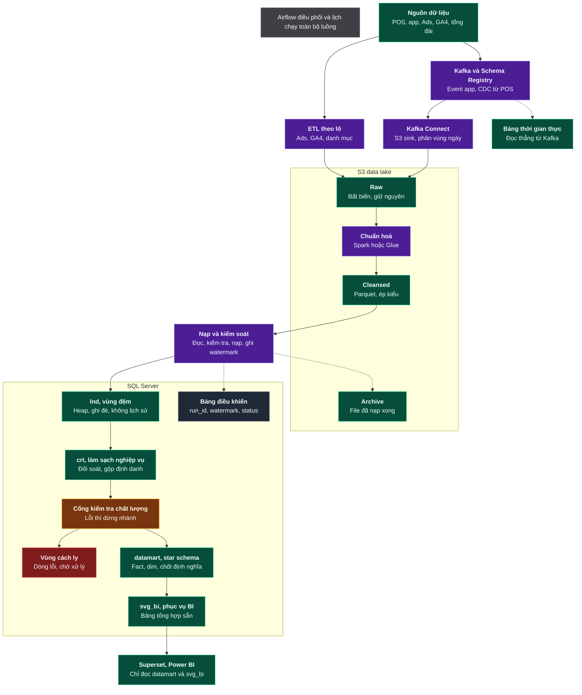
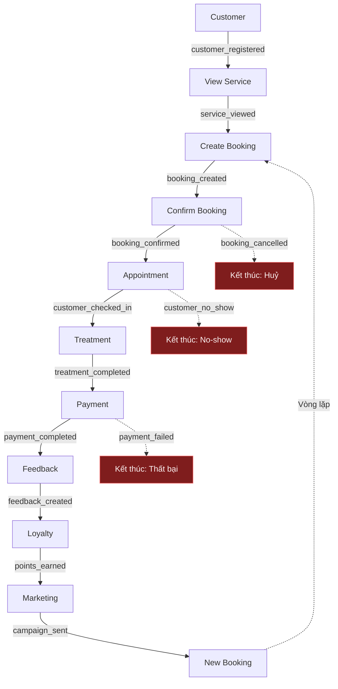
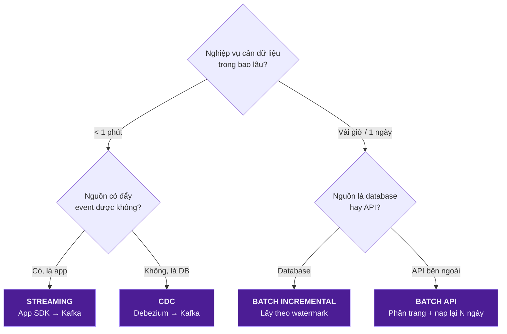
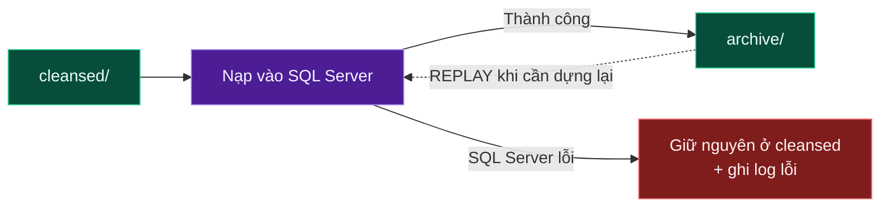
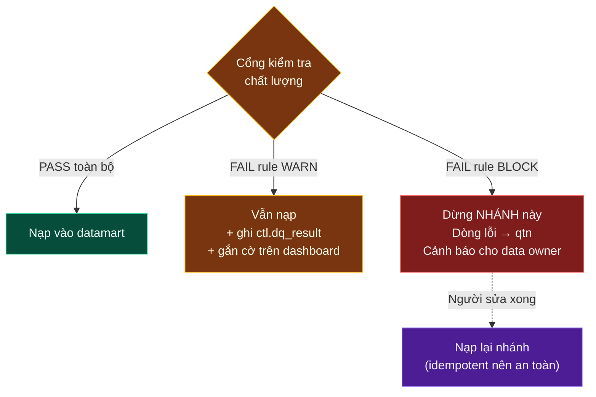
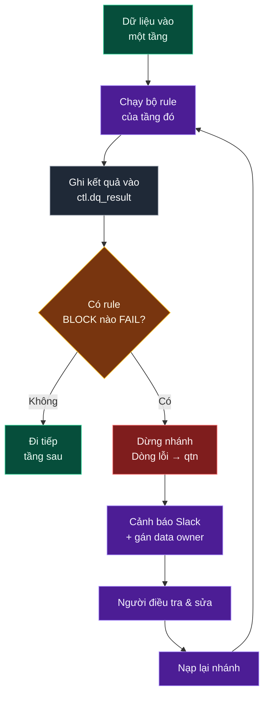

# FACIAL BAR — THIẾT KẾ DATA PLATFORM VÀ DATA WAREHOUSE

**Đặc tả kỹ thuật** · Phiên bản 1.0 · 14/08/2026

Tài liệu đặc tả nền tảng dữ liệu và kho dữ liệu phân tích cho chuỗi Facial Bar: mô hình nghiệp vụ, mô hình dữ liệu logic, thiết kế vật lý trên SQL Server, quy trình nạp, kiểm soát chất lượng và vận hành.

| | |
|---|---|
| **Đối tượng đọc** | Data Analyst, Data Engineer, DBA, Kiến trúc sư dữ liệu |
| **Sơ đồ kiến trúc gốc** | [Flow.jpg](Flow.jpg) — số hoá nguyên trạng tại [Phần 0](#phần-0--bức-tranh-tổng-thể) |
| **Bản trình phê duyệt** | [Ban-Thiet-Ke-CSDL.md](Ban-Thiet-Ke-CSDL.md) — dành cho ban lãnh đạo, không chứa chi tiết kỹ thuật |
| **Nguyên tắc thiết kế** | Business → Data → Technology. Công nghệ được chọn sau khi có yêu cầu, không chọn trước rồi tìm lý do |

**Phân định trách nhiệm theo vai trò** — mỗi phần có chủ sở hữu khác nhau:

| Phần | Nội dung | Vai trò chịu trách nhiệm |
|---|---|---|
| 1–2 | Nghiệp vụ, mô hình logic, grain, Bus Matrix | **Data Analyst** (chủ trì) |
| 3–4 | Nguồn dữ liệu, thu nạp, Data Lake, tầng kho | Data Engineer |
| 5 | Thiết kế vật lý, DDL, index, phân vùng | DBA / Data Engineer |
| 6 | Chỉ tiêu, phân tích, dashboard, ML | **Data Analyst** (chủ trì) |
| 7 | Công nghệ, bảo mật, chất lượng, vận hành | Kiến trúc sư / SRE |
| 8–9 | Lộ trình, quy ước, tra cứu | Chung |

---

## MỤC LỤC

| # | Lớp | Trả lời câu hỏi | Sản phẩm đầu ra (deliverable) |
|---|---|---|---|
| [0](#phần-0--bức-tranh-tổng-thể) | Tổng thể | Toàn bộ hệ thống trông như thế nào? | Sơ đồ kiến trúc |
| [1](#phần-1--business-layer) | Business | Nghiệp vụ là gì? Chuyện gì xảy ra? | Domain list, Process map, Event catalog |
| [2](#phần-2--mô-hình-dữ-liệu) | Mô hình dữ liệu | Dữ liệu có hình dạng gì? | → [docs/01-erd/](docs/01-erd/) |
| [3](#phần-3--data-source--flow) | Source & Flow | Dữ liệu từ đâu, vào bằng cách nào? | Source mapping, Ingestion matrix |
| [4](#phần-4--data-platform) | Platform | Lưu ở đâu, xử lý ra sao? | Lake zoning, DWH layering |
| [5](#phần-5--thiết-kế-vật-lý) | Thiết kế vật lý | Bảng, cột, khoá, index cụ thể ra sao? | → [docs/03-ddl/](docs/03-ddl/) |
| [6](#phần-6--analytics-layer) | Analytics | Dùng để làm gì? | KPI dictionary, Dashboard spec, ML use case |
| [7](#phần-7--architecture--non-functional) | Architecture | An toàn / tin cậy / scale được không? | Tech stack, DQ framework, Governance |
| [8](#phần-8--roadmap-thực-thi) | Roadmap | Làm theo thứ tự nào? | Kế hoạch 8 sprint |
| [9](#phần-9--phụ-lục) | Phụ lục | Tra cứu nhanh | Naming convention, Glossary, Checklist |

> **Ba lớp thiết kế database** — tài liệu này đi qua đủ cả ba, đừng nhảy bước:
>
> | Lớp | Tên | Sản phẩm | Ở phần nào |
> |---|---|---|---|
> | **Conceptual** (Khái niệm) | Có những thực thể nào, quan hệ ra sao | Domain list, ERD nghiệp vụ | Phần 1–2.2 |
> | **Logical** (Logic) | Bảng nào, cột nào, khoá nào, grain nào — chưa gắn với DBMS cụ thể | Grain table, Bus Matrix, Star schema | Phần 2.3–2.7 |
> | **Physical** (Vật lý) | Kiểu dữ liệu, index, partition, dung lượng — gắn chặt với SQL Server | **DDL chạy được** | **Phần 5** |

---
---

# PHẦN 0 — BỨC TRANH TỔNG THỂ

Đây là bản số hoá **đúng nguyên trạng** sơ đồ trong [Flow.jpg](Flow.jpg) — 20 hộp và **18 mũi tên**, không thêm không bớt. Toàn bộ tài liệu bên dưới là phần giải thích chi tiết cho sơ đồ này.



**Chú thích màu — nguyên văn trong ảnh:**

> *Tím là bước xử lý, xanh lá là nơi lưu dữ liệu*
> *Nét đứt là nhánh phụ và luồng quay lại*

Ảnh dùng thêm 3 màu mà chú thích gốc không nêu; suy ra từ ngữ cảnh:

| Màu | Hộp mang màu này | Ý nghĩa |
|---|---|---|
| 🟣 Tím | ETL theo lô, Kafka, Kafka Connect, Chuẩn hoá, Nạp và kiểm soát | Bước xử lý *(có trong chú thích)* |
| 🟢 Xanh lá | Raw, Cleansed, Archive, lnd, crt, datamart, svg_bi | Nơi lưu dữ liệu *(có trong chú thích)* |
| 🟡 Vàng | Cổng kiểm tra chất lượng | Cổng kiểm soát, có quyền dừng nhánh |
| 🔴 Đỏ | Vùng cách ly | Vùng lỗi, chờ người xử lý |
| ⚪ Xám | Airflow, Nguồn dữ liệu, Bảng điều khiển, Superset/Power BI, Bảng thời gian thực | Không phải nơi lưu dữ liệu nghiệp vụ |

### Ba điểm sơ đồ gốc chưa thể hiện

Sơ đồ trên là **bản sao đúng nguyên trạng**. Ba luồng sau đây cần thiết về mặt kỹ thuật nhưng **không được vẽ trong ảnh** — chúng được đặc tả ở các phần sau, không tự ý thêm vào sơ đồ:

| Luồng còn thiếu | Vì sao cần | Đặc tả ở |
|---|---|---|
| **Airflow điều phối cái gì** | Trong ảnh, Airflow là khung chú thích viền đứt ở trên cùng, **không nối vào hộp nào**. Cần chỉ rõ nó gọi những bước nào, theo thứ tự nào | [Mục 4.4](#44-airflow--điều-phối) |
| **Replay từ Archive** | Ảnh chỉ có `Nạp và kiểm soát → Archive` (đưa file đã nạp xong vào lưu trữ). Chiều ngược lại — đọc lại từ Archive khi cần dựng lại — chưa được vẽ | [Mục 4.1](#41-data-lake) |
| **Đường ra khỏi Vùng cách ly** | Ảnh không có mũi tên nào đi ra khỏi Vùng cách ly. Dòng lỗi sau khi sửa phải quay lại đường nạp, nếu không sẽ nằm đó vĩnh viễn | [Mục 4.3](#43-data-warehouse-sql-server--4-tầng) |

### Đọc sơ đồ theo 5 chặng

| Chặng | Tên gọi chuẩn | Việc xảy ra | Nếu hỏng thì sao |
|---|---|---|---|
| 1 | **Ingestion** (thu nạp) | Lấy dữ liệu ra khỏi hệ thống nguồn | Không có dữ liệu mới → báo cáo bị "đóng băng" ở ngày cũ |
| 2 | **Storage / Lake** | Lưu bản gốc bất biến + bản chuẩn hoá | Mất bản gốc → không thể dựng lại lịch sử, không thể audit |
| 3 | **Processing / Load** | Chuẩn hoá, khử trùng lặp, nạp vào DWH | Nạp trùng → doanh thu bị đếm 2 lần |
| 4 | **Modeling / Serving** | Dựng Fact–Dim, chốt định nghĩa KPI | Mỗi phòng ban ra một số khác nhau |
| 5 | **Consumption** | Dashboard, ad-hoc SQL, ML | Business không dùng được → cả platform vô nghĩa |

---
---

# PHẦN 1 — BUSINESS LAYER

> **Mục tiêu lớp này:** Hiểu nghiệp vụ **trước khi** vẽ bất kỳ cái bảng nào.
> Đây là lớp mà 80% lỗi thiết kế database thực sự bắt nguồn — không phải lỗi kỹ thuật.

## 1.1. Xuất phát điểm: Hành trình khách hàng

Slogan của Facial Bar là **"Hành trình khách hàng"** → dùng chính nó làm xương sống thiết kế.


hành trình khách hàng là thứ **duy nhất** mà cả CEO, marketing, lễ tân và data team đều hiểu giống nhau. Mọi bảng dữ liệu sau này phải trả lời được một chặng nào đó trên hành trình này. Bảng nào không thuộc chặng nào → nghi vấn: có thực sự cần không?

Chú ý mũi tên nét đứt cuối cùng: đây là **closed-loop** — dữ liệu đầu ra (feedback, hạng thành viên) trở thành đầu vào cho marketing chặng sau. Đây là lý do platform cần dữ liệu lịch sử, không chỉ dữ liệu hiện tại.

---

## 1.2. Business Domain — Xác định các "vùng nghiệp vụ"

Domain là một nhóm khái niệm nghiệp vụ có cùng chủ đề, do cùng một nhóm người chịu trách nhiệm.
Domain là cơ sở để chia schema, chia quyền truy cập, chia người sở hữu dữ liệu (data owner). Không chia domain → sau này 200 bảng nằm lẫn lộn trong 1 schema, không ai biết bảng nào của ai.

| # | Domain | Câu hỏi nghiệp vụ nó trả lời | Bản chất | Chủ sở hữu (Owner) |
|---|---|---|---|---|
| 1 | **Customer** | Ai là khách? Mới hay cũ? Đã quay lại mấy lần? | Master | CRM / Marketing |
| 2 | **Salon / Store** | Có bao nhiêu chi nhánh? Ở đâu? Quy mô nào? | Master | Vận hành |
| 3 | **Employee / Therapist** | Ai trực tiếp phục vụ khách? Tay nghề bậc mấy? | Master | HR / Vận hành |
| 4 | **Service** | Facial Bar bán những dịch vụ gì? Giá bao nhiêu? | Master | Sản phẩm |
| 5 | **Product** | Sản phẩm nào bán lẻ, sản phẩm nào dùng trong buồng? | Master | Kho / Sản phẩm |
| 6 | **Booking** | Khách đặt gì, khi nào, qua kênh nào? | Transaction | Vận hành |
| 7 | **Appointment** | Lịch hẹn cụ thể: ngày, giờ, buồng, KTV nào? | Transaction | Vận hành |
| 8 | **Treatment** | Dịch vụ **thực tế** đã được làm ra sao? | Transaction | Vận hành |
| 9 | **Payment** | Khách trả bao nhiêu, bằng hình thức gì? | Transaction | Tài chính |
| 10 | **Promotion** | Khuyến mãi nào đang chạy? Giảm bao nhiêu? | Master | Marketing |
| 11 | **Membership** | Khách ở hạng nào? Hết hạn khi nào? | Transaction (có kỳ hạn) | CRM |
| 12 | **Loyalty** | Khách tích/tiêu bao nhiêu điểm? | Transaction | CRM |
| 13 | **Marketing** | Chiến dịch nào? Chi bao nhiêu? Ra bao nhiêu khách? | Transaction | Marketing |
| 14 | **Feedback** | Khách hài lòng không? Vì sao? | Transaction | CX |

### Phân loại Master và Transaction

| | **Master Data** (Dữ liệu chủ) | **Transaction Data** (Dữ liệu giao dịch) |
|---|---|---|
| **Là gì** | Mô tả **một thứ tồn tại** | Ghi lại **một việc đã xảy ra** |
| Ví dụ | Khách hàng Lan, Salon Q1, dịch vụ Hydrafacial | Lan đặt lịch lúc 14:00 ngày 12/08 |
| Số lượng | Ít (nghìn dòng) | Rất nhiều (triệu dòng, tăng mỗi ngày) |
| Thay đổi | Chậm, sửa tại chỗ | Chỉ thêm mới (append) |
| Có mốc thời gian? | Không bắt buộc | **Luôn có** |
| Sau này thành | **Dimension** | **Fact** |

Tiêu chí phân loại: mô tả chứa động từ thể hoàn thành ("đã đặt", "đã trả", "đã đánh giá") → Transaction; mô tả là trạng thái tĩnh ("khách VIP", "chi nhánh Q1") → Master.

### Phân biệt Booking, Appointment và Treatment

Đây là chỗ dễ gộp bảng nhất, và cũng là chỗ gây sai số liệu nhiều nhất.

| | Booking | Appointment | Treatment |
|---|---|---|---|
| Là gì | **Ý định** của khách | **Lịch hẹn** đã xếp | **Việc đã làm** thật |
| Thời điểm | Khi khách bấm "Đặt lịch" | Khi hệ thống xếp KTV + buồng + giờ | Khi KTV thực hiện xong |
| Có thể huỷ? | Có | Có (kèm no-show) | Không (đã làm rồi) |
| Sinh doanh thu? | **Không** | **Không** | **Có** (qua Payment) |

Ba bảng tách rời vì quan hệ giữa chúng không phải một-một:
- 1 booking có thể tách thành **nhiều** appointment (khách đặt combo 3 buổi).
- 1 appointment có thể sinh **nhiều** treatment (đến làm facial, lễ tân up-sell thêm massage cổ vai gáy).
- 1 appointment có thể sinh **0** treatment (khách no-show).

Nếu gộp làm một bảng → không thể tính được **tỷ lệ no-show** và **tỷ lệ up-sell**, là 2 KPI vận hành quan trọng nhất của chuỗi spa.

---

## 1.3. Business Process — Các domain phối hợp với nhau ra sao

Process là một chuỗi bước nghiệp vụ có điểm bắt đầu, điểm kết thúc và một mục tiêu kinh doanh rõ ràng.
Process cho biết **thứ tự phụ thuộc** giữa các bảng → quyết định thứ tự nạp dữ liệu trong pipeline (không thể nạp `payment` trước khi có `treatment`).

| # | Process | Mục tiêu | Domain tham gia | KPI chính |
|---|---|---|---|---|
| 1 | **Customer Acquisition** | Thu hút khách mới | Marketing, Customer, Promotion | CAC, ROAS, số khách mới |
| 2 | **Booking & Appointment** | Khách đặt được lịch | Customer, Service, Salon, Employee, Booking, Appointment | Tỷ lệ chốt lịch, no-show |
| 3 | **Treatment** | Thực hiện dịch vụ | Appointment, Employee, Treatment, Service, Product | Utilization KTV, thời gian phục vụ |
| 4 | **Payment & Sales** | Thu tiền | Treatment, Product, Promotion, Payment, Membership | Revenue, ATV, tỷ lệ giảm giá |
| 5 | **Loyalty & Membership** | Giữ chân khách | Customer, Payment, Loyalty, Membership | Tỷ lệ nâng hạng, điểm tiêu/tích |
| 6 | **Customer Retention** | Khiến khách quay lại | Toàn bộ (closed-loop) | Repeat rate, CLV, churn |

> 💡 Process 6 không có bảng riêng — nó là **kết quả** của 5 process trước. Đây là dấu hiệu tốt: process phân tích thường không sinh bảng nguồn mới, mà sinh **bảng tổng hợp** ở tầng datamart.

---

## 1.4. Business Event — Chuyện gì thực sự xảy ra

Event là một việc đã xảy ra tại một thời điểm xác định, không thể thay đổi được nữa.
Event chính là **hạt dữ liệu nhỏ nhất** của hệ thống. Có event → tái dựng được toàn bộ lịch sử. Chỉ có bảng trạng thái hiện tại → mất vĩnh viễn thông tin "khách đã từng huỷ 3 lần trước khi đến".

### Quy ước đặt tên event
`<domain>_<động từ quá khứ>` — luôn dùng thể **đã hoàn thành**, chữ thường, gạch dưới.

✅ `booking_created`, `payment_completed`
❌ `create_booking` (đang làm), ❌ `BookingCreate` (không nhất quán), ❌ `booking` (không biết chuyện gì xảy ra)

### Event Catalog

| Domain | Event | Ý nghĩa nghiệp vụ | Thuộc tính then chốt |
|---|---|---|---|
| Customer | `customer_registered` | Khách tạo tài khoản | customer_id, channel, referral_code |
| | `customer_updated` | Sửa thông tin | customer_id, field_changed |
| | `customer_login` | Đăng nhập app | customer_id, device, session_id |
| Service | `service_viewed` | Xem trang dịch vụ | customer_id, service_id, duration_sec |
| Booking | `booking_created` | Đặt lịch | booking_id, service_ids[], slot_at |
| | `booking_confirmed` | Salon xác nhận | booking_id, confirmed_by |
| | `booking_cancelled` | Huỷ | booking_id, reason, cancelled_by |
| | `booking_rescheduled` | Đổi giờ | booking_id, old_slot, new_slot |
| Appointment | `customer_checked_in` | Khách đến quầy | appointment_id, checkin_at |
| | `customer_no_show` | Khách không đến | appointment_id |
| Treatment | `treatment_started` | Bắt đầu làm | treatment_id, employee_id, room_id |
| | `treatment_completed` | Làm xong | treatment_id, actual_duration_min |
| Payment | `payment_initiated` | Bấm thanh toán | payment_id, amount, method |
| | `payment_completed` | Trả tiền xong | payment_id, gateway_txn_id |
| | `payment_failed` | Thất bại | payment_id, error_code |
| | `refund_issued` | Hoàn tiền | payment_id, refund_amount |
| Loyalty | `points_earned` | Tích điểm | customer_id, points, source_payment_id |
| | `points_redeemed` | Tiêu điểm | customer_id, points, target |
| Membership | `membership_purchased` | Mua thẻ | customer_id, tier, valid_from/to |
| | `membership_upgraded` | Nâng hạng | customer_id, from_tier, to_tier |
| | `membership_expired` | Hết hạn | customer_id, tier |
| Feedback | `feedback_created` | Gửi đánh giá | feedback_id, rating, comment |
| Marketing | `campaign_sent` | Gửi chiến dịch | campaign_id, customer_id, channel |
| | `campaign_clicked` | Khách bấm vào | campaign_id, customer_id |

### Thuộc tính bắt buộc của MỌI event (Event Envelope)

Đây là "bao thư" chung, tách biệt với nội dung nghiệp vụ. Bắt buộc chuẩn hoá từ ngày đầu.

| Trường | Kiểu | Vai trò | Vì sao bắt buộc |
|---|---|---|---|
| `event_id` | UUID | Khoá duy nhất của event | Để **khử trùng lặp** — Kafka có thể gửi 1 event 2 lần |
| `event_name` | string | Tên event | Định tuyến xử lý |
| `event_version` | int | Phiên bản schema | Để đổi schema không làm vỡ downstream |
| `occurred_at` | timestamp (UTC) | **Lúc việc xảy ra thật** | Dùng để tính toán nghiệp vụ |
| `received_at` | timestamp (UTC) | Lúc hệ thống nhận được | Dùng để đo độ trễ, phát hiện late data |
| `source_system` | string | `pos` / `app` / `web` / `ga4` | Truy vết nguồn gốc |
| `entity_id` | string | ID đối tượng chính | Dùng làm Kafka partition key |

> ⚠️ **Phân biệt `occurred_at` và `received_at`.** Khách check-in ở salon lúc 23:50 ngày 13/08 nhưng mạng lỗi, event về server 00:10 ngày 14/08. Nếu báo cáo dùng `received_at` → doanh thu ngày 13 bị hụt, ngày 14 bị dôi. **Luôn phân vùng lưu trữ theo `received_at`, nhưng tính toán nghiệp vụ theo `occurred_at`.**

---

## 1.5. Business Event Flow — Ghép Process + Event



> 💡 **Điểm quan trọng mà bản phác thảo ban đầu chưa có: các nhánh THẤT BẠI.**
> Luồng "happy path" chỉ là 1 trong nhiều kết cục. Phân tích kinh doanh giá trị nhất nằm ở nhánh thất bại: *tại sao 30% booking bị huỷ?*
> Vì vậy mô hình dữ liệu **phải lưu cả event thất bại**, không chỉ event thành công. Nếu POS chỉ ghi booking thành công → mất vĩnh viễn khả năng phân tích huỷ lịch.

### Tóm tắt 3 khái niệm cốt lõi của Business Layer

| Khái niệm | Câu hỏi | Ví dụ Facial Bar |
|---|---|---|
| **Domain** | Có những đối tượng nghiệp vụ nào? | Customer, Salon, Booking, Payment |
| **Process** | Chúng vận hành với nhau thế nào? | Customer → Booking → Treatment → Payment |
| **Event** | Trong quá trình đó chuyện gì xảy ra? | `booking_created` → `treatment_completed` → `payment_completed` |

---
---

# PHẦN 2 — MÔ HÌNH DỮ LIỆU

Biến Process và Event ở Phần 1 thành đối tượng dữ liệu có cấu trúc: thực thể, quan hệ, grain, mô hình chiều.

Chi tiết đầy đủ nằm ở tài liệu riêng:

| Tài liệu | Nội dung |
|---|---|
| [docs/01-erd/erd-logic.md](docs/01-erd/erd-logic.md) | Thực thể master và transaction, ba loại khoá, ERD nghiệp vụ, cardinality, xử lý quan hệ N:N |
| [docs/01-erd/grain.md](docs/01-erd/grain.md) | Bảng khai báo grain cho toàn bộ bảng, double counting, fan-out, additivity của measure |
| [docs/01-erd/star-schema.md](docs/01-erd/star-schema.md) | Fact và Dimension, ba loại fact, SCD Type 1/2/3, dimension đặc biệt, chuẩn hoá 3NF so với phi chuẩn hoá |
| [docs/01-erd/bus-matrix.md](docs/01-erd/bus-matrix.md) | Ma trận fact × dimension, conformed dimension, drilling across |

## Bốn quyết định mô hình chi phối toàn bộ thiết kế

| # | Quyết định | Hệ quả nếu làm sai |
|---|---|---|
| 1 | **Tách Booking, Appointment, Treatment thành ba thực thể** | Gộp lại thì không tính được tỷ lệ no-show và tỷ lệ bán thêm |
| 2 | **Mỗi bảng khai báo grain bằng một câu**, thực thi bằng `UNIQUE` constraint | Sai grain làm mọi phép đếm và tổng sai mà không sinh thông báo lỗi |
| 3 | **Không lưu tỷ lệ trong fact**, chỉ lưu tử số và mẫu số | `AVG` của tỷ lệ cho kết quả lệch nhiều lần khi các nhóm khác quy mô |
| 4 | **Dimension theo dõi lịch sử bằng SCD Type 2** | Báo cáo quá khứ tự thay đổi khi dữ liệu hiện tại bị sửa |

## Kết quả

| Lớp | Số bảng | Dạng chuẩn | Tài liệu DDL |
|---|---|---|---|
| `crt` — đối soát | 25 bảng + 1 view | 3NF | [docs/03-ddl/02-crt.md](docs/03-ddl/02-crt.md) |
| `dm` — mô hình chiều | 13 dimension + 10 fact + 1 bridge | Phi chuẩn hoá có kiểm soát | [dimension](docs/03-ddl/03-dm-dimension.md) · [fact](docs/03-ddl/04-dm-fact.md) |


# PHẦN 3 — DATA SOURCE & FLOW

> **Mục tiêu:** Trả lời 3 câu hỏi — Dữ liệu phát sinh ở đâu? Đưa vào platform bằng cách nào? Đi qua những hệ thống nào?

## 3.1. Data Source — 4 nhóm nguồn của Facial Bar

| Nhóm | Là gì | Hệ thống cụ thể | Loại dữ liệu | Đặc tính |
|---|---|---|---|---|
| **A. Web / Mobile App** | Nơi phát sinh **hành vi** khách hàng | App iOS/Android, Website | Clickstream event (JSON) | Lượng lớn, bán cấu trúc, **chỉ thêm mới** |
| **B. OLTP Database** | Nơi lưu **giao dịch nghiệp vụ** chính | PostgreSQL/MySQL của hệ thống booking | Bảng quan hệ | Có cấu trúc, **bị UPDATE/DELETE** |
| **C. POS / Salon System** | Dữ liệu phát sinh **tại cửa hàng** | POS ở quầy, phần mềm quản lý buồng | Hoá đơn, check-in, tiêu hao vật tư | Có cấu trúc, **mạng có thể mất → dữ liệu về muộn** |
| **D. External Systems** | Hệ thống **bên ngoài** | Facebook Ads, Google Ads, GA4, Payment Gateway, CRM, Email/SMS, Tổng đài | API / file export | **Không kiểm soát được schema**, có rate limit, có độ trễ |

### Source Mapping — một Entity có thể có nhiều Source

Đây là bảng quan trọng: nó cho biết chỗ nào cần **gộp định danh** và chỗ nào cần **đối soát**.

| Entity | Nguồn chính (System of Record) | Nguồn bổ trợ | Xử lý xung đột |
|---|---|---|---|
| `customer` | OLTP | App (device, hành vi), POS (khách walk-in), CRM | Gộp theo phone → email → device_id |
| `booking` | OLTP | App event (`booking_created`), Hotline | OLTP thắng; event dùng để đo độ trễ |
| `appointment` | POS | OLTP | POS thắng (là nơi thực tế xếp lịch) |
| `treatment` | POS | — | POS là nguồn duy nhất |
| `payment` | POS | Payment Gateway | **Bắt buộc đối soát** POS ↔ Gateway hằng ngày |
| `product_usage` | POS | Hệ thống kho | Đối soát tồn kho cuối kỳ |
| `feedback` | App | SMS survey, Tổng đài | Khử trùng lặp theo (customer, treatment) |
| `ad_spend` | Facebook/Google Ads API | — | Chú ý API **cập nhật lại số liệu 7 ngày** |
| `web_traffic` | GA4 | — | Chỉ dùng ở mức tổng hợp, GA4 có lấy mẫu |

> 💡 **Khái niệm System of Record (SoR):** với mỗi trường dữ liệu, phải chỉ định **đúng một** hệ thống là nguồn chân lý. Không có SoR → khi 2 nguồn lệch nhau, không ai biết tin cái nào, và cuộc họp sẽ biến thành tranh luận vô tận.

---

## 3.2. Ingestion — 3 cơ chế thu nạp

Ingestion là việc đưa dữ liệu từ hệ thống nguồn vào data platform.

| Cơ chế | Là gì | Dùng khi | Nguồn ở Facial Bar | Công cụ | Độ trễ |
|---|---|---|---|---|---|
| **Batch** (theo lô) | Định kỳ lấy trọn một khối dữ liệu | Không cần real-time, nguồn là API/file | Facebook Ads, Google Ads, GA4, danh mục dịch vụ | Airflow + Python/Spark | Giờ → Ngày |
| **CDC** (Change Data Capture) | Đọc **log thay đổi** của database để bắt từng INSERT/UPDATE/DELETE | Cần biết dữ liệu OLTP thay đổi gì, không muốn quét lại cả bảng | OLTP: customer, booking, payment | Debezium → Kafka | Giây |
| **Streaming** | Ứng dụng **chủ động đẩy** event ngay khi xảy ra | Event hành vi, cần gần real-time | App event: `service_viewed`, `booking_created`, `feedback_created` | SDK → Kafka | Mili giây → Giây |

### CDC — giải thích kỹ vì đây là khái niệm khó nhất

**Vấn đề:** bảng `booking` trong OLTP có 5 triệu dòng. Mỗi đêm quét lại toàn bộ thì rất nặng và vẫn **không biết** dòng nào vừa bị sửa, dòng nào vừa bị xoá.

mọi database quan hệ đều ghi lại mọi thay đổi vào một file log nội bộ (WAL ở PostgreSQL, binlog ở MySQL). Debezium đọc chính file log đó và biến từng thay đổi thành một message Kafka:

```json
{
  "op": "u",                                  // c=create, u=update, d=delete, r=snapshot
  "before": { "booking_id": 1001, "booking_status": "created" },
  "after":  { "booking_id": 1001, "booking_status": "confirmed" },
  "source": { "table": "booking", "lsn": 84021, "ts_ms": 1755149400000 }
}
```

**Cái CDC cho ta mà batch không bao giờ có:** bắt được **DELETE** (batch chỉ thấy dòng biến mất một cách bí ẩn), và bắt được **mọi trạng thái trung gian** (batch chỉ thấy trạng thái lúc quét).

**Cái CDC đòi hỏi phải xử lý thêm:**
1. **Khử trùng lặp:** CDC đảm bảo *at-least-once* — một thay đổi có thể về 2 lần. Phải dùng `(business_key, lsn)` để loại trùng.
2. **Chọn dòng mới nhất:** trong 1 batch có thể có 5 phiên bản của cùng 1 booking. Phải lấy phiên bản có `lsn` lớn nhất.
3. **Xử lý xoá mềm:** không xoá thật ở DWH, mà set `is_deleted = 1` để giữ lịch sử.

```sql
-- Mẫu chuẩn: chọn phiên bản cuối cùng của mỗi bản ghi trong 1 lô CDC
WITH ranked AS (
  SELECT *,
         ROW_NUMBER() OVER (PARTITION BY booking_id ORDER BY _lsn DESC) AS rn
  FROM lnd.cdc_booking
)
SELECT * FROM ranked WHERE rn = 1 AND _op <> 'd';
```

### Ma trận quyết định — chọn cơ chế nào?



> ⚠️ **Không phải data nào cũng phải đi Kafka.** Chi phí vận hành Kafka rất thật (cluster, monitoring, schema registry, người biết vận hành). Dữ liệu chi phí quảng cáo chỉ cập nhật 1 lần/ngày mà đẩy qua Kafka là **over-engineering** — vừa tốn tiền vừa tăng số điểm có thể hỏng.
>
> **Chọn cơ chế dựa trên yêu cầu độ trễ (latency requirement) và đặc tính của nguồn.**

---

## 3.3. Kafka & Schema Registry

| Khái niệm | Là gì | Cấu hình cho Facial Bar |
|---|---|---|
| **Topic** | Kênh chứa các event cùng loại | `facialbar.booking.v1`, `facialbar.payment.v1`, `facialbar.customer.v1`, `facialbar.feedback.v1`, `facialbar.cdc.booking` |
| **Partition** | Topic được chia nhỏ để xử lý song song | 6 partition/topic, key = `customer_id` |
| **Partition Key** | Trường quyết định event vào partition nào | Cùng `customer_id` → cùng partition → **đảm bảo đúng thứ tự** cho từng khách |
| **Consumer Group** | Nhóm tiến trình cùng đọc 1 topic | `cg-s3-sink`, `cg-realtime-dashboard` |
| **Retention** | Giữ event bao lâu | 7 ngày (đủ để replay khi pipeline lỗi cuối tuần) |
| **Schema Registry** | Nơi lưu và kiểm tra schema của event | Avro, chế độ `BACKWARD` |

hôm nay dev app đổi `rating` từ số nguyên sang chuỗi. Không có registry → event vẫn được gửi, pipeline xuống hạ nguồn mới vỡ lúc 3 giờ sáng. Có registry → producer bị **chặn ngay tại chỗ** với lỗi rõ ràng.

**Chế độ tương thích `BACKWARD`:** consumer code mới đọc được dữ liệu cũ. Nghĩa là: **được phép thêm** field có giá trị mặc định, **được phép xoá** field không bắt buộc; **không được** đổi kiểu dữ liệu hay đổi tên field.

**Kafka Connect (S3 Sink):** đây là thành phần đưa event từ Kafka xuống S3, phân vùng theo ngày:
```
s3://facialbar-lake/raw/kafka/booking/v1/dt=2026-08-14/hour=09/part-00001.json.gz
```
Kích hoạt ghi file khi đạt 1 trong 3 ngưỡng: 128 MB, 100.000 dòng, hoặc 15 phút — chọn cái nào đến trước. Mục đích là tránh **bài toán file nhỏ** (hàng triệu file 2 KB làm Spark chậm gấp chục lần).

---

## 3.4. Kết quả của Phần 3

| Câu hỏi | Trả lời |
|---|---|
| Data từ đâu? | Web/App, OLTP, POS, External Systems |
| Data vào bằng cách nào? | Streaming, CDC, Batch, API |
| Dùng công nghệ gì? | Kafka + Schema Registry, Debezium, Kafka Connect, Airflow, Spark/Glue |
| Data đi đâu? | S3 Data Lake (zone `raw`) |

---
---

# PHẦN 4 — DATA PLATFORM

## 4.1. Data Lake

Data Lake là nơi lưu trữ tập trung dữ liệu ở quy mô lớn, chứa được nhiều định dạng và **giữ dữ liệu gần với dạng gốc của nguồn**.
**Chọn công nghệ:** Amazon S3.

**Lake lưu những gì:** dữ liệu có cấu trúc (customer, booking, payment, treatment, product, salon, employee, marketing, feedback), bán cấu trúc (JSON event, CSV export, log), và có thể cả phi cấu trúc (ảnh trước/sau điều trị, tài liệu đồng ý điều trị).

### Ba zone chính

| Zone | Mục đích | Định dạng | Nguyên tắc |
|---|---|---|---|
| **raw/** | Giữ **nguyên** dữ liệu từ nguồn, **không** transformation | Đúng như nguồn (JSON/CSV/Avro), gzip | **Immutable** |
| **cleansed/** | Bản đã chuẩn hoá, dùng được cho hạ nguồn | Parquet + Snappy | Có schema rõ ràng, đã ép kiểu |
| **archive/** | Giữ file **đã nạp thành công**, phục vụ replay/recovery | Như raw | Chỉ chuyển vào sau khi nạp xong |

### Nguyên tắc Immutable (Bất biến) — Write Once

File đã ghi vào Lake thì **không sửa trực tiếp**. Muốn có bản mới → ghi file mới.

```
raw/pos/booking/dt=2026-08-14/booking_20260814_v1.parquet   ← lô đầu
raw/pos/booking/dt=2026-08-14/booking_20260814_v2.parquet   ← nguồn gửi lại, KHÔNG ghi đè v1
```

Ba lý do:
1. **Audit** — khi số liệu lệch, phải chứng minh được nguồn đã gửi cái gì. Ghi đè là mất chứng cứ.
2. **Reproducibility** — chạy lại pipeline của tháng trước phải ra đúng kết quả tháng trước.
3. **An toàn trước lỗi code** — pipeline có bug thì chỉ cần sửa code rồi chạy lại từ raw. Nếu raw đã bị ghi đè bằng dữ liệu lỗi → mất vĩnh viễn.

### Cấu trúc thư mục chuẩn

```
s3://facialbar-lake/
├── raw/
│   ├── pos/booking/dt=2026-08-14/...
│   ├── pos/invoice/dt=2026-08-14/...
│   ├── kafka/booking/v1/dt=2026-08-14/hour=09/...
│   ├── cdc/oltp/customer/dt=2026-08-14/...
│   ├── ads/facebook/dt=2026-08-14/...
│   └── ga4/events/dt=2026-08-14/...
├── cleansed/
│   ├── customer/    (Iceberg table)
│   ├── booking/
│   ├── invoice_line/
│   └── payment/
└── archive/
    └── pos/booking/loaded_dt=2026-08-14/...
```

> 💡 **Vì sao thư mục có dạng `dt=2026-08-14` (kiểu Hive):** query engine đọc được ngay cột phân vùng từ tên thư mục. Câu `WHERE dt = '2026-08-14'` sẽ **chỉ đọc 1 thư mục** thay vì quét toàn bộ bucket. Đây gọi là **partition pruning** — chênh lệch chi phí có thể lên tới hàng trăm lần.

### Bước Chuẩn hoá (raw → cleansed) — Spark hoặc Glue

Đây chính là hộp tím "Chuẩn hoá" trong sơ đồ. Gồm 6 việc, theo đúng thứ tự:

| # | Việc | Chi tiết | Ví dụ |
|---|---|---|---|
| 1 | **Validation** | Kiểm tra schema, cột bắt buộc, dòng hỏng | Thiếu `booking_id` → đẩy sang reject |
| 2 | **Type Casting** | Ép kiểu về đúng chuẩn | `"1200000.00"` → `DECIMAL(18,2)`; `"14/08/2026"` → `DATE` |
| 3 | **Column Standardization** | Chuẩn tên cột, chuẩn giá trị | `CustomerID`/`cust_id` → `customer_id`; `"Nam"`/`"M"`/`"male"` → `M` |
| 4 | **CDC Deduplication** | Loại bản ghi trùng, lấy phiên bản cuối | `ROW_NUMBER() ... ORDER BY _lsn DESC` |
| 5 | **Data Quality** | Chạy rule kiểm tra chất lượng | `amount >= 0`, `occurred_at <= now()` |
| 6 | **Ghi Parquet + Snappy** | Định dạng cột, nén | Nhỏ hơn JSON ~5–10 lần, đọc nhanh hơn nhiều |

Parquet lưu theo **cột**, nên câu `SELECT SUM(net_amount)` chỉ đọc đúng 1 cột thay vì cả dòng. Nén tốt hơn vì dữ liệu cùng cột có cùng kiểu. Snappy nén nhẹ hơn gzip nhưng **giải nén nhanh hơn nhiều** và cho phép chia file để xử lý song song — đánh đổi đúng cho phân tích.

### Archive Zone — cơ chế phục hồi



> ⚠️ **Archive KHÔNG phải Database Backup.** Đây là hai thứ khác nhau hoàn toàn:
>
> | | Database Backup | Archive Zone |
> |---|---|---|
> | Là gì | Bản sao **trạng thái** của DB | Bản sao **dữ liệu đầu vào** của pipeline |
> | Phục hồi được gì | Đưa DB về thời điểm T | **Chạy lại** pipeline từ đầu |
> | Ai dùng | DBA | Data Engineer |
> | Khi nào dùng | Server chết, xoá bảng nhầm | Logic transform sai, cần nạp lại 3 tháng |

### Apache Iceberg — Open Table Format

Iceberg là một lớp **metadata** đặt lên trên các file Parquet trên S3, biến một đống file rời rạc thành một **bảng** thực sự có schema, có phiên bản, có transaction.

**Vấn đề Iceberg giải quyết:** S3 chỉ là kho file. Không có Iceberg thì:
- Muốn tìm dữ liệu → phải `LIST` toàn bộ prefix (rất chậm, tốn tiền theo request).
- Muốn `UPDATE` 1 dòng → phải đọc file, sửa, ghi lại cả file.
- Đang đọc mà job khác đang ghi → đọc được dữ liệu nửa vời.
- Đổi schema → mọi consumer vỡ.

**Iceberg quản lý 4 thứ:**

| Thành phần | Là gì | Lợi ích cụ thể |
|---|---|---|
| **Schema** | Lưu định nghĩa cột trong metadata | Biết chính xác bảng có cột gì, kiểu gì |
| **Metadata / Manifest** | Danh sách file thuộc bảng + thống kê min/max mỗi cột | Query → đọc metadata → **xác định đúng file cần đọc** → không phải quét S3 |
| **Snapshot** | Mỗi lần ghi tạo một snapshot mô tả trạng thái mới của bảng | Mỗi snapshot là **một trạng thái nhất quán tại một thời điểm** |
| **Partition** | Thông tin phân vùng nằm trong metadata (không phụ thuộc đường dẫn) | Giảm lượng dữ liệu phải đọc; **đổi được cách phân vùng** mà không ghi lại dữ liệu |

**Bốn năng lực có được từ đó:**

| Năng lực | Là gì | Ví dụ Facial Bar |
|---|---|---|
| **Schema Evolution** | Thêm/xoá/đổi tên cột an toàn | Thêm cột `skin_type` vào `treatment` — job cũ vẫn chạy bình thường |
| **ACID Transaction** | Ghi thì hoặc xong hẳn, hoặc như chưa từng xảy ra | Spark job dừng bất thường → không để lại dữ liệu ghi dở |
| **Time Travel** | Đọc bảng ở trạng thái quá khứ (nhờ snapshot) | `SELECT * FROM cleansed.booking FOR TIMESTAMP AS OF '2026-08-01'` để xem báo cáo hôm đó dựa trên dữ liệu nào |
| **Hidden Partitioning** | Người viết SQL không cần biết cột phân vùng | `WHERE occurred_at > ...` tự động được tối ưu |

> 💡 **Iceberg không lưu dữ liệu.** Dữ liệu thực tế vẫn là các file Parquet trên S3. Iceberg chỉ quản lý **metadata + trạng thái** của bảng. Xoá metadata thì file vẫn còn, nhưng không còn là "bảng" nữa.

**Dùng Iceberg ở đâu:** tầng **cleansed** trở đi (nơi cần schema ổn định, cần UPDATE/DELETE cho CDC, cần time travel). Tầng **raw** giữ nguyên file thô để bảo toàn nguyên tắc immutable.

**Việc bảo trì bắt buộc (nhiều nơi quên, dẫn tới chậm dần theo tháng):**
- `rewrite_data_files` — gộp file nhỏ (chạy hằng tuần).
- `expire_snapshots` — xoá snapshot cũ hơn 30 ngày (giữ metadata không tăng vô hạn).
- `remove_orphan_files` — dọn file không còn thuộc snapshot nào.

---

## 4.2. Ingestion / Loading Layer — "Nạp và kiểm soát"

Đây là hộp tím ở giữa sơ đồ, làm 4 việc theo thứ tự: **Đọc → Kiểm tra → Nạp → Ghi watermark**.

### Khái niệm Watermark

Watermark là một dấu mốc được lưu lại, ghi nhớ "đã xử lý đến đâu rồi", để lần chạy sau chỉ lấy phần mới.

không có watermark thì mỗi lần chạy phải quét lại toàn bộ dữ liệu (rất chậm và tốn tiền), hoặc phải hard-code ngày trong code (chạy lại lịch sử là không thể).

| Loại watermark | Giá trị lưu | Dùng cho |
|---|---|---|
| Theo thời gian | `2026-08-14 09:00:00` | Nguồn có cột `updated_at` đáng tin |
| Theo LSN/offset | `84021` | CDC (chính xác tuyệt đối) |
| Theo phân vùng ngày | `dt=2026-08-14` | File trên S3 |
| Theo danh sách file | Tên các file đã nạp | Nguồn gửi file không theo lịch |

### Tính Idempotent (chạy lại không sai)

Chạy pipeline 1 lần hay 5 lần với cùng dữ liệu đầu vào đều cho **cùng một kết quả**.

pipeline sẽ hỏng, và người ta sẽ bấm retry. Nếu không idempotent, mỗi lần retry cộng thêm một bản dữ liệu → doanh thu tăng vọt không rõ lý do.

| Cách làm | Kỹ thuật | Áp dụng cho |
|---|---|---|
| **Delete-Insert theo phân vùng** | `DELETE WHERE dt = @dt;` rồi `INSERT` | Fact theo ngày — đơn giản và an toàn nhất |
| **MERGE theo khoá nghiệp vụ** | `MERGE ... ON target.bk = source.bk` | Dimension SCD, bảng có UPDATE |
| **INSERT có kiểm tra tồn tại** | `WHERE NOT EXISTS (...)` | Bảng append-only, khối lượng nhỏ |

```sql
-- Mẫu nạp fact idempotent theo ngày (DDL đầy đủ của bảng ở mục 5.6.1)
BEGIN TRAN;
    DELETE FROM dm.fact_sales_line WHERE service_date_key = @date_key;

    INSERT INTO dm.fact_sales_line
        (service_date_key, invoice_date_key, customer_sk, salon_sk, /* ... */,
         invoice_line_id, invoice_no, net_amount, _run_id)
    SELECT @date_key,
           YEAR(i.invoiced_at)*10000 + MONTH(i.invoiced_at)*100 + DAY(i.invoiced_at),
           ISNULL(c.customer_sk, -1),      -- -1 = Unknown member, KHÔNG để NULL
           ISNULL(s.salon_sk, -1),
           /* ... */
           il.invoice_line_id,             -- cột định nghĩa GRAIN
           i.invoice_no,
           il.net_amount,
           @run_id
    FROM   crt.invoice_line il
    JOIN   crt.invoice i        ON i.invoice_id = il.invoice_id
    -- LEFT JOIN + ISNULL để KHÔNG BAO GIỜ mất dòng fact vì thiếu dimension
    LEFT JOIN dm.dim_customer c ON c.customer_id = i.customer_id
                               AND i.service_at >= c.valid_from
                               AND i.service_at <  c.valid_to      -- temporal join, xem cảnh báo dưới
    LEFT JOIN dm.dim_salon s    ON s.salon_id = i.salon_id
                               AND i.service_at >= s.valid_from
                               AND i.service_at <  s.valid_to
    WHERE  CAST(i.service_at AS DATE) = @business_date;

    UPDATE ctl.watermark
       SET last_value = @business_date, last_run_id = @run_id, updated_at = SYSUTCDATETIME()
     WHERE source_name = 'pos' AND entity_name = 'invoice_line';
COMMIT;
```

> ⚠️ **Bốn điểm cần lưu ý trong câu INSERT này:**
>
> **1. `LEFT JOIN` theo khoảng `valid_from`/`valid_to` là temporal join** — chọn đúng phiên bản SCD2 **có hiệu lực tại thời điểm giao dịch**. Dùng `is_current = 1` cho fact lịch sử sẽ gán hạng thành viên hiện tại vào giao dịch quá khứ.
>
> **2. `INNER JOIN` thay vì `LEFT JOIN`** sẽ khiến khách chưa có trong dim làm **mất luôn dòng doanh thu** — không lỗi, không cảnh báo.
>
> **3. `ISNULL(..., -1)` là bắt buộc**, không phải phòng xa. Cột FK trong fact được khai báo `NOT NULL` (mục 5.3), nên thiếu `ISNULL` thì câu INSERT sẽ fail — và đó là kết quả **tốt hơn** so với việc âm thầm ghi NULL rồi bị `INNER JOIN` của người dùng cuối xoá mất về sau.
>
> **4. Lọc theo `service_at` chứ không phải `invoiced_at`** — doanh thu ghi nhận theo ngày dịch vụ được thực hiện (mục 4.3), và `service_date_key` cũng là khoá phân vùng (mục 5.6.1). Lọc sai cột thì partition pruning vô hiệu và số liệu lệch ngày.

### Control / Metadata Tables — "Bảng điều khiển"

Nhóm bảng không chứa dữ liệu nghiệp vụ, chỉ chứa thông tin về **chính pipeline**: đã chạy chưa, chạy đến đâu, kết quả thế nào.

không có nhóm bảng này thì khi giám đốc hỏi *"số liệu hôm nay đã đủ chưa?"* — không ai trả lời được, chỉ có thể đoán.

```sql
-- ctl.pipeline_run : 1 dòng = 1 lần chạy 1 task
run_id          UNIQUEIDENTIFIER PK
dag_id          VARCHAR(100)
task_id         VARCHAR(100)
business_date   DATE
started_at      DATETIME2
ended_at        DATETIME2      NULL
status          VARCHAR(20)     -- RUNNING / SUCCESS / FAILED / SKIPPED
rows_read       BIGINT
rows_written    BIGINT
rows_rejected   BIGINT
error_message   NVARCHAR(MAX)   NULL

-- ctl.watermark : 1 dòng = 1 (nguồn, entity)
source_name     VARCHAR(50)     PK
entity_name     VARCHAR(100)    PK
watermark_type  VARCHAR(20)     -- TIMESTAMP / LSN / PARTITION
last_value      VARCHAR(100)
last_run_id     UNIQUEIDENTIFIER
updated_at      DATETIME2

-- ctl.load_audit : 1 dòng = 1 file đã nạp  → dùng để chống nạp trùng file
audit_id        BIGINT          PK
run_id          UNIQUEIDENTIFIER
file_path       VARCHAR(1000)
file_hash       VARCHAR(64)     -- phát hiện cùng nội dung gửi lại
rows_in_file    BIGINT
loaded_at       DATETIME2
status          VARCHAR(20)

-- ctl.dq_result : 1 dòng = 1 lần chạy 1 rule
dq_result_id    BIGINT          PK
run_id          UNIQUEIDENTIFIER
rule_id         VARCHAR(50)
entity_name     VARCHAR(100)
dimension       VARCHAR(30)     -- Completeness / Accuracy / ...
severity        VARCHAR(10)     -- BLOCK / WARN
metric_value    DECIMAL(18,4)
threshold_value DECIMAL(18,4)
status          VARCHAR(10)     -- PASS / FAIL
checked_at      DATETIME2
```

---

## 4.3. Data Warehouse (SQL Server) — 4 tầng

Sau Data Lake, cần một nơi tối ưu cho SQL Analytics + BI + Reporting.

Lake giỏi lưu trữ rẻ, linh hoạt, quy mô lớn. Warehouse giỏi query nhanh có index, có transaction, kết nối tốt với BI tool và người dùng SQL. Đây là hai vai trò khác nhau, không thay thế nhau.

### Tầng 1 — `lnd` (Landing / Vùng đệm)

| | |
|---|---|
| **Mục đích** | Nơi hạ cánh dữ liệu từ Lake vào SQL Server |
| **Đặc điểm** | **Heap** (không index), **Overwrite** (ghi đè), **No history** (không giữ lịch sử) |
| **Vì sao Heap** | Chỉ ghi rồi đọc một lần → index chỉ làm chậm việc ghi, không có lợi ích |
| **Vì sao không giữ lịch sử** | **Lịch sử đã nằm ở S3** — giữ lại ở đây là trùng lặp vô ích và tốn tiền |
| **Kiểu dữ liệu** | Để rộng (`NVARCHAR`) để **không bao giờ fail lúc nạp** — sai kiểu sẽ được bắt ở tầng sau với thông báo rõ ràng |

```sql
CREATE TABLE lnd.pos_invoice_line (
    invoice_id      NVARCHAR(50),
    invoice_line_id NVARCHAR(50),
    service_id      NVARCHAR(50),
    quantity        NVARCHAR(20),      -- chưa ép kiểu ở đây
    unit_price      NVARCHAR(50),
    _src_file       VARCHAR(1000),     -- cột kỹ thuật: truy vết file gốc
    _run_id         UNIQUEIDENTIFIER,  -- cột kỹ thuật: lần chạy nào nạp
    _loaded_at      DATETIME2
);
```

### Tầng 2 — `crt` (Curated / Làm sạch nghiệp vụ)

| | |
|---|---|
| **Mục đích** | **Reconciliation / Đối soát với nguồn** + làm sạch nghiệp vụ. Nếu số lệch → điều tra tại đây |
| **Việc làm** | Cleaning → Deduplication → Type casting đúng → **Gộp định danh** → Đối soát |
| **Đặc điểm** | Đã có khoá, có index, có ràng buộc, kiểu dữ liệu chuẩn |
| **Grain** | Vẫn giữ **đúng grain của nguồn** — chưa biến đổi theo logic nghiệp vụ |

> 💡 **Vai trò thực sự của `crt`:** đây là **tầng trọng tài**. Khi kế toán nói *"doanh thu POS là 1,25 tỷ mà dashboard hiện 1,21 tỷ"*, ta so `crt` với POS: nếu `crt` khớp POS → lỗi ở logic datamart; nếu `crt` lệch POS → lỗi ở ingestion. Không có tầng này thì không khoanh vùng được lỗi nằm ở khâu nào.

**Gộp định danh (Identity Resolution)** — việc khó nhất ở tầng `crt`:

Cùng một người là khách hàng nhưng xuất hiện ở 3 nơi với 3 mã khác nhau:

| Nguồn | Mã | Thông tin có |
|---|---|---|
| App | `app_user_88213` | email `lan@gmail.com`, phone `0901234567` |
| POS | `POS-CUS-00123` | phone `0901234567`, tên "Nguyễn Thị Lan" |
| GA4 | `client_id.9982371` | không có thông tin cá nhân |

Nếu không gộp → 1 khách bị đếm thành 3 → **repeat rate, CLV, retention đều sai**.

```sql
-- crt.customer_identity_map : bảng cầu nối định danh
identity_id     BIGINT       PK      -- ID nội bộ của một danh tính nguồn
source_system   VARCHAR(30)          -- app / pos / ga4 / crm
source_id       VARCHAR(100)
match_key       VARCHAR(100)         -- phone đã chuẩn E.164, hoặc email lowercase
customer_id     BIGINT               -- ID KHÁCH HÀNG THỐNG NHẤT (golden record)
match_method    VARCHAR(30)          -- exact_phone / exact_email / device_link / manual
match_confidence DECIMAL(3,2)        -- 0.00 – 1.00
matched_at      DATETIME2
```

Thứ tự ưu tiên gộp: `phone chuẩn hoá` → `email lowercase` → `(tên + ngày sinh + salon)` → thủ công. Trường hợp `match_confidence < 0.8` phải đưa vào danh sách cho người review, **không tự động gộp** — gộp sai 2 khách thành 1 là lỗi rất khó phát hiện và khó sửa.

### Tầng 3 — `dm` (Datamart / Star Schema)

| | |
|---|---|
| **Mục đích** | Mô hình chiều để phân tích: Fact, Dimension, **chốt định nghĩa KPI** |
| **Việc làm** | Từ `crt` → áp **Business Logic** → sinh Fact / Dimension |
| **Đặc điểm** | Đây là nơi **thay đổi grain** (từ grain nguồn sang grain phân tích), sinh surrogate key, áp SCD |

**Business Logic là gì (những quy tắc chỉ tồn tại ở tầng này):**
- "Khách mới" = không có hoá đơn nào trước ngày này.
- "No-show" = có appointment, `checkin_at IS NULL`, và đã qua giờ hẹn 30 phút.
- Doanh thu ghi nhận **theo ngày dịch vụ được thực hiện**, không theo ngày thu tiền.
- Membership hết hạn ngày cuối tháng thì tháng đó vẫn tính là active.

### Tầng 4 — `svg_bi` (Serving / Consumption Layer)

| | |
|---|---|
| **Mục đích** | Bảng **tổng hợp sẵn** (pre-aggregated) để dashboard mở trong dưới 2 giây |
| **Vì sao cần** | Dashboard mở 500 lượt/ngày, mỗi lượt quét 50 triệu dòng fact là lãng phí. Tính 1 lần lúc 5h sáng, đọc 500 lần |
| **Đặc điểm** | Đã denormalize, ít dòng, nhiều cột, có index phù hợp báo cáo |

| Bảng | Grain | Dùng cho dashboard |
|---|---|---|
| `svg_bi.agg_revenue_daily_salon` | ngày × salon | Tổng quan doanh thu |
| `svg_bi.agg_service_perf_monthly` | tháng × salon × dịch vụ | Hiệu quả dịch vụ |
| `svg_bi.agg_therapist_utilization_daily` | ngày × KTV | Năng suất KTV |
| `svg_bi.agg_customer_360` | 1 dòng = 1 khách | Chân dung khách hàng, đầu vào ML |
| `svg_bi.agg_cohort_retention` | cohort tháng × tháng thứ N | Phân tích giữ chân khách |
| `svg_bi.agg_funnel_daily` | ngày | Phễu booking → treatment → payment |

> ⚠️ **Ranh giới cần giữ nghiêm:** BI tool (Superset, Power BI) **chỉ được đọc** `dm` và `svg_bi`. Cấm truy cập `lnd`, `crt`, `ctl`.
> **Vì sao:** dữ liệu ở `lnd`/`crt` **chưa qua cổng kiểm tra chất lượng**. Nếu để BI đọc trực tiếp, một ngày nào đó sẽ có báo cáo dùng dữ liệu chưa được kiểm định — và đó sẽ là báo cáo gửi cho ban giám đốc.

### Cổng kiểm tra chất lượng (Quality Gate) & Vùng cách ly (Quarantine)

Đây là hộp vàng và hộp đỏ trong sơ đồ — nằm giữa `crt` và `dm`.

**Cổng kiểm tra chất lượng là gì:** một bước có **quyền dừng luồng**. Rule nghiêm trọng thất bại → **dừng nhánh đó**, không đẩy dữ liệu bẩn vào datamart.

**Nguyên tắc thiết kế cổng — "dừng nhánh", không "dừng cả hệ thống":**



Nếu `fact_payment` bị chặn, `fact_feedback` vẫn phải được nạp bình thường. Dừng cả hệ thống vì một bảng lỗi là thiết kế kém — nó khiến team dần dần **tắt luôn cổng kiểm tra** để mọi thứ chạy được, và thế là mất tác dụng.

**Vùng cách ly (Quarantine) là gì:** nơi giữ **những dòng lỗi** (không phải cả bảng), kèm lý do lỗi, chờ người xử lý.

```sql
CREATE TABLE qtn.reject_row (
    reject_id     BIGINT IDENTITY PK,
    run_id        UNIQUEIDENTIFIER,
    entity_name   VARCHAR(100),
    business_key  VARCHAR(200),
    rule_id       VARCHAR(50),
    reject_reason NVARCHAR(500),
    payload       NVARCHAR(MAX),      -- JSON của cả dòng gốc, để sửa và nạp lại
    status        VARCHAR(20),        -- NEW / INVESTIGATING / FIXED / IGNORED
    assigned_to   VARCHAR(100),
    created_at    DATETIME2,
    resolved_at   DATETIME2 NULL
);
```

> 💡 **Quarantine phải có người sở hữu và SLA xử lý.** Vùng cách ly không có người rà sẽ tích luỹ dòng lỗi mà không ai định lượng được phần doanh thu bị bỏ sót. Đề xuất: báo cáo quarantine hằng ngày cho data owner, SLA xử lý 3 ngày làm việc.

### Bảng thời gian thực (Real-time table)

Trong sơ đồ, đây là nhánh nét đứt đi **thẳng từ Kafka** sang, **không** qua Lake và **không** qua DWH.

| | |
|---|---|
| **Mục đích** | Vài số liệu cần xem ngay: số khách đang trong salon, doanh thu hôm nay tính đến giờ này, số booking mới trong 1 giờ |
| **Vì sao đi đường riêng** | Đi qua Lake + DWH mất 15–60 phút. Vận hành cần con số của **5 phút trước** |
| **Đặc tính đánh đổi** | **Nhanh nhưng gần đúng** — chưa đối soát, chưa qua cổng chất lượng |
| **Nguyên tắc bắt buộc** | Dashboard real-time phải ghi rõ *"số liệu tạm tính, chưa đối soát"*. **Số chính thức luôn lấy từ datamart** |

---

## 4.4. Airflow — Điều phối

Airflow chịu trách nhiệm quyết định **cái gì chạy, khi nào chạy, chạy sau cái gì**, và xử lý khi có lỗi.

cron chỉ biết "5h sáng chạy script A". Nó không biết A đã xong chưa mới chạy B, không tự retry, không backfill được 60 ngày lịch sử, không cho biết vì sao hôm qua thất bại.

### Thiết kế DAG

| DAG | Lịch chạy | Nhiệm vụ | Phụ thuộc |
|---|---|---|---|
| `dag_ingest_ads_daily` | 03:00 | Gọi Facebook/Google Ads API → `raw/ads/` | — |
| `dag_ingest_ga4_daily` | 03:30 | GA4 export → `raw/ga4/` | — |
| `dag_ingest_master_daily` | 04:00 | Danh mục service/product/salon/employee | — |
| `dag_lake_standardize` | 04:30 | Spark: raw → cleansed (6 bước chuẩn hoá) | 3 DAG trên |
| `dag_load_dwh` | 05:00 | cleansed → `lnd` → `crt`, ghi watermark | `dag_lake_standardize` |
| `dag_dq_gate` | 05:40 | Chạy toàn bộ DQ rule, quyết định pass/block | `dag_load_dwh` |
| `dag_build_datamart` | 06:00 | `crt` → `dim` (SCD2) → `fact` | `dag_dq_gate` |
| `dag_refresh_svg_bi` | 06:40 | Dựng lại các bảng tổng hợp | `dag_build_datamart` |
| `dag_iceberg_maintenance` | Chủ nhật 02:00 | Compact file, expire snapshot | — |
| `dag_reconciliation` | 07:00 | Đối soát `crt` ↔ POS/Gateway, gửi báo cáo | `dag_dq_gate` |

**Nguyên tắc thiết kế DAG:**
1. **Thứ tự luôn là: Dimension trước, Fact sau.** Fact cần surrogate key từ dimension.
2. **Task nhỏ, một việc.** Task 500 dòng code hỏng ở giữa thì phải chạy lại từ đầu.
3. **Mọi task nhận `business_date` làm tham số** — điều kiện tiên quyết để backfill được.
4. **Retry: 3 lần, giãn cách luỹ tiến** (2 phút → 4 phút → 8 phút) cho lỗi hạ tầng tạm thời.
5. **Đặt SLA** — `dag_refresh_svg_bi` phải xong trước 08:00 (giờ business mở dashboard); trễ thì cảnh báo.
6. **Chỉ dùng `LatestOnlyOperator`** cho việc gửi thông báo, để backfill không spam 60 email.

---
---

# PHẦN 5 — THIẾT KẾ VẬT LÝ

Chuyển mô hình logic thành DDL chạy được trên SQL Server. Đây là phần duy nhất gắn chặt với một DBMS cụ thể — đổi sang Synapse hay Snowflake thì chỉ phần này phải viết lại.

Toàn bộ DDL nằm ở tài liệu riêng:

| Tài liệu | Nội dung | Số đối tượng |
|---|---|---|
| [docs/03-ddl/00-init.md](docs/03-ddl/00-init.md) | Tạo database và schema, chuẩn kiểu dữ liệu, collation tiếng Việt, chính sách NULL, chiến lược khoá và ràng buộc, index và phân vùng, volumetrics | — |
| [docs/03-ddl/01-lnd.md](docs/03-ddl/01-lnd.md) | Vùng đệm, heap, ghi đè, script sinh DDL tự động | 28 bảng |
| [docs/03-ddl/02-crt.md](docs/03-ddl/02-crt.md) | Tầng đối soát 3NF, đủ PK/FK/CHECK/index, thứ tự tạo bảng | 25 bảng + 1 view |
| [docs/03-ddl/03-dm-dimension.md](docs/03-ddl/03-dm-dimension.md) | 13 dimension, SCD2 và SCD1, junk dimension | 13 bảng |
| [docs/03-ddl/04-dm-fact.md](docs/03-ddl/04-dm-fact.md) | 10 fact đủ 3 loại, 1 bridge table | 11 bảng |
| [docs/03-ddl/05-svg-bi.md](docs/03-ddl/05-svg-bi.md) | Bảng tổng hợp phục vụ BI | 6 bảng |
| [docs/03-ddl/06-ctl-qtn.md](docs/03-ddl/06-ctl-qtn.md) | Bảng điều khiển và vùng cách ly | 9 bảng + 1 view |

Nguồn dữ liệu từng cột: [docs/02-mapping/source-to-target.md](docs/02-mapping/source-to-target.md).
Quy trình nạp: [docs/04-etl/](docs/04-etl/). Quy tắc kiểm soát chất lượng: [docs/05-quality/dq-rules.md](docs/05-quality/dq-rules.md).

## Sáu quyết định vật lý có đánh đổi

| # | Vấn đề | Quyết định | Đánh đổi |
|---|---|---|---|
| 1 | Collation tiếng Việt | DB dùng `Vietnamese_CI_AI` để tìm không dấu | `_AI` coi `"Lan"` = `"Làn"` → mọi cột khoá phải ghi đè `COLLATE ..._BIN2` |
| 2 | `UNIQUE` trên bảng phân vùng | `UNIQUE (date_key, grain_id)` — aligned, `SWITCH` được | Chỉ đảm bảo duy nhất trong cùng ngày; bù bằng `DQ-UNIQ-001` |
| 3 | FK ở tầng `dm` | Giữ **enforced** ở quy mô hiện tại | Chuyển sang DQ rule khi một fact vượt 100 triệu dòng |
| 4 | `fact_booking_lifecycle` | **Rowstore**, không columnstore | Bị `UPDATE` liên tục nên columnstore sẽ phình và chậm dần |
| 5 | `fact_ad_spend` | Không columnstore, không phân vùng | Chỉ 21.000 dòng/năm — dưới ngưỡng 102.400 dòng/rowgroup thì columnstore chậm hơn |
| 6 | Cột phái sinh (`net_amount`) | Lưu vật lý + `CHECK`, không dùng computed column | Rõ khi debug và không lệ thuộc cú pháp riêng của SQL Server |

## Quy mô

| | 20 salon | 2.000 salon |
|---|---|---|
| Fact lớn nhất (`fact_sales_line`) | 421.000 dòng/năm | 42,1 triệu dòng/năm |
| Toàn bộ `dm` sau 5 năm | **~150 MB** | **~15 GB** |

Dung lượng không phải điểm nghẽn ở cả hai quy mô. Điểm nghẽn thực tế là **thời gian nạp** trong cửa sổ 05:00–06:40. Chi tiết: [docs/03-ddl/00-init.md mục 6](docs/03-ddl/00-init.md#6-volumetrics--dự-toán-số-dòng-và-dung-lượng).


# PHẦN 6 — ANALYTICS LAYER

> **Mục tiêu:** Biến Data Mart / Serving Data thành **Business Insight**, hỗ trợ ra quyết định và Machine Learning.

## 6.1. KPI — Bắt đầu từ Business, không bắt đầu từ database

**Nguyên tắc:** Câu hỏi nghiệp vụ có trước → KPI → công thức → dữ liệu cần → bảng cần dựng.
Làm ngược lại (nhìn bảng có gì rồi vẽ chart) sẽ ra hàng chục dashboard không ai dùng.

Bắt đầu bằng câu hỏi thật của ban lãnh đạo: *"Các salon đang kinh doanh hiệu quả như thế nào? Facial Bar kiếm được bao nhiêu tiền?"*

### KPI Dictionary

**Nhóm Tài chính**

| KPI | Là gì | Công thức | Nguồn | Lưu ý grain |
|---|---|---|---|---|
| **Net Revenue** | Doanh thu sau giảm giá | `SUM(net_amount)` | `fact_sales_line` | Không cộng thêm `fact_payment` — sẽ đếm 2 lần |
| **Cash Collected** | Tiền thực thu | `SUM(payment_amount)` | `fact_payment` | Khác Net Revenue khi có trả trước/nợ |
| **ATV** (Average Ticket Value) | Giá trị hoá đơn bình quân | `SUM(net_amount) / COUNT(DISTINCT invoice_no)` | `fact_sales_line` | **Phải** có `DISTINCT` — grain là dòng hoá đơn, không phải hoá đơn |
| **ARPU** | Doanh thu bình quân/khách | `SUM(net_amount) / COUNT(DISTINCT customer_sk)` | `fact_sales_line` | Chốt rõ kỳ tính |
| **Gross Margin** | Lãi gộp | `SUM(net_amount − cogs_amount)` | `fact_sales_line` | **Cần Kế toán chốt** cách tính COGS dịch vụ: chỉ vật tư, hay vật tư + phân bổ công KTV. Hai cách cho biên lãi rất khác nhau |
| **Discount Rate** | Tỷ lệ giảm giá | `SUM(discount_amount) / SUM(gross_amount)` | `fact_sales_line` | Cảnh báo nếu > 20% |

**Nhóm Vận hành**

| KPI | Là gì | Công thức | Nguồn |
|---|---|---|---|
| **Booking Conversion** | Tỷ lệ xem → đặt | Tổng hợp **từng fact về cùng grain `ngày × salon`** rồi mới chia: `booking_cnt / session_cnt`. **Không** chia trực tiếp giữa hai fact khác grain | `agg_funnel_daily` |
| **No-show Rate** | Tỷ lệ khách không đến | `COUNT(no-show) / COUNT(appointment)` | `fact_appointment` |
| **Cancellation Rate** | Tỷ lệ huỷ | `COUNT(cancelled) / COUNT(booking)` | `fact_booking_line` |
| **Therapist Utilization** | Tỷ lệ giờ KTV có khách | `SUM(actual_duration) / SUM(scheduled_hours)` | `fact_treatment` + lịch làm việc |
| **Bed Occupancy** | Tỷ lệ lấp buồng | `giờ buồng có khách / giờ buồng mở cửa` | `fact_treatment` + `dim_room` |
| **Up-sell Rate** | Tỷ lệ bán thêm tại chỗ | `COUNT(treatment không có trong booking) / COUNT(treatment)` | `fact_treatment` |
| **Avg Wait Time** | Thời gian chờ bình quân | `AVG(treatment_start − checkin_at)` | `fact_booking_lifecycle` |

**Nhóm Khách hàng**

| KPI | Là gì | Công thức | Nguồn |
|---|---|---|---|
| **New vs Returning** | Cơ cấu khách mới/cũ | Đếm theo cờ `is_first_visit` | `fact_sales_line` |
| **Repeat Rate** | Tỷ lệ khách quay lại | `khách có ≥ 2 lượt TRONG KỲ / khách có ≥ 1 lượt trong kỳ`. **Bắt buộc nêu kỳ** (đề xuất: 12 tháng gần nhất) | `fact_sales_line` |
| **Cohort Retention** | Giữ chân theo nhóm tháng đầu | Ma trận cohort × tháng thứ N | `agg_cohort_retention` |
| **Churn Rate** | Tỷ lệ mất khách | `khách vượt ngưỡng vắng / khách active`. **Ngưỡng phải suy ra từ dữ liệu**, xem ghi chú dưới | `agg_customer_360` |
| **CSAT** | Tỷ lệ hài lòng (thang 1–5 sao) | `SUM(is_satisfied) / SUM(response_count)` với hài lòng = rating ≥ 4 | `fact_feedback` |
| **NPS** | Chỉ số thiện cảm (thang 0–10) | `%promoter − %detractor`. **Chỉ tính trên phiếu có `nps_score`**, xem ghi chú dưới | `fact_feedback` |
| **Tier Upgrade Rate** | Tỷ lệ nâng hạng | `số nâng hạng trong kỳ / số thành viên đầu kỳ` | `fact_loyalty_txn` |

**Ba ghi chú phương pháp cho nhóm chỉ số khách hàng** — đây là phần dễ làm sai nhất và thuộc trách nhiệm của DA, không phải của kỹ thuật:

**1. NPS và CSAT là hai thang đo khác nhau, không quy đổi được cho nhau.**
NPS được định nghĩa trên thang **0–10** (promoter 9–10, detractor 0–6, còn lại là passive). Thang **1–5 sao** dùng để tính **CSAT**, không tính được NPS. Nếu công ty muốn có NPS thì phải **thêm một câu hỏi riêng** *"Bạn có sẵn sàng giới thiệu Facial Bar cho bạn bè?"* trên thang 0–10 — vì vậy `fact_feedback` có cột `nps_score` riêng, cho phép NULL.
→ Báo cáo hài lòng theo sao phải gọi là **CSAT**. Gọi là NPS là sai định nghĩa và sẽ không so sánh được với số liệu ngành.

**2. Ngưỡng churn phải suy ra từ phân bố khoảng cách giữa hai lượt đến, không được chọn theo cảm tính.**
Cách làm: tính khoảng cách ngày giữa các lượt liên tiếp của toàn bộ khách có ≥ 2 lượt, lấy **phân vị 80–90%** làm ngưỡng.

```sql
WITH gaps AS (
    SELECT customer_sk,
           DATEDIFF(DAY,
               LAG(f.full_date) OVER (PARTITION BY s.customer_sk ORDER BY f.full_date),
               f.full_date) AS gap_days
    FROM   dm.fact_sales_line s
    JOIN   dm.dim_date f ON f.date_key = s.service_date_key
)
SELECT DISTINCT
       PERCENTILE_CONT(0.80) WITHIN GROUP (ORDER BY gap_days) OVER () AS p80_days,
       PERCENTILE_CONT(0.90) WITHIN GROUP (ORDER BY gap_days) OVER () AS p90_days
FROM   gaps WHERE gap_days IS NOT NULL;
```
Con số 90 ngày chỉ là **giá trị khởi tạo tạm**; phải thay bằng kết quả truy vấn trên và **rà lại mỗi 6 tháng**. Ghi rõ ngưỡng đang dùng vào Data Dictionary.

**3. CLV phải tính trên lãi gộp, không tính trên doanh thu.**
Công thức doanh thu × tần suất × tuổi thọ trả lời câu "khách mang lại bao nhiêu **doanh thu**", không trả lời "khách mang lại bao nhiêu **giá trị**" — và sẽ khiến ngân sách marketing bị phân bổ sai về phía nhóm khách chi nhiều nhưng biên lãi mỏng.

| Mức | Công thức | Khi nào dùng |
|---|---|---|
| Thô | `ATV × tần suất/năm × số năm dự kiến` | Chỉ để so sánh tương đối giữa các phân khúc |
| **Chuẩn tối thiểu** | `Lãi gộp bình quân/lượt × tần suất/năm × số năm dự kiến` | **Khuyến nghị dùng cho báo cáo** |
| Có chiết khấu dòng tiền | Cộng dồn lãi gộp từng năm, chiết khấu về hiện tại | Khi dùng cho quyết định đầu tư dài hạn |

"Số năm dự kiến" cũng không được đặt tuỳ ý — suy ra từ `1 / tỷ lệ churn năm`.

**Nhóm Marketing**

| KPI | Là gì | Công thức | Nguồn |
|---|---|---|---|
| **CAC** | Chi phí thu hút 1 khách mới | `SUM(ad_spend) / COUNT(khách mới)` | `fact_ad_spend` + `fact_sales_line` |
| **ROAS** | Doanh thu trên 1 đồng quảng cáo | `revenue quy gán / ad_spend` | `fact_ad_spend` + `fact_sales_line` |
| **CTR** | Tỷ lệ bấm vào | `clicks / impressions` | `fact_ad_spend` |
| **Campaign Conversion** | Tỷ lệ chiến dịch ra booking | `booking từ campaign / số gửi` | `fact_campaign_send` |

> ⚠️ **CAC và ROAS cần "Attribution" (quy gán) — khái niệm dễ gây tranh chấp nhất.** Khách thấy Facebook Ads ngày 1, tìm Google ngày 3, đặt lịch ngày 7. Doanh thu tính cho ai? Phải chốt **một** mô hình quy gán và ghi vào catalog: `last_non_direct_click` là mặc định hợp lý cho chuỗi bán lẻ. Không chốt → marketing và tài chính sẽ tranh luận mãi không xong.

---

## 6.2. Analytics / BI — Hiểu vì sao KPI như vậy

**Bốn cấp độ phân tích:**

| Cấp | Tên | Câu hỏi | Ví dụ Facial Bar | Công cụ |
|---|---|---|---|---|
| 1 | **Descriptive** (mô tả) | Chuyện gì đã xảy ra? | Doanh thu tháng 7 là 4,2 tỷ | Dashboard |
| 2 | **Diagnostic** (chẩn đoán) | Vì sao lại như vậy? | Giảm 12% vì salon Q7 mất 2 KTV | Drill-down, phân rã |
| 3 | **Predictive** (dự đoán) | Sắp tới sẽ thế nào? | Tháng 9 dự báo 3,9 tỷ | ML |
| 4 | **Prescriptive** (đề xuất) | Nên làm gì? | Gửi voucher cho 850 khách nguy cơ rời | ML + rule |

### Bộ Dashboard

| Dashboard | Người dùng | Nội dung chính | Tần suất |
|---|---|---|---|
| **Executive Overview** | CEO, COO | Revenue, Margin, so cùng kỳ, xếp hạng salon | Hằng ngày |
| **Salon Performance** | Quản lý salon | Doanh thu, lấp buồng, no-show, CSAT theo chi nhánh | Hằng ngày |
| **Service & Product Mix** | Sản phẩm | Dịch vụ bán chạy, gắn kèm, biên lãi | Hằng tuần |
| **Therapist Productivity** | Vận hành, HR | Utilization, doanh thu/KTV, điểm đánh giá | Hằng tuần |
| **Customer & Retention** | CRM, Marketing | Cohort, churn, CLV, phân khúc RFM | Hằng tuần |
| **Marketing ROI** | Marketing | CAC, ROAS theo kênh, hiệu quả chiến dịch | Hằng ngày |
| **Data Quality Ops** | Data team | Trạng thái DQ, số dòng quarantine, độ trễ | Hằng ngày |
| **Live Salon Monitor** | Lễ tân, quản lý | Khách trong salon, buồng trống, doanh thu tạm tính | Real-time |

**Chuẩn tối thiểu cho mọi dashboard:**
- Ghi rõ **thời điểm cập nhật cuối** ("Dữ liệu đến 06:40, 14/08/2026").
- Ghi rõ **định nghĩa KPI** (tooltip hoặc trang chú thích), khớp với catalog.
- Cho phép **xuất dữ liệu** để người dùng tự kiểm tra.
- Không quá **7 biểu đồ** trên một trang.
- Luôn có **mốc so sánh**: cùng kỳ năm trước, kỳ trước, hoặc mục tiêu.

---

## 6.3. ML Use Case

Không chỉ nhìn dữ liệu quá khứ, mà dùng dữ liệu để **dự đoán** hoặc **tự động ra quyết định**.

| # | Use case | Câu hỏi nghiệp vụ | Loại bài toán | Nhãn (label) | Đặc trưng chính | Hành động tương ứng |
|---|---|---|---|---|---|---|
| 1 | **Churn Prediction** | Khách nào có khả năng không quay lại? | Phân loại nhị phân | Không có giao dịch trong ngưỡng vắng đã hiệu chỉnh | Ngày kể từ lần cuối, tần suất, hạng thẻ, CSAT, tỷ lệ huỷ | Chiến dịch giữ khách có mục tiêu |
| 2 | **CLV Prediction** | Khách này mang lại bao nhiêu doanh thu tương lai? | Hồi quy | Tổng doanh thu 12 tháng tới | Lịch sử chi tiêu, cơ cấu dịch vụ, kênh thu hút | Phân bổ ngân sách theo giá trị khách |
| 3 | **Next Best Service** | Nên gợi ý dịch vụ nào? | Gợi ý | Dịch vụ mua ở lần kế tiếp | Chuỗi dịch vụ đã dùng, loại da, mùa | Gợi ý trong app, kịch bản up-sell |
| 4 | **No-show Prediction** | Lịch hẹn nào có nguy cơ khách không đến? | Phân loại nhị phân | Đã no-show | Lịch sử no-show, thời gian đặt trước, khung giờ, thời tiết | Nhắc thêm, overbook có kiểm soát |
| 5 | **Demand Forecast** | Ngày mai cần bao nhiêu KTV? | Chuỗi thời gian | Số lượt treatment theo ngày × salon | Tính mùa, ngày lễ, chi quảng cáo | Xếp ca làm việc |
| 6 | **Customer Segmentation** | Có mấy nhóm khách? | Phân cụm / RFM | — (không giám sát) | Recency, Frequency, Monetary | Cá nhân hoá truyền thông |

### Nguyên tắc dữ liệu cho ML

**1. Data Leakage (rò rỉ dữ liệu):** dùng thông tin của tương lai để dự đoán tương lai.
Ví dụ: dự đoán churn mà lại đưa vào feature "tổng chi tiêu cả năm" — trong đó có cả chi tiêu **sau** mốc dự đoán. Model sẽ đạt độ chính xác 95% khi thử nghiệm và thất bại hoàn toàn khi lên production.
→ **Cách phòng:** mọi feature phải kèm mốc thời gian, và chỉ được dùng dữ liệu có `occurred_at <= feature_cutoff_date`.

**2. Training/Serving Skew (lệch giữa huấn luyện và triển khai):** feature lúc train tính bằng SQL trên warehouse, lúc chạy thật tính bằng Python trên app → hai công thức khác nhau chút ít → dự đoán sai.
→ **Cách phòng:** tính feature **một lần duy nhất** ở `svg_bi.agg_customer_360` (feature store đơn giản), cả train và serve đều đọc từ đó.

---
---

# PHẦN 7 — ARCHITECTURE & NON-FUNCTIONAL

> Trả lời: Hệ thống dùng công nghệ gì? An toàn thế nào? Data có đáng tin không? Ai được truy cập? Có giám sát không? Scale thế nào? Khi hỏng thì xử lý ra sao?

## 7.1. Chọn Technology

**Nguyên tắc:** Chọn công nghệ **dựa trên requirement**, không phải chọn công nghệ trước rồi mới tìm lý do sử dụng.

| Lớp | Công nghệ | Requirement nào dẫn tới lựa chọn này | Đã cân nhắc gì khác |
|---|---|---|---|
| Điều phối | **Airflow** | Cần phụ thuộc phức tạp, backfill, retry, quan sát được | Dagster (tốt hơn về data-aware nhưng team chưa quen) |
| Streaming | **Kafka + Schema Registry** | Event app cần gần real-time, cần replay, cần kiểm soát schema | Kinesis (khoá vào AWS, replay khó hơn) |
| CDC | **Debezium** | Cần bắt cả DELETE và trạng thái trung gian từ OLTP | Batch incremental (không bắt được DELETE) |
| Sink | **Kafka Connect S3** | Đưa event xuống Lake, phân vùng ngày, không cần viết code | Spark Streaming (phải tự vận hành nhiều hơn) |
| Lake | **Amazon S3** | Rẻ, không giới hạn dung lượng, tách lưu trữ khỏi tính toán | HDFS (phải tự quản cluster) |
| Table format | **Apache Iceberg** | Cần ACID, schema evolution, time travel trên S3 | Delta Lake, Hudi (đều được; chọn Iceberg vì trung lập engine) |
| Xử lý | **Spark (hoặc AWS Glue)** | Khối lượng lớn, có sẵn kỹ năng SQL/Python | dbt + engine SQL (tốt cho transform trong DWH) |
| Warehouse | **SQL Server** | Team đã thành thạo T-SQL, Power BI kết nối tự nhiên, có sẵn license | Snowflake/BigQuery (mạnh hơn nhưng đổi chi phí và kỹ năng) |
| BI | **Superset + Power BI** | Superset cho nội bộ data team; Power BI cho business | Metabase, Tableau |
| Real-time serving | **Đọc thẳng từ Kafka** | Chỉ cần vài chỉ số vận hành, không cần join phức tạp | ClickHouse/Druid (thêm khi số use case tăng) |

> 💡 **Ghi lại lý do dưới dạng ADR (Architecture Decision Record).** Mỗi quyết định 1 trang: bối cảnh, các phương án, lựa chọn, hệ quả. Sáu tháng sau sẽ có người hỏi *"vì sao lại dùng SQL Server?"* — không có ADR thì câu trả lời chỉ còn là ký ức của người đã rời công ty.

---

## 7.2. Security

**Nguyên tắc:** Security phải được thiết kế **end-to-end**, không phải chỉ đặt password cho SQL Server.

**Least Privilege (Đặc quyền tối thiểu):** chỉ cấp đúng quyền cần thiết, không hơn.

| Vùng | Rủi ro | Biện pháp |
|---|---|---|
| **Truyền tải** | Bị nghe giữa đường | TLS cho mọi kết nối: app→Kafka, Kafka→S3, ETL→SQL Server |
| **Lưu trữ (at rest)** | Đọc trực tiếp đĩa/bucket | S3 SSE-KMS, SQL Server TDE |
| **Xác thực** | Dùng tài khoản chung | Mỗi service một tài khoản riêng, xác thực bằng IAM role / SPN, không hard-code mật khẩu |
| **Phân quyền** | Ai cũng đọc được mọi thứ | Xem bảng vai trò bên dưới |
| **PII** (thông tin cá nhân) | Rò rỉ thông tin khách | Xem mục PII bên dưới |
| **Bí mật** | Mật khẩu trong code | Secrets Manager / Key Vault, xoay vòng 90 ngày |
| **Nhật ký truy cập** | Không biết ai đã xem gì | Bật audit log trên S3 và SQL Server, giữ 1 năm |

### Bảng vai trò truy cập

| Vai trò | `raw` | `cleansed` | `lnd` | `crt` | `dm` | `svg_bi` | `ctl` | `qtn` |
|---|---|---|---|---|---|---|---|---|
| Data Engineer | RW | RW | RW | RW | RW | RW | RW | RW |
| Data Analyst | — | R | — | R | R | R | R | R |
| BI Developer | — | — | — | — | R | R | — | — |
| Business User | — | — | — | — | — | R (qua BI) | — | — |
| Data Scientist | — | R | — | R | R | R | — | — |
| Auditor | R | R | — | R | R | R | R | R |

### Xử lý PII (Personally Identifiable Information)

Facial Bar lưu **dữ liệu sức khoẻ/thẩm mỹ** (loại da, tình trạng da, ảnh trước–sau) — thuộc loại dữ liệu **cảm nhạy**, mức bảo vệ phải cao hơn dữ liệu thường.

| Dữ liệu | Mức | Cách xử lý |
|---|---|---|
| `phone`, `email`, `full_name` | PII | Mã hoá cột; analyst thấy bản đã che (`090****567`) |
| `date_of_birth` | PII | Chỉ phơi ra `age_group`, không phơi ngày sinh |
| `skin_condition`, ảnh trước/sau | Cảm nhạy | Bucket riêng, quyền riêng, mặc định **không** đưa vào datamart |
| `payment_card_no` | PCI | **Không lưu**. Chỉ lưu token từ gateway + 4 số cuối |

**Quyền được xoá (Right to be forgotten):** khách yêu cầu xoá dữ liệu → cần một quy trình chạy được trên **cả** Lake và DWH. Đây là lý do kỹ thuật rất thực tế để dùng Iceberg ở tầng cleansed: `DELETE FROM ... WHERE customer_id = ?` là chuyện bất khả thi với file Parquet thuần trên S3.

---

## 7.3. Data Quality — 6 chiều

Data Quality là tập các phép kiểm tra tự động để phát hiện dữ liệu sai **trước khi** business dùng nó ra quyết định.

| Chiều | Câu hỏi | Ví dụ rule Facial Bar | Mức |
|---|---|---|---|
| **Completeness** (Đầy đủ) | Có thiếu data không? | Mọi salon đang mở phải có ≥ 1 hoá đơn/ngày; `customer_id` không NULL | BLOCK |
| **Accuracy** (Chính xác) | Data có hợp lý không? | `net_amount >= 0`; `actual_duration` trong khoảng 15–240 phút; `rating` từ 1–5 | BLOCK |
| **Consistency** (Nhất quán) | Các hệ thống có khớp nhau? | `SUM(POS revenue)` = `SUM(crt revenue)` ± 0,1%; tổng payment = tổng invoice | BLOCK |
| **Uniqueness** (Duy nhất) | Có trùng lặp không? | `invoice_line_id` duy nhất; 1 khách không có 2 appointment chồng giờ | BLOCK |
| **Validity** (Hợp lệ) | Đúng định dạng/miền giá trị? | `phone` khớp E.164; `booking_status` nằm trong danh mục; FK tồn tại | WARN/BLOCK |
| **Freshness** (Kịp thời) | Có cập nhật đúng SLA không? | Dữ liệu POS ngày N phải có trước 06:00 ngày N+1 | BLOCK |

### Data Quality Flow



### Rule nào chạy ở tầng nào

| Tầng | Loại kiểm tra | Ví dụ |
|---|---|---|
| **raw** | Kỹ thuật: file có về không, đọc được không | File tồn tại; số dòng > 0; JSON hợp lệ |
| **cleansed** | Schema và kiểu dữ liệu | Ép kiểu thành công; cột bắt buộc không NULL; đã khử trùng lặp |
| **crt** | **Nghiệp vụ và đối soát** | Tổng doanh thu khớp POS; FK tồn tại; không chồng lịch |
| **dm** | Toàn vẹn mô hình chiều | Không có fact trỏ `sk = -1` quá 1%; SCD2 không hở/không chồng khoảng thời gian |
| **svg_bi** | Đối chiếu tổng | Tổng ở bảng agg = tổng ở fact |

> 💡 **Đối soát (Reconciliation) — kiểm tra giá trị nhất, cần làm riêng mỗi ngày:**
> ```sql
> -- So từng salon từng ngày: DWH vs POS
> SELECT d.salon_id, d.business_date,
>        d.dwh_revenue, p.pos_revenue,
>        d.dwh_revenue - p.pos_revenue AS diff,
>        ABS(d.dwh_revenue - p.pos_revenue) / NULLIF(p.pos_revenue,0) AS diff_pct
> FROM   v_dwh_revenue_daily d
> FULL OUTER JOIN v_pos_revenue_daily p
>        ON d.salon_id = p.salon_id AND d.business_date = p.business_date
> WHERE  ABS(ISNULL(d.dwh_revenue,0) - ISNULL(p.pos_revenue,0)) > 1000;   -- ngưỡng làm tròn
> ```
> `FULL OUTER JOIN` là cố ý: nó phát hiện cả trường hợp **DWH có mà POS không có** (nạp trùng) và **POS có mà DWH không có** (mất dữ liệu). `INNER JOIN` sẽ bỏ qua đúng hai loại lỗi nghiêm trọng nhất.

---

## 7.4. Governance

Trả lời 3 câu hỏi — *Data này là gì? Ai sở hữu? Được sử dụng thế nào?*

| Thành phần | Là gì | Cách làm ở Facial Bar |
|---|---|---|
| **Data Catalog** | Danh mục tra cứu mọi bảng/cột | Mỗi bảng: mô tả, **grain**, owner, SLA, nguồn; mỗi cột: ý nghĩa, đơn vị, miền giá trị |
| **Data Dictionary** | Định nghĩa chính thức của từng KPI | "Net Revenue = SUM(net_amount) từ `fact_sales_line`, ghi nhận theo ngày dịch vụ" |
| **Data Lineage** | Dữ liệu đi từ đâu đến đâu | POS.invoice → raw → cleansed → lnd → crt → fact_sales_line → agg_revenue_daily → chart |
| **Data Ownership** | Ai chịu trách nhiệm | Mỗi domain 1 **Business Owner** (đúng/sai nghiệp vụ) + 1 **Technical Owner** (pipeline chạy) |
| **Data Classification** | Mức độ mật | Public / Internal / Confidential / PII / Sensitive |
| **Retention Policy** | Giữ bao lâu | raw 3 năm → Glacier; cleansed 5 năm; DWH đầy đủ 7 năm (tuân thủ kế toán) |
| **Change Management** | Đổi schema thì làm sao | Thông báo trước 2 tuần; kiểm tra tương thích ngược; ghi vào changelog |

khi một số liệu sai, lineage cho biết **bảng nào bị ảnh hưởng** (đánh giá phạm vi tác động) và **lỗi bắt nguồn từ đâu** (phân tích nguyên nhân gốc). Không có lineage, mỗi lần sai số là một cuộc điều tra thủ công vài ngày.

---

## 7.5. Monitoring & Observability

Trả lời câu hỏi *"Hệ thống có đang chạy tốt không?"* — và phải trả lời được **trước khi** business phát hiện ra.

| Cấp | Đo cái gì | Ví dụ chỉ số | Ngưỡng cảnh báo |
|---|---|---|---|
| **Hạ tầng** | Máy còn sống không | CPU, RAM, dung lượng đĩa, Kafka consumer lag | Lag > 100.000 message |
| **Pipeline** | Job có chạy đúng không | Tỷ lệ thành công, thời gian chạy, số lần retry | Thất bại 2 lần liên tiếp |
| **Dữ liệu** | Dữ liệu có đúng không | Tỷ lệ DQ pass, số dòng quarantine, độ trễ dữ liệu | DQ pass < 99% |
| **Nghiệp vụ** | Số liệu có bất thường không | Doanh thu hôm nay so với 7 ngày trước | Lệch > 30% |
| **Sử dụng** | Ai đang dùng gì | Lượt xem dashboard, bảng không ai truy vấn 90 ngày | — |

**Ba khái niệm cần phân biệt:**

| | Là gì | Ví dụ |
|---|---|---|
| **Monitoring** | Theo dõi các chỉ số **đã biết trước** | "Job có chạy xong không?" |
| **Observability** | Khả năng **truy vấn để hiểu** vấn đề chưa từng gặp | "Vì sao doanh thu salon Q7 hôm qua bằng 0?" |
| **Alerting** | Chủ động thông báo khi vượt ngưỡng | Slack `#data-alerts` |

**Quy tắc thiết kế cảnh báo:** mỗi cảnh báo phải **có người nhận, có việc phải làm**. Cảnh báo mà không ai xử lý được sẽ dẫn tới *alert fatigue* — team tắt thông báo, và cảnh báo thật sẽ bị bỏ lọt.

| Mức | Ví dụ | Nhận qua | Ai xử lý |
|---|---|---|---|
| **P1 – Nghiêm trọng** | Pipeline doanh thu hỏng, DQ chặn | Gọi điện + Slack | DE trực |
| **P2 – Cao** | Trễ SLA, quarantine > 1% | Slack | Chủ sở hữu domain |
| **P3 – Trung bình** | Rule WARN thất bại | Email hằng ngày | DA |
| **P4 – Thấp** | Bảng không ai dùng | Báo cáo hằng tuần | Data governance |

---

## 7.6. Scalability & Reliability

**Câu hỏi:** *Nếu Facial Bar từ 20 salon → 2.000 salon thì architecture có chịu được không?*

| Thành phần | Điểm nghẽn khi tăng 100 lần | Cách xử lý |
|---|---|---|
| **Kafka** | Thông lượng | Tăng partition; đảm bảo key `customer_id` phân bố đều (chống lệch partition) |
| **S3** | Bài toán file nhỏ | Compact định kỳ; nâng ngưỡng ghi của Kafka Connect |
| **Spark** | Thời gian xử lý | Tách job theo domain; phân vùng theo ngày; đọc tăng trưởng, không đọc lại toàn bộ |
| **SQL Server** | Đây là điểm nghẽn **cứng** đầu tiên | Xem bên dưới |
| **BI** | Dashboard chậm | Tổng hợp trước ở `svg_bi`; giới hạn khoảng thời gian mặc định |

### Kế hoạch xử lý điểm nghẽn SQL Server

| Bước | Khi nào | Việc làm |
|---|---|---|
| 1 | Ngay từ đầu | Phân vùng bảng fact theo tháng; columnstore index cho fact lớn |
| 2 | Fact > 100 triệu dòng | Chuyển sang chỉ nạp tăng trưởng; nén dữ liệu |
| 3 | Fact > 1 tỷ dòng | Chuyển dữ liệu chi tiết cũ về Lake, DWH chỉ giữ 25 tháng gần nhất |
| 4 | Vẫn không đủ | Chuyển Warehouse sang MPP (Synapse/Snowflake/BigQuery). **Chính vì thế mà logic transform phải viết dưới dạng SQL chuẩn, có version, tránh thủ tục đặc thù riêng của SQL Server** |

> 💡 **Đây là ví dụ điển hình của quyết định kiến trúc tốt:** chọn SQL Server hôm nay là hợp lý (đúng kỹ năng của team, tận dụng license có sẵn), nhưng viết code theo cách **giữ được đường thoát** cho sau này.

### Reliability — Khi hỏng thì xử lý ra sao

| Sự cố | Phát hiện bằng | Cách khôi phục |
|---|---|---|
| Nguồn không gửi dữ liệu | DQ Freshness thất bại | Chạy lại DAG khi nguồn phục hồi; watermark đảm bảo không mất, không trùng |
| Spark job dừng bất thường | Airflow task fail | Iceberg ACID nên không có dữ liệu ghi dở → retry an toàn |
| SQL Server không nạp được | Task load fail | Dữ liệu vẫn nằm ở `cleansed`, retry hoặc REPLAY từ `archive` |
| Logic transform sai | Đối soát lệch | Sửa code → backfill từ `archive`/`cleansed` → nhờ idempotent nên số liệu đúng lại |
| Nạp trùng | DQ Uniqueness thất bại | `ctl.load_audit` (file_hash) chặn từ đầu; nếu đã vào thì delete-insert lại phân vùng |
| Kafka mất dữ liệu | Consumer lag + đối soát | Replay từ offset trong retention 7 ngày |
| Xoá bảng nhầm | Cảnh báo | Restore DB backup; hoặc dựng lại từ Lake (nhánh nét đứt trong sơ đồ) |

**Chỉ tiêu cần chốt với business:**

| Chỉ tiêu | Là gì | Mục tiêu đề xuất |
|---|---|---|
| **RPO** (Recovery Point Objective) | Được phép mất tối đa bao nhiêu dữ liệu | ≤ 15 phút (nhờ Kafka retention + raw immutable) |
| **RTO** (Recovery Time Objective) | Được phép mất bao lâu để phục hồi | ≤ 4 giờ với báo cáo hằng ngày |
| **SLA dữ liệu** | Dữ liệu ngày N phải sẵn sàng khi nào | 08:00 ngày N+1 |

---
---

# PHẦN 8 — ROADMAP THỰC THI

**Nguyên tắc:** làm **theo chiều dọc** (một luồng nghiệp vụ chạy hết từ nguồn đến dashboard) thay vì theo chiều ngang (dựng hết ingestion cho mọi nguồn rồi mới làm modeling). Chiều dọc cho ra giá trị sử dụng được sau 4 tuần và phát hiện sớm mọi sai sót thiết kế.

| Sprint | Chủ đề | Việc làm | Điều kiện hoàn thành (DoD) |
|---|---|---|---|
| **S0** | Khám phá | Phỏng vấn business; kiểm kê nguồn; lấy mẫu dữ liệu; xác định owner | Có Source Inventory + 10 câu hỏi nghiệp vụ ưu tiên |
| **S1** | Business & Model logic | Chốt Domain, Process, Event Catalog; ERD; **Bảng khai báo Grain**; **Bus Matrix**; Star schema | Business ký xác nhận Event Catalog và định nghĩa KPI |
| **S2** | **Nền tảng DB + Lake** | S3 + phân zone; Iceberg ở cleansed; Airflow; **chuẩn kiểu dữ liệu (5.2)**; **`dim_date` + `dim_time` + partition scheme + toàn bộ bảng `ctl`** | `dim_date` đủ 10 năm kèm cờ ngày lễ/Tết; nạp 1 nguồn vào cleansed, chạy lại không sai |
| **S3** | Luồng dọc #1 — Doanh thu | POS → raw → cleansed → `lnd` → `crt` → **`dim_customer` + `dim_salon` (SCD2)** → **`fact_sales_line`** → `agg_revenue_daily_salon` → 1 dashboard | Doanh thu dashboard **khớp POS** 7 ngày liên tiếp; DQ-SCD-001/002 pass |
| **S4** | Streaming & CDC | Kafka + Schema Registry; Debezium cho OLTP; Kafka Connect S3 sink | Event `booking_created` đến cleansed trong dưới 5 phút |
| **S5** | Đủ mô hình chiều | Toàn bộ dim còn lại + `dim_booking_junk`; `fact_booking_line`, `fact_appointment`, `fact_treatment`, `fact_payment`, **`fact_booking_lifecycle`** | Chạy được đủ 4 dashboard vận hành; phễu chuyển đổi khớp số vận hành ghi tay |
| **S6** | Chất lượng & Cách ly | Bộ DQ rule 6 chiều; cổng kiểm tra; bảng `qtn`; đối soát tự động hằng ngày | Cổng chặn được lỗi cố tình gieo vào; báo cáo quarantine chạy hằng ngày |
| **S7** | Khách hàng & Marketing | Gộp định danh; `agg_customer_360`; `fact_customer_monthly_snapshot`; cohort; Ads/GA4; **chốt thiết kế `fact_campaign_send` và `fact_service_view`** (xem 5.11) | Repeat rate và CAC được business chấp nhận |
| **S8** | Vận hành & Nâng cao | Monitoring/alerting; Catalog + Lineage; bảng real-time; **sliding window + Iceberg maintenance**; ML use case đầu tiên (churn) | Runbook đầy đủ; on-call quay vòng; model churn có AUC ≥ 0,75 |

**Năm việc phải làm ngay từ Sprint 1–2, không được để sau:**
1. **Bảng khai báo Grain + Bus Matrix** — sửa grain về sau nghĩa là viết lại toàn bộ fact và mọi báo cáo.
2. **Chuẩn kiểu dữ liệu và collation (mục 5.2)** — đổi collation của database sau khi đã có dữ liệu là việc phải dựng lại toàn bộ; đổi kiểu cột đã có index là downtime.
3. **Partition scheme (mục 5.8)** — thêm phân vùng cho bảng đã có 40 triệu dòng phải ghi lại toàn bộ bảng.
4. **Bảng `ctl` (run_id, watermark, audit)** — thêm về sau nghĩa là mọi pipeline phải viết lại.
5. **Naming convention** — đổi tên về sau làm vỡ mọi dashboard và mọi câu SQL người dùng đã lưu.

> 💡 **Vì sao `dim_date` nằm ở Sprint 2 chứ không phải Sprint 5:** nó là dimension duy nhất mà **mọi** fact đều phụ thuộc (xem Bus Matrix, mục 2.7). Không có nó thì không nạp được fact nào. Cùng lý do, `partition scheme` phải có trước bảng fact đầu tiên vì `CREATE TABLE ... ON ps_...` cần scheme tồn tại sẵn.

---
---

# PHẦN 9 — PHỤ LỤC

## 9.1. Naming Convention

| Đối tượng | Quy tắc | Ví dụ |
|---|---|---|
| Schema | Chữ thường, viết tắt ngắn | `lnd`, `crt`, `dm`, `svg_bi`, `ctl`, `qtn` |
| Bảng landing | `<nguồn>_<entity>` | `lnd.pos_invoice_line` |
| Bảng curated | `<entity>` (số ít) | `crt.invoice_line` |
| Dimension | `dim_<entity>` | `dm.dim_customer` |
| Fact | `fact_<nghiệp vụ>` | `dm.fact_sales_line` |
| Bảng tổng hợp | `agg_<chủ đề>_<chu kỳ>_<chiều>` | `svg_bi.agg_revenue_daily_salon` |
| View | `v_<mục đích>` | `v_pos_revenue_daily` |
| Bridge table | `bridge_<fact>_<dim>` | `dm.bridge_sales_promotion` |
| Surrogate key | `<entity>_sk` | `customer_sk` |
| Business key | `<entity>_id` | `customer_id` |
| Khoá ngày | `<vai trò>_date_key` (INT: `20260814`) | `service_date_key`, `invoice_date_key`, `paid_date_key` |
| Khoá giờ | `<vai trò>_time_key` (SMALLINT: 0–1439) | `service_time_key`, `slot_time_key` |
| Cột ngày | `*_date` (DATE) | `business_date`, `last_visit_date` |
| Cột thời điểm | `*_at` (DATETIME2(3), **UTC**) | `created_at`, `occurred_at` |
| Cột boolean | `is_*` / `has_*` / `reached_*` | `is_current`, `is_first_visit`, `reached_payment` |
| Cột tiền | `*_amount` (DECIMAL(18,2)) | `net_amount`, `discount_amount` |
| Cột số lượng | `*_qty` / `*_count` / `*_minutes` | `quantity`, `visit_count`, `busy_minutes` |
| Cột kỹ thuật | Tiền tố `_` | `_run_id`, `_loaded_at`, `_src_file` |
| Ràng buộc & index | `PK_` / `UQ_` / `UX_` / `FK_` / `CK_` / `DF_` / `IX_` / `CCI_` | Bảng đầy đủ ở [mục 5.4](docs/03-ddl/00-init.md#4-chiến-lược-khoá-và-ràng-buộc) |
| Stored procedure | `usp_<hành động>_<đối tượng>` | `dm.usp_load_dim_customer` |
| Partition function/scheme | `pf_<cột>_<chu kỳ>` / `ps_<cột>_<chu kỳ>` | `pf_date_key_month`, `ps_date_key_month` |
| View | `v_<mục đích>` | `dm.v_fact_payment_completed` |
| Event | `<domain>_<động từ quá khứ>` | `booking_created` |
| Kafka topic | `facialbar.<domain>.v<n>` | `facialbar.booking.v1` |
| Airflow DAG | `dag_<hành động>_<đối tượng>_<chu kỳ>` | `dag_load_dwh_daily` |
| Phân vùng S3 | `<cột>=<giá trị>` (kiểu Hive) | `dt=2026-08-14/hour=09` |

> 💡 **Quy ước cho role-playing dimension:** khi một dim đóng nhiều vai trong cùng một fact, **tiền tố vai trò vào tên cột**, không đánh số. Dùng `service_date_key` / `invoice_date_key` chứ không dùng `date_key_1` / `date_key_2` — đọc câu SQL là hiểu ngay đang lọc theo ngày nào.

**Năm quy ước bắt buộc, không có ngoại lệ:**
1. **Mọi timestamp lưu ở UTC**, kiểu `DATETIME2(3)`. Chỉ đổi sang giờ Việt Nam ở tầng hiển thị. Trộn múi giờ trong dữ liệu là loại lỗi cực khó truy vết.
2. **Mọi số tiền dùng `DECIMAL(18,2)`.** Không `FLOAT` (sai số làm tròn), không `MONEY` (phép chia sai số tích luỹ).
3. **Mọi cột khoá/mã phải ghi đè `COLLATE Latin1_General_100_BIN2`** — collation `_AI` của database coi `"Lan"` và `"Làn"` là bằng nhau (xem [mục 5.2](docs/03-ddl/00-init.md#2-chuẩn-kiểu-dữ-liệu-và-collation)).
4. **Mọi dimension phải có dòng `-1` (Unknown member)**, seed ngay khi tạo bảng, trước khi nạp fact đầu tiên.
5. **Không dùng từ khoá SQL và không dùng tiếng Việt có dấu làm tên đối tượng.**

## 9.2. Glossary — Tra cứu nhanh

| Thuật ngữ | Giải thích một câu |
|---|---|
| **ACID** | Đảm bảo giao dịch hoặc xong hẳn hoặc như chưa từng xảy ra |
| **Attribution** | Quy gán doanh thu cho kênh marketing nào |
| **Backfill** | Chạy lại pipeline cho một khoảng thời gian trong quá khứ |
| **Batch** | Xử lý dữ liệu theo lô, định kỳ |
| **Cardinality** | Số dòng ở bảng A ứng với một dòng ở bảng B |
| **CDC** | Bắt thay đổi của database qua log giao dịch |
| **Cohort** | Nhóm khách có cùng mốc bắt đầu, theo dõi hành vi theo thời gian |
| **COGS** | Giá vốn hàng bán |
| **Columnstore** | Lưu dữ liệu theo cột để đọc phân tích nhanh |
| **Conformed dimension** | Dimension dùng chung nhiều fact, cho phép so sánh chéo |
| **Data Lake** | Kho lưu dữ liệu lớn, nhiều định dạng, gần dạng gốc |
| **Data Mart** | Tập dữ liệu theo mô hình chiều, phục vụ phân tích |
| **Degenerate dimension** | Mã giao dịch nằm ngay trong fact |
| **Denormalize** | Gộp bảng để bớt join, đọc nhanh hơn |
| **Drilling across** | Tổng hợp từng fact về cùng grain rồi mới join — cách so sánh 2 fact an toàn |
| **Fact** | Bảng chứa số đo của các sự kiện |
| **Fan-out** | Join làm nhân số dòng lên, gây sai tổng |
| **Freshness** | Độ mới của dữ liệu so với SLA |
| **Grain** | Một dòng trong bảng đại diện cho cái gì |
| **Hive-style partition** | Thư mục dạng `cột=giá trị` để engine lọc nhanh |
| **Iceberg** | Lớp metadata biến file Parquet trên S3 thành bảng có ACID và time travel |
| **Idempotent** | Chạy nhiều lần cho cùng một kết quả |
| **Immutable** | Đã ghi thì không sửa |
| **Ingestion** | Đưa dữ liệu từ nguồn vào platform |
| **Late-arriving data** | Dữ liệu về muộn so với thời điểm nó xảy ra |
| **Leakage** | Dùng thông tin tương lai để dự đoán tương lai — làm model sai |
| **Least Privilege** | Chỉ cấp quyền tối thiểu cần thiết |
| **Lineage** | Đường đi của dữ liệu từ nguồn tới báo cáo |
| **LSN** | Số thứ tự thay đổi trong log của database |
| **MERGE** | Câu lệnh gộp: có thì update, không có thì insert |
| **OLAP** | Hệ thống tối ưu cho phân tích |
| **OLTP** | Hệ thống tối ưu cho giao dịch nghiệp vụ |
| **Parquet** | Định dạng file lưu theo cột, nén tốt |
| **Partition pruning** | Chỉ đọc phân vùng cần thiết |
| **PII** | Thông tin nhận diện cá nhân |
| **Quarantine** | Vùng cách ly dòng dữ liệu lỗi |
| **Reconciliation** | Đối soát số liệu giữa DWH và nguồn |
| **Replay** | Nạp lại dữ liệu từ archive |
| **RFM** | Phân khúc khách theo Recency–Frequency–Monetary |
| **RPO / RTO** | Được mất tối đa bao nhiêu dữ liệu / bao lâu để phục hồi |
| **SCD** | Cơ chế xử lý dimension thay đổi theo thời gian |
| **Schema Evolution** | Đổi schema mà không làm vỡ hạ nguồn |
| **Schema Registry** | Nơi lưu và kiểm tra schema của event |
| **Snapshot** | Trạng thái nhất quán của bảng tại một thời điểm |
| **SoR (System of Record)** | Hệ thống được coi là nguồn chân lý cho một dữ liệu |
| **Star schema** | Fact ở giữa, dimension vây quanh |
| **Surrogate key** | Khoá số vô nghĩa do DWH sinh, dùng để join |
| **Time Travel** | Đọc bảng ở trạng thái quá khứ |
| **Watermark** | Dấu mốc "đã xử lý đến đâu" |

### Thuật ngữ riêng của thiết kế DB vật lý (Phần 5)

| Thuật ngữ | Giải thích một câu |
|---|---|
| **Accumulating snapshot** | Fact có 1 dòng cho cả quy trình, được UPDATE dần qua từng mốc |
| **Additive / Semi-additive / Non-additive** | Measure cộng được theo mọi chiều / trừ thời gian / không chiều nào |
| **Aligned index** | Index trên bảng phân vùng có chứa cột phân vùng → mới `SWITCH` được |
| **BCNF, 1NF, 2NF, 3NF** | Các dạng chuẩn hoá; `crt` ở 3NF, `dm` cố ý phá 3NF |
| **Bridge table** | Bảng cầu nối giải quan hệ nhiều-nhiều, có hệ số phân bổ |
| **Bus Matrix** | Bảng fact × dimension, artifact trung tâm của thiết kế chiều |
| **CCI (Clustered Columnstore Index)** | Index lưu theo cột, nén 5–10×, dùng cho fact lớn |
| **Collation** | Quy tắc so sánh và sắp xếp chuỗi; `_CI_AI` = không phân biệt hoa/thường và dấu |
| **Counting fact** | Cột luôn bằng 1 để mọi phép đếm thành `SUM`, tránh sai grain |
| **Degenerate dimension** | Mã giao dịch nằm trong fact, không có dim riêng |
| **Filtered index** | Index chỉ trên tập dòng thoả điều kiện (ví dụ `WHERE is_current = 1`) |
| **Junk dimension** | Gom nhiều cờ nhỏ vào 1 dim để bớt cột nhân bản trong fact |
| **Outrigger** | Dim trỏ tới dim khác (snowflake cục bộ), dùng rất tiết chế |
| **Partition pruning** | Chỉ đọc phân vùng cần thiết |
| **Periodic snapshot** | Fact chốt trạng thái vào cuối mỗi kỳ |
| **RANGE RIGHT / LEFT** | Biên phân vùng thuộc về khoảng bên phải / bên trái |
| **Role-playing dimension** | Một dim đóng nhiều vai trong cùng fact (`service_date_key` vs `invoice_date_key`) |
| **Rowgroup** | Đơn vị nén của columnstore, cần ≥ 102.400 dòng mới hiệu quả |
| **Sliding window** | `SWITCH` phân vùng cũ ra ngoài để lưu trữ/xoá trong vài giây |
| **Temporal join** | Join fact với dim SCD2 theo khoảng `valid_from`/`valid_to` |
| **Unknown member** | Dòng `sk = -1` trong dim, dành cho khoá thiếu/không xác định |
| **Volumetrics** | Dự toán số dòng và dung lượng, cơ sở cho mọi quyết định index/partition |

## 9.3. Checklist cho Data Analyst

**Trước khi tạo một bảng mới (thiết kế logic):**
- [ ] Viết được grain bằng đúng một câu, không có chữ "và"?
- [ ] Xác định được khoá duy nhất của grain đó?
- [ ] Bảng này thuộc chặng nào trên hành trình khách hàng?
- [ ] Đã thêm vào **Bus Matrix** và kiểm tra dim nào là conformed?
- [ ] Nguồn chân lý (SoR) là hệ thống nào?
- [ ] Ai là Business Owner, ai là Technical Owner?
- [ ] Chứa PII không? Nếu có, đã phân loại và bảo vệ chưa?
- [ ] Nạp lại 2 lần có ra kết quả giống nhau (idempotent)?
- [ ] Đã ghi vào Data Catalog kèm grain và định nghĩa cột?

**Trước khi chạy `CREATE TABLE` (thiết kế vật lý — Phần 5):**
- [ ] Mọi cột dùng **kiểu chuẩn** ở mục 5.2? Không còn `FLOAT`/`MONEY`/`DATETIME` nào?
- [ ] Cột khoá/mã đã ghi đè `COLLATE ..._BIN2`?
- [ ] Đã phân loại từng measure là **additive / semi-additive / non-additive**? Không lưu tỷ lệ nào?
- [ ] Measure `NOT NULL DEFAULT 0`, FK `NOT NULL` dùng `-1`?
- [ ] Phân biệt đúng ba trạng thái `NULL` (chưa xảy ra) / `-1` (không xác định) / `0` (bằng không)?
- [ ] Có **UNIQUE index trên grain**? Nếu bảng đã phân vùng thì index có **aligned** (chứa cột phân vùng)?
- [ ] Dimension đã seed dòng **Unknown member `-1`** chưa? (làm trước khi nạp fact đầu tiên)
- [ ] Dim SCD2 có `valid_from`/`valid_to`/`is_current`/`row_hash` + filtered UNIQUE index?
- [ ] Chọn đúng index chính theo mục 5.8? (CCI cho fact lớn, **rowstore** cho bảng bị UPDATE và bảng < 102.400 dòng)
- [ ] Khoá phân vùng là cột **được lọc nhiều nhất**, không phải cột tiện tay?
- [ ] Đã đặt tên tường minh cho **mọi** constraint và index?
- [ ] Đã dự toán volumetrics (dòng/năm và dung lượng) cho bảng này?
- [ ] Nếu dùng bridge table: đã có DQ rule kiểm tra tổng `allocation_factor = 1` và đã ghi cảnh báo "cấm SUM measure của fact sau khi join bridge"?

**Trước khi phát hành một KPI:**
- [ ] Công thức đã được business ký xác nhận?
- [ ] Tính từ đúng một fact, không join 2 fact trực tiếp?
- [ ] Có cần `DISTINCT` không (kiểm tra lại grain)?
- [ ] Xử lý NULL và chia cho 0 thế nào?
- [ ] Múi giờ và mốc chốt ngày (cut-off) đã rõ?
- [ ] Có mốc so sánh (cùng kỳ / mục tiêu)?
- [ ] Đã đối soát thủ công với nguồn ít nhất 1 lần?
- [ ] Đã ghi định nghĩa vào Data Dictionary?

**Trước khi đưa pipeline lên production:**
- [ ] Có ghi `run_id` và watermark?
- [ ] Retry được, backfill được theo `business_date`?
- [ ] Có DQ rule kèm phân mức BLOCK/WARN?
- [ ] Dòng lỗi đi vào quarantine, không bị âm thầm bỏ qua?
- [ ] Cảnh báo gửi tới đúng người, kèm việc cần làm?
- [ ] Có runbook: hỏng thì làm gì, theo thứ tự nào?
- [ ] Đã kiểm tra dữ liệu về muộn và dữ liệu trùng?
- [ ] Đã đo thời gian chạy và đặt SLA?

---

## 9.4. Bản đồ: từ khái niệm nghiệp vụ đến bảng vật lý

Đây là bảng tổng hợp cuối cùng — đọc ngang một dòng là thấy hết đường đi của một khái niệm nghiệp vụ qua toàn bộ platform.

| Nghiệp vụ | Event | Nguồn | Ingestion | Zone Lake | `crt` | `dm` | `svg_bi` | KPI |
|---|---|---|---|---|---|---|---|---|
| Khách đăng ký | `customer_registered` | App, OLTP | Stream + CDC | raw/kafka, raw/cdc | `crt.customer` | `dim_customer` (SCD2) | `agg_customer_360` | Số khách mới, CAC |
| Xem dịch vụ | `service_viewed` | App, GA4 | Stream, Batch | raw/kafka, raw/ga4 | `crt.service_view` | `fact_service_view` ⏳ | `agg_funnel_daily` | Booking Conversion |
| Đặt lịch | `booking_created` | App, OLTP | Stream + CDC | raw/kafka, raw/cdc | `crt.booking`, `crt.booking_item` | `fact_booking_line` | `agg_funnel_daily` | Số booking, tỷ lệ huỷ |
| Đến salon | `customer_checked_in` | POS | Batch/CDC | raw/pos | `crt.appointment` | `fact_appointment`, `fact_booking_lifecycle` | `agg_funnel_daily` | No-show Rate, Wait Time |
| Làm dịch vụ | `treatment_completed` | POS | Batch/CDC | raw/pos | `crt.treatment` | `fact_treatment` | `agg_therapist_utilization_daily` | Utilization, Up-sell |
| Thanh toán | `payment_completed` | POS, Gateway | Batch + API | raw/pos, raw/gateway | `crt.invoice_line`, `crt.payment` | `fact_sales_line`, `fact_payment` | `agg_revenue_daily_salon` | Net Revenue, ATV, Margin |
| Tích điểm | `points_earned` | OLTP | CDC | raw/cdc | `crt.loyalty_transaction` | `fact_loyalty_txn` | `agg_customer_360` | Tier Upgrade Rate |
| Đánh giá | `feedback_created` | App, SMS | Stream + Batch | raw/kafka | `crt.feedback` | `fact_feedback` | `agg_revenue_daily_salon` | CSAT (và NPS nếu thu) |
| Chiến dịch | `campaign_sent` | Marketing Platform, Ads | Batch API | raw/ads | `crt.campaign_send`, `crt.ad_spend` | `fact_campaign_send` ⏳, `fact_ad_spend` | `agg_cohort_retention` | ROAS, CAC |

⏳ = chưa thiết kế DDL chi tiết, thuộc Sprint 7 — xem [ranh giới phạm vi ở mục 5.11](docs/README.md#tình-trạng-hoàn-thiện).

---

## 9.5. Ràng buộc thiết kế không được vi phạm

Bốn ràng buộc dưới đây áp dụng cho mọi bảng và mọi thay đổi về sau. Vi phạm bất kỳ ràng buộc nào đều tạo ra sai số **không sinh thông báo lỗi**, nên không thể phát hiện bằng kiểm thử thông thường.

| # | Ràng buộc | Thực thi bằng | Kiểm chứng |
|---|---|---|---|
| 1 | Mỗi bảng khai báo grain bằng một câu, không có chữ "và" | `UNIQUE` constraint trên cột định nghĩa grain ([5.4](docs/03-ddl/00-init.md#4-chiến-lược-khoá-và-ràng-buộc)) | DQ-UNIQ-001 |
| 2 | Quy trình nạp idempotent — chạy lại cho cùng kết quả | Delete-insert theo phân vùng hoặc `MERGE` theo khoá nghiệp vụ ([4.2](#42-ingestion--loading-layer--nạp-và-kiểm-soát)) | Chạy lại 3 lần, đối chiếu kết quả |
| 3 | Không lưu tỷ lệ trong fact, chỉ lưu tử số và mẫu số | Rà cột khi review DDL ([2.6](docs/01-erd/grain.md#additivity-của-measure)) | Không có cột `*_pct`, `*_rate` trong `dm.fact_*` |
| 4 | Mọi dimension có dòng Unknown `-1`; FK trong fact `NOT NULL` | Seed dòng `-1` trước khi nạp fact đầu tiên ([5.5.3](docs/03-ddl/03-dm-dimension.md)) | Đếm dòng fact có `sk = -1`, ngưỡng cảnh báo 1% |

### Ba lỗi sai âm thầm thường gặp và cách chặn

| Lỗi | Biểu hiện | Chặn bằng |
|---|---|---|
| `COUNT(*)` trên bảng có grain chi tiết hơn câu hỏi | Số lượt đặt lịch cao gấp số dịch vụ/lượt | Khai báo grain trong catalog; dùng `COUNT(DISTINCT <khoá nghiệp vụ>)` |
| `AVG` của một tỷ lệ đã tính sẵn | Tỷ lệ lấp buồng toàn chuỗi lệch nhiều lần so với thực tế | Ràng buộc 3 ở trên |
| `INNER JOIN` với dimension thiếu khoá | Doanh thu hụt mà không có dấu vết | Ràng buộc 4 ở trên; `LEFT JOIN` + `ISNULL(..., -1)` khi nạp |

### Thứ tự thiết kế bắt buộc

Domain → Process → Event → Entity → Grain → Bus Matrix → Star Schema → kiểu dữ liệu → index và phân vùng → lựa chọn công nghệ.

Đảo thứ tự này — chọn công nghệ hoặc dựng bảng vật lý trước khi chốt grain và Bus Matrix — dẫn tới phải viết lại toàn bộ fact và mọi báo cáo phụ thuộc.
