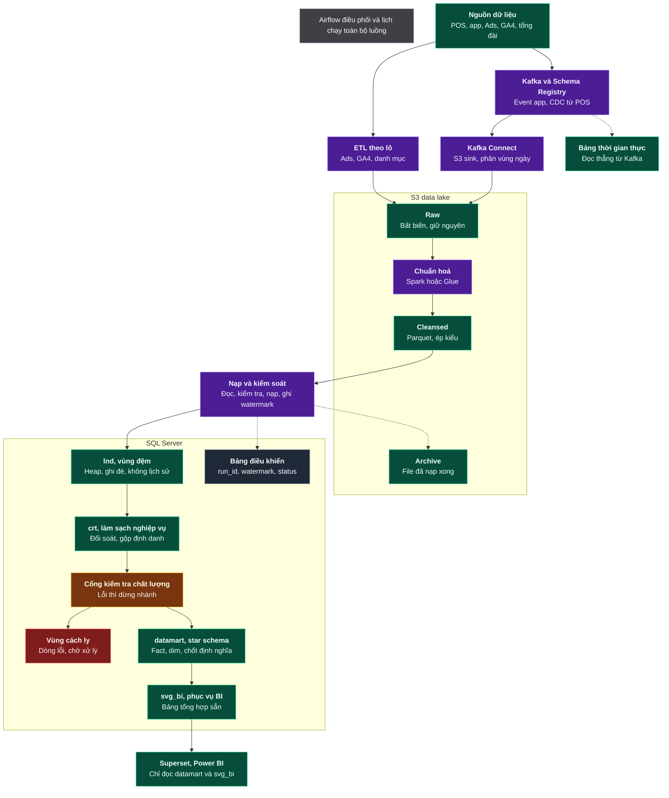

# LUỒNG THIẾT KẾ — TOÀN HỆ THỐNG

**Phiên bản 1.0 · 14/08/2026**

Đường đi của dữ liệu từ hệ thống nguồn đến báo cáo, qua 6 chặng (mục 1–6), kèm 4 mục xuyên suốt: điều phối, luồng quay lại, quy mô, ràng buộc thiết kế. Mỗi chặng: mô tả ngắn, quyết định thiết kế, link tới đặc tả.

Luồng theo góc nhìn phân tích dữ liệu (nghiệp vụ → chỉ tiêu): [Flow-DA.md](Flow-DA.md) · Tổng thiết kế: [README.md](README.md) · Sơ đồ gốc: [Flow.jpg](Flow.jpg)

**Quy ước thuật ngữ:** tiếng Việt cho khái niệm; giữ tiếng Anh cho tên sản phẩm (Airflow, Kafka, Spark, SQL Server), tên schema (`lnd`, `crt`, `dm`, `svg_bi`, `ctl`, `qtn`) và thuật ngữ chuẩn ngành (CDC, watermark, Heap, Parquet, star schema, Fact, dim). Đúng quy ước dùng trong sơ đồ gốc.

---

## SƠ ĐỒ

Số hoá nguyên trạng [Flow.jpg](Flow.jpg): 19 hộp trong 2 khung nhóm (hồ dữ liệu S3, SQL Server), 18 mũi tên — 15 liền và 3 nét đứt.

Chú thích màu, nguyên văn trong ảnh: *Tím là bước xử lý, xanh lá là nơi lưu dữ liệu. Nét đứt là nhánh phụ và luồng quay lại.* Ảnh dùng thêm vàng cho cổng kiểm tra chất lượng, đỏ cho vùng lỗi, xám cho thành phần ngoài phạm vi thiết kế kho: nguồn, công cụ báo cáo, bảng điều khiển và khung điều phối.

---

## 1. NGUỒN DỮ LIỆU

*POS, app, Ads, GA4, tổng đài*

| Nhóm | Hệ thống | Dữ liệu | Độ trễ cho phép |
|---|---|---|---|
| Tại cửa hàng | POS | Lịch hẹn, điều trị, hoá đơn, thanh toán, vật tư | 24 giờ |
| Ứng dụng | App iOS/Android, web | Xem dịch vụ, đặt lịch, đánh giá | 5 phút |
| Nghiệp vụ | Cơ sở dữ liệu đặt lịch | Khách hàng, booking, điểm thưởng, thành viên | 5 phút |
| Bên ngoài | Ads, GA4, cổng thanh toán, tổng đài, nền tảng marketing | Chi phí quảng cáo, lưu lượng web, đối soát | 24 giờ |

**Quyết định:** mỗi loại dữ liệu chỉ định **đúng một** hệ thống là nguồn chân lý. Thiếu quy định này thì khi hai hệ thống lệch số, không có căn cứ phân xử.

**Ranh giới:** hệ thống ở vị thế **chỉ đọc** với POS và cơ sở dữ liệu ứng dụng — không can thiệp, không đổi được schema nguồn.

→ [4 nhóm nguồn và ánh xạ theo thực thể](docs/06-platform/nguon-va-thu-nap.md#1-bốn-nhóm-nguồn)

---

## 2. THU NẠP

Hai nhánh trong sơ đồ — theo lô và qua Kafka — tách thành 3 cơ chế thu nạp. Chọn theo độ trễ cho phép ở bảng trên và đặc tính nguồn (cơ sở dữ liệu, API, hay ứng dụng tự đẩy sự kiện).

| Nhánh | Dùng cho | Công cụ | Độ trễ |
|---|---|---|---|
| ETL theo lô | Ads, GA4, danh mục dịch vụ và sản phẩm | Airflow + Python | Giờ đến ngày |
| CDC | Cơ sở dữ liệu nghiệp vụ, POS | Debezium → Kafka | Giây |
| Streaming | Sự kiện app và web | SDK → Kafka | Mili giây đến giây |
| Kafka Connect | Đưa sự kiện xuống `raw` | S3 sink, phân vùng ngày | Theo ngưỡng ghi file |

**Ba quyết định thiết kế:**

**Chi phí quảng cáo nạp lại 7 ngày mỗi lần chạy.** Nền tảng quảng cáo còn điều chỉnh số liệu trong 7 ngày; chỉ nạp ngày hôm qua thì số của tuần trước cố định ở giá trị tạm, làm chi phí thu hút khách mới sai lệch có hệ thống.

**Ngưỡng ghi file của Kafka Connect: 128 MB, 100.000 dòng, hoặc 15 phút — cái nào đến trước.** Ngưỡng này để tránh sinh hàng triệu file nhỏ; Spark đọc 1 triệu file 2 KB chậm gấp khoảng 10 lần so với cùng khối lượng ở 200 file 128 MB, do chi phí mở từng đối tượng trên S3.

**Không phải dữ liệu nào cũng đi Kafka.** Kafka cần cluster, monitoring, Schema Registry và người biết vận hành. Dữ liệu chi phí quảng cáo cập nhật 1 lần/ngày với độ trễ cho phép 24 giờ — đẩy qua Kafka không mang lại gì mà thêm 3 thành phần hạ tầng có thể hỏng (Kafka cluster, Kafka Connect, Schema Registry).

→ [3 cơ chế thu nạp, cấu hình Kafka và Schema Registry](docs/06-platform/nguon-va-thu-nap.md#2-ba-cơ-chế-thu-nạp)

---

## 3. S3 DATA LAKE

| Phân vùng | Nội dung | Định dạng | Nguyên tắc |
|---|---|---|---|
| **Raw** | Bản gốc từ nguồn | Như nguồn, gzip | **Bất biến** — file đã ghi không sửa |
| **Chuẩn hoá** | Bước xử lý bằng Spark hoặc Glue | — | 6 bước, xem dưới |
| **Cleansed** | Bản dùng được cho hạ nguồn | Parquet + Snappy, Iceberg | Đã ép kiểu, đã khử trùng lặp |
| **Archive** | File đã nạp xong vào SQL Server | Như raw | Phục vụ dựng lại pipeline |

**Sáu bước chuẩn hoá, theo đúng thứ tự:** kiểm tra cấu trúc → ép kiểu → chuẩn tên cột → khử trùng lặp CDC → chạy quy tắc chất lượng → ghi Parquet.

**Quyết định — nguyên tắc bất biến ở `raw`.** Đây là điều kiện cho 3 việc: chứng minh nguồn đã gửi gì (kiểm toán), chạy lại pipeline tháng trước ra đúng kết quả tháng trước, và sửa lỗi code rồi nạp lại từ đầu. Ghi đè file gốc là mất cả ba.

**Archive không phải backup database.** Backup phục hồi trạng thái database về thời điểm T; Archive cho phép **chạy lại pipeline** khi logic biến đổi sai. Hai thứ khác nhau, không thay thế nhau.

→ [Phân vùng hồ dữ liệu, Iceberg, bảo trì](docs/06-platform/ho-du-lieu-va-kho.md#1-hồ-dữ-liệu-s3)

---

## 4. NẠP VÀ KIỂM SOÁT

*Đọc, kiểm tra, nạp, ghi watermark*

Bốn việc theo đúng thứ tự đó. Kết thúc: file đã nạp chuyển sang `Archive`, trạng thái lần chạy ghi vào `Bảng điều khiển`.

**Hai yêu cầu bắt buộc:**

**Watermark** — ghi lại đã xử lý đến đâu. Bốn loại tuỳ nguồn: theo thời gian, theo LSN của CDC, theo phân vùng ngày, theo danh sách file. Thiếu watermark thì mỗi lần chạy phải quét lại toàn bộ, hoặc phải ghi cứng ngày trong code và mất khả năng nạp bù lịch sử.

**Chạy lại không sai số** — ba cách thực hiện: xoá-nạp theo phân vùng (dùng cho Fact theo ngày), `MERGE` theo khoá nghiệp vụ (dùng cho dim và bảng bị `UPDATE`), `INSERT` có kiểm tra tồn tại (bảng chỉ thêm mới, khối lượng nhỏ). Sự cố hạ tầng dẫn tới chạy lại là tình huống thường trực trong vận hành; không bảo đảm điều kiện này thì doanh thu cộng dồn theo số lần chạy lại.

**Chống nạp trùng có 2 lớp:** `UNIQUE` trên độ hạt của Fact, và `ctl.load_audit` khoá duy nhất trên hash nội dung file — nguồn đổi tên file rồi gửi lại cùng nội dung vẫn bị chặn.

→ [Nạp và kiểm soát](docs/06-platform/ho-du-lieu-va-kho.md#2-nạp-và-kiểm-soát) · [Quy trình nạp cụ thể](docs/04-etl/)

---

## 5. SQL SERVER

Bảy thành phần: 4 tầng dữ liệu, 1 cổng kiểm tra chất lượng, 1 vùng cách ly, 1 nhóm bảng điều khiển.

| # | Thành phần | Số bảng | Vai trò | Ai truy cập được |
|---|---|---|---|---|
| 5.1 | `lnd`, vùng đệm | 28 | Tiếp nhận từ `cleansed` | Chỉ hệ thống |
| 5.2 | `crt`, làm sạch nghiệp vụ | 25 + 1 view | **Đối soát với nguồn** | Dữ liệu, Kiểm toán |
| 5.3 | Cổng kiểm tra chất lượng | 56 quy tắc | Chặn dữ liệu không đạt | — |
| 5.4 | `qtn`, vùng cách ly | 1 + 1 view | Giữ dòng lỗi chờ xử lý | Dữ liệu, chủ sở hữu miền |
| 5.5 | `dm`, kho phân tích | 13 dim + 10 Fact + 1 cầu nối | **Chốt định nghĩa chỉ tiêu** | Dữ liệu, Phân tích |
| 5.6 | `svg_bi`, phục vụ BI | 6 | Bảng tổng hợp sẵn | Toàn bộ qua công cụ báo cáo |
| 5.7 | `ctl`, bảng điều khiển | 8 | Trạng thái pipeline | Dữ liệu |

### 5.1. `lnd` — *Heap, ghi đè, không lịch sử*

Không index, ghi đè mỗi lần chạy, mọi cột nghiệp vụ kiểu `NVARCHAR(4000)`.

**Quyết định:** để kiểu rộng nhằm loại bỏ lỗi ép kiểu ở bước nạp `lnd` với mọi chuỗi dưới 4.000 ký tự. Mục đích là tách lỗi vận chuyển khỏi lỗi dữ liệu — nạp `lnd` thất bại là lỗi hạ tầng, nạp `crt` thất bại là lỗi dữ liệu. Trộn hai loại lỗi làm thời gian khoanh vùng sự cố ngoài giờ tăng lên nhiều lần.

Không giữ lịch sử vì lịch sử đã nằm ở `raw` trên S3.

→ [28 bảng, script sinh DDL tự động](docs/03-ddl/01-lnd.md)

### 5.2. `crt` — *Đối soát, gộp định danh*

Mô hình 3NF, giữ đúng độ hạt của nguồn, chưa áp quy tắc nghiệp vụ.

**Vai trò phân xử:** `crt` lệch POS trong 0,1% (`DQ-RECON-001`) thì lỗi nằm ở `dm`; lệch quá 0,1% thì lỗi nằm ở thu nạp. Không có tầng này thì không khoanh được vùng lỗi.

**Việc khó nhất là gộp định danh.** Cùng một khách có 3 mã ở app, POS và GA4. Thứ tự ưu tiên gộp: số điện thoại chuẩn E.164 → email chữ thường → (tên + ngày sinh + chi nhánh) → thủ công. Độ tin cậy dưới 0,80 **không tự động gộp**, đưa vào danh sách chờ người rà — gộp sai hai khách thành một không sinh thông báo lỗi nào, và việc tách lại đòi ghi lại toàn bộ lịch sử SCD2 của khoá bị ảnh hưởng.

→ [25 bảng + 1 view, thứ tự tạo](docs/03-ddl/02-crt.md)

### 5.3. Cổng kiểm tra chất lượng — *Lỗi thì dừng nhánh*

56 quy tắc trên 7 nhóm: đầy đủ (6), chính xác (13), nhất quán (6), duy nhất (9), hợp lệ (9), kịp thời (6), mô hình chiều (7).

| Mức | Số quy tắc | Hành vi | Thông báo |
|---|---|---|---|
| Chặn | 43 | Dừng nhánh, dòng lỗi sang `qtn`, không nạp `dm` | P1: gọi điện + Slack |
| Cảnh báo | 12 | Vẫn nạp, gắn dấu hiệu trên báo cáo | P2: Slack cho chủ sở hữu dữ liệu nghiệp vụ |
| Ghi nhận | 1 | Chỉ ghi nhật ký | Email tổng hợp hằng ngày |

**Quyết định:** cổng chỉ dừng **nhánh** bị lỗi. `fact_payment` bị chặn thì `fact_feedback` vẫn nạp bình thường. Dừng cả hệ thống vì một bảng lỗi tạo áp lực vận hành dẫn tới vô hiệu hoá cổng kiểm tra, làm mất toàn bộ tác dụng của 56 quy tắc.

→ [56 quy tắc kèm SQL kiểm tra](docs/05-quality/dq-rules.md)

### 5.4. `qtn` — *Dòng lỗi, chờ xử lý*

Giữ **từng dòng lỗi**, không phải cả bảng, kèm mã quy tắc, lý do, và bản gốc dạng JSON để sửa rồi nạp lại. Có `src_file` và `src_line_no` để truy về đúng dòng trong file gốc trên S3.

**Cam kết xử lý 3 ngày làm việc**, có báo cáo hằng ngày gửi chủ sở hữu miền. Vùng cách ly không có người rà sẽ tích luỹ lỗi mà không ai định lượng được phần doanh thu bị bỏ sót.

→ [DDL và view theo dõi](docs/03-ddl/06-ctl-qtn.md#2-qtn--vùng-cách-ly)

### 5.5. `dm` — *Fact, dim, chốt định nghĩa*

Nơi thay đổi độ hạt từ nguồn sang độ hạt phân tích, sinh khoá đại diện, áp SCD Type 2 cho 4 dim.

**"Chốt định nghĩa"** nghĩa là mỗi chỉ tiêu định nghĩa **một lần duy nhất** tại tầng này. Ví dụ doanh thu có 4 cách hiểu đang cùng tồn tại — cả 4 được tính và lưu thành 4 cột tên riêng (`gross_amount`, `net_amount`, `net_excl_tax_amount`, và tiền thực thu ở `fact_payment`), không để tên chung chung là `revenue`.

→ [Mô hình logic](docs/01-erd/) · DDL: [13 dim](docs/03-ddl/03-dm-dimension.md) · [10 Fact và 1 bảng cầu nối](docs/03-ddl/04-dm-fact.md)

### 5.6. `svg_bi` — *Bảng tổng hợp sẵn*

6 bảng để báo cáo mở dưới 2 giây. Tính một lần lúc 06:40, đọc nhiều lần trong ngày.

**Quyết định:** không lưu tỷ lệ, chỉ lưu tử số và mẫu số. Tỷ lệ không cộng được — lưu sẵn tỷ lệ thì mọi phép tổng hợp lên mức cao hơn cho ra số sai.

**Hạn chế cố hữu:** cột `COUNT(DISTINCT ...)` không tổng hợp tiếp được. `unique_customer_count` ở mức ngày × chi nhánh không cộng lên mức tháng được, vì khách đến 3 ngày sẽ bị đếm 3 lần. Ghi rõ vào từ điển chỉ tiêu và tạo bảng tổng hợp riêng ở mức tháng.

→ [6 bảng tổng hợp](docs/03-ddl/05-svg-bi.md)

### 5.7. `ctl` — *run_id, watermark, status*

8 bảng, không chứa dữ liệu nghiệp vụ: lần chạy (`pipeline_run`), đã xử lý đến đâu (`watermark`), file nào đã nạp (`load_audit`), quy tắc nào đạt (`dq_result`, `dq_rule`), ánh xạ danh mục (`code_mapping`), ngày lễ (`vn_holiday`), từ điển chỉ tiêu (`metric_definition`).

Thiếu nhóm bảng này thì câu hỏi *"số liệu hôm nay đã đủ chưa"* không có câu trả lời nào ngoài phỏng đoán.

→ [8 bảng điều khiển](docs/03-ddl/06-ctl-qtn.md)

---

## 6. TIÊU THỤ

### 6.1. Superset, Power BI — *Chỉ đọc kho phân tích và svg_bi*

**Ranh giới bắt buộc:** công cụ báo cáo cấm truy cập `lnd` và `crt`. Hai ngoại lệ: bảng điều khiển vận hành dữ liệu được đọc `ctl` và view `qtn.v_quarantine_summary`; bảng thời gian thực đọc trực tiếp từ Kafka. Cả hai không dùng cho báo cáo nghiệp vụ. Hai tầng đầu chưa qua cổng kiểm tra chất lượng; để báo cáo đọc trực tiếp thì không có cơ chế nào ngăn một báo cáo trình lãnh đạo được lập từ dữ liệu chưa qua cổng kiểm tra.

8 bộ báo cáo → [Chỉ tiêu và báo cáo](docs/07-analytics/chi-tieu-va-bao-cao.md)

### 6.2. Bảng thời gian thực — *Đọc thẳng từ Kafka*

Nhánh riêng, không qua hồ dữ liệu và không qua kho. Phục vụ 3 chỉ số vận hành: số khách đang trong chi nhánh, doanh thu tạm tính hôm nay, số booking mới trong 1 giờ.

**Đánh đổi cụ thể:** độ trễ dưới 5 phút theo yêu cầu vận hành, nhưng **chưa khử trùng lặp CDC, chưa đối soát với POS, chưa qua 56 quy tắc chất lượng**. Không dùng cho báo cáo tài chính. Báo cáo phải ghi rõ "số liệu tạm tính"; số chính thức lấy từ kho phân tích `dm` sau 06:40 hôm sau.

---

## 7. AIRFLOW

*Điều phối và lịch chạy toàn bộ luồng*

Trong sơ đồ gốc, Airflow là hộp chú thích đặt trên cùng, không nối vào hộp nào — nghĩa là điều phối tất cả các chặng.

| Giờ | Việc | Phụ thuộc |
|---|---|---|
| 03:00–04:00 | Thu nạp theo lô: Ads, GA4, danh mục | — |
| 04:30 | Chuẩn hoá `raw` → `cleansed` | 3 tác vụ trên |
| 05:00 | Nạp `cleansed` → `lnd` → `crt`, ghi watermark | 04:30 |
| 05:40 | Cổng kiểm tra chất lượng | 05:00 |
| 06:00 | Dựng dim rồi Fact vào kho phân tích `dm` | Cổng chất lượng 05:40 đạt |
| 06:40 | Làm mới 6 bảng `svg_bi` | 06:00 |
| 07:00 | Đối soát với POS và cổng thanh toán | 05:40 |
| Chủ nhật 02:00 | Bảo trì Iceberg: gộp file nhỏ, xoá snapshot cũ 30 ngày | — |

**Ba quyết định:** thứ tự bất biến **dim trước Fact** (Fact cần khoá đại diện do dim sinh) · mọi tác vụ nhận `business_date` làm tham số (điều kiện để nạp bù lịch sử) · tự chạy lại 3 lần, giãn cách luỹ tiến 2/4/8 phút, chỉ áp cho lỗi hạ tầng tạm thời.

**Cam kết:** dữ liệu ngày N sẵn sàng trước **08:00 ngày N+1**, đạt tối thiểu 99% số ngày trong quý — đo bằng thời điểm kết thúc của `dag_refresh_svg_bi` ghi trong `ctl.pipeline_run`.

→ [Thiết kế DAG](docs/06-platform/ho-du-lieu-va-kho.md#4-điều-phối-bằng-airflow)

---

## 8. LUỒNG QUAY LẠI

| Luồng | Trong ảnh | Mục đích |
|---|---|---|
| Nạp và kiểm soát → Archive | Có | Lưu file đã nạp để dựng lại pipeline |
| Nạp và kiểm soát → Bảng điều khiển | Có | Ghi `run_id`, watermark, trạng thái |
| Kafka → Bảng thời gian thực | Có | Nhánh riêng cho chỉ số vận hành tức thời |
| Vùng cách ly → nạp lại | **Không** | Dòng lỗi sau khi sửa phải quay lại đường nạp |

Luồng thứ tư không có trong sơ đồ gốc nhưng bắt buộc phải có khi triển khai, nếu không dòng lỗi sẽ nằm trong vùng cách ly vĩnh viễn.

→ [Cổng kiểm tra chất lượng và vùng cách ly](docs/06-platform/ho-du-lieu-va-kho.md#cổng-kiểm-tra-chất-lượng-và-vùng-cách-ly)

---

## 9. QUY MÔ VÀ ĐIỂM NGHẼN

| | 20 chi nhánh | 2.000 chi nhánh |
|---|---|---|
| Fact chiếm dung lượng lớn nhất — `fact_sales_line`, 29 cột | 421.000 dòng/năm | 42,1 triệu dòng/năm |
| Fact nhiều dòng nhất — `fact_loyalty_txn` | 504.000 dòng/năm | 50,4 triệu dòng/năm |
| Toàn bộ kho phân tích `dm` sau 5 năm | ~150 MB | ~15 GB |
| Sự kiện ứng dụng — ở hồ dữ liệu, không vào kho | 2,5 triệu/năm | 250 triệu/năm |
| Khối lượng nạp mỗi đêm — bình quân 10 Fact ÷ 350 ngày | ~8.600 dòng | ~860.000 dòng |

**Dung lượng không phải điểm nghẽn ở cả hai quy mô.** Điểm nghẽn là **thời gian nạp** trong cửa sổ 05:00–06:40. Vì vậy các quyết định về chạy lại không sai số, phân vùng theo tháng và `TRUNCATE PARTITION` quan trọng hơn nhiều so với việc tiết kiệm dung lượng.

Khối dữ liệu lớn nhất là sự kiện ứng dụng và nó nằm ở hồ dữ liệu — đây chính là lý do kiến trúc tách hai tầng lưu trữ thay vì chỉ dùng SQL Server hoặc chỉ dùng S3.

→ [Dự toán số dòng và dung lượng](docs/03-ddl/00-init.md#6-volumetrics--dự-toán-số-dòng-và-dung-lượng)

---

## 10. BỐN RÀNG BUỘC KHÔNG ĐƯỢC VI PHẠM

Vi phạm bất kỳ ràng buộc nào đều tạo ra sai số **không sinh thông báo lỗi**, nên không phát hiện được bằng kiểm thử thông thường.

| # | Ràng buộc | Thực thi bằng | Kiểm chứng |
|---|---|---|---|
| 1 | Mỗi bảng khai báo độ hạt bằng một câu, không có chữ "và" | `UNIQUE` trên cột định nghĩa độ hạt | `DQ-UNIQ-001` |
| 2 | Quy trình nạp chạy lại ra cùng kết quả | Xoá-nạp theo phân vùng hoặc `MERGE` theo khoá nghiệp vụ | Chạy 3 lần, đối chiếu tổng |
| 3 | Không lưu tỷ lệ trong Fact, chỉ lưu tử số và mẫu số | Rà cột khi duyệt DDL | Không có cột `*_pct` trong `dm.fact_*` |
| 4 | Mọi dim có dòng `-1`; khoá ngoại trong Fact `NOT NULL` | Nạp dòng `-1` trước Fact đầu tiên | `DQ-SCD-003` |

Ba lỗi sai âm thầm hay gặp: `COUNT(*)` sai độ hạt · `AVG` của một tỷ lệ · `INNER JOIN` với dim thiếu khoá. Cả ba được chặn bằng chính bốn ràng buộc trên.

---

## TÀI LIỆU ĐẶC TẢ

| Chặng trong luồng này | Đặc tả chi tiết |
|---|---|
| 1–2 · Nguồn và thu nạp | [docs/06-platform/nguon-va-thu-nap.md](docs/06-platform/nguon-va-thu-nap.md) |
| 3–4 · Hồ dữ liệu, nạp và kiểm soát | [docs/06-platform/ho-du-lieu-va-kho.md](docs/06-platform/ho-du-lieu-va-kho.md) |
| 5 · DDL 92 bảng | [docs/03-ddl/](docs/03-ddl/) |
| 5 · Ánh xạ nguồn sang đích | [docs/02-mapping/source-to-target.md](docs/02-mapping/source-to-target.md) |
| 5 · Quy trình nạp và khởi tạo | [docs/04-etl/](docs/04-etl/) |
| 5.3 · 56 quy tắc chất lượng | [docs/05-quality/dq-rules.md](docs/05-quality/dq-rules.md) |
| 6 · Chỉ tiêu và báo cáo | [docs/07-analytics/chi-tieu-va-bao-cao.md](docs/07-analytics/chi-tieu-va-bao-cao.md) |
| 7 · Công nghệ, bảo mật, vận hành | [docs/08-operations/van-hanh.md](docs/08-operations/van-hanh.md) |
| Mô hình dữ liệu logic | [docs/01-erd/](docs/01-erd/) |
| Nghiệp vụ sinh ra dữ liệu | [docs/00-business/nghiep-vu.md](docs/00-business/nghiep-vu.md) |
| Lộ trình 9 giai đoạn (GĐ 0–8), 18 tuần | [docs/09-roadmap/lo-trinh.md](docs/09-roadmap/lo-trinh.md) |
| Quy ước đặt tên, thuật ngữ, checklist | [docs/99-reference/tra-cuu.md](docs/99-reference/tra-cuu.md) |
