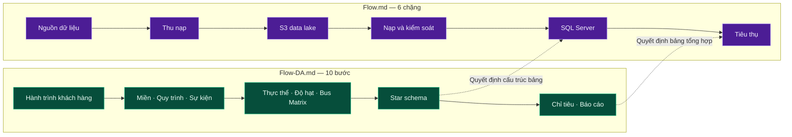

# FACIAL BAR — TỔNG THIẾT KẾ HỆ THỐNG DỮ LIỆU

**Phiên bản 1.0 · 14/08/2026**

Tài liệu tổng thiết kế cho hệ thống phân tích dữ liệu chuỗi Facial Bar. Đây là điểm vào của toàn bộ bộ tài liệu.

| | |
|---|---|
| **Phạm vi** | Cơ sở dữ liệu phân tích, hồ dữ liệu, đường ống nạp, kiểm soát chất lượng, bộ báo cáo |
| **Quy mô hiện tại** | 20 chi nhánh · thiết kế kiểm chứng đến 2.000 chi nhánh |
| **Nền tảng** | Amazon S3 + Apache Iceberg (hồ dữ liệu) · SQL Server (kho phân tích) · Airflow (điều phối) |
| **Khối lượng thiết kế** | 92 bảng · 2 view · 8 quy trình nạp · 56 quy tắc chất lượng · 24 chỉ tiêu · 8 bộ báo cáo |
| **Thời gian triển khai** | 18 tuần (9 giai đoạn × 2 tuần) · 16,95 người-tháng |


> **Quy ước thuật ngữ.** Thuật ngữ nghiệp vụ dùng trong toàn bộ văn bản là **chi nhánh**; tên bảng và tên cột giữ nguyên `salon` (`dim_salon`, `salon_sk`) theo quy ước đặt tên đối tượng bằng tiếng Anh. Tương tự: **hồ dữ liệu** trong văn bản, `raw`/`cleansed`/`archive` khi chỉ phân vùng; **kho phân tích** trong văn bản, `dm` khi chỉ schema.

---

## 1. HAI LUỒNG THIẾT KẾ

Thiết kế được tiếp cận từ hai trục vuông góc nhau. Đọc cả hai mới đủ.

| Luồng | Trục | Trả lời | Đối tượng đọc |
|---|---|---|---|
| **[Flow-DA.md](Flow-DA.md)** | Nghiệp vụ → Chỉ tiêu | Dữ liệu **nghĩa là gì**, đo cái gì, độ hạt nào | Phân tích dữ liệu, Nghiệp vụ |
| **[Flow.md](Flow.md)** | Nguồn → Báo cáo | Dữ liệu **đi qua đâu**, xử lý ra sao, lưu ở đâu | Kỹ sư dữ liệu, Quản trị cơ sở dữ liệu |



Luồng phân tích **quyết định** cấu trúc bảng; luồng hệ thống **hiện thực hoá** nó. Làm luồng hệ thống trước khi chốt độ hạt dẫn tới viết lại toàn bộ Fact.

Bản trình phê duyệt cho ban lãnh đạo: **[Ban-Thiet-Ke-CSDL.md](Ban-Thiet-Ke-CSDL.md)** — không chứa chi tiết kỹ thuật, tập trung vào 8 quyết định chính sách cần phê duyệt.

---

## 2. KIẾN TRÚC

Sơ đồ kỹ thuật gốc: [Flow.jpg](Flow.jpg) — số hoá nguyên trạng tại [Flow.md](Flow.md#sơ-đồ).

```
Nguồn: POS · App/Web · Ads · GA4 · Tổng đài · Cổng thanh toán
   │
   ├── ETL theo lô (Airflow)          độ trễ 24 giờ
   └── Kafka + Schema Registry        độ trễ 5 phút
         └── Kafka Connect → S3 sink
   ▼
S3 data lake:  raw → chuẩn hoá (Spark/Glue) → cleansed (Parquet + Iceberg)
                                                    └── archive
   ▼
Nạp và kiểm soát:  đọc → kiểm tra → nạp → ghi watermark
   ▼
SQL Server:  lnd → crt → [cổng chất lượng] → dm → svg_bi
                              └── qtn            ctl
   ▼
Superset · Power BI          Bảng thời gian thực (đọc thẳng từ Kafka)
```

### Căn cứ tách hai tầng lưu trữ

| | S3 + Iceberg | SQL Server |
|---|---|---|
| Thế mạnh | Chi phí lưu thấp, dung lượng không giới hạn, giữ bản gốc bất biến | Truy vấn nhanh có index, transaction, kết nối tự nhiên với Power BI |
| Chứa | Bản gốc + sự kiện ứng dụng (250 triệu dòng/năm ở quy mô 2.000 chi nhánh) | Dữ liệu giao dịch cần join nhanh (~15 GB sau 5 năm) |

Khối dữ liệu lớn nhất của hệ thống là sự kiện ứng dụng, và nó **không** nằm trong kho. Đây là lý do kiến trúc không dùng một tầng duy nhất.

---

## 3. KIẾN TRÚC DỮ LIỆU — 92 BẢNG

| Schema | Bảng | Vai trò | Dạng chuẩn | Ai truy cập |
|---|---|---|---|---|
| `lnd` | 28 | Vùng đệm tiếp nhận từ hồ dữ liệu | Không (Heap, `NVARCHAR`) | Chỉ hệ thống |
| `crt` | 25 + 1 view | **Đối soát với nguồn**, gộp định danh | 3NF | Dữ liệu, Kiểm toán |
| `dm` | 13 dim + 10 Fact + 1 cầu nối | **Chốt định nghĩa chỉ tiêu**, star schema | Phi chuẩn hoá có kiểm soát | Dữ liệu, Phân tích |
| `svg_bi` | 6 | Bảng tổng hợp sẵn cho báo cáo | Phi chuẩn hoá | Toàn bộ, qua công cụ báo cáo |
| `ctl` | 8 | Trạng thái pipeline, từ điển chỉ tiêu | — | Dữ liệu |
| `qtn` | 1 + 1 view | Dòng lỗi chờ xử lý | — | Dữ liệu, chủ sở hữu miền |

**Ranh giới bắt buộc:** công cụ báo cáo chỉ đọc `dm` và `svg_bi`. Cấm `lnd`, `crt`, `ctl` — chưa qua cổng kiểm tra chất lượng.

### Mô hình chiều

| Loại Fact | Bảng | Trả lời |
|---|---|---|
| Giao dịch (8) | `fact_sales_line`, `fact_payment`, `fact_treatment`, `fact_booking_line`, `fact_appointment`, `fact_loyalty_txn`, `fact_feedback`, `fact_ad_spend` | Đo lượng và tiền theo thời gian |
| Chốt kỳ (1) | `fact_customer_monthly_snapshot` | Số dư điểm, hạng thẻ cuối mỗi tháng |
| Chốt tiến trình (1) | `fact_booking_lifecycle` | Phễu đặt lịch → thanh toán, thời gian mỗi chặng |

**13 dim:** `dim_date`, `dim_time`, `dim_customer`, `dim_salon`, `dim_employee`, `dim_service`, `dim_product`, `dim_promotion`, `dim_payment_method`, `dim_room`, `dim_campaign`, `dim_membership_tier`, `dim_booking_junk`.

Bốn dim theo dõi lịch sử bằng **SCD Type 2**: `dim_customer`, `dim_salon`, `dim_employee`, `dim_service` — để báo cáo quá khứ không tự thay đổi khi dữ liệu hiện tại bị sửa.

**6 bảng tổng hợp:** doanh thu theo ngày × chi nhánh · chân dung khách hàng · phễu chuyển đổi · hiệu quả dịch vụ theo tháng · năng suất kỹ thuật viên · giữ chân theo nhóm khách.

---

## 4. CHUẨN THIẾT KẾ

### Kiểu dữ liệu — mỗi loại có đúng một kiểu chuẩn

| Loại | Kiểu | Lý do loại trừ cái khác |
|---|---|---|
| Tiền | `DECIMAL(18,2)` | Không `FLOAT` (sai số làm tròn), không `MONEY` (phép chia sai số tích luỹ) |
| Thời điểm | `DATETIME2(3)`, luôn UTC | Không `DATETIME`: độ phân giải 3,33 ms, giá trị bị làm tròn về .000/.003/.007 giây |
| Khoá ngày | `INT` dạng `20260814` | Đọc được bằng mắt, dùng trực tiếp làm khoá phân vùng |
| Khoá đại diện | `BIGINT IDENTITY` (dim nhỏ dùng `INT`) | Join số nguyên nhanh nhất |
| Text tiếng Việt | `NVARCHAR` | `VARCHAR` không lưu được dấu trên collation không phải UTF-8 |
| Danh mục | `VARCHAR(20)` + `CHECK` + bảng tham chiếu | Không mã hoá thành số: đọc dữ liệu thô thấy `status = 3` thì không ai hiểu |

**Collation `Vietnamese_CI_AI`** ở cấp database để lễ tân gõ không dấu vẫn tìm ra khách. Đánh đổi: `_AI` coi `"Lan"` bằng `"Làn"`, nên **mọi cột khoá và mã phải ghi đè `COLLATE Latin1_General_100_BIN2`**.

### Đặt tên

`dim_<thực thể>` · `fact_<nghiệp vụ>` · `agg_<chủ đề>_<chu kỳ>_<chiều>` · `<thực thể>_sk` (khoá đại diện) · `<thực thể>_id` (khoá nghiệp vụ) · `<vai trò>_date_key` · `*_amount` · `*_at` (UTC) · `is_*` · `_run_id` (cột kỹ thuật, tiền tố `_`).

Ràng buộc và index: `PK_` `UQ_` `UX_` `FK_` `CK_` `DF_` `IX_` `CCI_`.

### Index và phân vùng

| Loại bảng | Index chính | Phân vùng |
|---|---|---|
| dim nhỏ (< 100k dòng) | Clustered rowstore trên khoá đại diện + filtered unique cho SCD2 | Không |
| Fact lớn | **Clustered columnstore**, aligned theo phân vùng | Theo tháng |
| Fact bị `UPDATE` (`fact_booking_lifecycle`) | **Rowstore** — columnstore kém với khối lượng `UPDATE` lớn | Không |
| Fact nhỏ (< 100k dòng) | Rowstore — dưới 102.400 dòng/rowgroup thì columnstore chậm hơn | Không |
| Bảng tổng hợp | Rowstore trên `(date_key, dim_sk)` | Không |

→ Chi tiết đầy đủ: [docs/03-ddl/00-init.md](docs/03-ddl/00-init.md)

---

## 5. BỐN RÀNG BUỘC NỀN TẢNG

Vi phạm bất kỳ ràng buộc nào tạo ra sai số **không sinh thông báo lỗi**.

| # | Ràng buộc | Hệ quả nếu vi phạm | Thực thi bằng |
|---|---|---|---|
| 1 | Mỗi bảng khai báo độ hạt bằng một câu, không có chữ "và" | `COUNT(*)` và `SUM()` sai, toàn bộ báo cáo sai | `UNIQUE` trên cột định nghĩa độ hạt |
| 2 | Quy trình nạp chạy lại ra cùng kết quả | Doanh thu tự cộng dồn theo số lần chạy lại | Xoá-nạp theo phân vùng hoặc `MERGE` |
| 3 | Không lưu tỷ lệ trong Fact | `AVG` của tỷ lệ lệch nhiều lần khi các nhóm khác quy mô | Rà cột khi duyệt DDL |
| 4 | Mọi dim có dòng `-1`; khoá ngoại `NOT NULL` | `INNER JOIN` xoá mất dòng Fact, doanh thu hụt không dấu vết | Nạp dòng `-1` trước Fact đầu tiên |

**Thứ tự thiết kế bắt buộc:** Miền → Quy trình → Sự kiện → Thực thể → Độ hạt → Bus Matrix → Star schema → Kiểu dữ liệu → Index và phân vùng → Công nghệ.

---

## 6. KIỂM SOÁT CHẤT LƯỢNG

56 quy tắc tự động, chạy trong `dag_dq_gate` lúc 05:40.

| Tiêu chí | Số quy tắc | Ví dụ |
|---|---|---|
| Đầy đủ | 6 | Mọi chi nhánh đang mở phải có ≥ 1 hoá đơn/ngày |
| Chính xác | 13 | `net_amount = gross − discount`; thời lượng điều trị 5–480 phút |
| Nhất quán | 6 | Doanh thu khớp POS sai lệch ≤ 0,1% |
| Duy nhất | 9 | `invoice_line_id` duy nhất toàn cục; kỹ thuật viên không có 2 lịch chồng giờ |
| Hợp lệ | 9 | Số điện thoại đúng E.164; độ tin cậy gộp định danh < 0,80 phải có người rà |
| Kịp thời | 6 | Dữ liệu ngày N tới `crt` trước 06:00 ngày N+1 (`DQ-FRESH-001`); bảng tổng hợp làm mới xong trước 08:00 (`DQ-FRESH-003`) |
| Mô hình chiều | 7 | Lịch sử SCD2 liền mạch; đúng 1 phiên bản hiện hành |

**Phân mức:** 43 chặn · 12 cảnh báo · 1 ghi nhận. Cổng chỉ **dừng nhánh** bị lỗi, không dừng toàn hệ thống.

**Đối soát tự động hằng ngày:** doanh thu theo ngày × chi nhánh giữa kho ↔ POS, và POS ↔ cổng thanh toán. Dùng `FULL OUTER JOIN` là cố ý — bắt được cả trường hợp kho có mà POS không có (nạp trùng) và ngược lại (mất dữ liệu).

→ [docs/05-quality/dq-rules.md](docs/05-quality/dq-rules.md)

---

## 7. QUY MÔ VÀ ĐIỂM NGHẼN

| | 20 chi nhánh | 2.000 chi nhánh |
|---|---|---|
| `fact_sales_line` | 421.000 dòng/năm | 42,1 triệu dòng/năm |
| Toàn bộ `dm` sau 5 năm | ~150 MB | ~15 GB |
| Sự kiện ứng dụng (ở hồ dữ liệu) | 2,5 triệu/năm | 250 triệu/năm |
| Khối lượng nạp mỗi đêm | ~12.000 dòng | ~1,2 triệu dòng |

**Ba kết luận:**

Dung lượng không phải điểm nghẽn ở cả hai quy mô — điều này xác nhận lựa chọn SQL Server và quyết định giữ khoá ngoại enforced.

Fact lớn nhất đạt ~210 triệu dòng sau 5 năm ở quy mô 2.000 chi nhánh, dưới ngưỡng 1 tỷ dòng. Việc di trú sang kho dữ liệu đám mây chỉ cần xét lại khi Fact lớn nhất vượt 1 tỷ dòng; theo dự toán, ngưỡng này không đạt tới trong 5 năm ngay cả ở quy mô 2.000 chi nhánh. Thiết kế giữ khả năng chuyển đổi nhưng không đầu tư trước.

Điểm nghẽn thực tế là **thời gian nạp** trong cửa sổ 05:00–06:40.

---

## 8. CÔNG NGHỆ

| Lớp | Chọn | Lý do | Phương án đã loại |
|---|---|---|---|
| Điều phối | Airflow | Phụ thuộc phức tạp, nạp bù lịch sử, tự chạy lại, quan sát được | Dagster — đội hiện tại chưa có kinh nghiệm vận hành |
| Streaming | Kafka + Schema Registry | Cần gần thời gian thực, cần replay, cần kiểm soát cấu trúc | Kinesis — replay khó hơn, khoá vào một nhà cung cấp |
| CDC | Debezium | Cần bắt cả DELETE và trạng thái trung gian | Batch tăng trưởng — không bắt được DELETE |
| Hồ dữ liệu | Amazon S3 | Rẻ, không giới hạn, tách lưu trữ khỏi tính toán | HDFS — phải tự quản cluster |
| Định dạng bảng | Apache Iceberg | Cần ACID, đổi cấu trúc an toàn, đọc trạng thái quá khứ | Delta Lake, Hudi — chọn Iceberg vì trung lập engine |
| Xử lý | Spark hoặc AWS Glue | Khối lượng lớn, có sẵn kỹ năng SQL/Python | — |
| Kho phân tích | **SQL Server** | Tận dụng bản quyền và kỹ năng sẵn có, Power BI kết nối tự nhiên | Snowflake/BigQuery — mạnh hơn nhưng phát sinh chi phí thường xuyên |
| Báo cáo | Superset + Power BI | Superset cho nội bộ, Power BI cho nghiệp vụ | Tableau, Metabase |

→ Phân tích đầy đủ: [docs/08-operations/van-hanh.md](docs/08-operations/van-hanh.md#1-lựa-chọn-công-nghệ)

---

## 9. TRẠNG THÁI THIẾT KẾ

| Hạng mục | Trạng thái |
|---|---|
| Nghiệp vụ: 14 miền, 6 quy trình, 24 sự kiện | Xong |
| Mô hình logic: ERD, độ hạt, Bus Matrix, star schema | Xong |
| Ánh xạ nguồn sang đích ở mức cột | Xong — 15 mục ánh xạ, phủ 19 trong 25 bảng `crt` |
| DDL: `lnd` 28, `crt` 25+view, `dm` 24, `svg_bi` 6, `ctl` 8, `qtn` 1+view | Xong |
| Script khởi tạo: 16 script | Xong |
| Quy trình nạp: 8 procedure mẫu, phủ 4 khuôn nạp áp dụng cho 23 bảng còn lại | Xong |
| Catalog quy tắc chất lượng: 56 quy tắc | Xong |
| Từ điển chỉ tiêu: 24 chỉ tiêu | Xong — **chưa có chữ ký nghiệp vụ** |
| Triển khai thực tế | Chưa bắt đầu — xem [lộ trình](docs/09-roadmap/lo-trinh.md) |

### Hai bảng chưa thiết kế chi tiết

| Bảng | Căn cứ chưa thiết kế | Giai đoạn |
|---|---|---|
| `fact_campaign_send` | Độ hạt phụ thuộc cách nền tảng marketing xuất dữ liệu, chưa kiểm kê xong | 7 |
| `fact_service_view` | 2,5 triệu dòng/năm và chỉ dùng ở mức tổng hợp — có thể giữ ở Iceberg, không nạp vào SQL Server. Cần đo trước khi quyết | 7 |

### Năm dữ liệu chưa có nguồn

Các chỉ tiêu tương ứng **sẽ không tính được** nếu không được cung cấp:

| Cần | Chặn | Bên cung cấp |
|---|---|---|
| Lịch làm việc / phân ca kỹ thuật viên | Năng suất kỹ thuật viên, tỷ lệ lấp buồng | Vận hành |
| Giờ mở cửa từng chi nhánh theo ngày | Tỷ lệ lấp buồng | Vận hành |
| Cách tính giá vốn dịch vụ | Lợi nhuận gộp, giá trị vòng đời khách | Kế toán |
| Bảng số liệu đối chiếu doanh thu từ POS | `DQ-RECON-001` — tiêu chí nghiệm thu số 1 | Nhà cung cấp POS |
| Tỷ giá quy đổi điểm thưởng | Giá trị điểm thưởng | CRM |

### Tám quyết định chính sách chờ phê duyệt

Định nghĩa doanh thu · kỳ ghi nhận doanh thu · quy gán kênh marketing · nguồn chân lý từng loại dữ liệu · chính sách lưu trữ · xử lý dữ liệu nhạy cảm · cam kết sẵn sàng số liệu · nền tảng kho dữ liệu.

Chưa chốt tám nội dung này thì không bắt đầu được giai đoạn 2 → [Ban-Thiet-Ke-CSDL.md](Ban-Thiet-Ke-CSDL.md#6-các-quyết-định-cần-ban-lãnh-đạo-phê-duyệt)

---

## 10. ĐIỀU HƯỚNG TÀI LIỆU

### Ba tài liệu gốc

| Tài liệu | Nội dung | Dùng khi |
|---|---|---|
| **README.md** (file này) | Tổng thiết kế: kiến trúc, kiến trúc dữ liệu, chuẩn thiết kế, trạng thái | Vào dự án lần đầu, hoặc cần tra nhanh con số tổng thể |
| **[Flow-DA.md](Flow-DA.md)** | Luồng thiết kế theo góc nhìn phân tích: 10 bước từ nghiệp vụ đến báo cáo | Thiết kế bảng mới, định nghĩa chỉ tiêu mới |
| **[Flow.md](Flow.md)** | Luồng hệ thống: 6 chặng từ nguồn đến báo cáo | Xây dựng hoặc sửa đường ống dữ liệu |
| **[Ban-Thiet-Ke-CSDL.md](Ban-Thiet-Ke-CSDL.md)** | Bản trình phê duyệt cho ban lãnh đạo | Trình duyệt, xin nguồn lực, xin quyết định chính sách |

### Đặc tả chi tiết — [docs/](docs/)

| Thư mục | Nội dung |
|---|---|
| [00-business/](docs/00-business/) | Hành trình khách hàng, 14 miền, 6 quy trình, 24 sự kiện |
| [01-erd/](docs/01-erd/) | Thực thể và quan hệ · độ hạt và additivity · star schema và SCD · Bus Matrix |
| [02-mapping/](docs/02-mapping/) | Ánh xạ nguồn sang đích ở mức cột, ánh xạ danh mục, cột tính trong kho |
| [03-ddl/](docs/03-ddl/) | Khởi tạo và chuẩn kiểu dữ liệu · `lnd` · `crt` · dim · Fact · `svg_bi` · `ctl`/`qtn` |
| [04-etl/](docs/04-etl/) | 16 script khởi tạo · nạp dim · nạp Fact và bảng tổng hợp |
| [05-quality/](docs/05-quality/) | 56 quy tắc kèm SQL kiểm tra và kịch bản chạy |
| [06-platform/](docs/06-platform/) | Nguồn và thu nạp · hồ dữ liệu, nạp và kiểm soát, kho, Airflow |
| [07-analytics/](docs/07-analytics/) | 24 chỉ tiêu · 8 bộ báo cáo · 6 bài toán dự báo |
| [08-operations/](docs/08-operations/) | Công nghệ · bảo mật · quản trị · giám sát · mở rộng và phục hồi |
| [09-roadmap/](docs/09-roadmap/) | 9 giai đoạn (GĐ 0–8), việc phải làm sớm |
| [99-reference/](docs/99-reference/) | Quy ước đặt tên · thuật ngữ · 4 checklist |

Chỉ mục đầy đủ kèm thứ tự đọc khi triển khai: [docs/README.md](docs/README.md)

### Thứ tự đọc

| Vai trò | Đọc theo thứ tự |
|---|---|
| Phân tích dữ liệu | README → [Flow-DA.md](Flow-DA.md) → [docs/01-erd/](docs/01-erd/) → [docs/07-analytics/](docs/07-analytics/) |
| Kỹ sư dữ liệu | README → [Flow.md](Flow.md) → [docs/02-mapping/](docs/02-mapping/) → [docs/03-ddl/](docs/03-ddl/) → [docs/04-etl/](docs/04-etl/) |
| Quản trị cơ sở dữ liệu | README mục 4 → [docs/03-ddl/00-init.md](docs/03-ddl/00-init.md) → [docs/03-ddl/](docs/03-ddl/) |
| Ban lãnh đạo | [Ban-Thiet-Ke-CSDL.md](Ban-Thiet-Ke-CSDL.md) |
