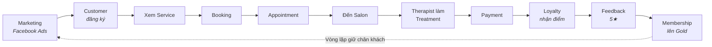
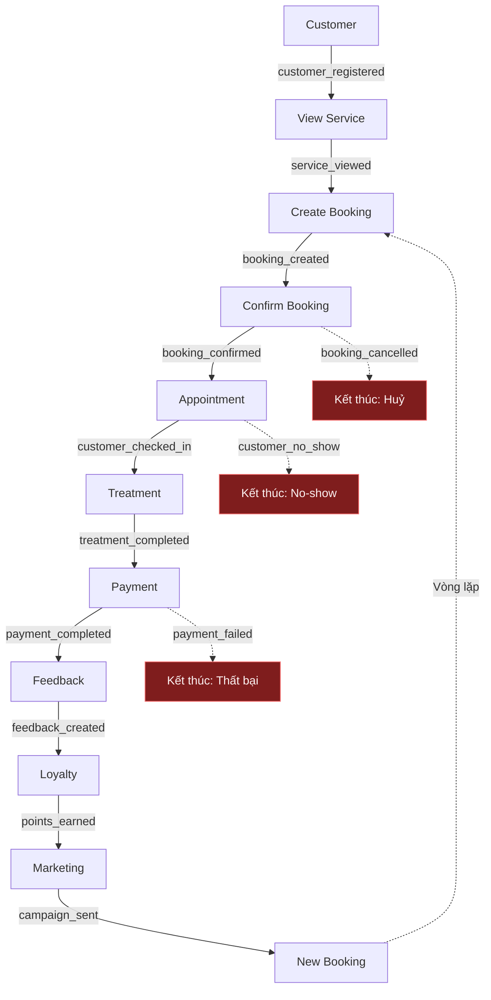

# Nghiệp vụ — Miền, quy trình, sự kiện

Hành trình khách hàng, 14 miền nghiệp vụ, 6 quy trình, danh mục sự kiện. Đây là lớp quyết định mọi thứ phía sau; mô hình dữ liệu ở [../01-erd/](../01-erd/) suy ra trực tiếp từ đây.

> **Mục tiêu lớp này:** Hiểu nghiệp vụ **trước khi** vẽ bất kỳ cái bảng nào.
> Đây là lớp mà 80% lỗi thiết kế database thực sự bắt nguồn — không phải lỗi kỹ thuật.

## 1. Hành trình khách hàng

Slogan của Facial Bar là **"Hành trình khách hàng"** → dùng chính nó làm xương sống thiết kế.

hành trình khách hàng là thứ **duy nhất** mà cả CEO, marketing, lễ tân và data team đều hiểu giống nhau. Mọi bảng dữ liệu sau này phải trả lời được một chặng nào đó trên hành trình này. Bảng nào không thuộc chặng nào → nghi vấn: có thực sự cần không?

Chú ý mũi tên nét đứt cuối cùng: đây là **closed-loop** — dữ liệu đầu ra (feedback, hạng thành viên) trở thành đầu vào cho marketing chặng sau. Đây là lý do platform cần dữ liệu lịch sử, không chỉ dữ liệu hiện tại.

---

## 2. Miền nghiệp vụ

Domain là một nhóm khái niệm nghiệp vụ có cùng chủ đề, do cùng một nhóm người chịu trách nhiệm.
Domain là cơ sở để chia schema, chia quyền truy cập, chia người sở hữu dữ liệu (data owner). Không chia domain → sau này 200 bảng nằm lẫn lộn trong 1 schema, không ai biết bảng nào của ai.

| # | Domain | Câu hỏi nghiệp vụ nó trả lời | Bản chất | Chủ sở hữu (Owner) |
|---|---|---|---|---|
| 1 | **Customer** | Ai là khách? Mới hay cũ? Đã quay lại mấy lần? | Master | CRM / Marketing |
| 2 | **Salon / Store** | Có bao nhiêu chi nhánh? Ở đâu? Quy mô nào? | Master | Vận hành |
| 3 | **Employee / Therapist** | Ai trực tiếp phục vụ khách? Tay nghề bậc mấy? | Master | HR / Vận hành |
| 4 | **Service** | Facial Bar bán những dịch vụ gì? Giá bao nhiêu? | Master | Sản phẩm |
| 5 | **Product** | Sản phẩm nào bán lẻ, sản phẩm nào dùng trong buồng? | Master | Kho / Sản phẩm |
| 6 | **Booking** | Khách đặt gì, khi nào, qua kênh nào? | Transaction | Vận hành |
| 7 | **Appointment** | Lịch hẹn cụ thể: ngày, giờ, buồng, KTV nào? | Transaction | Vận hành |
| 8 | **Treatment** | Dịch vụ **thực tế** đã được làm ra sao? | Transaction | Vận hành |
| 9 | **Payment** | Khách trả bao nhiêu, bằng hình thức gì? | Transaction | Tài chính |
| 10 | **Promotion** | Khuyến mãi nào đang chạy? Giảm bao nhiêu? | Master | Marketing |
| 11 | **Membership** | Khách ở hạng nào? Hết hạn khi nào? | Transaction (có kỳ hạn) | CRM |
| 12 | **Loyalty** | Khách tích/tiêu bao nhiêu điểm? | Transaction | CRM |
| 13 | **Marketing** | Chiến dịch nào? Chi bao nhiêu? Ra bao nhiêu khách? | Transaction | Marketing |
| 14 | **Feedback** | Khách hài lòng không? Vì sao? | Transaction | CX |

### Phân loại Master và Transaction

| | **Master Data** (Dữ liệu chủ) | **Transaction Data** (Dữ liệu giao dịch) |
|---|---|---|
| **Là gì** | Mô tả **một thứ tồn tại** | Ghi lại **một việc đã xảy ra** |
| Ví dụ | Khách hàng Lan, Salon Q1, dịch vụ Hydrafacial | Lan đặt lịch lúc 14:00 ngày 12/08 |
| Số lượng | Ít (nghìn dòng) | Rất nhiều (triệu dòng, tăng mỗi ngày) |
| Thay đổi | Chậm, sửa tại chỗ | Chỉ thêm mới (append) |
| Có mốc thời gian? | Không bắt buộc | **Luôn có** |
| Sau này thành | **Dimension** | **Fact** |

Tiêu chí phân loại: mô tả chứa động từ thể hoàn thành ("đã đặt", "đã trả", "đã đánh giá") → Transaction; mô tả là trạng thái tĩnh ("khách VIP", "chi nhánh Q1") → Master.

### Phân biệt Booking, Appointment và Treatment

Đây là chỗ dễ gộp bảng nhất, và cũng là chỗ gây sai số liệu nhiều nhất.

| | Booking | Appointment | Treatment |
|---|---|---|---|
| Là gì | **Ý định** của khách | **Lịch hẹn** đã xếp | **Việc đã làm** thật |
| Thời điểm | Khi khách bấm "Đặt lịch" | Khi hệ thống xếp KTV + buồng + giờ | Khi KTV thực hiện xong |
| Có thể huỷ? | Có | Có (kèm no-show) | Không (đã làm rồi) |
| Sinh doanh thu? | **Không** | **Không** | **Có** (qua Payment) |

Ba bảng tách rời vì quan hệ giữa chúng không phải một-một:
- 1 booking có thể tách thành **nhiều** appointment (khách đặt combo 3 buổi).
- 1 appointment có thể sinh **nhiều** treatment (đến làm facial, lễ tân up-sell thêm massage cổ vai gáy).
- 1 appointment có thể sinh **0** treatment (khách no-show).

Nếu gộp làm một bảng → không thể tính được **tỷ lệ no-show** và **tỷ lệ up-sell**, là 2 KPI vận hành quan trọng nhất của chuỗi spa.

---

## 3. Quy trình nghiệp vụ

Process là một chuỗi bước nghiệp vụ có điểm bắt đầu, điểm kết thúc và một mục tiêu kinh doanh rõ ràng.
Process cho biết **thứ tự phụ thuộc** giữa các bảng → quyết định thứ tự nạp dữ liệu trong pipeline (không thể nạp `payment` trước khi có `treatment`).

| # | Process | Mục tiêu | Domain tham gia | KPI chính |
|---|---|---|---|---|
| 1 | **Customer Acquisition** | Thu hút khách mới | Marketing, Customer, Promotion | CAC, ROAS, số khách mới |
| 2 | **Booking & Appointment** | Khách đặt được lịch | Customer, Service, Salon, Employee, Booking, Appointment | Tỷ lệ chốt lịch, no-show |
| 3 | **Treatment** | Thực hiện dịch vụ | Appointment, Employee, Treatment, Service, Product | Utilization KTV, thời gian phục vụ |
| 4 | **Payment & Sales** | Thu tiền | Treatment, Product, Promotion, Payment, Membership | Revenue, ATV, tỷ lệ giảm giá |
| 5 | **Loyalty & Membership** | Giữ chân khách | Customer, Payment, Loyalty, Membership | Tỷ lệ nâng hạng, điểm tiêu/tích |
| 6 | **Customer Retention** | Khiến khách quay lại | Toàn bộ (closed-loop) | Repeat rate, CLV, churn |

> 💡 Process 6 không có bảng riêng — nó là **kết quả** của 5 process trước. Đây là dấu hiệu tốt: process phân tích thường không sinh bảng nguồn mới, mà sinh **bảng tổng hợp** ở tầng datamart.

---

## 4. Sự kiện nghiệp vụ

Event là một việc đã xảy ra tại một thời điểm xác định, không thể thay đổi được nữa.
Event chính là **hạt dữ liệu nhỏ nhất** của hệ thống. Có event → tái dựng được toàn bộ lịch sử. Chỉ có bảng trạng thái hiện tại → mất vĩnh viễn thông tin "khách đã từng huỷ 3 lần trước khi đến".

### Quy ước đặt tên event
`<domain>_<động từ quá khứ>` — luôn dùng thể **đã hoàn thành**, chữ thường, gạch dưới.

✅ `booking_created`, `payment_completed`
❌ `create_booking` (đang làm), ❌ `BookingCreate` (không nhất quán), ❌ `booking` (không biết chuyện gì xảy ra)

### Danh mục sự kiện

| Domain | Event | Ý nghĩa nghiệp vụ | Thuộc tính then chốt |
|---|---|---|---|
| Customer | `customer_registered` | Khách tạo tài khoản | customer_id, channel, referral_code |
| | `customer_updated` | Sửa thông tin | customer_id, field_changed |
| | `customer_login` | Đăng nhập app | customer_id, device, session_id |
| Service | `service_viewed` | Xem trang dịch vụ | customer_id, service_id, duration_sec |
| Booking | `booking_created` | Đặt lịch | booking_id, service_ids[], slot_at |
| | `booking_confirmed` | Salon xác nhận | booking_id, confirmed_by |
| | `booking_cancelled` | Huỷ | booking_id, reason, cancelled_by |
| | `booking_rescheduled` | Đổi giờ | booking_id, old_slot, new_slot |
| Appointment | `customer_checked_in` | Khách đến quầy | appointment_id, checkin_at |
| | `customer_no_show` | Khách không đến | appointment_id |
| Treatment | `treatment_started` | Bắt đầu làm | treatment_id, employee_id, room_id |
| | `treatment_completed` | Làm xong | treatment_id, actual_duration_min |
| Payment | `payment_initiated` | Bấm thanh toán | payment_id, amount, method |
| | `payment_completed` | Trả tiền xong | payment_id, gateway_txn_id |
| | `payment_failed` | Thất bại | payment_id, error_code |
| | `refund_issued` | Hoàn tiền | payment_id, refund_amount |
| Loyalty | `points_earned` | Tích điểm | customer_id, points, source_payment_id |
| | `points_redeemed` | Tiêu điểm | customer_id, points, target |
| Membership | `membership_purchased` | Mua thẻ | customer_id, tier, valid_from/to |
| | `membership_upgraded` | Nâng hạng | customer_id, from_tier, to_tier |
| | `membership_expired` | Hết hạn | customer_id, tier |
| Feedback | `feedback_created` | Gửi đánh giá | feedback_id, rating, comment |
| Marketing | `campaign_sent` | Gửi chiến dịch | campaign_id, customer_id, channel |
| | `campaign_clicked` | Khách bấm vào | campaign_id, customer_id |

### Thuộc tính bắt buộc của mọi sự kiện

Đây là "bao thư" chung, tách biệt với nội dung nghiệp vụ. Bắt buộc chuẩn hoá từ ngày đầu.

| Trường | Kiểu | Vai trò | Vì sao bắt buộc |
|---|---|---|---|
| `event_id` | UUID | Khoá duy nhất của event | Để **khử trùng lặp** — Kafka có thể gửi 1 event 2 lần |
| `event_name` | string | Tên event | Định tuyến xử lý |
| `event_version` | int | Phiên bản schema | Để đổi schema không làm vỡ downstream |
| `occurred_at` | timestamp (UTC) | **Lúc việc xảy ra thật** | Dùng để tính toán nghiệp vụ |
| `received_at` | timestamp (UTC) | Lúc hệ thống nhận được | Dùng để đo độ trễ, phát hiện late data |
| `source_system` | string | `pos` / `app` / `web` / `ga4` | Truy vết nguồn gốc |
| `entity_id` | string | ID đối tượng chính | Dùng làm Kafka partition key |

> ⚠️ **Phân biệt `occurred_at` và `received_at`.** Khách check-in ở salon lúc 23:50 ngày 13/08 nhưng mạng lỗi, event về server 00:10 ngày 14/08. Nếu báo cáo dùng `received_at` → doanh thu ngày 13 bị hụt, ngày 14 bị dôi. **Luôn phân vùng lưu trữ theo `received_at`, nhưng tính toán nghiệp vụ theo `occurred_at`.**

---

## 5. Luồng sự kiện

> 💡 **Điểm quan trọng mà bản phác thảo ban đầu chưa có: các nhánh THẤT BẠI.**
> Luồng "happy path" chỉ là 1 trong nhiều kết cục. Phân tích kinh doanh giá trị nhất nằm ở nhánh thất bại: *tại sao 30% booking bị huỷ?*
> Vì vậy mô hình dữ liệu **phải lưu cả event thất bại**, không chỉ event thành công. Nếu POS chỉ ghi booking thành công → mất vĩnh viễn khả năng phân tích huỷ lịch.

### Ba khái niệm cốt lõi

| Khái niệm | Câu hỏi | Ví dụ Facial Bar |
|---|---|---|
| **Domain** | Có những đối tượng nghiệp vụ nào? | Customer, Salon, Booking, Payment |
| **Process** | Chúng vận hành với nhau thế nào? | Customer → Booking → Treatment → Payment |
| **Event** | Trong quá trình đó chuyện gì xảy ra? | `booking_created` → `treatment_completed` → `payment_completed` |

---
---
