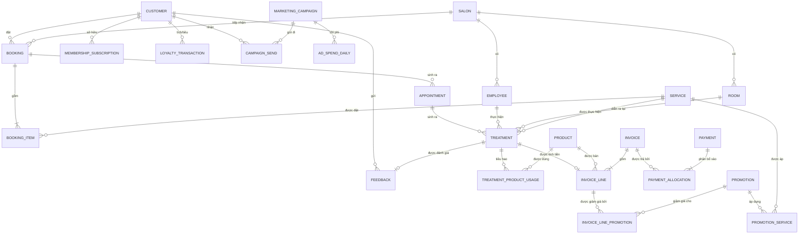

# ERD nghiệp vụ và quan hệ

Mô hình khái niệm và logic: thực thể, khoá, quan hệ, cardinality. Chưa gắn với DBMS cụ thể.

DDL vật lý tương ứng: [03-ddl/02-crt.md](../03-ddl/02-crt.md) (3NF) và [03-ddl/03-dm-dimension.md](../03-ddl/03-dm-dimension.md) + [04-dm-fact.md](../03-ddl/04-dm-fact.md) (star schema).

## 1. Data Entity

Entity là một đối tượng nghiệp vụ được biểu diễn thành bảng, có khoá xác định duy nhất.

### Khái niệm khoá — phân biệt 3 loại

| Loại khoá | Định nghĩa | Ví dụ | Dùng ở đâu |
|---|---|---|---|
| **Natural Key** (khoá tự nhiên) | Giá trị nghiệp vụ tự nhận diện | Số điện thoại `0901234567` | Nhận diện khách ở tầng nguồn |
| **Business Key** (khoá nghiệp vụ) | ID do hệ thống nguồn sinh ra | `POS-CUS-00123` | Đối chiếu ngược về nguồn |
| **Surrogate Key** (khoá đại diện) | Số nguyên vô nghĩa do DWH tự sinh | `customer_sk = 8471` | Join trong Star schema |

khách đổi số điện thoại → natural key đổi → mọi giao dịch cũ bị mất liên kết. Surrogate key không bao giờ đổi, nên lịch sử được bảo toàn. Ngoài ra join số nguyên nhanh hơn join chuỗi rất nhiều.

### Master Entity

```sql
-- crt.customer : bản sạch, 1 dòng = 1 khách hàng duy nhất
customer_id        BIGINT       PK   -- business key thống nhất sau khi gộp định danh
phone              VARCHAR(20)       -- đã chuẩn hoá E.164: +84901234567
email              VARCHAR(255)
full_name          NVARCHAR(200)
date_of_birth      DATE
gender             VARCHAR(10)       -- F / M / OTHER / UNKNOWN
registration_date  DATE         NOT NULL
acquisition_channel VARCHAR(50)      -- fb_ads / google_ads / walk_in / referral
first_salon_id     BIGINT       FK -> salon
status             VARCHAR(20)  NOT NULL  -- active / inactive / blacklisted
created_at         DATETIME2    NOT NULL
updated_at         DATETIME2    NOT NULL
```

| Entity | Khoá chính | Các thuộc tính then chốt |
|---|---|---|
| `salon` | salon_id | name, city, district, address, open_date, close_date, capacity_beds, manager_id |
| `employee` | employee_id | full_name, role (therapist/receptionist/manager), skill_level, hire_date, terminate_date, salon_id |
| `service` | service_id | name, category, standard_duration_min, list_price, is_active, valid_from, valid_to |
| `product` | product_id | name, category, unit, retail_price, cost_price, is_retail, is_consumable |
| `promotion` | promotion_id | name, type (percent/amount/gift), value, valid_from, valid_to, applicable_scope |
| `membership_tier` | tier_id | tier_name (Silver/Gold/Platinum), min_spend, discount_pct, point_multiplier |
| `room` | room_id | salon_id, room_name, room_type |
| `marketing_campaign` | campaign_id | name, platform, objective, start_date, end_date, budget |

### Transaction Entity — nhóm quan trọng nhất

Đây là nhóm thể hiện **business activity**, và cũng là nhóm sinh ra toàn bộ giá trị phân tích.

```sql
-- crt.booking : 1 dòng = 1 lần khách đặt lịch (phần HEADER)
booking_id       BIGINT      PK
customer_id      BIGINT      FK -> customer
salon_id         BIGINT      FK -> salon
booking_channel  VARCHAR(30)      -- app / web / hotline / walk_in
booking_status   VARCHAR(20)      -- created / confirmed / cancelled / completed
booked_at        DATETIME2   NOT NULL   -- lúc khách bấm đặt
requested_slot_at DATETIME2  NOT NULL   -- giờ khách muốn đến
cancel_reason    NVARCHAR(200) NULL
promotion_id     BIGINT      NULL FK -> promotion
source_event_id  UUID             -- truy vết về event gốc

-- crt.booking_item : 1 dòng = 1 DỊCH VỤ trong 1 booking (phần LINE)
booking_item_id  BIGINT      PK
booking_id       BIGINT      FK -> booking
service_id       BIGINT      FK -> service
quantity         INT
unit_price       DECIMAL(18,2)
discount_amount  DECIMAL(18,2)
line_amount      DECIMAL(18,2)    -- = quantity * unit_price - discount_amount
```

> **Khái niệm Header–Line (Đầu–Dòng):** một giao dịch gần như luôn có 2 mức: mức tổng (ai, khi nào, ở đâu) và mức chi tiết (mua cái gì, mấy cái). Tách 2 bảng là chuẩn mực. Gộp lại sẽ khiến dữ liệu khách hàng bị lặp lại theo số dòng dịch vụ → nguồn gốc của double counting.

| Entity | Khoá chính | Grain (1 dòng = ?) | Ghi chú |
|---|---|---|---|
| `booking` | booking_id | 1 lần đặt lịch | Header |
| `booking_item` | booking_item_id | 1 dịch vụ trong 1 booking | Line |
| `appointment` | appointment_id | 1 lịch hẹn cụ thể | Có KTV, buồng, giờ |
| `treatment` | treatment_id | 1 dịch vụ **đã thực hiện** bởi 1 KTV | Nơi sinh doanh thu dịch vụ |
| `treatment_product_usage` | usage_id | 1 sản phẩm dùng trong 1 treatment | Tính COGS |
| `invoice` | invoice_id | 1 hoá đơn | Header |
| `invoice_line` | invoice_line_id | 1 dòng hoá đơn (dịch vụ hoặc sản phẩm) | **Grain doanh thu chuẩn** |
| `payment` | payment_id | 1 lần chuyển tiền | 1 hoá đơn có thể trả nhiều lần |
| `payment_allocation` | alloc_id | 1 phần tiền phân bổ cho 1 hoá đơn | Giải bài toán trả góp / trả nhiều thẻ |
| `loyalty_transaction` | loyalty_txn_id | 1 lần điểm biến động (+/−) | Sổ kế toán điểm |
| `membership_subscription` | subscription_id | 1 kỳ thành viên của 1 khách | Có valid_from/valid_to |
| `feedback` | feedback_id | 1 phiếu đánh giá | Gắn với treatment hoặc appointment |
| `campaign_send` | send_id | 1 lần gửi tới 1 khách | Grain: campaign × customer × lần gửi |
| `ad_spend_daily` | (date, campaign_id, platform) | 1 ngày × 1 chiến dịch × 1 nền tảng | Từ Ads API |

---

## 2. Relationship và Cardinality

Cardinality là số lượng dòng ở bảng A ứng với một dòng ở bảng B.

| Ký hiệu | Đọc là | Ví dụ Facial Bar |
|---|---|---|
| **1:1** | Một–một | 1 appointment ↔ 1 phiếu check-in |
| **1:N** | Một–nhiều | 1 customer có **nhiều** booking |
| **N:1** | Nhiều–một | Nhiều treatment thuộc **một** appointment |
| **N:N** | Nhiều–nhiều | 1 promotion áp cho nhiều service, 1 service nhận nhiều promotion |

> ⚠️ **Quan hệ N:N không tồn tại được trong database.** Phải luôn phá thành 2 quan hệ 1:N qua một **bảng trung gian** (bridge / junction table).
> `promotion` 1—N `promotion_service` N—1 `service`
>
> **Vì sao:** nếu không có bảng trung gian, phải lưu danh sách service trong 1 cột dạng `"1,5,9"` → không join được, không index được, không kiểm tra toàn vẹn được.

### ERD nghiệp vụ



---
