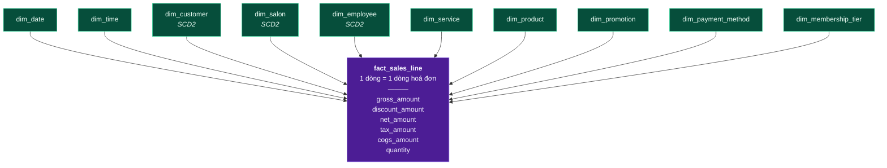

# Star Schema, SCD và chuẩn hoá

Mô hình chiều: Fact ở giữa, Dimension vây quanh. Cơ chế xử lý dimension thay đổi theo thời gian, và lý do hai tầng `crt` / `dm` theo hai triết lý chuẩn hoá ngược nhau.

DDL: [03-ddl/03-dm-dimension.md](../03-ddl/03-dm-dimension.md) · [03-ddl/04-dm-fact.md](../03-ddl/04-dm-fact.md). Quy trình nạp SCD2: [04-etl/load-dimension.md](../04-etl/load-dimension.md).


Star schema là cách tổ chức dữ liệu thành các bảng **Fact** (số đo, ở giữa) vây quanh bởi các bảng **Dimension** (ngữ cảnh, ở ngoài) — trông như hình ngôi sao.

So sánh với mô hình chuẩn hoá 3NF của OLTP:

| | OLTP (3NF) | Star Schema |
|---|---|---|
| Tối ưu cho | Ghi nhanh, không trùng lặp | **Đọc nhanh, dễ hiểu** |
| Số bảng phải join để ra 1 báo cáo | 8–15 | **2–4** |
| Người dùng cuối tự viết SQL được? | Rất khó | Được |
| Giữ lịch sử thay đổi? | Thường không | **Có (SCD)** |



### SCD — Slowly Changing Dimension (Chiều thay đổi chậm)

SCD là cơ chế xử lý việc thuộc tính của một dimension bị thay đổi theo thời gian.

**Vấn đề cụ thể:** Tháng 1 khách Lan ở hạng **Silver**, tháng 6 lên **Gold**. Câu hỏi: *"Doanh thu tháng 1 từ khách Silver là bao nhiêu?"*

| Loại | Cách xử lý | Kết quả với câu hỏi trên | Dùng khi |
|---|---|---|---|
| **SCD Type 1** | Ghi đè giá trị cũ | **SAI** — doanh thu tháng 1 bị tính vào Gold | Sửa lỗi chính tả tên khách |
| **SCD Type 2** | Thêm dòng mới, đóng dòng cũ | **ĐÚNG** — tháng 1 vẫn là Silver | Thuộc tính cần phân tích theo lịch sử |
| **SCD Type 3** | Thêm cột `previous_tier` | Chỉ nhớ được 1 bước lùi | Ít dùng |

```sql
-- dm.dim_customer : SCD Type 2
customer_sk      BIGINT      PK        -- surrogate key, tăng tự động
customer_id      BIGINT      NOT NULL  -- business key, LẶP LẠI qua các phiên bản
full_name        NVARCHAR(200)
phone            VARCHAR(20)
gender           VARCHAR(10)
age_group        VARCHAR(20)           -- <25 / 25-34 / 35-44 / 45+
city             VARCHAR(50)
membership_tier  VARCHAR(20)           -- thuộc tính THEO DÕI LỊCH SỬ
acquisition_channel VARCHAR(50)
-- Bộ cột điều khiển SCD2:
valid_from       DATETIME2   NOT NULL
valid_to         DATETIME2   NOT NULL  -- '9999-12-31' nếu đang hiệu lực
is_current       BIT         NOT NULL
row_hash         VARBINARY(32)         -- hash các cột theo dõi, để phát hiện thay đổi
```

Dữ liệu thực tế:

| customer_sk | customer_id | tier | valid_from | valid_to | is_current |
|---|---|---|---|---|---|
| 8471 | 1001 | Silver | 2026-01-05 | 2026-06-14 | 0 |
| 9022 | 1001 | Gold | 2026-06-15 | 9999-12-31 | **1** |

Fact tháng 1 trỏ vào `customer_sk = 8471` → mãi mãi là Silver. Fact tháng 7 trỏ vào `9022` → Gold. Lịch sử được bảo toàn tuyệt đối.

> 💡 **Vai trò của `row_hash`:** mỗi lần nạp, băm các cột cần theo dõi rồi so với hash cũ. Khác nhau → tạo phiên bản mới. Giống nhau → bỏ qua. Nếu không có hash, phải so từng cột bằng tay — dài dòng và dễ sót.

### Dimension đặc biệt

| Loại | Là gì | Ví dụ Facial Bar |
|---|---|---|
| **Role-playing dimension** | Một dim dùng nhiều vai | `dim_date` đóng vai `booked_date`, `appointment_date`, `paid_date` — tạo view riêng cho từng vai |
| **Degenerate dimension** | Mã giao dịch nằm ngay trong fact, không có dim riêng | `invoice_no`, `booking_id` |
| **Junk dimension** | Gom nhiều cờ nhị phân rời rạc vào 1 dim | `is_first_visit`, `is_promotion_applied`, `is_walk_in` |
| **Conformed dimension** | Một dim dùng chung cho nhiều fact | `dim_customer` dùng cho cả `fact_sales_line` và `fact_feedback` → cho phép so sánh chéo |
| **Unknown member** | Dòng `sk = -1` cho trường hợp thiếu dữ liệu | Khách walk-in chưa có hồ sơ |

> ⚠️ **Luôn tạo dòng `sk = -1` ("Unknown") trong mọi dimension.** Nếu không, fact thiếu khoá sẽ bị mất khi INNER JOIN → doanh thu bị hụt mà không có dấu vết.

### Chốt định nghĩa KPI ngay tại Datamart

Sơ đồ ghi *"datamart star schema — Fact, dim, **chốt định nghĩa**"*. Nghĩa là: mỗi số đo chỉ được định nghĩa **một lần duy nhất** tại tầng này, không để mỗi dashboard tự tính lại.

Trường hợp thường gặp: định nghĩa "Doanh thu".

| Cách hiểu | Công thức | Ai dùng |
|---|---|---|
| Gross revenue | `SUM(gross_amount)` | Marketing (đo quy mô) |
| Net revenue | `SUM(gross_amount − discount_amount)` | **Chuẩn công ty** |
| Net excl. VAT | `SUM(net_amount − tax_amount)` | Kế toán |
| Cash collected | `SUM(payment.amount)` | Tài chính (dòng tiền) |

→ Datamart phải có sẵn cả 4 cột với tên khác nhau rõ ràng, kèm định nghĩa trong data catalog. **Không** để tên chung chung là `revenue`.

---

---

## Chuẩn hoá và phi chuẩn hoá

Chuẩn hoá là việc sắp xếp cột vào bảng sao cho **mỗi dữ kiện chỉ được lưu ở đúng một chỗ**.

hai tầng `crt` và `dm` trong sơ đồ được thiết kế theo **hai triết lý ngược nhau**. Nhầm lẫn giữa hai lớp sẽ dẫn tới làm `crt` giống `dm` (mất khả năng đối soát) hoặc làm `dm` giống `crt` (dashboard phải join 12 bảng, mở 30 giây).

| Dạng chuẩn | Yêu cầu | Vi phạm thật ở Facial Bar | Hậu quả cụ thể |
|---|---|---|---|
| **1NF** | Mỗi ô chứa **một** giá trị nguyên tử, không có nhóm lặp | `booking.service_ids = '1,5,9'` | Không join, không index, không đếm được số dịch vụ |
| **2NF** | Mọi cột non-key phụ thuộc **toàn bộ** khoá chính | Bảng `booking_item(booking_id, service_id)` lại lưu `customer_name` — tên khách chỉ phụ thuộc `booking_id` | Sửa tên khách phải sửa N dòng; sót 1 dòng là dữ liệu tự mâu thuẫn |
| **3NF** | Không có phụ thuộc **bắc cầu** (non-key → non-key) | `booking` lưu `salon_city`, mà city phụ thuộc `salon_id` chứ không phụ thuộc `booking_id` | Salon chuyển địa chỉ → toàn bộ booking cũ mang thành phố sai |

*(BCNF và các dạng cao hơn hiếm khi phát sinh trong nghiệp vụ bán lẻ dịch vụ; nếu gặp thì thường là dấu hiệu khoá chính đang bị chọn sai.)*

### Hai tầng, hai triết lý — đây là quyết định thiết kế, không phải sự bất nhất

| | `crt` (Curated) | `dm` (Datamart) |
|---|---|---|
| Mục tiêu | **Đúng**, đối soát được với nguồn | **Đọc nhanh**, người dùng tự hiểu |
| Dạng chuẩn | **3NF** | **Cố ý phá 3NF** (denormalized) |
| Số bảng phải join cho 1 báo cáo | 8–15 | 2–4 |
| `city` được lưu ở đâu | Chỉ ở `crt.salon` | Nhân bản vào `dim_salon` **và** `dim_customer` |
| Vì sao chấp nhận trùng lặp | — | Dimension chỉ vài nghìn dòng; đổi vài MB trùng lặp để bỏ hàng chục phép join |
| Ai đảm bảo nhất quán | **Ràng buộc FK** của database | **Pipeline + DQ rule** (database không tự lo được) |

> ⚠️ **Câu "denormalize cho nhanh" chỉ đúng với DIMENSION, không đúng với FACT.**
> Denormalize fact (đưa `customer_name`, `salon_city` vào từng dòng hoá đơn) là sai vì: (1) fact có hàng trăm triệu dòng, nhân bản chuỗi ở đó làm bảng tăng dung lượng nhiều lần; (2) **mất luôn khả năng áp SCD2** — thuộc tính đã bị đóng băng cứng trong fact, không còn phiên bản nào để chọn.

### Một chỗ được phép "phá 1NF" có kiểm soát: quan hệ nhiều-nhiều trong fact

Vấn đề thật: một hoá đơn có thể áp **đồng thời 2 khuyến mãi** (giảm 20% sinh nhật + tặng kèm mask). Fact có grain 1 dòng = 1 dòng hoá đơn, nhưng lại cần trỏ tới **nhiều** promotion.

Ba cách xử lý, và lý do chọn:

| Cách | Làm gì | Vấn đề |
|---|---|---|
| Nhân dòng fact | 1 dòng hoá đơn × 2 promotion = 2 dòng | ❌ **Phá grain** → `SUM(net_amount)` bị nhân đôi |
| Nhồi vào 1 cột | `promotion_ids = '3,7'` | ❌ Phá 1NF, không lọc/join được |
| **Bridge table + hệ số phân bổ** | Bảng cầu nối riêng, có `allocation_factor` cộng lại bằng 1 | ✅ Giữ nguyên grain fact, phân tích được theo promotion |

→ Chọn cách 3. DDL của `bridge_sales_promotion` nằm ở [mục 5.7](../03-ddl/04-dm-fact.md).

---
