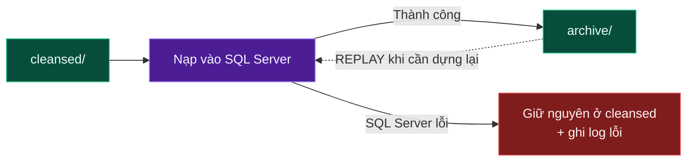
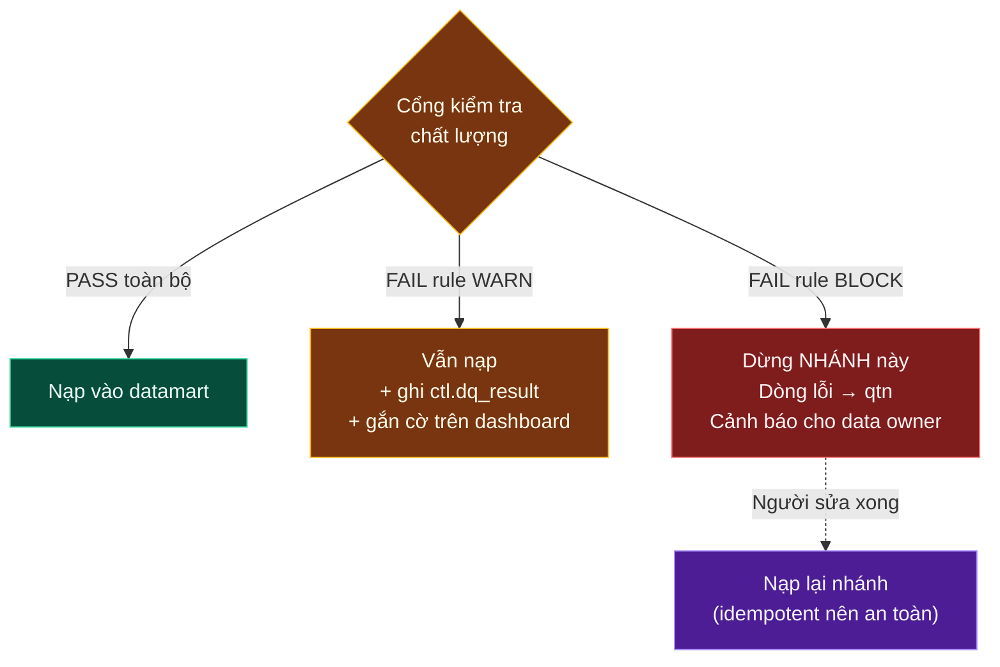

# Hồ dữ liệu, nạp và kiểm soát, kho dữ liệu

Ba phân vùng của hồ dữ liệu S3, bước nạp và kiểm soát, bốn tầng kho trên SQL Server, cổng kiểm tra chất lượng và vùng cách ly, điều phối bằng Airflow.

DDL từng tầng: [../03-ddl/](../03-ddl/). Quy trình nạp: [../04-etl/](../04-etl/).


## 1. Hồ dữ liệu S3

Data Lake là nơi lưu trữ tập trung dữ liệu ở quy mô lớn, chứa được nhiều định dạng và **giữ dữ liệu gần với dạng gốc của nguồn**.
**Chọn công nghệ:** Amazon S3.

**Lake lưu những gì:** dữ liệu có cấu trúc (customer, booking, payment, treatment, product, salon, employee, marketing, feedback), bán cấu trúc (JSON event, CSV export, log), và có thể cả phi cấu trúc (ảnh trước/sau điều trị, tài liệu đồng ý điều trị).

### Ba zone chính

| Zone | Mục đích | Định dạng | Nguyên tắc |
|---|---|---|---|
| **raw/** | Giữ **nguyên** dữ liệu từ nguồn, **không** transformation | Đúng như nguồn (JSON/CSV/Avro), gzip | **Immutable** |
| **cleansed/** | Bản đã chuẩn hoá, dùng được cho hạ nguồn | Parquet + Snappy | Có schema rõ ràng, đã ép kiểu |
| **archive/** | Giữ file **đã nạp thành công**, phục vụ replay/recovery | Như raw | Chỉ chuyển vào sau khi nạp xong |

### Nguyên tắc Immutable (Bất biến) — Write Once

File đã ghi vào Lake thì **không sửa trực tiếp**. Muốn có bản mới → ghi file mới.

```
raw/pos/booking/dt=2026-08-14/booking_20260814_v1.parquet   ← lô đầu
raw/pos/booking/dt=2026-08-14/booking_20260814_v2.parquet   ← nguồn gửi lại, KHÔNG ghi đè v1
```

Ba lý do:
1. **Audit** — khi số liệu lệch, phải chứng minh được nguồn đã gửi cái gì. Ghi đè là mất chứng cứ.
2. **Reproducibility** — chạy lại pipeline của tháng trước phải ra đúng kết quả tháng trước.
3. **An toàn trước lỗi code** — pipeline có bug thì chỉ cần sửa code rồi chạy lại từ raw. Nếu raw đã bị ghi đè bằng dữ liệu lỗi → mất vĩnh viễn.

### Cấu trúc thư mục chuẩn

```
s3://facialbar-lake/
├── raw/
│   ├── pos/booking/dt=2026-08-14/...
│   ├── pos/invoice/dt=2026-08-14/...
│   ├── kafka/booking/v1/dt=2026-08-14/hour=09/...
│   ├── cdc/oltp/customer/dt=2026-08-14/...
│   ├── ads/facebook/dt=2026-08-14/...
│   └── ga4/events/dt=2026-08-14/...
├── cleansed/
│   ├── customer/    (Iceberg table)
│   ├── booking/
│   ├── invoice_line/
│   └── payment/
└── archive/
    └── pos/booking/loaded_dt=2026-08-14/...
```

> **Căn cứ — thư mục có dạng `dt=2026-08-14` (kiểu Hive):** query engine đọc được ngay cột phân vùng từ tên thư mục. Câu `WHERE dt = '2026-08-14'` sẽ **chỉ đọc 1 thư mục** thay vì quét toàn bộ bucket. Đây gọi là **partition pruning** — chênh lệch chi phí có thể lên tới hàng trăm lần.

### Bước Chuẩn hoá (raw → cleansed) — Spark hoặc Glue

Đây chính là hộp tím "Chuẩn hoá" trong sơ đồ. Gồm 6 việc, theo đúng thứ tự:

| # | Việc | Chi tiết | Ví dụ |
|---|---|---|---|
| 1 | **Validation** | Kiểm tra schema, cột bắt buộc, dòng hỏng | Thiếu `booking_id` → đẩy sang reject |
| 2 | **Type Casting** | Ép kiểu về đúng chuẩn | `"1200000.00"` → `DECIMAL(18,2)`; `"14/08/2026"` → `DATE` |
| 3 | **Column Standardization** | Chuẩn tên cột, chuẩn giá trị | `CustomerID`/`cust_id` → `customer_id`; `"Nam"`/`"M"`/`"male"` → `M` |
| 4 | **CDC Deduplication** | Loại bản ghi trùng, lấy phiên bản cuối | `ROW_NUMBER() ... ORDER BY _lsn DESC` |
| 5 | **Data Quality** | Chạy rule kiểm tra chất lượng | `amount >= 0`, `occurred_at <= now()` |
| 6 | **Ghi Parquet + Snappy** | Định dạng cột, nén | Nhỏ hơn JSON ~5–10 lần, đọc nhanh hơn nhiều |

Parquet lưu theo **cột**, nên câu `SELECT SUM(net_amount)` chỉ đọc đúng 1 cột thay vì cả dòng. Nén tốt hơn vì dữ liệu cùng cột có cùng kiểu. Snappy nén nhẹ hơn gzip nhưng **giải nén nhanh hơn nhiều** và cho phép chia file để xử lý song song — đánh đổi đúng cho phân tích.

### Archive Zone — cơ chế phục hồi



> ⚠️ **Archive KHÔNG phải Database Backup.** Đây là hai thứ khác nhau hoàn toàn:
>
> | | Database Backup | Archive Zone |
> |---|---|---|
> | Định nghĩa | Bản sao **trạng thái** của DB | Bản sao **dữ liệu đầu vào** của pipeline |
> | Phục hồi được gì | Đưa DB về thời điểm T | **Chạy lại** pipeline từ đầu |
> | Ai dùng | DBA | Data Engineer |
> | Khi nào dùng | Server chết, xoá bảng nhầm | Logic transform sai, cần nạp lại 3 tháng |

### Apache Iceberg — Open Table Format

Iceberg là một lớp **metadata** đặt lên trên các file Parquet trên S3, biến một đống file rời rạc thành một **bảng** thực sự có schema, có phiên bản, có transaction.

**Vấn đề Iceberg giải quyết:** S3 chỉ là kho file. Không có Iceberg thì:
- Muốn tìm dữ liệu → phải `LIST` toàn bộ prefix (rất chậm, tốn tiền theo request).
- Muốn `UPDATE` 1 dòng → phải đọc file, sửa, ghi lại cả file.
- Đang đọc mà job khác đang ghi → đọc được dữ liệu nửa vời.
- Đổi schema → mọi consumer vỡ.

**Iceberg quản lý 4 thứ:**

| Thành phần | Định nghĩa | Lợi ích cụ thể |
|---|---|---|
| **Schema** | Lưu định nghĩa cột trong metadata | Biết chính xác bảng có cột gì, kiểu gì |
| **Metadata / Manifest** | Danh sách file thuộc bảng + thống kê min/max mỗi cột | Query → đọc metadata → **xác định đúng file cần đọc** → không phải quét S3 |
| **Snapshot** | Mỗi lần ghi tạo một snapshot mô tả trạng thái mới của bảng | Mỗi snapshot là **một trạng thái nhất quán tại một thời điểm** |
| **Partition** | Thông tin phân vùng nằm trong metadata (không phụ thuộc đường dẫn) | Giảm lượng dữ liệu phải đọc; **đổi được cách phân vùng** mà không ghi lại dữ liệu |

**Bốn năng lực có được từ đó:**

| Năng lực | Định nghĩa | Ví dụ Facial Bar |
|---|---|---|
| **Schema Evolution** | Thêm/xoá/đổi tên cột an toàn | Thêm cột `skin_type` vào `treatment` — job cũ vẫn chạy bình thường |
| **ACID Transaction** | Ghi thì hoặc xong hẳn, hoặc như chưa từng xảy ra | Spark job dừng bất thường → không để lại dữ liệu ghi dở |
| **Time Travel** | Đọc bảng ở trạng thái quá khứ (nhờ snapshot) | `SELECT * FROM cleansed.booking FOR TIMESTAMP AS OF '2026-08-01'` để xem báo cáo hôm đó dựa trên dữ liệu nào |
| **Hidden Partitioning** | Người viết SQL không cần biết cột phân vùng | `WHERE occurred_at > ...` tự động được tối ưu |

> **Iceberg không lưu dữ liệu.** Dữ liệu thực tế vẫn là các file Parquet trên S3. Iceberg chỉ quản lý **metadata + trạng thái** của bảng. Xoá metadata thì file vẫn còn, nhưng không còn là "bảng" nữa.

**Dùng Iceberg ở đâu:** tầng **cleansed** trở đi (nơi cần schema ổn định, cần UPDATE/DELETE cho CDC, cần time travel). Tầng **raw** giữ nguyên file thô để bảo toàn nguyên tắc immutable.

**Việc bảo trì bắt buộc (nhiều nơi quên, dẫn tới chậm dần theo tháng):**
- `rewrite_data_files` — gộp file nhỏ (chạy hằng tuần).
- `expire_snapshots` — xoá snapshot cũ hơn 30 ngày (giữ metadata không tăng vô hạn).
- `remove_orphan_files` — dọn file không còn thuộc snapshot nào.

---

## 2. Nạp và kiểm soát

Đây là hộp tím ở giữa sơ đồ, làm 4 việc theo thứ tự: **Đọc → Kiểm tra → Nạp → Ghi watermark**.

### Khái niệm Watermark

Watermark là một dấu mốc được lưu lại, ghi nhớ "đã xử lý đến đâu rồi", để lần chạy sau chỉ lấy phần mới.

không có watermark thì mỗi lần chạy phải quét lại toàn bộ dữ liệu (rất chậm và tốn tiền), hoặc phải hard-code ngày trong code (chạy lại lịch sử là không thể).

| Loại watermark | Giá trị lưu | Dùng cho |
|---|---|---|
| Theo thời gian | `2026-08-14 09:00:00` | Nguồn có cột `updated_at` đáng tin |
| Theo LSN/offset | `84021` | CDC (chính xác tuyệt đối) |
| Theo phân vùng ngày | `dt=2026-08-14` | File trên S3 |
| Theo danh sách file | Tên các file đã nạp | Nguồn gửi file không theo lịch |

### Tính Idempotent (chạy lại không sai)

Chạy pipeline 1 lần hay 5 lần với cùng dữ liệu đầu vào đều cho **cùng một kết quả**.

đường ống sẽ có lúc hỏng và phải chạy lại. Nếu không lũy đẳng, mỗi lần chạy lại cộng thêm một bản dữ liệu, làm doanh thu tăng mà không có dấu vết giải thích.

| Cách làm | Kỹ thuật | Áp dụng cho |
|---|---|---|
| **Delete-Insert theo phân vùng** | `DELETE WHERE dt = @dt;` rồi `INSERT` | Fact theo ngày — đơn giản và an toàn nhất |
| **MERGE theo khoá nghiệp vụ** | `MERGE ... ON target.bk = source.bk` | Dimension SCD, bảng có UPDATE |
| **INSERT có kiểm tra tồn tại** | `WHERE NOT EXISTS (...)` | Bảng append-only, khối lượng nhỏ |

```sql
-- Mẫu nạp fact idempotent theo ngày (DDL đầy đủ của bảng ở mục 5.6.1)
BEGIN TRAN;
    DELETE FROM dm.fact_sales_line WHERE service_date_key = @date_key;

    INSERT INTO dm.fact_sales_line
        (service_date_key, invoice_date_key, customer_sk, salon_sk, /* ... */,
         invoice_line_id, invoice_no, net_amount, _run_id)
    SELECT @date_key,
           YEAR(i.invoiced_at)*10000 + MONTH(i.invoiced_at)*100 + DAY(i.invoiced_at),
           ISNULL(c.customer_sk, -1),      -- -1 = Unknown member, KHÔNG để NULL
           ISNULL(s.salon_sk, -1),
           /* ... */
           il.invoice_line_id,             -- cột định nghĩa GRAIN
           i.invoice_no,
           il.net_amount,
           @run_id
    FROM   crt.invoice_line il
    JOIN   crt.invoice i        ON i.invoice_id = il.invoice_id
    -- LEFT JOIN + ISNULL để KHÔNG BAO GIỜ mất dòng fact vì thiếu dimension
    LEFT JOIN dm.dim_customer c ON c.customer_id = i.customer_id
                               AND i.service_at >= c.valid_from
                               AND i.service_at <  c.valid_to      -- temporal join, xem cảnh báo dưới
    LEFT JOIN dm.dim_salon s    ON s.salon_id = i.salon_id
                               AND i.service_at >= s.valid_from
                               AND i.service_at <  s.valid_to
    WHERE  CAST(i.service_at AS DATE) = @business_date;

    UPDATE ctl.watermark
       SET last_value = @business_date, last_run_id = @run_id, updated_at = SYSUTCDATETIME()
     WHERE source_name = 'pos' AND entity_name = 'invoice_line';
COMMIT;
```

> ⚠️ **Bốn điểm cần lưu ý trong câu INSERT này:**
>
> **1. `LEFT JOIN` theo khoảng `valid_from`/`valid_to` là temporal join** — chọn đúng phiên bản SCD2 **có hiệu lực tại thời điểm giao dịch**. Dùng `is_current = 1` cho fact lịch sử sẽ gán hạng thành viên hiện tại vào giao dịch quá khứ.
>
> **2. `INNER JOIN` thay vì `LEFT JOIN`** sẽ khiến khách chưa có trong dim làm **mất luôn dòng doanh thu** — không lỗi, không cảnh báo.
>
> **3. `ISNULL(..., -1)` là bắt buộc**, không phải phòng xa. Cột FK trong fact được khai báo `NOT NULL` (mục 5.3), nên thiếu `ISNULL` thì câu INSERT sẽ fail — và đó là kết quả **tốt hơn** so với việc âm thầm ghi NULL rồi bị `INNER JOIN` của người dùng cuối xoá mất về sau.
>
> **4. Lọc theo `service_at` chứ không phải `invoiced_at`** — doanh thu ghi nhận theo ngày dịch vụ được thực hiện (mục 4.3), và `service_date_key` cũng là khoá phân vùng (mục 5.6.1). Lọc sai cột thì partition pruning vô hiệu và số liệu lệch ngày.

### Control / Metadata Tables — "Bảng điều khiển"

Nhóm bảng không chứa dữ liệu nghiệp vụ, chỉ chứa thông tin về **chính pipeline**: đã chạy chưa, chạy đến đâu, kết quả thế nào.

không có nhóm bảng này thì khi giám đốc hỏi *"số liệu hôm nay đã đủ chưa?"* — không ai trả lời được, chỉ có thể đoán.

```sql
-- ctl.pipeline_run : 1 dòng = 1 lần chạy 1 task
run_id          UNIQUEIDENTIFIER PK
dag_id          VARCHAR(100)
task_id         VARCHAR(100)
business_date   DATE
started_at      DATETIME2
ended_at        DATETIME2      NULL
status          VARCHAR(20)     -- RUNNING / SUCCESS / FAILED / SKIPPED
rows_read       BIGINT
rows_written    BIGINT
rows_rejected   BIGINT
error_message   NVARCHAR(MAX)   NULL

-- ctl.watermark : 1 dòng = 1 (nguồn, entity)
source_name     VARCHAR(50)     PK
entity_name     VARCHAR(100)    PK
watermark_type  VARCHAR(20)     -- TIMESTAMP / LSN / PARTITION
last_value      VARCHAR(100)
last_run_id     UNIQUEIDENTIFIER
updated_at      DATETIME2

-- ctl.load_audit : 1 dòng = 1 file đã nạp  → dùng để chống nạp trùng file
audit_id        BIGINT          PK
run_id          UNIQUEIDENTIFIER
file_path       VARCHAR(1000)
file_hash       VARCHAR(64)     -- phát hiện cùng nội dung gửi lại
rows_in_file    BIGINT
loaded_at       DATETIME2
status          VARCHAR(20)

-- ctl.dq_result : 1 dòng = 1 lần chạy 1 rule
dq_result_id    BIGINT          PK
run_id          UNIQUEIDENTIFIER
rule_id         VARCHAR(50)
entity_name     VARCHAR(100)
dimension       VARCHAR(30)     -- Completeness / Accuracy / ...
severity        VARCHAR(10)     -- BLOCK / WARN
metric_value    DECIMAL(18,4)
threshold_value DECIMAL(18,4)
status          VARCHAR(10)     -- PASS / FAIL
checked_at      DATETIME2
```

---

## 3. Kho dữ liệu trên SQL Server — bốn tầng

Sau Data Lake, cần một nơi tối ưu cho SQL Analytics + BI + Reporting.

Lake giỏi lưu trữ rẻ, linh hoạt, quy mô lớn. Warehouse giỏi query nhanh có index, có transaction, kết nối tốt với BI tool và người dùng SQL. Đây là hai vai trò khác nhau, không thay thế nhau.

### Tầng 1 — `lnd` (Landing / Vùng đệm)

| | |
|---|---|
| **Mục đích** | Nơi hạ cánh dữ liệu từ Lake vào SQL Server |
| **Đặc điểm** | **Heap** (không index), **Overwrite** (ghi đè), **No history** (không giữ lịch sử) |
| **Vì sao Heap** | Chỉ ghi rồi đọc một lần → index chỉ làm chậm việc ghi, không có lợi ích |
| **Vì sao không giữ lịch sử** | **Lịch sử đã nằm ở S3** — giữ lại ở đây là trùng lặp vô ích và tốn tiền |
| **Kiểu dữ liệu** | Để rộng (`NVARCHAR`) để **không bao giờ fail lúc nạp** — sai kiểu sẽ được bắt ở tầng sau với thông báo rõ ràng |

```sql
CREATE TABLE lnd.pos_invoice_line (
    invoice_id      NVARCHAR(50),
    invoice_line_id NVARCHAR(50),
    service_id      NVARCHAR(50),
    quantity        NVARCHAR(20),      -- chưa ép kiểu ở đây
    unit_price      NVARCHAR(50),
    _src_file       VARCHAR(1000),     -- cột kỹ thuật: truy vết file gốc
    _run_id         UNIQUEIDENTIFIER,  -- cột kỹ thuật: lần chạy nào nạp
    _loaded_at      DATETIME2
);
```

### Tầng 2 — `crt` (Curated / Làm sạch nghiệp vụ)

| | |
|---|---|
| **Mục đích** | **Reconciliation / Đối soát với nguồn** + làm sạch nghiệp vụ. Nếu số lệch → điều tra tại đây |
| **Việc làm** | Cleaning → Deduplication → Type casting đúng → **Gộp định danh** → Đối soát |
| **Đặc điểm** | Đã có khoá, có index, có ràng buộc, kiểu dữ liệu chuẩn |
| **Grain** | Vẫn giữ **đúng grain của nguồn** — chưa biến đổi theo logic nghiệp vụ |

> **Vai trò thực sự của `crt`:** đây là **tầng trọng tài**. Khi kế toán nói *"doanh thu POS là 1,25 tỷ mà dashboard hiện 1,21 tỷ"*, đối chiếu `crt` với POS: `crt` lệch POS trong 0,1% thì lỗi nằm ở logic kho phân tích; lệch quá 0,1% thì lỗi nằm ở bước thu nạp. Không có tầng này thì không khoanh vùng được lỗi nằm ở khâu nào.

**Gộp định danh (Identity Resolution)** — việc khó nhất ở tầng `crt`:

Cùng một người là khách hàng nhưng xuất hiện ở 3 nơi với 3 mã khác nhau:

| Nguồn | Mã | Thông tin có |
|---|---|---|
| App | `app_user_88213` | email `lan@gmail.com`, phone `0901234567` |
| POS | `POS-CUS-00123` | phone `0901234567`, tên "Nguyễn Thị Lan" |
| GA4 | `client_id.9982371` | không có thông tin cá nhân |

Nếu không gộp → 1 khách bị đếm thành 3 → **repeat rate, CLV, retention đều sai**.

```sql
-- crt.customer_identity_map : bảng cầu nối định danh
identity_id     BIGINT       PK      -- ID nội bộ của một danh tính nguồn
source_system   VARCHAR(30)          -- app / pos / ga4 / crm
source_id       VARCHAR(100)
match_key       VARCHAR(100)         -- phone đã chuẩn E.164, hoặc email lowercase
customer_id     BIGINT               -- ID KHÁCH HÀNG THỐNG NHẤT (golden record)
match_method    VARCHAR(30)          -- exact_phone / exact_email / device_link / manual
match_confidence DECIMAL(3,2)        -- 0.00 – 1.00
matched_at      DATETIME2
```

Thứ tự ưu tiên gộp: `phone chuẩn hoá` → `email lowercase` → `(tên + ngày sinh + salon)` → thủ công. Trường hợp `match_confidence < 0.8` phải đưa vào danh sách cho người review, **không tự động gộp** — gộp sai 2 khách thành 1 là lỗi rất khó phát hiện và khó sửa.

### Tầng 3 — `dm` (datamart, star schema)

| | |
|---|---|
| **Mục đích** | Mô hình chiều để phân tích: Fact, Dimension, **chốt định nghĩa KPI** |
| **Việc làm** | Từ `crt` → áp **Business Logic** → sinh Fact / Dimension |
| **Đặc điểm** | Đây là nơi **thay đổi grain** (từ grain nguồn sang grain phân tích), sinh surrogate key, áp SCD |

**Business Logic là gì (những quy tắc chỉ tồn tại ở tầng này):**
- "Khách mới" = không có hoá đơn nào trước ngày này.
- "No-show" = có appointment, `checkin_at IS NULL`, và đã qua giờ hẹn 30 phút.
- Doanh thu ghi nhận **theo ngày dịch vụ được thực hiện**, không theo ngày thu tiền.
- Membership hết hạn ngày cuối tháng thì tháng đó vẫn tính là active.

### Tầng 4 — `svg_bi` (Serving / Consumption Layer)

| | |
|---|---|
| **Mục đích** | Bảng **tổng hợp sẵn** (pre-aggregated) để dashboard mở trong dưới 2 giây |
| **Vì sao cần** | Dashboard mở 500 lượt/ngày, mỗi lượt quét 50 triệu dòng fact là lãng phí. Tính 1 lần lúc 5h sáng, đọc 500 lần |
| **Đặc điểm** | Đã denormalize, ít dòng, nhiều cột, có index phù hợp báo cáo |

| Bảng | Grain | Dùng cho dashboard |
|---|---|---|
| `svg_bi.agg_revenue_daily_salon` | ngày × salon | Tổng quan doanh thu |
| `svg_bi.agg_service_perf_monthly` | tháng × salon × dịch vụ | Hiệu quả dịch vụ |
| `svg_bi.agg_therapist_utilization_daily` | ngày × KTV | Năng suất KTV |
| `svg_bi.agg_customer_360` | 1 dòng = 1 khách | Chân dung khách hàng, đầu vào ML |
| `svg_bi.agg_cohort_retention` | cohort tháng × tháng thứ N | Phân tích giữ chân khách |
| `svg_bi.agg_funnel_daily` | ngày | Phễu booking → treatment → payment |

> ⚠️ **Ranh giới cần giữ nghiêm:** BI tool (Superset, Power BI) **chỉ được đọc** `dm` và `svg_bi`. Cấm truy cập `lnd`, `crt`, `ctl`.
> **Vì sao:** dữ liệu ở `lnd`/`crt` **chưa qua cổng kiểm tra chất lượng**. Nếu để BI đọc trực tiếp, một ngày nào đó sẽ có báo cáo dùng dữ liệu chưa được kiểm định — và đó sẽ là báo cáo gửi cho ban giám đốc.

### Cổng kiểm tra chất lượng và vùng cách ly

Đây là hộp vàng và hộp đỏ trong sơ đồ — nằm giữa `crt` và `dm`.

**Cổng kiểm tra chất lượng là gì:** một bước có **quyền dừng luồng**. Rule nghiêm trọng thất bại → **dừng nhánh đó**, không đẩy dữ liệu bẩn vào datamart.

**Nguyên tắc thiết kế cổng — "dừng nhánh", không "dừng cả hệ thống":**



Nếu `fact_payment` bị chặn, `fact_feedback` vẫn phải được nạp bình thường. Dừng cả hệ thống vì một bảng lỗi là thiết kế kém — nó khiến team dần dần **tắt luôn cổng kiểm tra** để mọi thứ chạy được, và thế là mất tác dụng.

**Vùng cách ly (Quarantine) là gì:** nơi giữ **những dòng lỗi** (không phải cả bảng), kèm lý do lỗi, chờ người xử lý.

```sql
CREATE TABLE qtn.reject_row (
    reject_id     BIGINT IDENTITY PK,
    run_id        UNIQUEIDENTIFIER,
    entity_name   VARCHAR(100),
    business_key  VARCHAR(200),
    rule_id       VARCHAR(50),
    reject_reason NVARCHAR(500),
    payload       NVARCHAR(MAX),      -- JSON của cả dòng gốc, để sửa và nạp lại
    status        VARCHAR(20),        -- NEW / INVESTIGATING / FIXED / IGNORED
    assigned_to   VARCHAR(100),
    created_at    DATETIME2,
    resolved_at   DATETIME2 NULL
);
```

> **Quarantine phải có người sở hữu và SLA xử lý.** Vùng cách ly không có người rà sẽ tích luỹ dòng lỗi mà không ai định lượng được phần doanh thu bị bỏ sót. Đề xuất: báo cáo quarantine hằng ngày cho data owner, SLA xử lý 3 ngày làm việc.

### Bảng thời gian thực (Real-time table)

Trong sơ đồ, đây là nhánh nét đứt đi **thẳng từ Kafka** sang, **không** qua Lake và **không** qua DWH.

| | |
|---|---|
| **Mục đích** | Vài số liệu cần xem ngay: số khách đang trong salon, doanh thu hôm nay tính đến giờ này, số booking mới trong 1 giờ |
| **Vì sao đi đường riêng** | Đi qua Lake + DWH mất 15–60 phút. Vận hành cần con số của **5 phút trước** |
| **Đặc tính đánh đổi** | **Nhanh nhưng gần đúng** — chưa đối soát, chưa qua cổng chất lượng |
| **Nguyên tắc bắt buộc** | Dashboard real-time phải ghi rõ *"số liệu tạm tính, chưa đối soát"*. **Số chính thức luôn lấy từ datamart** |

---

## 4. Điều phối bằng Airflow

Airflow chịu trách nhiệm quyết định **cái gì chạy, khi nào chạy, chạy sau cái gì**, và xử lý khi có lỗi.

cron chỉ biết "5h sáng chạy script A". Nó không biết A đã xong chưa mới chạy B, không tự retry, không backfill được 60 ngày lịch sử, không cho biết vì sao hôm qua thất bại.

### Thiết kế DAG

| DAG | Lịch chạy | Nhiệm vụ | Phụ thuộc |
|---|---|---|---|
| `dag_ingest_ads_daily` | 03:00 | Gọi Facebook/Google Ads API → `raw/ads/` | — |
| `dag_ingest_ga4_daily` | 03:30 | GA4 export → `raw/ga4/` | — |
| `dag_ingest_master_daily` | 04:00 | Danh mục service/product/salon/employee | — |
| `dag_lake_standardize` | 04:30 | Spark: raw → cleansed (6 bước chuẩn hoá) | 3 DAG trên |
| `dag_load_dwh` | 05:00 | cleansed → `lnd` → `crt`, ghi watermark | `dag_lake_standardize` |
| `dag_dq_gate` | 05:40 | Chạy toàn bộ DQ rule, quyết định pass/block | `dag_load_dwh` |
| `dag_build_datamart` | 06:00 | `crt` → `dim` (SCD2) → `fact` | `dag_dq_gate` |
| `dag_refresh_svg_bi` | 06:40 | Dựng lại các bảng tổng hợp | `dag_build_datamart` |
| `dag_iceberg_maintenance` | Chủ nhật 02:00 | Compact file, expire snapshot | — |
| `dag_reconciliation` | 07:00 | Đối soát `crt` ↔ POS/Gateway, gửi báo cáo | `dag_dq_gate` |

**Nguyên tắc thiết kế DAG:**
1. **Thứ tự luôn là: Dimension trước, Fact sau.** Fact cần surrogate key từ dimension.
2. **Task nhỏ, một việc.** Task 500 dòng code hỏng ở giữa thì phải chạy lại từ đầu.
3. **Mọi task nhận `business_date` làm tham số** — điều kiện tiên quyết để backfill được.
4. **Retry: 3 lần, giãn cách luỹ tiến** (2 phút → 4 phút → 8 phút) cho lỗi hạ tầng tạm thời.
5. **Đặt SLA** — `dag_refresh_svg_bi` phải xong trước 08:00 (giờ business mở dashboard); trễ thì cảnh báo.
6. **Chỉ dùng `LatestOnlyOperator`** cho việc gửi thông báo, để backfill không spam 60 email.

---
---
