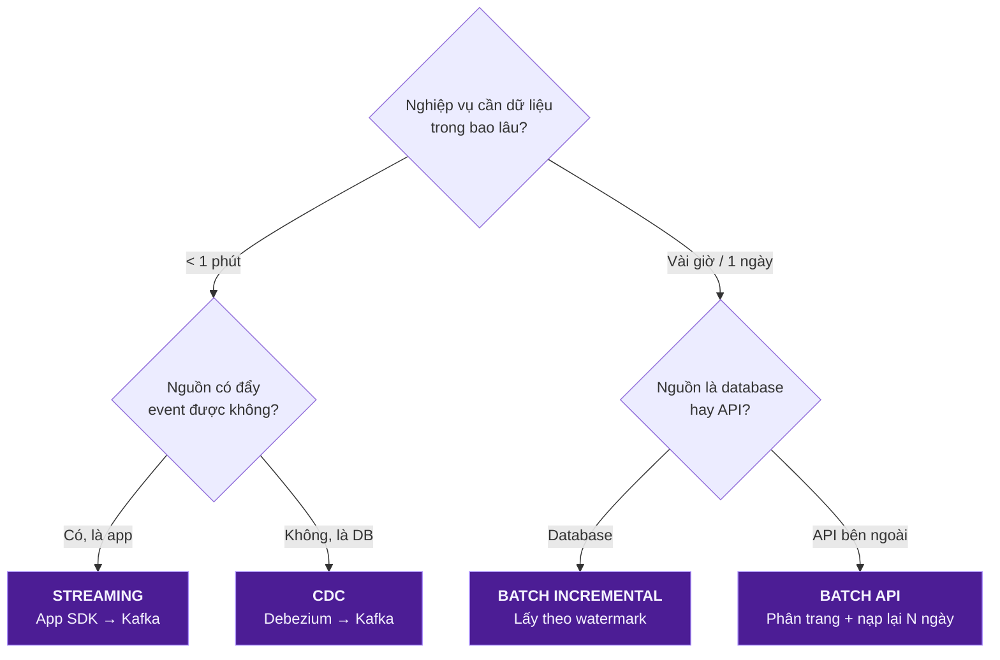

# Nguồn dữ liệu và cơ chế thu nạp

Bốn nhóm nguồn, ba cơ chế thu nạp (theo lô, CDC, streaming), cấu hình Kafka và Schema Registry.

Ánh xạ từng cột: [../02-mapping/source-to-target.md](../02-mapping/source-to-target.md).


> **Mục tiêu:** Trả lời 3 câu hỏi — Dữ liệu phát sinh ở đâu? Đưa vào platform bằng cách nào? Đi qua những hệ thống nào?

## 1. Bốn nhóm nguồn

| Nhóm | Định nghĩa | Hệ thống cụ thể | Loại dữ liệu | Đặc tính |
|---|---|---|---|---|
| **A. Web / Mobile App** | Nơi phát sinh **hành vi** khách hàng | App iOS/Android, Website | Clickstream event (JSON) | Lượng lớn, bán cấu trúc, **chỉ thêm mới** |
| **B. OLTP Database** | Nơi lưu **giao dịch nghiệp vụ** chính | PostgreSQL/MySQL của hệ thống booking | Bảng quan hệ | Có cấu trúc, **bị UPDATE/DELETE** |
| **C. POS / Salon System** | Dữ liệu phát sinh **tại cửa hàng** | POS ở quầy, phần mềm quản lý buồng | Hoá đơn, check-in, tiêu hao vật tư | Có cấu trúc, **mạng có thể mất → dữ liệu về muộn** |
| **D. External Systems** | Hệ thống **bên ngoài** | Facebook Ads, Google Ads, GA4, Payment Gateway, CRM, Email/SMS, Tổng đài | API / file export | **Không kiểm soát được schema**, có rate limit, có độ trễ |

### Ánh xạ nguồn theo thực thể

Đây là bảng quan trọng: nó cho biết chỗ nào cần **gộp định danh** và chỗ nào cần **đối soát**.

| Entity | Nguồn chính (System of Record) | Nguồn bổ trợ | Xử lý xung đột |
|---|---|---|---|
| `customer` | OLTP | App (device, hành vi), POS (khách walk-in), CRM | Gộp theo phone → email → device_id |
| `booking` | OLTP | App event (`booking_created`), Hotline | OLTP thắng; event dùng để đo độ trễ |
| `appointment` | POS | OLTP | POS thắng (là nơi thực tế xếp lịch) |
| `treatment` | POS | — | POS là nguồn duy nhất |
| `payment` | POS | Payment Gateway | **Bắt buộc đối soát** POS ↔ Gateway hằng ngày |
| `product_usage` | POS | Hệ thống kho | Đối soát tồn kho cuối kỳ |
| `feedback` | App | SMS survey, Tổng đài | Khử trùng lặp theo (customer, treatment) |
| `ad_spend` | Facebook/Google Ads API | — | Chú ý API **cập nhật lại số liệu 7 ngày** |
| `web_traffic` | GA4 | — | Chỉ dùng ở mức tổng hợp, GA4 có lấy mẫu |

> **Khái niệm System of Record (SoR):** với mỗi trường dữ liệu, phải chỉ định **đúng một** hệ thống là nguồn chân lý. Không có SoR → khi 2 nguồn lệch nhau, không ai biết tin cái nào, và cuộc họp sẽ biến thành tranh luận vô tận.

---

## 2. Ba cơ chế thu nạp

Ingestion là việc đưa dữ liệu từ hệ thống nguồn vào data platform.

| Cơ chế | Định nghĩa | Dùng khi | Nguồn ở Facial Bar | Công cụ | Độ trễ |
|---|---|---|---|---|---|
| **Batch** (theo lô) | Định kỳ lấy trọn một khối dữ liệu | Không cần real-time, nguồn là API/file | Facebook Ads, Google Ads, GA4, danh mục dịch vụ | Airflow + Python/Spark | Giờ → Ngày |
| **CDC** (Change Data Capture) | Đọc **log thay đổi** của database để bắt từng INSERT/UPDATE/DELETE | Cần biết dữ liệu OLTP thay đổi gì, không muốn quét lại cả bảng | OLTP: customer, booking, payment | Debezium → Kafka | Giây |
| **Streaming** | Ứng dụng **chủ động đẩy** event ngay khi xảy ra | Event hành vi, cần gần real-time | App event: `service_viewed`, `booking_created`, `feedback_created` | SDK → Kafka | Mili giây → Giây |

### CDC — giải thích kỹ vì đây là khái niệm khó nhất

**Vấn đề:** bảng `booking` trong OLTP có 5 triệu dòng. Mỗi đêm quét lại toàn bộ thì rất nặng và vẫn **không biết** dòng nào vừa bị sửa, dòng nào vừa bị xoá.

mọi database quan hệ đều ghi lại mọi thay đổi vào một file log nội bộ (WAL ở PostgreSQL, binlog ở MySQL). Debezium đọc chính file log đó và biến từng thay đổi thành một message Kafka:

```json
{
  "op": "u",                                  // c=create, u=update, d=delete, r=snapshot
  "before": { "booking_id": 1001, "booking_status": "created" },
  "after":  { "booking_id": 1001, "booking_status": "confirmed" },
  "source": { "table": "booking", "lsn": 84021, "ts_ms": 1755149400000 }
}
```

**Cái CDC cho ta mà batch không bao giờ có:** bắt được **DELETE** (batch chỉ thấy dòng biến mất một cách bí ẩn), và bắt được **mọi trạng thái trung gian** (batch chỉ thấy trạng thái lúc quét).

**Cái CDC đòi hỏi phải xử lý thêm:**
1. **Khử trùng lặp:** CDC đảm bảo *at-least-once* — một thay đổi có thể về 2 lần. Phải dùng `(business_key, lsn)` để loại trùng.
2. **Chọn dòng mới nhất:** trong 1 batch có thể có 5 phiên bản của cùng 1 booking. Phải lấy phiên bản có `lsn` lớn nhất.
3. **Xử lý xoá mềm:** không xoá thật ở DWH, mà set `is_deleted = 1` để giữ lịch sử.

```sql
-- Mẫu chuẩn: chọn phiên bản cuối cùng của mỗi bản ghi trong 1 lô CDC
WITH ranked AS (
  SELECT *,
         ROW_NUMBER() OVER (PARTITION BY booking_id ORDER BY _lsn DESC) AS rn
  FROM lnd.cdc_booking
)
SELECT * FROM ranked WHERE rn = 1 AND _op <> 'd';
```

### Ma trận quyết định — chọn cơ chế nào?



> ⚠️ **Không phải data nào cũng phải đi Kafka.** Chi phí vận hành Kafka rất thật (cluster, monitoring, schema registry, người biết vận hành). Dữ liệu chi phí quảng cáo chỉ cập nhật 1 lần/ngày mà đẩy qua Kafka là **over-engineering** — vừa tốn tiền vừa tăng số điểm có thể hỏng.
>
> **Chọn cơ chế dựa trên yêu cầu độ trễ (latency requirement) và đặc tính của nguồn.**

---

## 3. Kafka và Schema Registry

| Khái niệm | Định nghĩa | Cấu hình cho Facial Bar |
|---|---|---|
| **Topic** | Kênh chứa các event cùng loại | `facialbar.booking.v1`, `facialbar.payment.v1`, `facialbar.customer.v1`, `facialbar.feedback.v1`, `facialbar.cdc.booking` |
| **Partition** | Topic được chia nhỏ để xử lý song song | 6 partition/topic, key = `customer_id` |
| **Partition Key** | Trường quyết định event vào partition nào | Cùng `customer_id` → cùng partition → **đảm bảo đúng thứ tự** cho từng khách |
| **Consumer Group** | Nhóm tiến trình cùng đọc 1 topic | `cg-s3-sink`, `cg-realtime-dashboard` |
| **Retention** | Giữ event bao lâu | 7 ngày (đủ để replay khi pipeline lỗi cuối tuần) |
| **Schema Registry** | Nơi lưu và kiểm tra schema của event | Avro, chế độ `BACKWARD` |

hôm nay dev app đổi `rating` từ số nguyên sang chuỗi. Không có registry → event vẫn được gửi, pipeline xuống hạ nguồn mới vỡ lúc 3 giờ sáng. Có registry → producer bị **chặn ngay tại chỗ** với lỗi rõ ràng.

**Chế độ tương thích `BACKWARD`:** consumer code mới đọc được dữ liệu cũ. Nghĩa là: **được phép thêm** field có giá trị mặc định, **được phép xoá** field không bắt buộc; **không được** đổi kiểu dữ liệu hay đổi tên field.

**Kafka Connect (S3 Sink):** đây là thành phần đưa event từ Kafka xuống S3, phân vùng theo ngày:
```
s3://facialbar-lake/raw/kafka/booking/v1/dt=2026-08-14/hour=09/part-00001.json.gz
```
Kích hoạt ghi file khi đạt 1 trong 3 ngưỡng: 128 MB, 100.000 dòng, hoặc 15 phút — chọn cái nào đến trước. Mục đích là tránh **bài toán file nhỏ** (hàng triệu file 2 KB làm Spark chậm gấp chục lần).

---

## 4. Tổng kết

| Câu hỏi | Trả lời |
|---|---|
| Data từ đâu? | Web/App, OLTP, POS, External Systems |
| Data vào bằng cách nào? | Streaming, CDC, Batch, API |
| Dùng công nghệ gì? | Kafka + Schema Registry, Debezium, Kafka Connect, Airflow, Spark/Glue |
| Data đi đâu? | S3 Data Lake (zone `raw`) |

---
---
