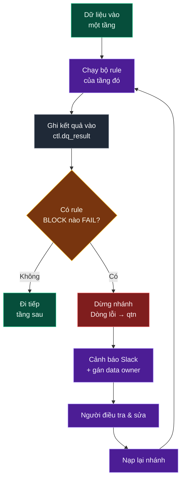

# Công nghệ, bảo mật, quản trị và vận hành

Lựa chọn công nghệ kèm lý do, bảo mật đầu-cuối, chất lượng dữ liệu, quản trị dữ liệu, giám sát, khả năng mở rộng và phục hồi.

Catalog quy tắc chất lượng: [../05-quality/dq-rules.md](../05-quality/dq-rules.md).


> Trả lời: Hệ thống dùng công nghệ gì? An toàn thế nào? Data có đáng tin không? Ai được truy cập? Có giám sát không? Scale thế nào? Khi hỏng thì xử lý ra sao?

## 1. Lựa chọn công nghệ

**Nguyên tắc:** Chọn công nghệ **dựa trên requirement**, không phải chọn công nghệ trước rồi mới tìm lý do sử dụng.

| Lớp | Công nghệ | Requirement nào dẫn tới lựa chọn này | Đã cân nhắc gì khác |
|---|---|---|---|
| Điều phối | **Airflow** | Cần phụ thuộc phức tạp, backfill, retry, quan sát được | Dagster (tốt hơn về data-aware nhưng team chưa quen) |
| Streaming | **Kafka + Schema Registry** | Event app cần gần real-time, cần replay, cần kiểm soát schema | Kinesis (khoá vào AWS, replay khó hơn) |
| CDC | **Debezium** | Cần bắt cả DELETE và trạng thái trung gian từ OLTP | Batch incremental (không bắt được DELETE) |
| Sink | **Kafka Connect S3** | Đưa event xuống Lake, phân vùng ngày, không cần viết code | Spark Streaming (phải tự vận hành nhiều hơn) |
| Lake | **Amazon S3** | Rẻ, không giới hạn dung lượng, tách lưu trữ khỏi tính toán | HDFS (phải tự quản cluster) |
| Table format | **Apache Iceberg** | Cần ACID, schema evolution, time travel trên S3 | Delta Lake, Hudi (đều được; chọn Iceberg vì trung lập engine) |
| Xử lý | **Spark (hoặc AWS Glue)** | Khối lượng lớn, có sẵn kỹ năng SQL/Python | dbt + engine SQL (tốt cho transform trong DWH) |
| Warehouse | **SQL Server** | Team đã thành thạo T-SQL, Power BI kết nối tự nhiên, có sẵn license | Snowflake/BigQuery (mạnh hơn nhưng đổi chi phí và kỹ năng) |
| BI | **Superset + Power BI** | Superset cho nội bộ data team; Power BI cho business | Metabase, Tableau |
| Real-time serving | **Đọc thẳng từ Kafka** | Chỉ cần vài chỉ số vận hành, không cần join phức tạp | ClickHouse/Druid (thêm khi số use case tăng) |

> **Ghi lại lý do dưới dạng ADR (Architecture Decision Record).** Mỗi quyết định 1 trang: bối cảnh, các phương án, lựa chọn, hệ quả. Sáu tháng sau sẽ có người hỏi *"vì sao lại dùng SQL Server?"* — không có ADR thì câu trả lời chỉ còn là ký ức của người đã rời công ty.

---

## 2. Bảo mật

**Nguyên tắc:** Security phải được thiết kế **end-to-end**, không phải chỉ đặt password cho SQL Server.

**Least Privilege (Đặc quyền tối thiểu):** chỉ cấp đúng quyền cần thiết, không hơn.

| Vùng | Rủi ro | Biện pháp |
|---|---|---|
| **Truyền tải** | Bị nghe giữa đường | TLS cho mọi kết nối: app→Kafka, Kafka→S3, ETL→SQL Server |
| **Lưu trữ (at rest)** | Đọc trực tiếp đĩa/bucket | S3 SSE-KMS, SQL Server TDE |
| **Xác thực** | Dùng tài khoản chung | Mỗi service một tài khoản riêng, xác thực bằng IAM role / SPN, không hard-code mật khẩu |
| **Phân quyền** | Ai cũng đọc được mọi thứ | Xem bảng vai trò bên dưới |
| **PII** (thông tin cá nhân) | Rò rỉ thông tin khách | Xem mục PII bên dưới |
| **Bí mật** | Mật khẩu trong code | Secrets Manager / Key Vault, xoay vòng 90 ngày |
| **Nhật ký truy cập** | Không biết ai đã xem gì | Bật audit log trên S3 và SQL Server, giữ 1 năm |

### Bảng vai trò truy cập

| Vai trò | `raw` | `cleansed` | `lnd` | `crt` | `dm` | `svg_bi` | `ctl` | `qtn` |
|---|---|---|---|---|---|---|---|---|
| Data Engineer | RW | RW | RW | RW | RW | RW | RW | RW |
| Data Analyst | — | R | — | R | R | R | R | R |
| BI Developer | — | — | — | — | R | R | — | — |
| Business User | — | — | — | — | — | R (qua BI) | — | — |
| Data Scientist | — | R | — | R | R | R | — | — |
| Auditor | R | R | — | R | R | R | R | R |

### Xử lý PII (Personally Identifiable Information)

Facial Bar lưu **dữ liệu sức khoẻ/thẩm mỹ** (loại da, tình trạng da, ảnh trước–sau) — thuộc loại dữ liệu **cảm nhạy**, mức bảo vệ phải cao hơn dữ liệu thường.

| Dữ liệu | Mức | Cách xử lý |
|---|---|---|
| `phone`, `email`, `full_name` | PII | Mã hoá cột; analyst thấy bản đã che (`090****567`) |
| `date_of_birth` | PII | Chỉ phơi ra `age_group`, không phơi ngày sinh |
| `skin_condition`, ảnh trước/sau | Cảm nhạy | Bucket riêng, quyền riêng, mặc định **không** đưa vào datamart |
| `payment_card_no` | PCI | **Không lưu**. Chỉ lưu token từ gateway + 4 số cuối |

**Quyền được xoá (Right to be forgotten):** khách yêu cầu xoá dữ liệu → cần một quy trình chạy được trên **cả** Lake và DWH. Đây là lý do kỹ thuật rất thực tế để dùng Iceberg ở tầng cleansed: `DELETE FROM ... WHERE customer_id = ?` là chuyện bất khả thi với file Parquet thuần trên S3.

---

## 3. Chất lượng dữ liệu — sáu tiêu chí

Data Quality là tập các phép kiểm tra tự động để phát hiện dữ liệu sai **trước khi** business dùng nó ra quyết định.

| Chiều | Câu hỏi | Ví dụ rule Facial Bar | Mức |
|---|---|---|---|
| **Completeness** (Đầy đủ) | Có thiếu data không? | Mọi salon đang mở phải có ≥ 1 hoá đơn/ngày; `customer_id` không NULL | BLOCK |
| **Accuracy** (Chính xác) | Data có hợp lý không? | `net_amount >= 0`; `actual_duration` trong khoảng 15–240 phút; `rating` từ 1–5 | BLOCK |
| **Consistency** (Nhất quán) | Các hệ thống có khớp nhau? | `SUM(POS revenue)` = `SUM(crt revenue)` ± 0,1%; tổng payment = tổng invoice | BLOCK |
| **Uniqueness** (Duy nhất) | Có trùng lặp không? | `invoice_line_id` duy nhất; 1 khách không có 2 appointment chồng giờ | BLOCK |
| **Validity** (Hợp lệ) | Đúng định dạng/miền giá trị? | `phone` khớp E.164; `booking_status` nằm trong danh mục; FK tồn tại | WARN/BLOCK |
| **Freshness** (Kịp thời) | Có cập nhật đúng SLA không? | Dữ liệu POS ngày N phải có trước 06:00 ngày N+1 | BLOCK |

### Luồng kiểm soát chất lượng



### Rule nào chạy ở tầng nào

| Tầng | Loại kiểm tra | Ví dụ |
|---|---|---|
| **raw** | Kỹ thuật: file có về không, đọc được không | File tồn tại; số dòng > 0; JSON hợp lệ |
| **cleansed** | Schema và kiểu dữ liệu | Ép kiểu thành công; cột bắt buộc không NULL; đã khử trùng lặp |
| **crt** | **Nghiệp vụ và đối soát** | Tổng doanh thu khớp POS; FK tồn tại; không chồng lịch |
| **dm** | Toàn vẹn mô hình chiều | Không có fact trỏ `sk = -1` quá 1%; SCD2 không hở/không chồng khoảng thời gian |
| **svg_bi** | Đối chiếu tổng | Tổng ở bảng agg = tổng ở fact |

> **Đối soát (Reconciliation) — kiểm tra giá trị nhất, cần làm riêng mỗi ngày:**
> ```sql
> -- So từng salon từng ngày: DWH vs POS
> SELECT d.salon_id, d.business_date,
>        d.dwh_revenue, p.pos_revenue,
>        d.dwh_revenue - p.pos_revenue AS diff,
>        ABS(d.dwh_revenue - p.pos_revenue) / NULLIF(p.pos_revenue,0) AS diff_pct
> FROM   v_dwh_revenue_daily d
> FULL OUTER JOIN v_pos_revenue_daily p
>        ON d.salon_id = p.salon_id AND d.business_date = p.business_date
> WHERE  ABS(ISNULL(d.dwh_revenue,0) - ISNULL(p.pos_revenue,0)) > 1000;   -- ngưỡng làm tròn
> ```
> `FULL OUTER JOIN` là cố ý: nó phát hiện cả trường hợp **DWH có mà POS không có** (nạp trùng) và **POS có mà DWH không có** (mất dữ liệu). `INNER JOIN` sẽ bỏ qua đúng hai loại lỗi nghiêm trọng nhất.

---

## 4. Quản trị dữ liệu

Trả lời 3 câu hỏi — *Data này là gì? Ai sở hữu? Được sử dụng thế nào?*

| Thành phần | Định nghĩa | Cách làm ở Facial Bar |
|---|---|---|
| **Data Catalog** | Danh mục tra cứu mọi bảng/cột | Mỗi bảng: mô tả, **grain**, owner, SLA, nguồn; mỗi cột: ý nghĩa, đơn vị, miền giá trị |
| **Data Dictionary** | Định nghĩa chính thức của từng KPI | "Net Revenue = SUM(net_amount) từ `fact_sales_line`, ghi nhận theo ngày dịch vụ" |
| **Data Lineage** | Dữ liệu đi từ đâu đến đâu | POS.invoice → raw → cleansed → lnd → crt → fact_sales_line → agg_revenue_daily → chart |
| **Data Ownership** | Ai chịu trách nhiệm | Mỗi domain 1 **Business Owner** (đúng/sai nghiệp vụ) + 1 **Technical Owner** (pipeline chạy) |
| **Data Classification** | Mức độ mật | Public / Internal / Confidential / PII / Sensitive |
| **Retention Policy** | Giữ bao lâu | raw 3 năm → Glacier; cleansed 5 năm; DWH đầy đủ 7 năm (tuân thủ kế toán) |
| **Change Management** | Đổi schema thì làm sao | Thông báo trước 2 tuần; kiểm tra tương thích ngược; ghi vào changelog |

khi một số liệu sai, lineage cho biết **bảng nào bị ảnh hưởng** (đánh giá phạm vi tác động) và **lỗi bắt nguồn từ đâu** (phân tích nguyên nhân gốc). Không có lineage, mỗi lần sai số là một cuộc điều tra thủ công vài ngày.

---

## 5. Giám sát

Trả lời câu hỏi *"Hệ thống có đang chạy tốt không?"* — và phải trả lời được **trước khi** business phát hiện ra.

| Cấp | Đo cái gì | Ví dụ chỉ số | Ngưỡng cảnh báo |
|---|---|---|---|
| **Hạ tầng** | Máy còn sống không | CPU, RAM, dung lượng đĩa, Kafka consumer lag | Lag > 100.000 message |
| **Pipeline** | Job có chạy đúng không | Tỷ lệ thành công, thời gian chạy, số lần retry | Thất bại 2 lần liên tiếp |
| **Dữ liệu** | Dữ liệu có đúng không | Tỷ lệ DQ pass, số dòng quarantine, độ trễ dữ liệu | DQ pass < 99% |
| **Nghiệp vụ** | Số liệu có bất thường không | Doanh thu hôm nay so với 7 ngày trước | Lệch > 30% |
| **Sử dụng** | Ai đang dùng gì | Lượt xem dashboard, bảng không ai truy vấn 90 ngày | — |

**Ba khái niệm cần phân biệt:**

| | Định nghĩa | Ví dụ |
|---|---|---|
| **Monitoring** | Theo dõi các chỉ số **đã biết trước** | "Job có chạy xong không?" |
| **Observability** | Khả năng **truy vấn để hiểu** vấn đề chưa từng gặp | "Vì sao doanh thu salon Q7 hôm qua bằng 0?" |
| **Alerting** | Chủ động thông báo khi vượt ngưỡng | Slack `#data-alerts` |

**Quy tắc thiết kế cảnh báo:** mỗi cảnh báo phải **có người nhận, có việc phải làm**. Cảnh báo mà không ai xử lý được sẽ dẫn tới *alert fatigue* — team tắt thông báo, và cảnh báo thật sẽ bị bỏ lọt.

| Mức | Ví dụ | Nhận qua | Ai xử lý |
|---|---|---|---|
| **P1 – Nghiêm trọng** | Pipeline doanh thu hỏng, DQ chặn | Gọi điện + Slack | Kỹ sư dữ liệu trực |
| **P2 – Cao** | Trễ SLA, quarantine > 1% | Slack | Chủ sở hữu domain |
| **P3 – Trung bình** | Rule WARN thất bại | Email hằng ngày | Phân tích dữ liệu |
| **P4 – Thấp** | Bảng không ai dùng | Báo cáo hằng tuần | Data governance |

---

## 6. Khả năng mở rộng và phục hồi

**Câu hỏi:** *Nếu Facial Bar từ 20 salon → 2.000 salon thì architecture có chịu được không?*

| Thành phần | Điểm nghẽn khi tăng 100 lần | Cách xử lý |
|---|---|---|
| **Kafka** | Thông lượng | Tăng partition; đảm bảo key `customer_id` phân bố đều (chống lệch partition) |
| **S3** | Bài toán file nhỏ | Compact định kỳ; nâng ngưỡng ghi của Kafka Connect |
| **Spark** | Thời gian xử lý | Tách job theo domain; phân vùng theo ngày; đọc tăng trưởng, không đọc lại toàn bộ |
| **SQL Server** | Đây là điểm nghẽn **cứng** đầu tiên | Xem bên dưới |
| **BI** | Dashboard chậm | Tổng hợp trước ở `svg_bi`; giới hạn khoảng thời gian mặc định |

### Kế hoạch xử lý điểm nghẽn SQL Server

| Bước | Khi nào | Việc làm |
|---|---|---|
| 1 | Ngay từ đầu | Phân vùng bảng fact theo tháng; columnstore index cho fact lớn |
| 2 | Fact > 100 triệu dòng | Chuyển sang chỉ nạp tăng trưởng; nén dữ liệu |
| 3 | Fact > 1 tỷ dòng | Chuyển dữ liệu chi tiết cũ về Lake, DWH chỉ giữ 25 tháng gần nhất |
| 4 | Vẫn không đủ | Chuyển Warehouse sang MPP (Synapse/Snowflake/BigQuery). **Chính vì thế mà logic transform phải viết dưới dạng SQL chuẩn, có version, tránh thủ tục đặc thù riêng của SQL Server** |

> **Đây là ví dụ điển hình của quyết định kiến trúc tốt:** chọn SQL Server hôm nay là hợp lý — đúng kỹ năng của đội hiện có và tận dụng giấy phép đã mua — nhưng viết mã theo chuẩn phổ thông để chi phí chuyển đổi về sau vẫn thấp.

### Reliability — Khi hỏng thì xử lý ra sao

| Sự cố | Phát hiện bằng | Cách khôi phục |
|---|---|---|
| Nguồn không gửi dữ liệu | DQ Freshness thất bại | Chạy lại DAG khi nguồn phục hồi; watermark đảm bảo không mất, không trùng |
| Spark job dừng bất thường | Airflow task fail | Iceberg ACID nên không có dữ liệu ghi dở → retry an toàn |
| SQL Server không nạp được | Task load fail | Dữ liệu vẫn nằm ở `cleansed`, retry hoặc REPLAY từ `archive` |
| Logic transform sai | Đối soát lệch | Sửa code → backfill từ `archive`/`cleansed` → nhờ idempotent nên số liệu đúng lại |
| Nạp trùng | DQ Uniqueness thất bại | `ctl.load_audit` (file_hash) chặn từ đầu; nếu đã vào thì delete-insert lại phân vùng |
| Kafka mất dữ liệu | Consumer lag + đối soát | Replay từ offset trong retention 7 ngày |
| Xoá bảng nhầm | Cảnh báo | Restore DB backup; hoặc dựng lại từ Lake (nhánh nét đứt trong sơ đồ) |

**Chỉ tiêu cần chốt với business:**

| Chỉ tiêu | Định nghĩa | Mục tiêu đề xuất |
|---|---|---|
| **RPO** (Recovery Point Objective) | Được phép mất tối đa bao nhiêu dữ liệu | ≤ 15 phút (nhờ Kafka retention + raw immutable) |
| **RTO** (Recovery Time Objective) | Được phép mất bao lâu để phục hồi | ≤ 4 giờ với báo cáo hằng ngày |
| **SLA dữ liệu** | Dữ liệu ngày N phải sẵn sàng khi nào | 08:00 ngày N+1 |

---
---
